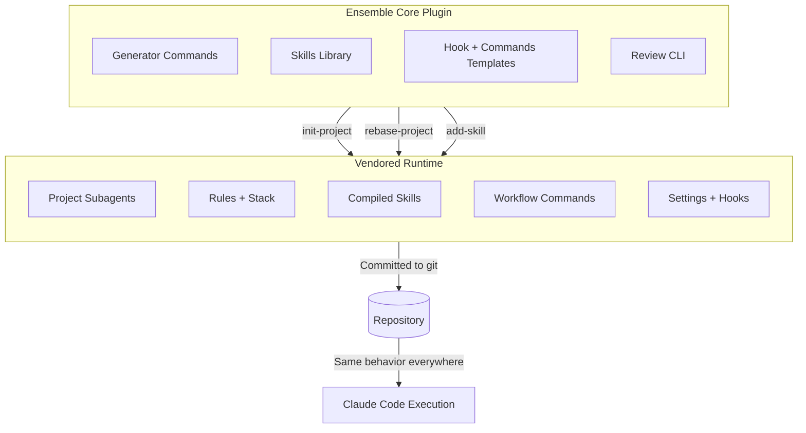
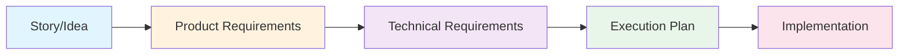
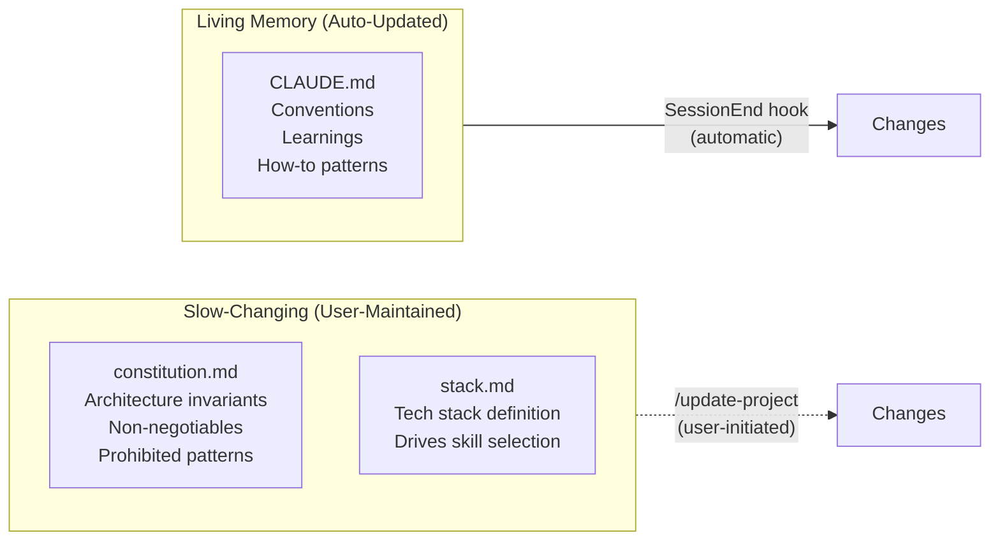
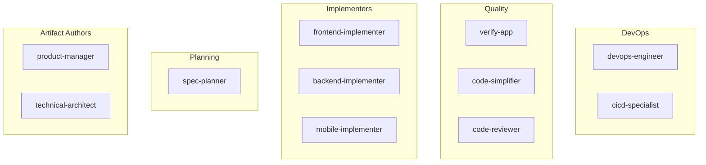
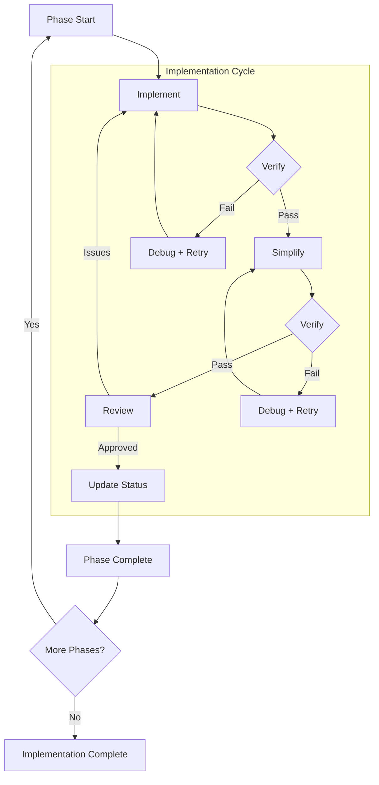
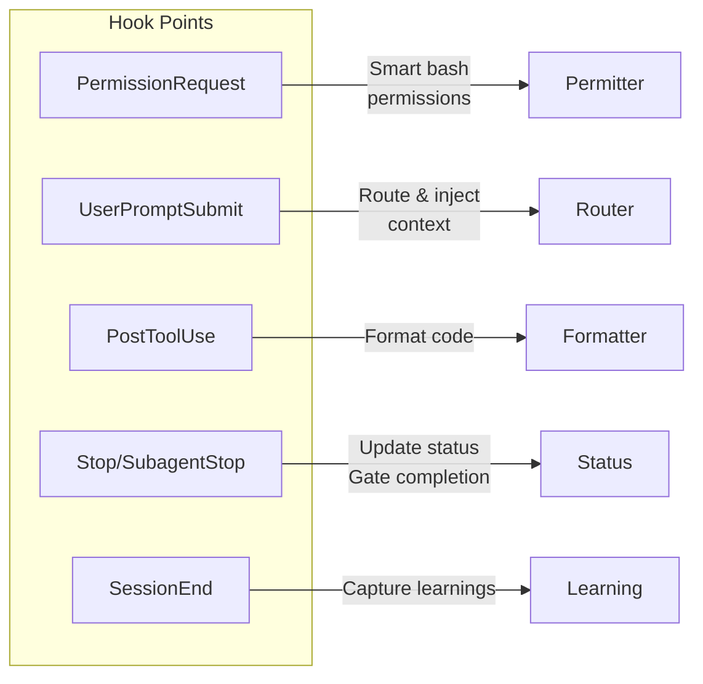

# Product Requirements Document: Ensemble vNext

**Document Version**: 1.3.0
**Status**: Draft
**Created**: 2026-01-11
**Updated**: 2026-01-12
**Author**: Product Management

---

## Changelog

### Version 1.3.0 (2026-01-12)

**Based on User Interview Feedback:**

**RESOLVED - Migration/Brownfield Support (F1.1)**:
- Updated `/init-project` to handle existing ensemble installations
- Behavior: Prompts user that existing ensemble agents/skills/commands/hooks will be replaced with current plugin version
- Other project files remain untouched
- Implementation: Shell script scaffolding -> prompts -> validation script
- Added acceptance criteria for migration behavior

**RESOLVED - Work Session Conflict Resolution (Section 5.5)**:
- Decision: Warn if user manually starts two sessions on same work item, but take no blocking action
- Marked as future phase enhancement to increase protections

**RESOLVED - CLAUDE.md Growth Management**:
- SessionEnd hook does NOT manage growth
- Added new P1 command: `/cleanup-project` for CLAUDE.md pruning and project streamlining
- Future expansion: May include broader project cleanup functionality

**RESOLVED - Testing Strategy (Section 5.9)**:
- Clarified testing is internal-only for development verification
- Not intended for user distribution or external testing

**PROPOSED - Error Recovery Mechanism (Section 5.10)**:
- Added comprehensive recovery mechanism for interrupted autonomous executions
- Covers: Wiggum mode cloud crashes, corrupted state files, network failures

**PROPOSED - Version Compatibility (Section 5.11)**:
- Added lightweight version compatibility approach
- Assumes current Claude Code version; graceful degradation for older versions

**CLARIFIED - Wiggum vs Completion Gates (Section 4.2, F7/F9)**:
- Added detailed explanation distinguishing the two concepts
- Wiggum: Loop mechanism (Stop hook pattern)
- Completion Gates: Quality criteria (tests, coverage, review)
- Recommendation: Wiggum and Completion Gates are complementary; implement Completion Gates within Wiggum prompts
- Secondary LLM review remains optional P1 feature

### Version 1.2.0 (2026-01-12)

**HIGH PRIORITY Additions:**
- Added Appendix C: Claude Code Frontmatter Specifications with verified YAML formats for agents, skills, and commands
- Added secondary LLM privacy constraint: "Secondary LLM sees only artifacts, not codebase"
- Resolved `/plan-trd` design: Recommend Option 1 - plan mode during `/create-trd` generates implementation plan embedded in TRD
- Added remote branch naming convention based on "claude work sessions" from TRD phases
- Added status artifact merge strategy: take latest status when two branches report differing statuses
- Added vendored component testing strategy using 3 simple exercises and OpenTelemetry verification
- Added Wiggum implementation details aligned with official `ralph-wiggum` plugin (stop hook pattern)
- Added VALIDATION.md note as "to be determined" pending official documentation

**MEDIUM PRIORITY Additions:**
- Added 6 key Mermaid diagrams: artifact flow, governance split, staged execution loop, subagent categories, hook system, two-layer architecture
- Added Boris Jabes attribution as Claude Code creator throughout document
- Added Permitter hook problem statement with npm test example
- Added coverage threshold strategy options (block/warn/continue)
- Added `stop_hook_active` safety mechanism for Wiggum mode

**LOW PRIORITY Additions:**
- Added default formatter description (project-configurable prettifier)
- Added router streamlining note for vendored runtime
- Added consolidated artifact table with owners
- Added explicit "Commands orchestrate. Subagents execute." statement

### Version 1.1.0 (2026-01-11)
- Initial PRD based on architecture vision and implementation notes

---

## Table of Contents

1. [Product Summary](#1-product-summary)
2. [User Analysis](#2-user-analysis)
3. [Goals and Non-Goals](#3-goals-and-non-goals)
4. [Feature Requirements](#4-feature-requirements)
5. [Technical Requirements](#5-technical-requirements)
6. [Acceptance Criteria](#6-acceptance-criteria)
7. [Implementation Planning](#7-implementation-planning)
8. [Appendix A: Glossary](#appendix-a-glossary)
9. [Appendix B: Related Documents](#appendix-b-related-documents)
10. [Appendix C: Claude Code Frontmatter Specifications](#appendix-c-claude-code-frontmatter-specifications)

---

## 1. Product Summary

### 1.1 Context: Relationship to Current Ensemble

Ensemble vNext is a **major refactor/replacement** of the current Ensemble framework, not an incremental evolution. Key changes include:

- **Agent consolidation**: Reduction from 28 agents to approximately 11 streamlined subagents based on actual usage patterns
- **Distribution model**: Shift to Claude Code plugin marketplace distribution
- **Architecture simplification**: Command-led orchestration replacing complex multi-agent coordination

### 1.2 Problem Statement

Claude Code is extraordinarily capable out of the box. Power users like Boris Cherny (Claude Code's creator) run 5+ parallel local sessions, 10+ web sessions, and achieve remarkable throughput through intuitive mastery of plan mode, verification patterns, and subagent delegation.

**The challenge**: This workflow is implicit. Less experienced engineers struggle to:

1. **Know when to plan vs execute** - No clear guidance on when to iterate on approach vs when to start implementing
2. **Structure work for parallel execution** - Cannot identify which tasks can run concurrently across local and cloud sessions
3. **Maintain verification discipline** - Skip validation steps, leading to compounding errors
4. **Delegate effectively to subagents** - Unclear when and how to spawn specialized workers
5. **Capture and retain learnings** - Hard-won knowledge is lost between sessions

This accessibility gap means organizations cannot scale AI-augmented development effectively. Power users operate at 10x productivity while others struggle to achieve 2x, creating bottlenecks and inconsistent outputs.

### 1.3 Solution Overview

**Ensemble vNext** is a workflow framework for Claude Code that encodes power-user patterns into a repeatable, accessible system. It provides:

- **Command-led orchestration** - Workflow encoded in explicit commands, not scattered across prompts or implicit knowledge
- **Vendored runtime** - Consistent behavior across local CLI and web (Claude Code on the web) sessions through a committed `.claude/` directory
- **Staged execution with verification gates** - Implement -> Verify -> Simplify -> Verify -> Review -> Artifact Update cycle with automated quality checks
- **Repeatable artifact generation** - Story -> PRD -> TRD pipeline with consistent structure and refinement support
- **Continuous learning** - Session learnings flow back into project memory automatically

### 1.4 Value Proposition

**For development teams**: Democratize power-user workflows so that less experienced engineers can operate at productivity levels approaching what experts achieve intuitively.

**For engineering leaders**: Standardize how teams go from idea to production, enabling predictable delivery and scalable AI-augmented development practices.

**For organizations**: Unlock the full potential of Claude Code across entire engineering teams, not just power users, exponentially multiplying ROI on AI tooling investment.

### 1.5 Key Differentiators

| Aspect | Current State | Ensemble vNext |
|--------|---------------|----------------|
| Workflow | Implicit, expert-dependent | Explicit, command-driven |
| Runtime | Session-specific | Vendored, version-controlled |
| Quality Gates | Manual, inconsistent | Automated, enforced |
| Parallel Execution | Ad-hoc | Planned, coordinated |
| Knowledge Retention | Manual effort | Automatic capture |

### 1.6 Core Architecture Diagrams

#### Two-Layer Architecture

Ensemble vNext separates **generation** from **runtime**:



#### Artifact Flow



#### Governance Split



### 1.7 Consolidated Artifact Table

| Artifact | Purpose | Owner | Location |
|----------|---------|-------|----------|
| **PRD** | What to build and why | Product Manager (`product-manager`) | `docs/PRD/` |
| **TRD** | How to build it technically (includes execution plan) | Technical Architect (`technical-architect`) | `docs/TRD/` |
| **Status** | Implementation progress tracking | System (automated via Status hook) | `.trd-state/<feature>/implement.json` |
| **Constitution** | Project absolutes, architecture invariants | User (manual via `/update-project`) | `.claude/rules/constitution.md` |
| **Stack** | Tech stack definition, drives skill selection | Generated by `init-project`, user-maintained | `.claude/rules/stack.md` |
| **CLAUDE.md** | Living memory, conventions, learnings | System (auto via SessionEnd) + User | Project root |

---

## 2. User Analysis

### 2.1 Primary Users

Development teams using Claude Code for AI-augmented software development, including:

- Individual contributors (junior to senior engineers)
- Technical leads and architects
- Engineering managers overseeing AI-augmented teams

### 2.2 User Personas

#### Persona 1: The Power User (Expert)

**Profile**: Senior engineer who has mastered Claude Code through extensive experimentation.

**Current Behavior**:
- Runs 5+ parallel local sessions simultaneously
- Maintains 10+ web/cloud sessions for fire-and-forget tasks
- Intuitively knows when to plan vs execute
- Has developed personal verification discipline
- Updates CLAUDE.md multiple times weekly with learnings

**Pain Points**:
- Cannot easily transfer workflow knowledge to team members
- Team inconsistency creates review burden
- No standardized way to encode best practices

**Ensemble vNext Value**: Framework to encode expertise into team-wide standards; reduced time spent coaching others.

#### Persona 2: The Growing Engineer (Intermediate)

**Profile**: Mid-level engineer comfortable with Claude Code basics but not maximizing productivity.

**Current Behavior**:
- Uses Claude Code for implementation tasks
- Occasionally uses subagents without clear strategy
- Inconsistent verification before commits
- Loses context between sessions

**Pain Points**:
- Knows experts are more productive but unclear how to bridge gap
- Frequent rework due to skipped verification
- Struggles with complex multi-part features
- Loses learnings between sessions

**Ensemble vNext Value**: Clear workflow guidance; automated quality gates prevent rework; persistent project memory.

#### Persona 3: The New Adopter (Beginner)

**Profile**: Engineer new to Claude Code, potentially from traditional development background.

**Current Behavior**:
- Uses Claude Code as an enhanced autocomplete
- Rarely ventures beyond basic prompting
- Does not use subagents or parallel sessions
- No systematic approach to AI-augmented development

**Pain Points**:
- Overwhelming number of features without clear starting point
- Does not know what "good" AI-augmented development looks like
- Fear of automation leading to quality issues
- No mental model for effective AI collaboration

**Ensemble vNext Value**: Structured onramp; guardrails prevent common mistakes; visible workflow teaches best practices.

#### Persona 4: The Engineering Lead (Manager)

**Profile**: Technical lead responsible for team productivity and output quality.

**Current Behavior**:
- Monitors team output and velocity
- Reviews PRs and provides guidance
- Struggles to standardize AI-augmented practices

**Pain Points**:
- Inconsistent quality across team members
- No visibility into AI-augmented workflows
- Cannot establish team-wide standards
- ROI on Claude Code varies wildly by individual

**Ensemble vNext Value**: Standardized workflows; consistent artifacts; trackable implementation status; team-wide quality baselines.

### 2.3 User Journey

```
1. INITIALIZATION
   User: /init-project
   System: Generates vendored runtime (.claude/ directory)
   Output: Project ready for Ensemble workflow

2. REQUIREMENTS CAPTURE
   User: /create-prd [story description]
   System: Product manager agent creates PRD
   Output: docs/PRD/feature-name.md

   [Optional: /refine-prd for iteration with feedback]

3. TECHNICAL DESIGN & PLANNING
   User: /create-trd [PRD reference]
   System: Technical architect agent creates TRD with embedded execution plan
   Output: docs/TRD/feature-name.md (includes phases, tasks, work sessions)

   [Optional: /refine-trd for iteration with feedback]

4. IMPLEMENTATION
   User: /implement-trd [TRD reference]
   System: Staged loop (implement -> verify -> simplify -> review)
   Output: Completed feature with passing tests

   [Optional: --wiggum flag for autonomous cloud execution]

5. LEARNING CAPTURE
   System: SessionEnd hook auto-updates CLAUDE.md
   User: /update-project for manual capture
   Output: Updated project memory and conventions
```

---

## 3. Goals and Non-Goals

### 3.1 Goals

#### G1: Encode Power-User Patterns into Repeatable Framework
- Translate implicit expert workflows (like those of Boris Cherny) into explicit, documented commands
- Make plan mode, verification discipline, and parallel execution accessible to all skill levels
- Reduce time-to-productivity for new Claude Code adopters

#### G2: Enable Autonomous Development with Engineer Oversight
- Support long-running development sessions that execute without constant intervention
- Provide verification gates that catch issues before they compound
- Allow engineers to focus on architectural decisions and edge cases while AI handles implementation bulk

#### G3: Support Parallel Execution Across Local and Cloud
- Identify parallelizable work during planning phase
- Enable fire-and-forget task offloading to cloud/web sessions
- Coordinate multiple workstreams without conflicts

#### G4: Provide Consistent Runtime Across Environments
- Ensure identical behavior in CLI, web, and cloud sessions
- Version control the runtime configuration
- Allow teams to customize while maintaining reproducibility

#### G5: Capture and Retain Learnings Automatically
- Auto-update project memory (CLAUDE.md) with session learnings
- Separate slow-changing governance (Constitution) from fast-changing conventions
- Prevent knowledge loss between sessions and team members

### 3.2 Non-Goals

#### NG1: Replace Claude Code Core Functionality
Ensemble vNext is a workflow framework that enhances Claude Code, not a replacement. It does not:
- Modify Claude Code's underlying capabilities
- Override Claude Code's built-in features

#### NG2: Require External Infrastructure
Ensemble vNext operates entirely within Claude Code's execution context:
- No external servers or databases required (except when using secondary LLMs for optional verification)
- No cloud services beyond Claude's built-in remote execution (except as noted above)
- No additional authentication systems (except Github, and application-specific tooling)

#### NG3: Force Specific Development Methodologies
While Ensemble vNext provides structure, it remains configurable:
- TDD, characterization testing, and other strategies are options, not mandates
- Quality gate thresholds are project-configurable
- Teams can work outside the framework when appropriate, but still see benefits of context management, skill-driven context grounding

#### NG4: Handle Non-Development Workflows
Ensemble vNext focuses on software development:
- Not a general-purpose task management system
- Not designed for non-engineering use cases, though teams would likely see benefit from the subagent routing
- Not a project management or issue tracking replacement

---

## 4. Feature Requirements

### 4.1 Core Features (P0 - Must Have)

#### F1: Plugin Commands (Generator Layer)

| Feature | Description | Priority |
|---------|-------------|----------|
| F1.1 `/init-project` | Generate initial vendored runtime with project analysis | P0 |
| F1.2 `/rebase-project` | Upgrade vendored runtime to newer plugin version | P1 |
| F1.3 `/add-skill` | Add additional skills without full rebase | P2 |

**F1.1 /init-project Details**:

*Migration/Brownfield Support*:
When running on a project with existing Ensemble installation:
1. **Detection**: Check for existing `.claude/` directory
2. **Prompt**: Inform user that existing ensemble agents, skills, commands, and hooks will be replaced with current plugin version
3. **Preservation**: All other project files remain untouched
4. **Implementation Approach**:
   - Shell script performs scaffolding (creates/overwrites `.claude/` structure) and deterministic configuration
   - LLM updates plugin-provided templates to create project-specific versions of subagents, skills
   - Validation shell script verifies structure is correct (deterministic check)

*Comprehensive Repository Scan*:
`init-project` performs a thorough analysis beyond just dependency files:
1. **Dependency files** - package.json, requirements.txt, Gemfile, etc.
2. **Project structure** - Directory layout, file organization
3. **Architecture patterns** - How code is organized (MVC, Clean Architecture, etc.)
4. **Existing conventions** - Code style, naming patterns, module structure

*Output Generation*:
- Generate Constitution and Stack templates
- Generate `.claude/` directory structure with all components
- Create project-appropriate subagent roster; modify subagents based on project, patterns, and tech stack
- Compile skills based on detected tech stack (skills are not modified from baseline, just selected)
- Generate Process rules template
- Update `.gitignore` for proper tracking
- Initialize CLAUDE.md with project context (or preserve existing if migrating)

*.gitignore Handling*:

```gitignore
# Track .claude/ directory
!.claude/

# But ignore local settings
.claude/settings.local.json
.claude/*.local.*
```

**F1.2 /rebase-project Details**:
- Detect plugin version changes
- Recompute compiled skills based on current stack
- Update templates and commands to new version
- Preserve local customizations where possible
- Generate rebase report showing changes for review
- Specifically look for:
  - New subagents; do not modify existing subagents as they've been tailored
  - New or modified skills
  - New or Updated commands (commands are not modified per project, so new commands include improvements)
  - New or updated hooks


**F1.3 /add-skill Details**:

- Validate skill exists in plugin library
- Add to `.claude/skills/` without affecting other skills
- Update Stack definition if needed

#### F2: Vendored Runtime Generation

| Feature | Description | Priority |
|---------|-------------|----------|
| F2.1 Subagent Generation | Generate 11 streamlined subagents with proper prompts | P0 |
| F2.2 Rules Generation | Create constitution.md, stack.md, process.md | P0 |
| F2.3 Skills Compilation | Pull skills based on tech stack (likely will not have skills for each element of the stack - pull all relevant skills) | P0 |
| F2.4 Commands Generation | Copy workflow commands in .claude/commands/ | P0 |
| F2.5 Settings Generation | Generate settings.json with hooks and permissions | P0 |

**Subagent Design Principles**:

1. **No tool restrictions** - Subagents have all tools enabled (omit `tools:` line in frontmatter)
2. **Explicit skills** - Each subagent declares which skills to invoke based on the project's stack
3. **Mandatory split** - Implementation is always split between frontend and backend
4. **Permissive start** - Tighten restrictions only when measurably beneficial

**Subagent Roster**:

| Role | Agent | Responsibility |
|------|-------|----------------|
| Artifact | `product-manager` | PRD creation and refinement |
| Artifact | `technical-architect` | TRD creation and refinement |
| Planning | `spec-planner` | Execution planning and parallelization |
| Implement | `frontend-implementer` | UI, components, client logic |
| Implement | `backend-implementer` | APIs, services, data layer |
| Implement | `mobile-implementer` | Mobile apps (when applicable) |
| Quality | `verify-app` | Test execution and verification |
| Quality | `code-simplifier` | Post-verification refactoring |
| Quality | `code-reviewer` | Security and quality review |
| DevOps | `devops-engineer` | Infrastructure and deployment |
| DevOps | `cicd-specialist` | Pipeline configuration |

**Subagent Categories Diagram**:



#### F3: Artifact Commands

| Feature | Description | Priority |
|---------|-------------|----------|
| F3.1 `/create-prd` | Generate PRD from story/idea via product-manager agent | P0 |
| F3.2 `/refine-prd` | Iterate on PRD with user feedback | P0 |
| F3.3 `/create-trd` | Generate TRD from PRD via technical-architect agent | P0 |
| F3.4 `/refine-trd` | Iterate on TRD with user feedback | P0 |

**Artifact Locations**:

- PRDs: `docs/PRD/<feature-name>.md`
- TRDs: `docs/TRD/<feature-name>.md`

**Key Design Decision: Commands Orchestrate. Subagents Execute.**

The command is responsible for the workflow; subagents do the specialized work. This separation provides clear visibility into what's happening and why.

#### F4: Implementation Commands

| Feature | Description | Priority |
|---------|-------------|----------|
| F4.1 `/create-trd` (plan mode) | TRD creation includes execution plan with work sessions | P0 |
| F4.2 `/implement-trd` | Execute staged implementation loop | P0 |

**F4.1 /create-trd with Integrated Planning**:

**Design Decision**: The `/plan-trd` command is **not a separate command**. Instead, planning is integrated into `/create-trd`:

- When `/create-trd` runs, it uses plan mode to analyze the PRD
- The resulting TRD includes an "Execution Plan" section with:
  1. **Phases** - Logical groupings of work
  2. **Tasks** - Individual units of work within phases
  3. **Claude Work Sessions** - Proposed splits of work for parallel execution
  4. **Parallelization Opportunities** - Which tasks can run concurrently
  5. **Offload Recommendations** - Work suitable for remote/cloud sessions

**Rationale for eliminating separate `/plan-trd`**:
- The TRD already contains a plan/phases section
- Creating separate plan artifacts adds complexity without clear benefit
- Work session identification belongs in technical design, not a separate step
- Reduces command surface area and simplifies the workflow

**Claude Work Sessions**:
The TRD proposes "claude work sessions" that:
- Split the work into parallelizable chunks
- Identify which sessions can run independently
- Become branch names when work is executed (see Section 5.5)

**Parallel Execution Strategy**:
| Aspect | Resolution |
|--------|------------|
| Conflict detection | Planning stage (in TRD) determines parallelizable tasks |
| Conflict resolution | Deconflict during merge |
| Cross-cutting concerns | Handle in merge; not a primary concern |

**F4.2 /implement-trd Details**:

- Command acts as orchestrator (no separate orchestrator agent)
- Execute staged loop: Implement -> Verify -> Simplify -> Verify -> Review
- Track status in `.trd-state/<trd-name>/implement.json`
- Automated gates with bounded retries (max 2-3 attempts per gate)
- Pause for user decision only when stuck (after retry bounds exceeded)

**Staged Execution Loop Diagram**:



**Command-Led Orchestration Rationale**:
Putting orchestration logic in the command (rather than SubagentStop hooks or a dedicated orchestrator agent) provides:
1. **Visibility** - The workflow is explicit in the command definition
2. **Debuggability** - Easy to understand what's happening and why
3. **Determinism** - Consistent execution path every time
4. **Simplicity** - No hook ordering concerns or hidden state

#### F5: Project Memory Commands

| Feature | Description | Priority |
|---------|-------------|----------|
| F5.1 `/update-project` | Manual learning capture with Constitution updates | P1 |
| F5.2 `/cleanup-project` | Review and prune CLAUDE.md and project artifacts | P2 |

**F5.1 /update-project Details**:
- Analyze current session for learnings
- Auto-update CLAUDE.md with conventions and patterns
- Propose Constitution changes (require explicit user confirmation)
  - Implementation note: constitution changes should be very rare; only major, material, and repeated changes should qualify, not minor deviations from the existing constitution

- Propose Tech Stack (stack.md) updates (require explicit user confirmation)
  - Check if the base plugin has matching skills if so propose add-skill command to incorporate them
  - Update them into subagents

- Optionally update subagent prompts for improved delegation
- run generate-project-routing rules to improve routing

**F5.2 /cleanup-project Details**:

*Purpose*: Address CLAUDE.md growth over time and maintain project hygiene.

*Note*: The SessionEnd hook does NOT perform growth management. Growth management is explicitly a user-initiated action via this command.

*Core Functionality*:
- Review CLAUDE.md for stale, redundant, or obsolete entries
- Prune outdated conventions and learnings
- Consolidate duplicate or overlapping guidance
- Remove references to deprecated features or patterns

*Future Expansion* (planned):
- Clean up completed `.trd-state/` entries
- Archive old PRDs/TRDs to `docs/completed/` (or docs/cancelled) 
- Identify and remove unused vendored skills
- Detect and report stale branches
- Clean up test scripts and documentation that were created as part of debugging or implementation, but are not part of the solution or verification suite

*Usage*:

```bash
/cleanup-project              # Interactive cleanup with confirmations
/cleanup-project --dry-run    # Preview changes without applying
/cleanup-project --auto       # Apply non-destructive cleanups automatically
```

*Safety*:
- Always shows diff before applying changes
- Destructive operations (deleting files) require explicit confirmation
- Creates backup of CLAUDE.md before modifications

#### F6: Hooks

| Hook | Event | Purpose | Priority |
|------|-------|---------|----------|
| F6.1 Permitter | PermissionRequest | Smart bash permission expansion | P1 |
| F6.2 Router | UserPromptSubmit | Route prompts to appropriate commands/skills | P1 |
| F6.3 Formatter | PostToolUse | Format code output (project-configurable) | P2 |
| F6.4 Status | SubagentStop | Update status artifact on completion | P0 |
| F6.5 Learning | SessionEnd | Auto-capture learnings to CLAUDE.md | P2 |

**Hook System Diagram**:



**F6.1 Permitter Hook Details**:

*Problem Statement*:
Claude Code's permission allowlist uses exact prefix matching. For example, `Bash(npm test:*)` won't match:
- `API_KEY=x npm test` (env var prefix)
- `timeout 30 npm test` (wrapper command)
- `npm test && npm run build` (command chain)

This friction interrupts autonomous workflows with unnecessary permission prompts for equivalent commands.

*Solution - Normalization*:
1. Intercepts bash permission requests
2. Normalizes command (strips env vars, wrappers like `timeout`, chains like `&&`)
3. Matches normalized commands against allowlist
4. Auto-approves if all extracted commands match

*Key Properties*:
- Never creates new permissions - only recognizes equivalent forms
- Fail-closed on parse errors (defer to normal permission flow)
- Rejects unsafe constructs (command substitution `$()`, heredocs, process substitution)

**F6.2 Router Hook Details**:

- Generates router-rules.json files (global and project-specific) by analyzing documentation and codebase
- Matches keywords/patterns and injects context steering to appropriate commands/skills/subagents
- Classify incoming prompts based on pattern matching
- Never blocking (always allows prompt to continue)
- **vNext behavior**: Streamlined for vendored runtime with project-specific routing rules

**F6.3 Formatter Hook Details**:

- Runs on PostToolUse events (Edit/Write operations)
- **Default**: Simple, standard prettifier supporting multiple languages (configurable per-project)
- Project can override with custom formatter (Prettier, Black, gofmt, etc.)
- Non-blocking; formatting failures do not stop execution

### 4.2 Enhanced Features (P1 - Should Have) -- NOTE: I have made other features "P1" or even "P2" but have not updated this section

#### Understanding Wiggum Mode vs Completion Gates

**Important Clarification**: Based on research of the official `ralph-wiggum` plugin, these are **complementary concepts**, not competing ones:

| Concept | What It Is | What It Does |
|---------|-----------|--------------|
| **Wiggum Mode** | Loop mechanism | Stop hook pattern that re-injects prompts after exit attempts |
| **Completion Gates** | Quality criteria | Tests, coverage thresholds, and review checks that define "done" |

**How They Work Together**:
```
Wiggum (Loop) + Completion Gates (Criteria) = Reliable Autonomous Execution
```

1. **Wiggum provides the loop**: Uses Stop hook to intercept Claude's exit attempts and feed the same prompt back
2. **Completion Gates provide the criteria**: Define what "done" means (tests pass, coverage met, review approved)
3. **Together**: Wiggum keeps iterating until Completion Gates are satisfied

**Key Insight from ralph-wiggum**:
The official plugin uses only two termination conditions:
- **Completion Promise**: Exact string match (e.g., `<promise>COMPLETE</promise>`)
- **Max Iterations**: Safety limit to prevent infinite loops

**Recommendation for Ensemble vNext**:
Completion Gates should be **embedded in the Wiggum prompt**, not a separate system:
```
/implement-trd docs/TRD/feature.md --wiggum

# Prompt includes:
# "Continue until:
#  - All tests pass
#  - Coverage >= 80%
#  - Code reviewed and approved
#  Then output <promise>COMPLETE</promise>"
```

**Priority Clarification**:
- **Wiggum (F7)**: P1 - Essential for autonomous cloud offload
- **Completion Gates (F9)**: P1 - Essential for reliable automation
- **Secondary LLM Review (F8)**: P1 (optional) - Nice to have, lower priority than F7/F9

**Sources**: [Ralph Wiggum Plugin README](https://github.com/anthropics/claude-code/blob/main/plugins/ralph-wiggum/README.md), [Paddo.dev Blog](https://paddo.dev/blog/ralph-wiggum-autonomous-loops/)

#### F7: Autonomy Mode (Wiggum)

| Feature | Description | Priority |
|---------|-------------|----------|
| F7.1 `--wiggum` flag | Enable autonomous execution mode | P1 |
| F7.2 Completion Promise | Emit unique ID when all gates pass | P1 |
| F7.3 Bounded Execution | Configurable iteration/time limits | P1 |

**F7.1 --wiggum Details**:

Wiggum mode is aligned with Anthropic's official `ralph-wiggum` plugin, which implements a Stop hook pattern for autonomous, long-running execution.

**Implementation Alignment with ralph-wiggum**:
- Enable with `/implement-trd --wiggum`
- Uses Stop hook to intercept exit attempts and re-inject the prompt
- The prompt never changes between iterations; Claude's previous work persists in files
- Each iteration sees modified files and git history, enabling autonomous improvement
- Designed for cloud/web offload (fire-and-forget)

**Stop Hook Mechanism**:
```
1. User runs: /implement-trd --wiggum
2. Claude works on the task
3. Claude tries to exit
4. Stop hook blocks exit (exit code 2)
5. Stop hook feeds the SAME prompt back
6. Repeat until completion promise or bounds reached
```

**Safety Mechanism - `stop_hook_active`**:
- The hook sets a `stop_hook_active` flag during execution
- This prevents infinite loops by allowing detection of recursive hook invocations
- Falls back to vendored loop behavior if official implementation has issues

**Remote/Web Offload Pattern**:
Wiggum mode and cloud/web offload are designed to work together:

1. **Plan locally** - TRD identifies work sessions and offloadable work
2. **Offload with wiggum** - Launch `& /implement-trd --wiggum` to cloud
3. **Fire and forget** - Cloud session runs autonomously until completion promise
4. **Monitor with /tasks** - Check progress periodically
5. **Pull when done** - Use `/teleport` to retrieve completed work

**Environmental Reality**:
- Web/cloud sessions clone repo to Anthropic-managed VM
- Session handoff is one-way (pull only)
- Hooks run in both contexts; gate with `CLAUDE_CODE_REMOTE` env var if needed

**F7.2 Completion Promise Details**:
Emitted only when ALL conditions met:
- Implementation complete
- Tests passing
- Coverage thresholds met
- Code simplified
- Review approved
- Artifacts/status updated

#### F8: Secondary LLM Review

| Feature | Description | Priority |
|---------|-------------|----------|
| F8.1 Review CLI | Submit artifacts to secondary LLM for critique | P2 |
| F8.2 PRD Review | Send (Story + PRD) for product review | P2 |
| F8.3 TRD Review | Send (PRD + TRD) for technical review | P2 |

**Privacy Constraint**: The secondary LLM sees **only artifacts, not codebase**. This provides a fresh perspective focused purely on specification quality without access to implementation details.

**Activation Requirements**:
- Environment variable: `ENSEMBLE_SECONDARY_REVIEW=1`
- Credentials in `.claude/settings.local.json`

**Configuration**:
```json
{
  "ensemble": {
    "secondaryReview": {
      "provider": "openai",
      "model": "gpt-4o"
    }
  }
}
```

#### F9: Completion Gates with Bounded Retries

| Feature | Description | Priority |
|---------|-------------|----------|
| F9.1 Stop Hook | Enforce completion criteria in autonomy mode | P2 |
| F9.2 Retry Logic | Automatic retry with debug loop (2-3 attempts) | P2 |
| F9.3 Graceful Degradation | Pause for user decision when stuck | P1 |

**Coverage Threshold Strategy Options**:
| Strategy | Behavior |
|----------|----------|
| `block` | Fail the gate if coverage below threshold (default) |
| `warn` | Log warning but continue execution |
| `continue` | Ignore coverage thresholds entirely |

Strategy is project-configurable in `.claude/settings.json`:
```json
{
  "ensemble": {
    "coverage": {
      "strategy": "block",
      "unit": 0.80,
      "integration": 0.70
    }
  }
}
```

### 

|      |      |      |
|---------|-------------|----------|
|      |      |      |
|      |      |      |
|      |      |      |

## 5. Technical Requirements

### 5.1 Distribution

| Requirement | Specification |
|-------------|---------------|
| TR1.1 | Distribute via Claude Code plugin marketplace |
| TR1.2 | Plugin provides generator commands and skill library |
| TR1.3 | Plugin version embedded in vendored files for tracking |
| TR1.4 | Support automatic updates via `/rebase-project` |

### 5.2 Runtime

| Requirement | Specification |
|-------------|---------------|
| TR2.1 | Vendored runtime committed to project repository |
| TR2.2 | Runtime contained in `.claude/` directory |
| TR2.3 | Identical behavior in local and Claude code on the web sessions |
| TR2.4 | Local settings (`.local.json`) gitignored |

### 5.3 Hooks

| Requirement | Specification |
|-------------|---------------|
| TR3.1 | Hooks must be parallel-safe (no ordering dependencies) |
| TR3.2 | Hooks fail-closed on errors (defer to default behavior) |
| TR3.3 | Hooks never block unless explicitly required |
| TR3.4 | Hook configuration in committed `settings.json` |

### 5.4 Skills

| Requirement | Specification |
|-------------|---------------|
| TR4.1 | Pull-based loading (invoked when needed, not always injected) |
| TR4.2 | Skills compiled from plugin library based on stack.md |
| TR4.3 | Skills use directory structure with SKILL.md as entry point |
| TR4.4 | Skills support progressive disclosure (REFERENCE.md, examples/) |

### 5.5 State Management

| Requirement | Specification |
|-------------|---------------|
| TR5.1 | Implementation status tracked in `.trd-state/` directory |
| TR5.2 | Status files are JSON for machine readability |
| TR5.3 | Status includes task status, commits, coverage, checkpoints |
| TR5.4 | Status files included in git - to support parallization |

**Status Tracking Schema** (`.trd-state/<feature-name>/implement.json`):

```json
{
  "trd_file": "docs/TRD/feature.md",
  "trd_hash": "<sha256>",
  "branch": "feature/feature-name",
  "strategy": "tdd",
  "phase_cursor": 2,
  "tasks": {
    "TRD-001": { "status": "success", "commit": "abc1234" },
    "TRD-002": { "status": "failed", "error": "Test assertion failed" }
  },
  "coverage": { "unit": 0.82, "integration": 0.71 },
  "checkpoints": [
    { "phase": 1, "commit": "def5678", "timestamp": "..." }
  ]
}
```

**Remote Branch Naming Convention**:

Branches are named based on "claude work sessions" proposed in the TRD:
- TRD produces phases and tasks
- TRD proposes "claude work sessions" that split the work
- These session names become branch names when work is executed

Format: `feature/<trd-name>/<session-name>`

Example:
- TRD: `user-authentication.md`
- Work Session: `session-1-api-endpoints`
- Branch: `feature/user-authentication/session-1-api-endpoints`

**Status Artifact Merge Strategy**:

When merging branches that both contain status updates:
- There should be no status conflicts - no two branches should work on the same piece of work simultaneously (enforced by work session planning)
- This is a merge problem, not a conflict problem
- **Strategy**: Take the latest status if two branches report differing statuses on the same item of work
- Merge logic compares timestamps in checkpoints to determine which status is more recent

**Work Session Conflict Resolution**:

*Current Behavior (v1.0)*:
If a user manually starts two sessions on the same work item:
- System attempts to **warn** the user about the conflict
- **No blocking action** is taken - sessions proceed independently
- This is a user discipline issue, not a system enforcement issue

*Future Enhancement (Planned)*:
In a future phase, increase protections:
- Detect active work sessions via status file locking
- Provide clear conflict resolution options
- Consider session coordination mechanisms for intentional parallel work on same item

### 5.6 Governance Split

| Requirement | Specification |
|-------------|---------------|
| TR6.1 | Constitution (`constitution.md`) - slow-changing, user-maintained |
| TR6.2 | Stack (`stack.md`) - explicit tech stack, drives skill selection |
| TR6.3 | Process (`process.md`) - workflow expectations |
| TR6.4 | CLAUDE.md - living memory, auto-updated by SessionEnd hook |
| TR6.5 | Constitution changes require explicit user confirmation |

### 5.7 MCP Integration

| Requirement | Specification |
|-------------|---------------|
| TR7.1 | Context7 MCP server supported for documentation retrieval |
| TR7.2 | Playwright MCP server supported for E2E testing |
| TR7.3 | Additional MCP servers project-configurable via `.mcp.json` |
| TR7.4 | MCP configuration committed to repository for consistency |

### 5.8 File Structure

```
project-root/
├── .claude/
│   ├── agents/                    # Project subagents (11 agents)
│   │   ├── product-manager.md
│   │   ├── technical-architect.md
│   │   ├── spec-planner.md
│   │   ├── frontend-implementer.md
│   │   ├── backend-implementer.md
│   │   ├── mobile-implementer.md
│   │   ├── verify-app.md
│   │   ├── code-simplifier.md
│   │   ├── code-reviewer.md
│   │   ├── devops-engineer.md
│   │   └── cicd-specialist.md
│   │
│   ├── rules/
│   │   ├── constitution.md        # Project absolutes (user-maintained)
│   │   ├── stack.md               # Tech stack definition
│   │   └── process.md             # Workflow expectations
│   │
│   ├── skills/                    # Compiled from plugin based on stack
│   │   ├── <skill-name>/
│   │   │   ├── SKILL.md           # Main skill definition
│   │   │   ├── REFERENCE.md       # Additional reference (optional)
│   │   │   └── examples/          # Code examples (optional)
│   │   └── ...
│   │
│   ├── commands/                  # Workflow commands
│   │   ├── create-prd.md
│   │   ├── refine-prd.md
│   │   ├── create-trd.md
│   │   ├── refine-trd.md
│   │   ├── implement-trd.md
│   │   └── update-project.md
│   │
│   ├── settings.json              # Permissions + hooks (committed)
│   └── settings.local.json        # Local overrides (gitignored)
│
├── .gitignore                     # Updated to track .claude/ except locals
│
├── CLAUDE.md                      # Living project memory (auto-updated)
│
├── docs/
│   ├── PRD/                       # Product Requirements Documents
│   │   └── <feature-name>.md
│   └── TRD/                       # Technical Requirements Documents
│       └── <feature-name>.md
│
└── .trd-state/                    # Implementation status (gitignored)
    └── <feature-name>/
        └── implement.json
```

### 5.9 Vendored Component Testing Strategy

**Scope**: This testing strategy is for **internal development verification only**. It is not intended for user distribution or external testing.

To verify that vendored components work correctly and that all commands, subagents, and skills are local to the project:

**Testing Approach**:
1. Create 3 simple development exercises in common frameworks:
   - **Exercise 1**: React + TypeScript TODO app
   - **Exercise 2**: Python FastAPI REST service
   - **Exercise 3**: Node.js Express API with Jest tests

2. Use these exercises to test vendoring by:
   - Running `/init-project` on each exercise
   - Verifying all expected files are generated
   - Running `/create-prd`, `/create-trd`, `/implement-trd` workflows
   - Confirming execution uses vendored components only

3. **OpenTelemetry (Otel) Verification**:
   - Instrument Claude Code execution to emit traces
   - Confirm from logs which subagents and skills were used
   - **Feasibility Assessment**: Verifying that all invocations are local requires:
     - Tracing tool invocations to confirm they reference `.claude/` paths
     - Checking that no external plugin skills are loaded
     - This is feasible through trace analysis but requires custom Otel instrumentation
   - **Alternative**: If Otel instrumentation is not practical, use debug logging and file access monitoring to verify locality

### 5.10 Error Recovery Mechanism

**Purpose**: Provide recovery options for interrupted autonomous executions.

**Failure Scenarios Covered**:

| Scenario | Cause | Recovery Mechanism |
|----------|-------|-------------------|
| Wiggum Mode Cloud Crash | Anthropic VM crash, session timeout, resource limits | Checkpoint-based resume |
| Corrupted State Files | Disk errors, partial writes, concurrent access | State validation + repair |
| Network Failures | LLM API unavailable during secondary review | Graceful skip with retry queue |

#### 5.10.1 Checkpoint-Based Recovery

**How It Works**:

1. Status file (`.trd-state/<feature>/implement.json`) captures checkpoints after each phase completion
2. Checkpoints include: commit SHA, timestamp, phase number, task statuses
3. On crash/interruption, `/implement-trd --resume` reads the last checkpoint
4. Execution resumes from the next incomplete phase

**Checkpoint Schema Addition**:
```json
{
  "recovery": {
    "last_healthy_checkpoint": "abc1234",
    "last_checkpoint_timestamp": "2026-01-12T14:30:00Z",
    "interrupted": false,
    "interrupt_reason": null
  }
}
```

**Resume Command**:
```bash
/implement-trd docs/TRD/feature.md --resume
# Detects last checkpoint and continues from there
```

#### 5.10.2 State File Validation and Repair

**Validation**:
- On `/implement-trd` start, validate status file JSON structure
- Check for required fields, valid enum values, consistent timestamps
- Verify referenced commits exist in git history

**Repair**:
- If validation fails, attempt automatic repair:
  1. Parse recoverable fields
  2. Reconstruct missing data from git log
  3. Reset to last known-good checkpoint
- If repair fails, prompt user with options:
  - `--reset-state`: Start fresh (lose progress tracking)
  - `--manual-repair`: Show corrupt fields for manual fixing

#### 5.10.3 Network Failure Handling

**For Secondary LLM Review**:

- If network fails during secondary LLM review, skip review gracefully
- Log the skipped review with timestamp
- Add to retry queue in status file
- On next successful network, prompt: "Pending review from [timestamp]. Run now?"

**Implementation**:
```json
{
  "pending_reviews": [
    {
      "type": "trd_review",
      "artifact": "docs/TRD/feature.md",
      "queued_at": "2026-01-12T14:30:00Z",
      "attempts": 1,
      "last_error": "Network timeout"
    }
  ]
}
```

### 5.11 Version Compatibility

**Philosophy**: Assume current Claude Code version. Claude Code generally auto-updates, so version compatibility is a low-priority concern.

**Lightweight Approach**:

| Component | Strategy |
|-----------|----------|
| Plugin Commands | Target current Claude Code version; document minimum version in plugin manifest |
| Vendored Runtime | Self-contained; no external version dependencies |
| Hooks | Use stable hook APIs only; avoid experimental features |
| Skills | No version-specific features; plain Markdown with frontmatter |

**Version Detection**:
```bash
# Plugin records Claude Code version during init
claude --version > .claude/.claude-version
```

**Graceful Degradation**:
- If a feature requires a newer Claude Code version:
  1. Detect version mismatch
  2. Log warning with upgrade recommendation
  3. Fall back to alternative behavior or skip feature
  4. Never fail hard on version mismatch

**Minimum Version Policy**:
- Document minimum supported version in plugin README
- Test against current and previous major version
- Deprecation warnings 2 releases before dropping support

**Not Implemented** (low priority):
- Automatic Claude Code upgrades
- Multi-version compatibility matrices
- Legacy version support beyond N-1

---

## 6. Acceptance Criteria

### 6.1 Core Features (P0)

#### AC-F1: Plugin Commands

| ID | Criteria | Verification Method |
|----|----------|---------------------|
| AC-F1.1-01 | `/init-project` creates complete `.claude/` directory structure | Execute command, verify all directories and files exist |
| AC-F1.1-02 | `/init-project` detects tech stack from repo analysis | Run on repos with different stacks, verify stack.md accuracy |
| AC-F1.1-03 | `/init-project` generates appropriate subagents for project type | Compare generated agents with expected roster |
| AC-F1.1-04 | `/init-project` compiles relevant skills only | Verify skills/ contains only stack-relevant skills |
| AC-F1.1-05 | `/init-project` updates .gitignore correctly | Check .gitignore contains proper tracking rules |
| AC-F1.1-06 | `/init-project` detects existing ensemble installation | Run on project with existing `.claude/`, verify detection |
| AC-F1.1-07 | `/init-project` prompts before replacing existing ensemble components | Run on brownfield project, verify prompt displayed |
| AC-F1.1-08 | `/init-project` preserves non-ensemble files during migration | Verify other project files unchanged after migration |
| AC-F1.1-09 | `/init-project` runs validation script after scaffolding | Verify validation output confirms structure correctness |
| AC-F1.2-01 | `/rebase-project` preserves local customizations | Modify vendored file, rebase, verify changes preserved |
| AC-F1.2-02 | `/rebase-project` updates to new plugin version | Compare version before/after rebase |
| AC-F1.2-03 | `/rebase-project` generates change report | Verify report shows what changed |
| AC-F1.3-01 | `/add-skill` adds skill without affecting existing skills | Add skill, verify other skills unchanged |
| AC-F1.3-02 | `/add-skill` validates skill exists in plugin library | Attempt invalid skill name, verify error |

#### AC-F2: Vendored Runtime

| ID | Criteria | Verification Method |
|----|----------|---------------------|
| AC-F2.1-01 | All 11 subagents generated with proper frontmatter | Inspect generated .md files for required fields |
| AC-F2.1-02 | Subagents have no tool restrictions by default | Verify no `tools:` line in frontmatter |
| AC-F2.2-01 | constitution.md contains architecture invariants section | Inspect generated file structure |
| AC-F2.2-02 | stack.md accurately reflects detected tech stack | Compare with repo dependency files |
| AC-F2.3-01 | Skills use SKILL.md as entry point | Verify SKILL.md exists in each skill directory |
| AC-F2.4-01 | All workflow commands generated | Verify all 6 commands exist in commands/ |
| AC-F2.5-01 | settings.json contains hook configuration | Parse JSON, verify hook entries |

#### AC-F3: Artifact Commands

| ID | Criteria | Verification Method |
|----|----------|---------------------|
| AC-F3.1-01 | `/create-prd` produces PRD in docs/PRD/ | Execute command, verify file created |
| AC-F3.1-02 | `/create-prd` delegates to product-manager agent | Check execution trace for agent invocation |
| AC-F3.1-03 | PRD contains required sections (summary, requirements, acceptance criteria) | Inspect generated PRD structure |
| AC-F3.2-01 | `/refine-prd` accepts user feedback | Run with feedback, verify changes |
| AC-F3.2-02 | `/refine-prd` preserves PRD structure while updating content | Compare before/after structure |
| AC-F3.3-01 | `/create-trd` produces TRD in docs/TRD/ | Execute command, verify file created |
| AC-F3.3-02 | `/create-trd` delegates to technical-architect agent | Check execution trace |
| AC-F3.3-03 | TRD references source PRD | Verify PRD link in TRD |
| AC-F3.3-04 | TRD contains execution plan with work sessions | Verify "Execution Plan" section exists |
| AC-F3.4-01 | `/refine-trd` accepts user feedback | Run with feedback, verify changes |

#### AC-F4: Implementation Commands

| ID | Criteria | Verification Method |
|----|----------|---------------------|
| AC-F4.1-01 | TRD execution plan identifies parallelizable tasks | Inspect TRD for parallelization section |
| AC-F4.1-02 | TRD execution plan proposes work sessions | Verify work session definitions in TRD |
| AC-F4.2-01 | `/implement-trd` executes staged loop | Trace execution through implement/verify/simplify/review |
| AC-F4.2-02 | `/implement-trd` creates status in .trd-state/ | Verify implement.json created |
| AC-F4.2-03 | `/implement-trd` retries on verification failure | Inject failure, verify retry behavior |
| AC-F4.2-04 | `/implement-trd` pauses for user when stuck | Exceed retry bounds, verify pause |
| AC-F4.2-05 | Status file tracks task completion | Complete task, verify status update |

#### AC-F5: Project Memory Commands

| ID | Criteria | Verification Method |
|----|----------|---------------------|
| AC-F5.1-01 | `/update-project` updates CLAUDE.md | Run command, verify CLAUDE.md changes |
| AC-F5.1-02 | `/update-project` requires confirmation for Constitution changes | Attempt constitution change, verify prompt |
| AC-F5.1-03 | CLAUDE.md updates are additive and brief | Compare size before/after multiple updates |
| AC-F5.2-01 | `/cleanup-project` identifies stale CLAUDE.md entries | Run on project with old entries, verify detection |
| AC-F5.2-02 | `/cleanup-project --dry-run` previews without applying | Run with flag, verify no files modified |
| AC-F5.2-03 | `/cleanup-project` creates backup before modifications | Run command, verify backup file created |
| AC-F5.2-04 | `/cleanup-project` requires confirmation for destructive operations | Attempt file deletion, verify confirmation prompt |

#### AC-F6: Hooks

| ID | Criteria | Verification Method |
|----|----------|---------------------|
| AC-F6.1-01 | Permitter normalizes commands before matching | Test with env var prefix, verify normalization |
| AC-F6.1-02 | Permitter fails closed on parse errors | Inject malformed command, verify default behavior |
| AC-F6.1-03 | Permitter rejects unsafe constructs | Test $(), heredoc, verify rejection |
| AC-F6.2-01 | Router classifies prompts to appropriate commands | Test known patterns, verify routing |
| AC-F6.2-02 | Router is non-blocking | Verify prompt continues regardless of routing |
| AC-F6.3-01 | Formatter runs on Edit/Write | Make edit, verify formatting applied |
| AC-F6.4-01 | Status hook updates on subagent completion | Complete subagent task, verify status update |
| AC-F6.5-01 | Learning hook updates CLAUDE.md on session end | End session, verify CLAUDE.md updated |
| AC-F6.5-02 | Learning hook never modifies Constitution | End session with learnings, verify constitution unchanged |

### 6.2 Enhanced Features (P1)

#### AC-F7: Autonomy Mode (Wiggum)

| ID | Criteria | Verification Method |
|----|----------|---------------------|
| AC-F7.1-01 | `--wiggum` enables autonomous execution | Run with flag, verify no user prompts |
| AC-F7.1-02 | Stop hook blocks exit and re-injects prompt | Trace execution, verify stop hook behavior |
| AC-F7.1-03 | `stop_hook_active` prevents infinite loops | Verify flag set during execution |
| AC-F7.2-01 | Completion promise emitted when all gates pass | Complete successful run, verify promise |
| AC-F7.2-02 | No promise on incomplete execution | Fail a gate, verify no promise |
| AC-F7.3-01 | Iteration limit respected | Set limit, exceed, verify stop |
| AC-F7.3-02 | Time limit respected | Set limit, exceed, verify stop |

#### AC-F8: Secondary LLM Review

| ID | Criteria | Verification Method |
|----|----------|---------------------|
| AC-F8.1-01 | Review disabled by default | Run refine without config, verify no review |
| AC-F8.1-02 | Review enabled with env var AND config | Set both, verify review runs |
| AC-F8.2-01 | PRD review sends Story + PRD only | Inspect review payload, verify no codebase |
| AC-F8.3-01 | TRD review sends PRD + TRD only | Inspect review payload, verify no codebase |

#### AC-F9: Completion Gates

| ID | Criteria | Verification Method |
|----|----------|---------------------|
| AC-F9.1-01 | Stop hook blocks on failed criteria | Fail gate in wiggum mode, verify block |
| AC-F9.2-01 | Retry attempts configurable | Set max retries, verify behavior |
| AC-F9.2-02 | Coverage strategy respected (block/warn/continue) | Test each strategy, verify behavior |
| AC-F9.3-01 | Graceful pause after max retries | Exceed retries, verify user prompt |

### 6.3 Technical Requirements

#### AC-TR5.10: Error Recovery

| ID | Criteria | Verification Method |
|----|----------|---------------------|
| AC-TR5.10-01 | `/implement-trd --resume` continues from last checkpoint | Interrupt execution, resume, verify continuation |
| AC-TR5.10-02 | Checkpoint includes commit SHA and timestamp | Inspect implement.json for recovery fields |
| AC-TR5.10-03 | Corrupted state file triggers validation warning | Corrupt JSON file, run command, verify warning |
| AC-TR5.10-04 | `--reset-state` option clears state and starts fresh | Run with flag, verify clean state |
| AC-TR5.10-05 | Network failure during secondary review queues for retry | Simulate network failure, verify retry queue populated |

#### AC-TR5.11: Version Compatibility

| ID | Criteria | Verification Method |
|----|----------|---------------------|
| AC-TR5.11-01 | Plugin records Claude Code version during init | Run init, verify `.claude/.claude-version` created |
| AC-TR5.11-02 | Version mismatch logs warning but continues | Simulate old version, verify warning logged |
| AC-TR5.11-03 | No hard failure on version mismatch | Test with mismatched version, verify execution continues |

---

## 7. Implementation Planning

### 7.1 Phase 1: Core Plugin and Vendored Runtime (Weeks 1-4)

**Objective**: Establish the foundation with plugin distribution and runtime generation.

**Deliverables**:
- F1.1: `/init-project` command
- F2: Complete vendored runtime generation
- F6.1: Permitter hook (carry over from current Ensemble)
- F6.2: Router hook (carry over from current Ensemble)
- Basic settings.json structure

**Success Criteria**:
- Running `/init-project` on a fresh repo generates complete `.claude/` structure
- Generated runtime works identically in local CLI and web sessions
- Permitter and Router hooks function as documented

**Dependencies**: None (foundational phase)

### 7.2 Phase 2: Full Artifact Workflow (Weeks 5-8)

**Objective**: Complete the PRD -> TRD -> Implementation pipeline.

**Deliverables**:
- F3: All artifact commands (create-prd, refine-prd, create-trd, refine-trd)
- F4.2: `/implement-trd` command (basic staged loop)
- F5.1: `/update-project` command
- F6.3: Formatter hook
- F6.4: Status hook
- F6.5: Learning hook

**Success Criteria**:
- Full workflow from story to implementation completes successfully
- TRD includes execution plan with work sessions
- Status tracking in `.trd-state/` accurate
- CLAUDE.md auto-updated on session end

**Dependencies**: Phase 1 complete

### 7.3 Phase 3: Wiggum Mode and Cloud Integration (Weeks 9-12)

**Objective**: Enable autonomous execution for cloud offload workflows.

**Deliverables**:
- F7: Wiggum mode (`--wiggum` flag, completion promise, bounds)
- F9: Completion gates with bounded retries
- F1.2: `/rebase-project` command
- F1.3: `/add-skill` command

**Success Criteria**:
- Fire-and-forget cloud execution works reliably
- Completion promise emitted only when all gates pass
- Runtime upgrades preserve customizations

**Dependencies**: Phase 2 complete

### 7.4 Phase 4: Secondary Review and Advanced Features (Weeks 13-16)

**Objective**: Add optional external review and polish.

**Deliverables**:
- F8: Secondary LLM review (review CLI, PRD/TRD review)
- F10: External review CLI (stretch)
- Documentation and examples
- Performance optimization

**Success Criteria**:
- Secondary review integrates smoothly into refine commands
- Complete documentation for all features
- Performance acceptable for large repos

**Dependencies**: Phase 3 complete

### 7.5 Risk Mitigation

| Risk | Likelihood | Impact | Mitigation |
|------|------------|--------|------------|
| Claude Code API changes break hooks | Medium | High | Version pin hooks; test against canary builds |
| Performance issues on large repos | Medium | Medium | Lazy loading; incremental analysis |
| User adoption friction | Medium | Medium | Clear documentation; gradual workflow introduction |
| Skill library maintenance burden | Low | Medium | Community contributions; automated testing |
| Cloud session limitations | Medium | Medium | Graceful fallback; clear documentation of limits |

---

## Appendix A: Glossary

| Term | Definition |
|------|------------|
| **Artifact** | A generated document in the workflow (PRD, TRD, Status) |
| **Boris Jabes** | Creator of Claude Code; power user whose workflows inform Ensemble vNext design |
| **Constitution** | Slow-changing project rules requiring user confirmation to change |
| **Permitter** | Hook that normalizes bash commands for permission matching |
| **Ralph Wiggum** | Anthropic's official plugin for autonomous execution loops (Stop hook pattern) |
| **Router** | Hook that classifies prompts and steers to appropriate handlers |
| **Stack** | Tech stack definition that drives skill selection |
| **Vendored Runtime** | The `.claude/` directory committed to the project repo |
| **Wiggum Mode** | Autonomous execution mode for fire-and-forget tasks |
| **Work Session** | A proposed split of TRD work for parallel execution |

## Appendix B: Related Documents

- [Architecture Vision](../ensemble-vnext/architecture.md)
- [Implementation Notes](../ensemble-vnext/implementation-notes.md)

## Appendix C: Claude Code Frontmatter Specifications

This appendix provides verified YAML frontmatter formats for Claude Code components. These specifications are based on official Claude Code documentation.

### C.1 Agents (`.claude/agents/*.md`)

Subagents are Markdown files with YAML frontmatter stored in `.claude/agents/` (project-level) or `~/.claude/agents/` (user-level).

**Required Fields**:
- `name`: Agent identifier (lowercase letters, numbers, hyphens)
- `description`: When to use this agent (triggers discovery)

**Optional Fields**:
- `model`: Which model to use
  - `sonnet`, `opus`, `haiku` - Specific model aliases
  - `inherit` - Use same model as main conversation
  - (omitted) - Uses default model (sonnet)
- `color`: Terminal color for agent output
- `tools`: Allowlist of permitted tools (comma-separated or YAML list)
- `disallowedTools`: Denylist of prohibited tools
- `skills`: List of skills to auto-load when agent is invoked

**Example - Standard Subagent**:
```yaml
---
name: code-reviewer
description: Reviews code for quality, security, and best practices. Use when code needs security audit or quality review.
model: sonnet
color: blue
---
You are a code reviewer. When invoked, analyze the code and provide specific, actionable feedback on quality, security, and best practices.
```

**Example - Subagent with Skills**:
```yaml
---
name: backend-implementer
description: Implements backend APIs, services, and data layer. Use for server-side development tasks.
model: sonnet
skills:
  - python
  - fastapi
  - pytest
---
You are a backend implementer. Follow the project's architecture patterns and ensure all code has appropriate test coverage.
```

**Ensemble vNext Convention**: Omit `tools:` line to enable all tools by default.

### C.2 Skills (`.claude/skills/<name>/SKILL.md`)

Skills are directories containing a SKILL.md file. The file must start with YAML frontmatter.

**Required Fields**:
- `name`: Skill name (max 64 chars, lowercase letters/numbers/hyphens only)
- `description`: What the skill does and when to use it (max 1024 chars)

**Optional Fields**:
- `version`: Version string for tracking (e.g., `"1.0.0"`)
- `allowed-tools`: Restrict which tools Claude can use when skill is active
- `disable-model-invocation`: Boolean - if true, skill can only be invoked manually via `/skill-name`
- `mode`: Boolean - if true, skill is categorized as a "mode command" in skills list

**Example - Basic Skill**:
```yaml
---
name: testing-python
description: Use this skill when writing or running Python tests. Covers pytest fixtures, parametrization, mocking, and test organization.
version: "1.0.0"
---

# Python Testing Skill

When writing Python tests, follow these guidelines:

1. Use pytest as the test framework
2. Organize tests to mirror source structure
3. Use fixtures for shared setup
...
```

**Example - Skill with Tool Restrictions**:
```yaml
---
name: read-only-analysis
description: Analyzes code without making changes. Use for code review or architecture analysis.
allowed-tools: Read, Glob, Grep
---

# Read-Only Analysis

Analyze the codebase without making any modifications...
```

**Best Practices**:
- Use gerund form (verb + -ing) for skill names: `writing-tests`, `deploying-aws`
- Keep SKILL.md body under 500 lines; use REFERENCE.md for additional content
- Description is the primary trigger mechanism - include "when to use" information

### C.3 Commands (`.claude/commands/*.md`)

Commands are Markdown files with YAML frontmatter that define slash commands.

**Available Fields** (all optional):
- `description`: Brief description of what the command does
- `argument-hint`: Hint shown for command arguments (e.g., `[feature-name]`)
- `allowed-tools`: Restrict which tools the command can use
- `model`: Override the model for this command

**Template Variables**:
- `$1`, `$2`, etc. - Positional arguments
- `$ARGUMENTS` - All arguments as a single string
- `@path/to/file` - File inclusion
- `!`command here`` - Inline bash execution

**Example - Simple Command**:
```yaml
---
description: Generate a PRD from a story or idea
argument-hint: [story-description]
---

Create a Product Requirements Document based on the following story:

$ARGUMENTS

Follow the PRD template in @docs/templates/prd-template.md
```

**Example - Command with Tool Restrictions**:
```yaml
---
description: Analyze code without making changes
argument-hint: [file-or-directory]
allowed-tools: Read, Glob, Grep
model: sonnet
---

Analyze the code at $1 and provide:
1. Architecture overview
2. Potential issues
3. Improvement suggestions

Do not make any changes.
```

**YAML Formatting Rules**:
- Frontmatter must start with `---` on line 1 (no blank lines before)
- End frontmatter with `---` before Markdown content
- Use spaces for indentation (not tabs)
- Use consistent 2-space indentation

### C.4 Validation Rules Summary

| Component | Field | Validation |
|-----------|-------|------------|
| Agent | `name` | Lowercase, numbers, hyphens |
| Agent | `description` | Required, non-empty |
| Skill | `name` | Max 64 chars, lowercase/numbers/hyphens, no XML tags |
| Skill | `description` | Max 1024 chars, non-empty, no XML tags |
| Command | All fields | Optional |

**Sources**:
- [Claude Code Subagents Documentation](https://code.claude.com/docs/en/sub-agents)
- [Claude Code Skills Documentation](https://code.claude.com/docs/en/skills)
- [Anthropic Skills Repository](https://github.com/anthropics/skills)
- [Skill Authoring Best Practices](https://platform.claude.com/docs/en/agents-and-tools/agent-skills/best-practices)

---

*Document generated by Ensemble Product Management*
