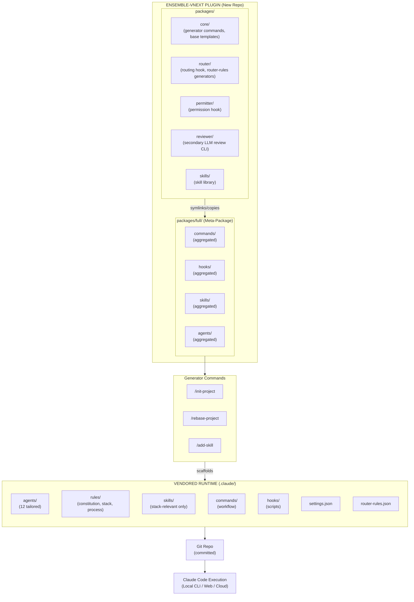
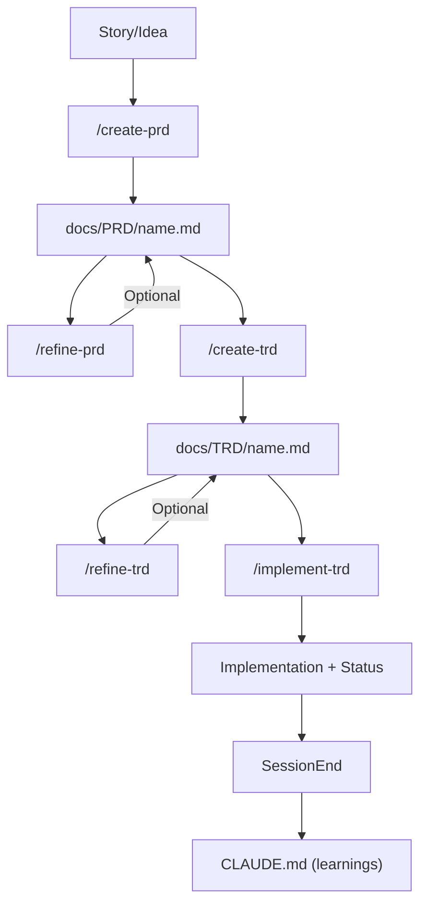
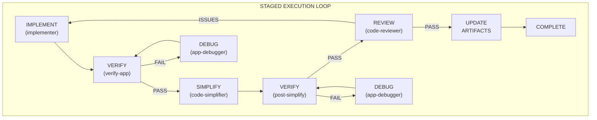
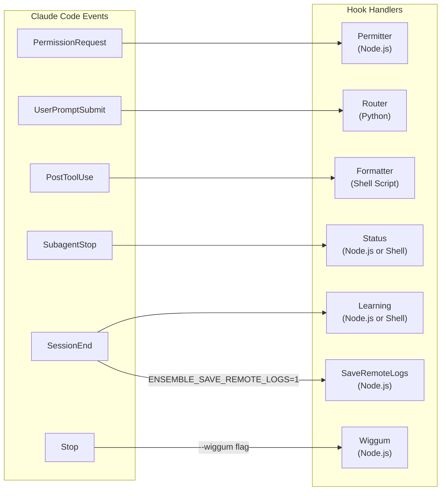
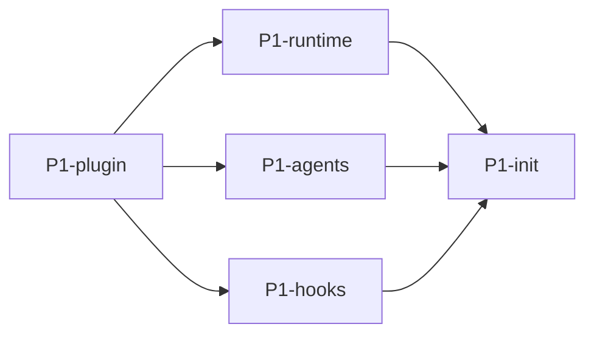
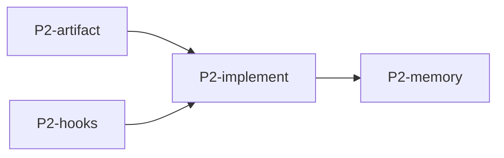
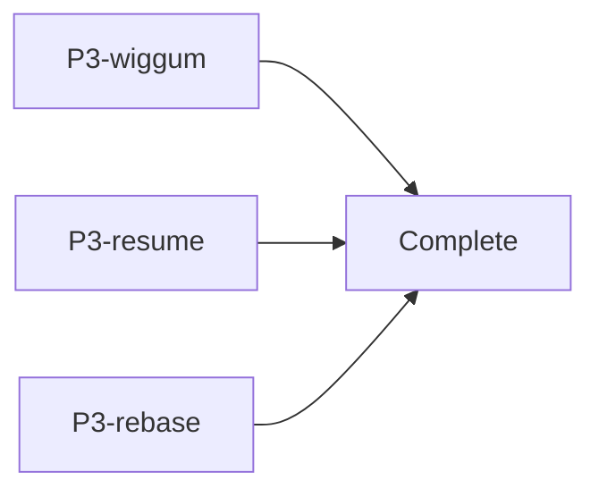
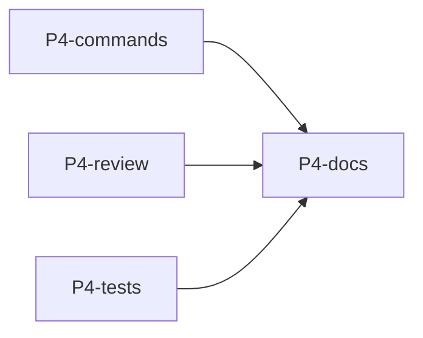
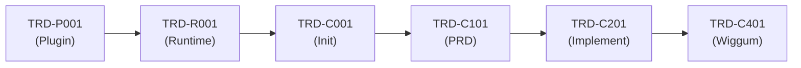

# Technical Requirements Document: Ensemble vNext

**Document Version**: 1.2.0
**Status**: Draft
**Created**: 2026-01-12
**Last Updated**: 2026-01-13
**Author**: Technical Architecture
**Source PRD**: [docs/PRD/ensemble-vnext.md](../PRD/ensemble-vnext.md)

---

## Changelog

### Version 1.2.0 (2026-01-13)

**Comprehensive Update Based on Detailed Feedback Review:**

**TECHNOLOGY STACK CLARIFICATIONS (Section 1.3)**:
- Node.js for hook executables we build, UNLESS they can be written with straightforward bash/sh scripts
- Python only for router hook (note: future refactor planned to Node.js)
- Added reference to predefined formatter table (see Section 3.5.3 and PRD Section F6.3)

**INTEGRATION POINTS (Section 1.4)**:
- Secondary LLM will use OpenAI, gpt-5.2 (when implemented)

**PACKAGE STRUCTURE RESTRUCTURE (Section 2.1)**:
- Restructured packages to: router, permitter, reviewer (secondary LLM review), skills, core
- This is a NEW repo - files are COPIED from existing ensemble
- Updated diagram and tables accordingly

**HOOK SYSTEM ARCHITECTURE (Section 2.4)**:
- Formatter hook changed from Node.js to shell script routing to correct formatter tool
- Full formatter table from PRD included

**GOVERNANCE FILES (Section 2.5.2)**:
- Added project router-rules.json to governance files table (lives in .claude/ folder structure)

**ARTIFACT COMMANDS (Section 3.2)**:
- Added VERY CLEAR instructions that /create-prd, /create-trd should START FROM existing ensemble commands
- Copy from ensemble and iterate on them
- Note that TRD template needs updates for planning/structural requirements

**IMPLEMENT-TRD CRITICAL CLARIFICATIONS (Section 3.3.1)**:
- **All commands are .md prompt files** with optional helper shell scripts - NOT code
- Pseudocode (execute_task_cycle, etc.) is CONCEPTUAL, showing orchestration flow - not actual code
- Subagents are also prompts (.md files)
- Added references to prompt template resources and Claude subagent documentation
- /implement-trd based on existing /implement-trd-enhanced, modified for vendored version
- Support `--continue` argument (alias for `--resume`)
- Note about auto-dispatch to Claude Code on the web when ready

**HOOK SPECIFICATIONS (Section 3.5)**:
- Note that bash/sh scripts are acceptable if simple enough
- Router needs to copy generate-project-router-rules AND generate-router-rules commands

**FORMATTER HOOK (Section 3.5.3)**:
- Changed from Node.js to SHELL SCRIPT that routes to correct formatter based on language
- Ensure init-project installs and configures formatters

**STATUS HOOK (Section 3.5.4)**:
- Added VALIDATION NOTE: Assess feasibility - can we actually build this hook to review what's done and update implement.json? Or can we only confirm implement.json was updated from when we started?

**LEARNING HOOK (Section 3.5.5)**:
- Should `git add` OTHER changed files, not just CLAUDE.md

**SUBAGENT FRONTMATTER TEMPLATE (Section 3.6.2)**:
- Changed model from `sonnet` to `opus` for ALL agents
- Added missing frontmatter fields (see PRD Appendix C for full spec)
- Added reference section showing existing ensemble agents as starting points

**MASTER TASK LIST (Section 4) - Task Description Clarifications**:
- TRD-P002: Clarified - skill library loader is NOT custom code; Claude plugin framework handles this
- TRD-P003: Reframed - we don't "template" agents; we have base .md files that LLM updates
- TRD-P004: Reframed - commands are NOT modified; .md files simply copied to project
- TRD-P005: Clarified - hook bundling mechanism exists in Claude plugin framework
- TRD-R002: Clear this is LLM prompt, NOT code - init-project scans codebase entirely via LLM
- TRD-R003: LLM generates stack.md, NOT a script
- TRD-R004: Use existing ensemble init-project template mechanism
- TRD-R006: LLM reviews stack.md against skill list for matches
- TRD-R007: Assess if we need GENERATOR or just static settings.json to deploy
- TRD-C001: Clarified relationship with TRD-R001 - significant reuse expected
- TRD-C002: Ensure clear this is LLM function
- TRD-C003: This is LLM function; init-project command modifies agents via prompt
- TRD-H001, H002: Exact copy, but may need integration into new plugin structure
- A0 section: Note these are NOT "templates" - fully formed, ready-to-work agents
- TRD-C101, C103, C104, C108: Start from existing versions, modify as needed
- TRD-C105: Ensure create-trd runs in plan mode
- TRD-C201: Not a "shell" - based on implement-trd-enhanced, modified for vendored version
- C2 section: Add note - TRD parser is detailed prompt, NOT script; assess XML prompt structure
- TRD-C302, C303: Part of update-project command prompt, nothing specific to implement
- C4 section: Review official wiggum plugin, ensure we follow same pattern

**TESTING (Section T0)**:
- React+TS: Simple TODO list app - create checklist, check items off (UI + backend)
- FastAPI: Simple straightforward example
- Node.js Express: Full-stack TODO list with frontend + backend

**TESTING REQUIREMENTS (Section 6.1)**:
- Added notes about limited testing for commands, subagents, skills
- Primary test mechanism: `claude --prompt "..." --session-id xxx --dangerously-skip-permissions`
- Review session logs to verify agents/skills/hooks used
- Much testing will need to be done manually

### Version 1.1.0 (2026-01-12)

- **Plugin Architecture**: Updated Section 2 and 3.1 to accurately reflect existing ensemble monorepo structure with npm workspaces, symlink-based aggregation in ensemble-full meta-package
- **Hook Specifications**: Updated Section 3.5 to specify Node.js as default hook language, with router.py noted as exception pending future refactor
- **Diagrams**: Converted all ASCII diagrams (Sections 2.1, 2.3.1, 2.3.2, 2.4, 5) to Mermaid syntax
- **Current Feature Pointer**: Added Section 2.5.3 documenting `.trd-state/current.json` for context-free command execution
- **Command Templates**: Added references to existing baseline commands (create-prd, create-trd, implement-trd-enhanced) in Sections 3.2 and 3.3
- **Task Dependencies**: Fixed TRD-C301 dependency from non-existent TRD-H005 to TRD-H103
- **New Tasks**: Added TRD-R009 and TRD-C009 for current.json feature pointer implementation

### Version 1.0.0 (2026-01-12)

- Initial TRD creation from PRD

---

## Table of Contents

1. [Overview](#1-overview)
2. [System Architecture](#2-system-architecture)
3. [Technical Specifications](#3-technical-specifications)
4. [Master Task List](#4-master-task-list)
5. [Execution Plan](#5-execution-plan)
6. [Quality Requirements](#6-quality-requirements)
7. [Risk Assessment](#7-risk-assessment)
8. [Appendices](#8-appendices)

---

## 1. Overview

### 1.1 Technical Summary

Ensemble vNext is a workflow framework for Claude Code that implements power-user patterns as a repeatable, accessible system. The architecture consists of two layers:

1. **Generator Layer (Plugin)**: Distributed via Claude Code marketplace, provides commands that scaffold project-specific runtime configurations.

2. **Vendored Runtime Layer (Project)**: A committed \`.claude/\` directory containing subagents, skills, commands, hooks, and settings that ensure identical behavior across local CLI and web sessions.

### 1.2 Key Technical Decisions

| Decision | Choice | Rationale |
|----------|--------|-----------|
| Distribution Model | Claude Code Plugin Marketplace | Standard distribution, automatic updates, user discovery |
| Runtime Model | Vendored (\`.claude/\` committed) | Consistent behavior across environments, version-controlled |
| Orchestration Model | Command-led (no orchestrator agent) | Visibility, debuggability, determinism |
| State Management | JSON files in \`.trd-state/\` tracked in git | Machine-readable, parallel session coordination |
| Hook Implementation | Permitter/Router copied from legacy | Proven, tested implementations |
| Subagent Count | 12 streamlined agents | Reduced from 28 based on usage patterns |

### 1.3 Technology Stack

| Component | Technology | Notes |
|-----------|------------|-------|
| Plugin Runtime | Claude Code Plugin API | Commands, hooks, settings |
| Hook Executables | Node.js or Shell (bash/sh) | Node.js for complex hooks; bash/sh scripts acceptable when straightforward |
| Router Hook | Python (`router.py`) | Exception to Node.js default; **future refactor planned to Node.js for consistency** |
| Formatter Hook | Shell script | Routes to correct formatter based on language (see Section 3.5.3 and PRD F6.3 for predefined formatter table) |
| Configuration | JSON, YAML frontmatter | settings.json, agent/skill definitions |
| State Files | JSON | \`.trd-state/\` implementation tracking |
| Documentation | Markdown | PRDs, TRDs, skills, agents |
| Commands & Agents | Markdown (.md) prompt files | **NOT code** - all commands and subagents are prompt files that the LLM interprets |

> **Important Note on Implementation**: This is a NEW repository. Files will be COPIED from the existing ensemble repository, not migrated or modified in place. The ensemble-vnext plugin is a fresh implementation that uses existing ensemble components as starting points.

### 1.4 Integration Points

| Integration | Purpose | Priority |
|-------------|---------|----------|
| Git | Version control, branch management, parallel coordination | Required |
| Claude Code API | Commands, hooks, subagents, skills | Required |
| Context7 MCP | Documentation retrieval | Optional |
| Playwright MCP | E2E testing | Required for testing |
| Secondary LLM API (OpenAI gpt-5.2) | External review for PRD/TRD critique | P2 Optional |

> **Secondary LLM Note**: When implemented, the secondary LLM review feature will use **OpenAI gpt-5.2** as the initial provider. The secondary LLM sees ONLY artifacts (PRD, TRD), NOT the codebase, providing an independent perspective on specification quality.

---

## 2. System Architecture

### 2.1 Two-Layer Architecture

> **IMPORTANT**: This is a NEW repository (`ensemble-vnext`). Files are COPIED from the existing ensemble repository, not migrated in place. This ensures a clean separation and allows for structural improvements.



**Plugin Architecture Details (ensemble-vnext Structure)**:

The ensemble-vnext plugin is a **new monorepo** with a simplified, focused package structure:

| Package | Purpose | Contents |
|---------|---------|----------|
| `core/` | Generator layer | init-project, rebase-project, add-skill commands; base agent/command templates |
| `router/` | Prompt routing | router.py hook (Python), generate-router-rules, generate-project-router-rules commands |
| `permitter/` | Permission management | permitter.js hook (Node.js), permission allowlist logic |
| `reviewer/` | Secondary LLM review | CLI tool for OpenAI gpt-5.2 artifact review |
| `skills/` | Skill library | All available skills, selected based on stack.md during init |
| `full/` | Meta-package | Aggregates all packages for distribution |

**Simplified Package Structure (ensemble-vnext)**:

```
ensemble-vnext/
├── packages/
│   ├── core/
│   │   ├── commands/           # Generator commands
│   │   │   ├── init-project.md
│   │   │   ├── rebase-project.md
│   │   │   └── add-skill.md
│   │   ├── agents/             # Base agent templates (copied from existing ensemble)
│   │   └── templates/          # TRD/PRD templates
│   │
│   ├── router/
│   │   ├── hooks/
│   │   │   └── router.py       # Copied from existing ensemble
│   │   └── commands/
│   │       ├── generate-router-rules.md
│   │       └── generate-project-router-rules.md
│   │
│   ├── permitter/
│   │   └── hooks/
│   │       └── permitter.js    # Copied from existing ensemble
│   │
│   ├── reviewer/
│   │   └── cli/                # Secondary LLM review CLI
│   │       └── ensemble-review
│   │
│   ├── skills/
│   │   └── <skill-name>/       # Individual skill directories
│   │       ├── SKILL.md
│   │       └── REFERENCE.md
│   │
│   └── full/                   # Meta-package (aggregates all)
│       ├── .claude-plugin/
│       │   └── plugin.json
│       ├── commands/           # Symlinks to package commands
│       ├── hooks/              # Symlinks to package hooks
│       ├── skills/             # Symlinks to skills
│       └── agents/             # Symlinks to agents
```

> **Source Repository**: Files are copied from the existing ensemble repository at `~/dev/ensemble`. The existing ensemble implementation provides proven, tested components that serve as the foundation for ensemble-vnext.

### 2.2 Component Architecture

#### 2.2.1 Plugin Components

| Component | Path (Plugin) | Description |
|-----------|---------------|-------------|
| Generator Commands | `packages/core/commands/` | init-project, rebase-project, add-skill |
| Workflow Commands | `packages/core/commands/` | create-prd, refine-prd, create-trd, refine-trd, implement-trd, update-project, cleanup-project |
| Router Commands | `packages/router/commands/` | generate-router-rules, generate-project-router-rules |
| Skills Library | `packages/skills/` | Full skill library, selected based on stack.md |
| Agent Definitions | `packages/core/agents/` | Base agent templates (12 agents), tailored during init |
| Permitter Hook | `packages/permitter/hooks/permitter.js` | Node.js - copied from existing ensemble |
| Router Hook | `packages/router/hooks/router.py` | Python - copied from existing ensemble |
| Review CLI | `packages/reviewer/cli/` | Secondary LLM review tool (OpenAI gpt-5.2) |

#### 2.2.2 Vendored Runtime Components

| Component | Path (Project) | Description |
|-----------|----------------|-------------|
| Subagents | \`.claude/agents/\` | 12 project-tailored subagents |
| Rules | \`.claude/rules/\` | constitution.md, stack.md, process.md |
| Skills | \`.claude/skills/\` | Stack-relevant skills only |
| Commands | \`.claude/commands/\` | Workflow commands (7 total) |
| Hooks | \`.claude/hooks/\` | Hook shell scripts |
| Settings | \`.claude/settings.json\` | Permissions + hook config (committed) |
| Local Settings | \`.claude/settings.local.json\` | Local overrides (gitignored) |

### 2.3 Data Flow Architecture

#### 2.3.1 Artifact Flow



#### 2.3.2 Implementation Cycle Flow



### 2.4 Hook System Architecture



| Event | Hook | Implementation | Responsibilities |
|-------|------|----------------|------------------|
| PermissionRequest | Permitter | Node.js (`permitter.js`) | Normalize bash commands, match allowlist, auto-approve |
| UserPromptSubmit | Router | Python (`router.py`) | Classify prompts, inject context steering, route to commands/skills/agents |
| PostToolUse | Formatter | **Shell script** (`formatter.sh`) | Route to correct formatter based on file extension (see formatter table below) |
| SubagentStop | Status | Node.js or Shell | Update `.trd-state/`, record cycle position, track session IDs |
| SessionEnd | Learning | Node.js or Shell | Capture learnings, update CLAUDE.md, git add changed files (NEVER commit) |
| SessionEnd | SaveRemoteLogs | Node.js (`save-remote-logs.js`) | Capture session logs from remote sessions before VM terminates (when `ENSEMBLE_SAVE_REMOTE_LOGS=1`) |
| Stop | Wiggum | Node.js | Intercept exit (when `--wiggum`), re-inject prompt, check completion |

> **Note**: The Router hook is currently implemented in Python (`router.py`). A future iteration will refactor it to Node.js for consistency with other hooks.

> **Hook Implementation Language**: Hooks may be implemented in Node.js OR bash/sh scripts, whichever is simpler for the task. Complex logic favors Node.js; simple routing or file operations may use shell scripts.

**Formatter Routing Table** (used by `formatter.sh`):

| Extensions | Formatter | Command |
|------------|-----------|---------|
| js, jsx, ts, tsx, html, css, json, yaml, md | Prettier | `prettier --write <file>` |
| py | Ruff | `ruff format <file>` |
| go | goimports | `goimports -w <file>` |
| rs | rustfmt | `rustfmt <file>` |
| sh | shfmt | `shfmt -w <file>` |
| tf, tfvars | terraform fmt | `terraform fmt <file>` |
| c, cpp, h, hpp | clang-format | `clang-format -i <file>` |
| java | google-java-format | `google-java-format -i <file>` |
| kt, kts | ktlint | `ktlint -F <file>` |
| cs | CSharpier | `dotnet csharpier <file>` |
| swift | swift-format | `swift-format format -i <file>` |
| lua | StyLua | `stylua <file>` |

> **Note**: The `/init-project` command MUST install and configure the appropriate formatters based on the detected tech stack. See PRD Section F6.3 for the complete formatter specification.

### 2.5 State Management Architecture

#### 2.5.1 Status File Schema

\`\`\`json
{
  "trd_file": "docs/TRD/<feature>.md",
  "trd_hash": "<sha256>",
  "branch": "<issue-id>-<session>",
  "strategy": "tdd|characterization|implementation",
  "phase_cursor": 1,
  "tasks": {
    "TRD-001": {
      "status": "pending|in_progress|success|failed",
      "cycle_position": "implement|verify|simplify|verify_post_simplify|review|update_artifacts|complete",
      "current_problem": "string or null",
      "retry_count": 0,
      "session_id": "sess_xxx or null",
      "commit": "sha or null"
    }
  },
  "coverage": {
    "unit": 0.0,
    "integration": 0.0
  },
  "checkpoints": [
    {
      "phase": 1,
      "commit": "sha",
      "timestamp": "ISO8601"
    }
  ],
  "active_sessions": {
    "<phase_name>": "session_id or null"
  },
  "recovery": {
    "last_healthy_checkpoint": "sha",
    "last_checkpoint_timestamp": "ISO8601",
    "interrupted": false,
    "interrupt_reason": null
  }
}
\`\`\`

#### 2.5.2 Governance Files

| File | Location | Update Mechanism | Contents |
|------|----------|------------------|----------|
| Constitution | `.claude/rules/constitution.md` | Manual only (user confirmation) | Architecture invariants, non-negotiables |
| Stack | `.claude/rules/stack.md` | Semi-auto (user confirmation) | Tech stack definition |
| Process | `.claude/rules/process.md` | Generated | Workflow expectations |
| Router Rules | `.claude/router-rules.json` | Generated by `/init-project` and `generate-project-router-rules` | Project-specific routing patterns for the Router hook |
| CLAUDE.md | Project root | Auto (SessionEnd hook) | Living memory, conventions, learnings |

#### 2.5.3 Current Feature Pointer

The current feature pointer enables commands to work without explicit path arguments by tracking the active PRD/TRD context.

**File**: `.trd-state/current.json`

```json
{
  "prd": "docs/PRD/VFM-1234.md",
  "trd": "docs/TRD/VFM-1234.md",
  "status": ".trd-state/VFM-1234/implement.json",
  "branch": "VFM-1234-phase1"
}
```

**Field Definitions**:

| Field | Description |
|-------|-------------|
| `prd` | Path to currently active PRD (or null if not yet created) |
| `trd` | Path to currently active TRD (or null if not yet created) |
| `status` | Path to implementation status file (or null if not started) |
| `branch` | Current feature branch name |

**Command Behavior**:

| Command | Without `current.json` | With `current.json` |
|---------|------------------------|---------------------|
| `/create-prd` | Must specify story/idea | Reads context, can omit args |
| `/create-trd` | Must specify PRD path | Uses `current.prd` automatically |
| `/implement-trd` | Must specify TRD path | Uses `current.trd` automatically |
| `/refine-prd` | Must specify PRD path | Uses `current.prd` automatically |
| `/refine-trd` | Must specify TRD path | Uses `current.trd` automatically |

**Housekeeping (Command Start)**:

At the start of any workflow command, validate alignment:

1. Check if `current.branch` matches the actual git branch
2. If mismatched, offer options:
   - Update `current.json` to reflect current branch
   - Switch git branch to match `current.json`
   - Clear `current.json` (start fresh)
3. Validate that referenced files exist
4. If files are missing, clear stale pointers

**Automatic Updates**:

| Event | Action |
|-------|--------|
| `/create-prd` completes | Set `current.prd` |
| `/create-trd` completes | Set `current.trd`, clear old `status` |
| `/implement-trd` starts | Set `current.status`, `current.branch` |
| Branch switch detected | Prompt user to update or clear |

---

## 3. Technical Specifications

### 3.1 Plugin Commands (Generator Layer)

#### 3.1.1 /init-project (F1.1)

**Purpose**: Generate vendored runtime with project analysis.

**Implementation Approach**:
1. Shell script performs scaffolding (deterministic)
2. LLM customizes templates based on project analysis
3. Validation script verifies structure
4. Auto-run \`generate-project-router-rules\`

**Input Analysis**:
- Dependency files: package.json, requirements.txt, Gemfile, go.mod, Cargo.toml, etc.
- Project structure: Directory layout, file organization
- Architecture patterns: MVC, Clean Architecture, microservices, etc.
- Existing conventions: Code style, naming patterns

**Output Generation**:

| Output | Source | Customization |
|--------|--------|---------------|
| \`.claude/agents/\` | Plugin templates | Tailored to project stack/patterns |
| \`.claude/rules/\` | Generated | Project-specific content |
| \`.claude/skills/\` | Plugin library | Selected based on stack.md |
| \`.claude/commands/\` | Plugin templates | Copied without modification |
| \`.claude/hooks/\` | Plugin hooks | Copied without modification |
| \`.claude/settings.json\` | Generated | Project-appropriate permissions |
| \`.gitignore\` | Updated | Track .claude/, ignore *.local.* |
| CLAUDE.md | Generated or preserved | Project context |

**Brownfield/Migration Behavior**:
1. Detect existing \`.claude/\` directory
2. Prompt user: "Existing ensemble installation detected. Replace with current version?"
3. On confirmation: Replace agents, skills, commands, hooks
4. Preserve: Other project files, CLAUDE.md content

**Formatter Installation**:
- Detect tech stack from analysis
- Install missing formatters (npm, pip, etc.)
- Configure formatter settings

#### 3.1.2 /rebase-project (F1.2)

**Purpose**: Upgrade vendored runtime to newer plugin version.

**Behavior**:
1. Detect plugin version changes
2. Identify new/updated components:
   - New subagent templates (do NOT overwrite customized agents)
   - New/modified skills
   - Updated commands (not customized per project)
   - Updated hooks
3. Recompute compiled skills based on current stack
4. Generate rebase report

**Preservation Rules**:
- Agent customizations: Preserved
- Rule files: Preserved
- Local settings: Preserved
- Skills: Recomputed
- Commands: Updated
- Hooks: Updated

#### 3.1.3 /add-skill (F1.3)

**Purpose**: Add skill without full rebase.

**Behavior**:
1. Validate skill exists in plugin library
2. Copy to \`.claude/skills/\`
3. Update stack.md if needed
4. No other changes

### 3.2 Artifact Commands

> **CRITICAL IMPLEMENTATION APPROACH - Commands are .md Prompt Files**:
>
> All commands in this section are **Markdown prompt files** (.md), NOT executable code. The LLM interprets these prompts
> to orchestrate the workflow. Implementation means **writing a well-structured prompt**, not programming.
>
> **Starting Point**: COPY commands from the existing ensemble repository and ITERATE on them:
> - Source: `~/dev/ensemble/packages/product/commands/ensemble/create-prd.md`
> - Source: `~/dev/ensemble/packages/development/commands/ensemble/create-trd.md`
> - Source: `~/dev/ensemble/packages/development/commands/ensemble/refine-prd.md`
> - Source: `~/dev/ensemble/packages/development/commands/ensemble/refine-trd.md`
>
> **Process**:
> 1. **Copy** the existing command .md file from ensemble to ensemble-vnext
> 2. **Review** the current prompt structure and intent
> 3. **Modify** to align with ensemble-vnext requirements (vendored runtime, 12 agents, new package structure)
> 4. **Update** references to new document templates as needed
>
> **Note**: The TRD template (`docs/templates/trd-template.md`) will need updates based on the planning and structural
> requirements defined in this document. Ensure the /create-trd command references the updated template.

#### 3.2.1 /create-prd (F3.1)

**Purpose**: Generate PRD from story/idea.

**Implementation**:
```
1. Parse input (story description or issue reference)
2. Check .trd-state/current.json for context (optional)
3. Delegate to product-manager subagent with ultrathink
4. Generate PRD to docs/PRD/<issue-id>.md
5. Update .trd-state/current.json with new PRD path
6. Validate PRD structure
```

**Prompt Template** (excerpt):
```
ultrathink

Create a Product Requirements Document for:
$ARGUMENTS

Follow the structure in @docs/templates/prd-template.md if available.
Output to docs/PRD/<appropriate-name>.md
```

#### 3.2.2 /create-trd (F3.3, F4.1)

**Purpose**: Generate TRD with integrated execution plan.

**Implementation**:
```
1. Parse PRD reference (or use current.prd from .trd-state/current.json)
2. Delegate to technical-architect subagent with ultrathink
3. Generate TRD with embedded execution plan
4. Execution plan includes:
   - Phases (logical groupings)
   - Tasks (individual work units)
   - Work sessions (proposed parallel splits)
   - Parallelization opportunities
   - Offload recommendations
5. Execution plan EXCLUDES:
   - Timing estimates
   - Duration predictions
   - Sprint assignments
6. Output to docs/TRD/<issue-id>.md
7. Update .trd-state/current.json with new TRD path
```

**TRD Structure Requirements**:
```markdown
# TRD: <Feature Name>

## Overview
## System Architecture
## Technical Specifications
## Master Task List
  - Task IDs: TRD-XXX format
  - Dependencies
  - Acceptance criteria
## Execution Plan
  - Phases
  - Work Sessions
  - Parallelization
## Quality Requirements
## Risk Assessment
```

#### 3.2.3 /refine-prd and /refine-trd (F3.2, F3.4)

**Purpose**: Iterate on artifacts with user feedback.

**Implementation**:
\`\`\`
1. Load existing artifact
2. Accept user feedback
3. Delegate to appropriate agent
4. Update artifact preserving structure
5. Track revision in artifact header
\`\`\`

### 3.3 Implementation Command

> **CRITICAL CLARIFICATION - /implement-trd is a PROMPT, NOT CODE**:
>
> The /implement-trd command is a **Markdown prompt file** (.md) that the LLM interprets to orchestrate the implementation
> workflow. The pseudocode below (functions like `execute_task_cycle`, `delegate_to_implementer`, etc.) is **CONCEPTUAL**,
> showing the orchestration flow and decision logic - it is NOT actual executable code.
>
> **What gets implemented**: A well-structured prompt that guides the LLM through the staged execution loop.
> **What does NOT get implemented**: Code for a TRD parser, delegation functions, or orchestration scripts.
>
> Subagents (frontend-implementer, backend-implementer, verify-app, code-reviewer, etc.) are ALSO prompts (.md files).
> Delegation means the main prompt instructs the LLM to spawn a subagent with specific context.
>
> **Baseline Reference**: COPY and MODIFY from existing ensemble command:
> - Source: `~/dev/ensemble/packages/development/commands/ensemble/implement-trd-enhanced.md`
>
> Key patterns from implement-trd-enhanced to incorporate:
> - **Strategy awareness**: tdd, characterization, test-after, bug-fix, refactor, flexible
> - **File conflict detection**: Infer file touches, detect conflicts, serialize when needed
> - **Skill matching**: From router-rules.json with fallback table
> - **Quality gate per strategy**: Different behavior for tdd vs characterization vs flexible
> - **State management schema**: Full task tracking with status, cycle position, coverage
>
> **Reference Resources**:
> - Claude Subagent Documentation: https://docs.anthropic.com/en/docs/claude-code/sub-agents
> - Prompt template examples: See AgentOS and Speckit GitHub repos for complex orchestration prompts
>
> **Consider XML Structure**: Assess whether XML-based prompt structuring helps maintain order/structure for this
> complex command. Claude handles XML well for structured content.

#### 3.3.1 /implement-trd (F4.2)

**Purpose**: Execute staged implementation loop via orchestration prompt.

**Arguments**:
| Argument | Description |
|----------|-------------|
| `<trd-path>` | Path to TRD file (optional if current.json exists) |
| `--phase N` | Execute only phase N |
| `--session <name>` | Execute only named work session |
| `--wiggum` | Enable autonomous mode |
| `--resume` | Resume from last checkpoint |
| `--continue` | Alias for `--resume` |

**Invocation**:
- `/implement-trd` - Uses current.trd from `.trd-state/current.json`
- `/implement-trd docs/TRD/feature.md` - Explicit TRD path
- `/implement-trd --continue` - Resume interrupted session (alias for `--resume`)

**Auto-Dispatch Note**: When the implementation is ready for autonomous execution, support dispatching to Claude Code
on the web interface for extended sessions.

**Core Algorithm** (CONCEPTUAL - shows orchestration flow, not actual code):
\`\`\`
function implement_trd(trd_path, options):
    state = load_or_create_state(trd_path)
    
    if options.phase:
        phases = [options.phase]
    elif options.session:
        phases = get_phases_for_session(options.session)
    else:
        phases = get_all_phases(trd_path)
    
    for phase in phases:
        for task in get_tasks(phase):
            if task.status == "complete":
                continue
                
            result = execute_task_cycle(task, state)
            
            if result == STUCK and not options.wiggum:
                pause_for_user()
            elif result == STUCK and options.wiggum:
                continue_to_next()  # Wiggum mode keeps going
                
        update_checkpoint(state, phase)
        commit_and_push(state.branch)
    
    if all_complete(state):
        emit_completion_promise()
\`\`\`

**Task Cycle Execution**:
\`\`\`
function execute_task_cycle(task, state):
    max_retries = 3
    current_problem = null
    retry_count = 0
    
    while true:
        # IMPLEMENT
        task.cycle_position = "implement"
        implement_result = delegate_to_implementer(task)
        
        # VERIFY
        task.cycle_position = "verify"
        verify_result = delegate_to_verify_app()
        
        if verify_result.failed:
            if verify_result.problem == current_problem:
                retry_count++
                if retry_count >= max_retries:
                    return STUCK
            else:
                current_problem = verify_result.problem
                retry_count = 1
            
            # DEBUG (not implementer)
            delegate_to_app_debugger(verify_result.problem)
            continue  # Back to verify
        
        # SIMPLIFY
        task.cycle_position = "simplify"
        delegate_to_code_simplifier()
        
        # VERIFY POST-SIMPLIFY
        task.cycle_position = "verify_post_simplify"
        verify_result = delegate_to_verify_app()
        
        if verify_result.failed:
            # Same retry logic with app-debugger
            ...
        
        # REVIEW
        task.cycle_position = "review"
        review_result = delegate_to_code_reviewer()
        
        if review_result.issues:
            # Back to implement for issues
            continue
        
        # UPDATE ARTIFACTS
        task.cycle_position = "update_artifacts"
        update_status_file(task)
        task.status = "complete"
        task.cycle_position = "complete"
        
        return SUCCESS
\`\`\`

**Git Operations**:
- Create branch: `<issue-id>-<session-name>`
- Commit at checkpoints
- Push to remote branch
- Status file tracked in git

### 3.4 Project Memory Commands

#### 3.4.1 /update-project (F5.1)

**Purpose**: Manual learning capture with Constitution updates.

**Behavior**:
1. Analyze current session for learnings
2. Auto-update CLAUDE.md
3. Propose Constitution changes (require confirmation)
4. Propose stack.md updates (require confirmation)
5. If stack changes, check for matching skills
6. Run \`generate-project-router-rules\`

#### 3.4.2 /cleanup-project (F5.2)

**Purpose**: Review and prune CLAUDE.md and project artifacts.

**Behavior**:
1. Identify stale/redundant CLAUDE.md entries
2. Show diff before applying
3. Create backup
4. Apply changes with confirmations

**Arguments**:
| Argument | Description |
|----------|-------------|
| \`--dry-run\` | Preview without applying |
| \`--auto\` | Apply non-destructive cleanups |

### 3.5 Hook Specifications

> **Hook Implementation Language**:
> - **Default**: Node.js (JavaScript) for complex hooks
> - **Alternative**: Bash/shell scripts (`*.sh`) are acceptable when the logic is straightforward
> - **File naming**: `*.js` for Node.js, `*.sh` for shell scripts, `*.py` acceptable during transition
> - **Exception**: Router hook is currently implemented in Python (`router.py`); future iteration will refactor to Node.js for consistency
> - All hooks in `packages/full/hooks/` are either JS files, shell scripts, or symlinks to other packages
>
> **Router Package Commands**: The router package MUST include both routing-related commands:
> - `generate-router-rules.md` - Generate global router rules
> - `generate-project-router-rules.md` - Generate project-specific router rules

#### 3.5.1 Permitter Hook (F6.1)

> **CRITICAL**: Copy existing implementation from legacy Ensemble EXACTLY. No modifications.
> **Source**: `packages/permitter/hooks/permitter.js`

**Event**: PermissionRequest
**Priority**: P1
**Language**: Node.js

**Behavior**:
1. Intercept bash permission requests
2. Normalize command:
   - Strip env var prefixes
   - Strip wrappers (timeout, etc.)
   - Extract commands from chains (&&, ||, ;)
3. Match normalized commands against allowlist
4. Auto-approve if all extracted commands match
5. Reject unsafe constructs: `$()`, heredocs, process substitution
6. Fail-closed on parse errors

**Implementation File**: `.claude/hooks/permitter.js`

#### 3.5.2 Router Hook (F6.2)

> **CRITICAL**: Copy existing implementation from legacy Ensemble EXACTLY. No modifications.
> **Source**: `packages/router/hooks/router.py`
> **Note**: Currently Python; will be refactored to Node.js in future iteration for consistency.

**Event**: UserPromptSubmit
**Priority**: P1
**Language**: Python (exception to Node.js default)

**Behavior**:
1. Load router-rules.json (global and project-specific)
2. Match incoming prompt against patterns
3. Inject context steering to appropriate:
   - Commands
   - Skills
   - Subagents
4. Never blocking (always allows prompt to continue)

**Generated By**: `generate-project-router-rules` command

**Implementation File**: `.claude/hooks/router.py`

#### 3.5.3 Formatter Hook (F6.3)

**Event**: PostToolUse (Edit/Write)
**Priority**: P2
**Language**: Shell script (bash/sh)

> **Implementation Approach**: This is a straightforward routing task - the shell script extracts the file extension
> and executes the corresponding formatter command. No complex logic required.
>
> **Init-Project Responsibility**: The `/init-project` command MUST:
> 1. Detect the project's tech stack
> 2. Install missing formatters (via npm, pip, brew, etc.)
> 3. Configure formatter settings (e.g., .prettierrc, ruff.toml)
> 4. Verify formatters are accessible in PATH

**Behavior**:
1. Extract file extension from the edited/written file path
2. Look up formatter command from the routing table below
3. Execute formatter (non-blocking, fire-and-forget)
4. Log errors to stderr but do NOT fail the hook

**Formatter Routing Table** (see PRD Section F6.3 for full specification):

| Extensions | Formatter | Command |
|------------|-----------|---------|
| js, jsx, ts, tsx, html, css, json, yaml, md | Prettier | `prettier --write <file>` |
| py | Ruff | `ruff format <file>` |
| go | goimports | `goimports -w <file>` |
| rs | rustfmt | `rustfmt <file>` |
| sh | shfmt | `shfmt -w <file>` |
| tf, tfvars | terraform fmt | `terraform fmt <file>` |
| c, cpp, h, hpp | clang-format | `clang-format -i <file>` |
| java | google-java-format | `google-java-format -i <file>` |
| kt, kts | ktlint | `ktlint -F <file>` |
| cs | CSharpier | `dotnet csharpier <file>` |
| swift | swift-format | `swift-format format -i <file>` |
| lua | StyLua | `stylua <file>` |

**Implementation File**: `.claude/hooks/formatter.sh`

#### 3.5.4 Status Hook (F6.4)

**Event**: SubagentStop
**Priority**: P0
**Language**: Node.js or Shell

> **VALIDATION REQUIRED - Feasibility Assessment**:
>
> Before implementation, assess the feasibility of this hook:
>
> **Question**: Can we actually build a hook that reviews what work was done and updates `implement.json` accordingly?
> Or can we only confirm that `implement.json` has been updated (from when the session started)?
>
> **Option A - Active Status Tracking**: Hook analyzes subagent output to determine task completion, cycle position,
> and updates implement.json automatically. This requires parsing subagent results and making semantic decisions.
>
> **Option B - Passive Verification**: Hook simply verifies that implement.json was modified during the session
> and logs whether changes occurred. The actual updates are done by the implement-trd command prompt itself.
>
> **Recommendation**: Start with Option B (passive verification) and iterate toward Option A if feasible.

**Behavior**:
1. Update `.trd-state/<feature>/implement.json`
2. Record:
   - Task status
   - Cycle position
   - Session ID (set on start, clear on complete)
   - Commit SHA (on completion)
   - Checkpoint (on phase completion)
3. Track current problem for retry logic

**Implementation File**: `.claude/hooks/status.js` (or `status.sh` if simple)

#### 3.5.5 Learning Hook (F6.5)

**Event**: SessionEnd
**Priority**: P2
**Language**: Node.js or Shell

**Behavior**:
1. Detect `CLAUDE_CODE_REMOTE` environment variable
2. Generate session learnings
3. Append to CLAUDE.md
4. `git add CLAUDE.md` (stage only)
5. **`git add` OTHER changed files** - stage all files modified during the session
6. **NEVER commit or push**
7. Log appropriate message:
   - Local: "Review and commit when ready"
   - Remote: "Will be included in auto-push"

> **Important**: This hook stages CLAUDE.md AND other changed files for commit, but does NOT commit.
> The user (or automated process) decides when to commit. Does NOT manage CLAUDE.md growth - use `/cleanup-project` for that.

**Implementation File**: `.claude/hooks/learning.js` (or `learning.sh` if simple)

#### 3.5.6 SaveRemoteLogs Hook

**Event**: SessionEnd
**Priority**: P2
**Language**: Node.js
**Timeout**: 30 seconds

**Activation**: Set `ENSEMBLE_SAVE_REMOTE_LOGS=1` in:
- Environment variable, or
- `settings.json` env configuration

**Purpose**: Capture session logs from remote Claude Code sessions before the VM terminates. Remote sessions do not persist session logs locally, so this hook copies all relevant logs to a committed location for later analysis.

**Behavior**:
1. Check if `ENSEMBLE_SAVE_REMOTE_LOGS=1` is set
2. If not set, exit immediately (no-op)
3. Get session start time from the transcript
4. Find all `.jsonl` files created since session start (captures subagent logs)
5. Copy logs to `.claude-sessions/logs/` directory
6. `git add` the copied logs
7. `git commit` the logs (to ensure they are captured before VM termination)

> **Important**: Unlike other SessionEnd hooks, this hook DOES commit because remote sessions may terminate immediately after SessionEnd, leaving no opportunity for manual commits. The logs are committed to `.claude-sessions/logs/` which should be gitignored in production if desired.

**Destination Directory**: `.claude-sessions/logs/`

**Implementation File**: `.claude/hooks/save-remote-logs.js`

#### 3.5.7 Wiggum Hook (F7)

**Event**: Stop
**Priority**: P1 (only active with `--wiggum` flag)
**Language**: Node.js

**Behavior**:
1. Intercept Claude exit attempts
2. Check completion criteria:
   - Status block shows 100% done
   - All tasks complete
   - Or max iterations reached
3. If not complete:
   - Block exit (exit code 2)
   - Re-inject prompt AND session outputs
4. If complete:
   - Allow exit
   - Emit completion promise

**Safety**: `stop_hook_active` flag prevents infinite loops

**Implementation File**: `.claude/hooks/wiggum.js`

### 3.6 Subagent Specifications

#### 3.6.1 Subagent Roster (12 Agents)

| Category | Agent | Responsibility |
|----------|-------|----------------|
| Artifact | product-manager | PRD creation/refinement |
| Artifact | technical-architect | TRD creation/refinement |
| Planning | spec-planner | Execution planning |
| Implement | frontend-implementer | UI, components, client logic |
| Implement | backend-implementer | APIs, services, data layer |
| Implement | mobile-implementer | Mobile apps (when applicable) |
| Quality | verify-app | Test execution, verification |
| Quality | code-simplifier | Post-verification refactoring |
| Quality | code-reviewer | Security and quality review |
| Quality | app-debugger | Debug verification failures |
| DevOps | devops-engineer | Infrastructure, deployment |
| DevOps | cicd-specialist | Pipeline configuration |

#### 3.6.2 Subagent Frontmatter Template

> **Reference**: See PRD Appendix C for the complete frontmatter specification from Claude subagent documentation.
> **All agents use model: opus** for maximum capability and reasoning.

\`\`\`yaml
---
name: <agent-name>
description: <when to use this agent>
model: opus
model_max_tokens: 16384
api_key_env: ANTHROPIC_API_KEY
skills:
  - <relevant-skill-1>
  - <relevant-skill-2>
---
<Agent prompt content>
\`\`\`

**Frontmatter Fields**:

| Field | Required | Description |
|-------|----------|-------------|
| `name` | Yes | Agent identifier, matches filename without .md |
| `description` | Yes | When to use this agent (for routing) |
| `model` | Yes | **Always `opus`** for all ensemble-vnext agents |
| `model_max_tokens` | No | Max output tokens (default 16384) |
| `api_key_env` | No | Environment variable for API key |
| `skills` | No | Array of skill names relevant to this agent |
| `tools` | No | **Omit this field** - no tool restrictions by default |

**Design Principles**:
1. No tool restrictions (omit `tools:` line entirely)
2. Explicit skills based on project stack
3. Agents are **fully-formed, ready-to-work prompts** - NOT templates to be filled in
4. The LLM (via /init-project) customizes agents for the specific project
5. Permissive start (tighten only when beneficial)

**Existing Ensemble Agents as Starting Points**:

Use these existing ensemble agents as reference when constructing new agents. These are starting points - construct each agent as a fresh prompt based on best practices:

| ensemble-vnext Agent | Existing Ensemble Reference |
|---------------------|----------------------------|
| product-manager | `product-manager` -> `product-management-orchestrator` |
| technical-architect | `technical-architect` -> `tech-lead-orchestrator` |
| spec-planner | *(new agent - no direct equivalent)* |
| frontend-implementer | `frontend-developer` |
| backend-implementer | `backend-developer` |
| mobile-implementer | `mobile-developer` |
| verify-app | *(new agent - focused on test execution)* |
| code-simplifier | *(new agent - focused on refactoring)* |
| code-reviewer | `code-reviewer` |
| app-debugger | *(new agent - focused on debugging)* |
| devops-engineer | `infrastructure-developer` |
| cicd-specialist | `deployment-orchestrator` |

> **Note**: Also reference online examples from the Claude subagent documentation URL provided in the PRD.
> Construct each agent as a fresh, well-structured prompt following best practices.

#### 3.6.3 app-debugger Specification

**Purpose**: Fix verification failures and bugs.

**Distinct From Implementer**:
- Debugger: Analyzes and fixes specific problems
- Implementer: Builds new features

**Receives**: All relevant skills for tech stack (may be context-heavy)
**Outputs**: Fix + writeup of issue and resolution
**Does NOT**: Test the fix (verify-app handles testing)

### 3.7 Secondary LLM Review (F8)

**Priority**: P2

**Privacy Constraint**: Secondary LLM sees ONLY artifacts, NOT codebase.

**Configuration** (\`.claude/settings.local.json\`):
\`\`\`json
{
  "ensemble": {
    "secondaryReview": {
      "provider": "openai",
      "model": "gpt-4o",
      "enabled": true
    }
  }
}
\`\`\`

**Activation**: \`ENSEMBLE_SECONDARY_REVIEW=1\` environment variable

**Review Types**:
- PRD Review: Send (Story + PRD)
- TRD Review: Send (PRD + TRD)

**CLI Tool**: \`ensemble-review\`
- Built-in retry (3 attempts, exponential backoff)
- Reports failure gracefully (non-blocking)

### 3.8 Error Recovery (TR5.10)

#### 3.8.1 Session Resume

**Primary**: Claude Code session resume
\`\`\`bash
claude --resume <session-id>
\`\`\`

**Fallback**: Checkpoint-based resume
\`\`\`bash
/implement-trd docs/TRD/feature.md --resume
\`\`\`

#### 3.8.2 State Validation

On \`/implement-trd\` start:
1. Validate JSON structure
2. Check required fields
3. Verify commits exist in git
4. If invalid:
   - Attempt automatic repair
   - Reconstruct from git log
   - Reset to last checkpoint
   - Or prompt user with options

#### 3.8.3 Recovery Options

| Option | Behavior |
|--------|----------|
| \`--reset-state\` | Start fresh (lose tracking) |
| \`--manual-repair\` | Show corrupt fields for manual fix |

---

## 4. Master Task List

### 4.1 Task ID Convention

Format: \`TRD-<category><number>\`

| Category | Prefix | Description |
|----------|--------|-------------|
| Plugin | P | Generator layer tasks |
| Runtime | R | Vendored runtime tasks |
| Command | C | Command implementation |
| Hook | H | Hook implementation |
| Agent | A | Subagent tasks |
| Test | T | Testing tasks |
| Doc | D | Documentation tasks |

### 4.2 Phase 1: Core Plugin and Vendored Runtime

#### P0 - Plugin Foundation

> **Clarification**: The Claude plugin framework handles skill/command/hook loading automatically.
> These tasks focus on creating the correct file structure - NOT custom loading code.

| ID | Task | Dependencies | Acceptance Criteria |
|----|------|--------------|---------------------|
| TRD-P001 | Create plugin manifest and structure | None | Plugin installs in Claude Code, plugin.json valid |
| TRD-P002 | Organize skill library in packages/skills/ | TRD-P001 | Skills in correct directory structure; Claude plugin framework loads them automatically |
| TRD-P003 | Create base agent .md files in packages/core/agents/ | TRD-P001 | 12 fully-formed agent prompts (NOT templates with variables); LLM customizes them during init |
| TRD-P004 | Copy command .md files to packages/core/commands/ | TRD-P001 | Commands copied from existing ensemble; .md files simply copied to project during init |
| TRD-P005 | Organize hooks in package directories | TRD-P001 | Hooks in correct locations; Claude plugin framework bundles them via plugin.json |

#### R0 - Runtime Generation

> **Clarification**: Tech stack detection, stack.md generation, and skill selection are ALL LLM functions
> performed by the /init-project command prompt. These are NOT scripts or executable code.

| ID | Task | Dependencies | Acceptance Criteria |
|----|------|--------------|---------------------|
| TRD-R001 | Create .claude/ directory scaffolding | TRD-P001 | All directories created correctly |
| TRD-R002 | Tech stack detection via LLM (init-project prompt) | TRD-R001 | LLM scans package.json, requirements.txt, etc. via prompt - NO detection code |
| TRD-R003 | stack.md generation via LLM (init-project prompt) | TRD-R002 | LLM generates stack.md - NOT a script or generator |
| TRD-R004 | Constitution.md template from existing ensemble | TRD-R001 | Use existing ensemble init-project template; current mechanism is fine |
| TRD-R005 | Create process.md template | TRD-R001 | Workflow expectations documented |
| TRD-R006 | Skill selection via LLM (init-project prompt) | TRD-R002 | LLM reviews stack.md against skill list and copies matching skill folders |
| TRD-R007 | Assess settings.json approach | TRD-R001 | Determine: generate dynamically OR deploy static settings.json? What variability expected? |
| TRD-R008 | Implement .gitignore updater | TRD-R001 | Correct tracking rules |
| TRD-R009 | Create .trd-state/ directory scaffolding | TRD-R001 | Directory created with current.json template |

#### C0 - /init-project Command

> **Clarification**: TRD-C001 may overlap with TRD-R001 - significant reuse expected. Repository analysis (C002)
> and subagent customization (C003) are LLM functions performed via the init-project prompt, NOT code.

| ID | Task | Dependencies | Acceptance Criteria |
|----|------|--------------|---------------------|
| TRD-C001 | Create init-project command .md prompt | TRD-R001 | Prompt orchestrates directory creation; reuses TRD-R001 scaffolding |
| TRD-C002 | Repository analysis via LLM (init-project prompt) | TRD-R002 | LLM comprehensively scans project - this is an LLM function, NOT code |
| TRD-C003 | Subagent customization via LLM (init-project prompt) | TRD-P003, TRD-C002 | LLM modifies each agent according to prompt - NOT code; init-project does modification |
| TRD-C004 | Implement brownfield detection | TRD-C001 | Detects existing .claude/ |
| TRD-C005 | Create migration prompt flow | TRD-C004 | User confirmation before replace |
| TRD-C006 | Implement formatter installation | TRD-R002 | Formatters installed and configured |
| TRD-C007 | Create validation script | TRD-C001 | Structure verification |
| TRD-C008 | Integrate generate-project-router-rules | TRD-H002 | Router rules generated |
| TRD-C009 | Implement current.json housekeeping | TRD-R009 | Branch alignment validation on command start |

#### H0 - Core Hooks

> **Clarification**: Permitter and Router hooks are EXACT copies from existing ensemble. May need integration
> work for the new plugin structure (packages/permitter/, packages/router/) and vendored runtime.

| ID | Task | Dependencies | Acceptance Criteria |
|----|------|--------------|---------------------|
| TRD-H001 | Copy Permitter hook from legacy ensemble | None | Exact copy; integrate into packages/permitter/hooks/ and vendored structure |
| TRD-H002 | Copy Router hook from legacy ensemble | None | Exact copy; integrate into packages/router/hooks/ and vendored structure |
| TRD-H003 | Create Status hook | TRD-R001 | Updates .trd-state/ correctly |
| TRD-H004 | Implement session ID tracking | TRD-H003 | Session IDs recorded/cleared |

#### A0 - Subagent Prompts (NOT Templates)

> **CRITICAL**: These are NOT "templates" with variable substitution. Each agent is a **fully-formed, ready-to-work
> prompt**. The LLM (via /init-project) reads the base agent and customizes it for the specific project.

| ID | Task | Dependencies | Acceptance Criteria |
|----|------|--------------|---------------------|
| TRD-A001 | Create product-manager agent prompt | TRD-P003 | Fully-formed PRD-focused prompt |
| TRD-A002 | Create technical-architect agent prompt | TRD-P003 | Fully-formed TRD-focused prompt |
| TRD-A003 | Create spec-planner agent prompt | TRD-P003 | Fully-formed planning-focused prompt |
| TRD-A004 | Create frontend-implementer agent prompt | TRD-P003 | Fully-formed UI/component prompt |
| TRD-A005 | Create backend-implementer agent prompt | TRD-P003 | Fully-formed API/service prompt |
| TRD-A006 | Create mobile-implementer agent prompt | TRD-P003 | Fully-formed mobile app prompt |
| TRD-A007 | Create verify-app agent prompt | TRD-P003 | Fully-formed testing prompt |
| TRD-A008 | Create code-simplifier agent prompt | TRD-P003 | Fully-formed refactoring prompt |
| TRD-A009 | Create code-reviewer agent prompt | TRD-P003 | Fully-formed security/quality prompt |
| TRD-A010 | Create app-debugger agent prompt | TRD-P003 | Fully-formed debug-focused prompt |
| TRD-A011 | Create devops-engineer agent prompt | TRD-P003 | Fully-formed infrastructure prompt |
| TRD-A012 | Create cicd-specialist agent prompt | TRD-P003 | Fully-formed pipeline prompt |

### 4.3 Phase 2: Full Artifact Workflow

#### C1 - Artifact Commands

> **Clarification**: Start from EXISTING ensemble commands - COPY and MODIFY. These are .md prompt files.

| ID | Task | Dependencies | Acceptance Criteria |
|----|------|--------------|---------------------|
| TRD-C101 | Copy and adapt /create-prd from existing ensemble | TRD-A001 | PRD generated to docs/PRD/; start from existing version, modify as needed |
| TRD-C102 | Implement ultrathink in create-prd | TRD-C101 | Keyword in prompt |
| TRD-C103 | Copy and adapt /refine-prd from existing ensemble | TRD-C101 | Start from existing version, modify as needed |
| TRD-C104 | Copy and adapt /create-trd from existing ensemble | TRD-A002 | TRD with execution plan; start from existing version, modify as needed |
| TRD-C105 | Ensure create-trd runs in plan mode | TRD-C104 | Execution plan with phases, sessions, parallelization |
| TRD-C106 | Ensure NO timing estimates | TRD-C105 | No durations in plan |
| TRD-C107 | Implement ultrathink in create-trd | TRD-C104 | Keyword in prompt |
| TRD-C108 | Copy and adapt /refine-trd from existing ensemble | TRD-C104 | Start from existing version, modify as needed |

#### C2 - /implement-trd Command

> **CRITICAL CLARIFICATION**: This is a PROMPT file (.md), NOT code. The "TRD parser" is detailed prompt instructions,
> NOT a script. The "orchestrator" is prompt structure guiding the LLM, NOT executable code.
>
> Assess whether XML-based prompt structuring helps maintain order/structure for this complex command.
> See AgentOS or Speckit GitHub repos for examples of complex orchestration prompts.
>
> Base on existing **implement-trd-enhanced** command, modified for vendored version, reduced agent set, and modified process.

| ID | Task | Dependencies | Acceptance Criteria |
|----|------|--------------|---------------------|
| TRD-C201 | Create implement-trd command .md prompt | TRD-H003 | Based on implement-trd-enhanced; NOT a "shell" - it's a prompt |
| TRD-C202 | Write TRD parsing instructions in prompt | TRD-C201 | Prompt includes detailed instructions for LLM to extract tasks/phases |
| TRD-C203 | Write staged loop orchestration in prompt | TRD-C202 | Prompt guides LLM through all stages |
| TRD-C204 | Write implementer delegation instructions | TRD-C203 | Prompt instructs LLM to spawn correct agent |
| TRD-C205 | Write verify-app delegation instructions | TRD-C203, TRD-A007 | Prompt instructs verification |
| TRD-C206 | Write app-debugger delegation instructions | TRD-C203, TRD-A010 | Prompt instructs debugging on failures |
| TRD-C207 | Write code-simplifier delegation instructions | TRD-C203, TRD-A008 | Prompt instructs simplification |
| TRD-C208 | Write code-reviewer delegation instructions | TRD-C203, TRD-A009 | Prompt instructs review |
| TRD-C209 | Write retry logic instructions in prompt | TRD-C203 | Max 3 per unique problem |
| TRD-C210 | Write cycle position tracking instructions | TRD-H003 | Position updated correctly |
| TRD-C211 | Write checkpoint instructions in prompt | TRD-C203 | Checkpoints saved |
| TRD-C212 | Write git branch management instructions | TRD-C201 | Correct branch naming |
| TRD-C213 | Write commit/push instructions | TRD-C212 | Commits at checkpoints |
| TRD-C214 | Implement --phase argument handling | TRD-C202 | Targets specific phase |
| TRD-C215 | Implement --session argument handling | TRD-C202 | Targets work session |
| TRD-C216 | Write pause-for-user instructions (non-wiggum) | TRD-C209 | Pauses when stuck |

#### C3 - Project Memory Commands

> **Clarification**: TRD-C302 and TRD-C303 are part of the /update-project command prompt - there's nothing
> specific to "implement" beyond ensuring the prompt includes these proposal mechanisms.

| ID | Task | Dependencies | Acceptance Criteria |
|----|------|--------------|---------------------|
| TRD-C301 | Create /update-project command prompt | TRD-H103 | CLAUDE.md updated |
| TRD-C302 | Include Constitution change proposal in prompt | TRD-C301 | Prompt includes mechanism for user confirmation |
| TRD-C303 | Include stack.md update proposal in prompt | TRD-C301 | Prompt includes mechanism for user confirmation |
| TRD-C304 | Integrate router-rules regeneration | TRD-C301, TRD-H002 | Rules updated |

#### H1 - Remaining Hooks

| ID | Task | Dependencies | Acceptance Criteria |
|----|------|--------------|---------------------|
| TRD-H101 | Create Formatter hook | TRD-C006 | Formats on Edit/Write |
| TRD-H102 | Implement stack-aware formatter selection | TRD-H101 | Correct tool per file type |
| TRD-H103 | Create Learning hook (SessionEnd) | TRD-R001 | Updates CLAUDE.md |
| TRD-H104 | Implement CLAUDE_CODE_REMOTE detection | TRD-H103 | Context-aware behavior |
| TRD-H105 | Implement stage-only behavior | TRD-H103 | Never commits |

### 4.4 Phase 3: Wiggum Mode and Cloud Integration

#### C4 - Wiggum Mode

> **Reference**: Review the official Wiggum plugin (and unofficial versions) to ensure we follow the same pattern.
> Wiggum enables autonomous execution by intercepting exit attempts and re-injecting prompts.

| ID | Task | Dependencies | Acceptance Criteria |
|----|------|--------------|---------------------|
| TRD-C401 | Implement --wiggum flag | TRD-C203 | Flag recognized |
| TRD-C402 | Create Wiggum Stop hook | TRD-C401 | Intercepts exit; follows official Wiggum pattern |
| TRD-C403 | Implement prompt re-injection | TRD-C402 | Prompt + outputs fed back |
| TRD-C404 | Implement completion promise | TRD-C402 | Emitted when done |
| TRD-C405 | Implement iteration bounds | TRD-C402 | Respects max iterations |
| TRD-C406 | Implement stop_hook_active safety | TRD-C402 | Prevents infinite loops |
| TRD-C407 | Implement done calculation | TRD-H003 | Status-based done check |

#### C5 - Resume and Recovery

| ID | Task | Dependencies | Acceptance Criteria |
|----|------|--------------|---------------------|
| TRD-C501 | Implement --resume flag | TRD-C211 | Flag recognized |
| TRD-C502 | Implement session resume attempt | TRD-C501 | Tries claude --resume |
| TRD-C503 | Implement checkpoint fallback | TRD-C502 | Falls back correctly |
| TRD-C504 | Implement state validation | TRD-C201 | JSON validated on start |
| TRD-C505 | Implement state repair | TRD-C504 | Repairs from git |
| TRD-C506 | Implement --reset-state option | TRD-C504 | Clears state |

#### C6 - /rebase-project Command

| ID | Task | Dependencies | Acceptance Criteria |
|----|------|--------------|---------------------|
| TRD-C601 | Create rebase-project command | TRD-C001 | Command structure |
| TRD-C602 | Implement version detection | TRD-C601 | Detects plugin version |
| TRD-C603 | Implement component diff | TRD-C602 | Identifies new/updated |
| TRD-C604 | Implement selective update | TRD-C603 | Preserves customizations |
| TRD-C605 | Create rebase report | TRD-C603 | Shows changes |

### 4.5 Phase 4: Polish and Optional Features

#### C7 - Optional Commands

| ID | Task | Dependencies | Acceptance Criteria |
|----|------|--------------|---------------------|
| TRD-C701 | Create /add-skill command | TRD-P002 | Skill added without rebase |
| TRD-C702 | Create /cleanup-project command | TRD-C301 | CLAUDE.md pruned |
| TRD-C703 | Implement --dry-run for cleanup | TRD-C702 | Preview without changes |
| TRD-C704 | Implement backup before cleanup | TRD-C702 | Backup created |

#### F8 - Secondary LLM Review

| ID | Task | Dependencies | Acceptance Criteria |
|----|------|--------------|---------------------|
| TRD-F801 | Create review CLI tool | None | CLI structure |
| TRD-F802 | Implement OpenAI integration | TRD-F801 | API calls work |
| TRD-F803 | Implement retry logic | TRD-F802 | 3 retries, backoff |
| TRD-F804 | Implement PRD review mode | TRD-F801 | Sends Story + PRD |
| TRD-F805 | Implement TRD review mode | TRD-F801 | Sends PRD + TRD |
| TRD-F806 | Implement privacy enforcement | TRD-F801 | Only artifacts sent |

#### T0 - Testing

> **Test Exercise Descriptions**:
> - **React+TS TODO**: Simple TODO list app - create a checklist and check items off. Showcases UI + backend integration.
> - **FastAPI**: Simple Python backend with straightforward endpoints. Purpose: go through the process of building a FastAPI example.
> - **Node.js Express**: Full-stack TODO list with both frontend and backend together.
>
> These exercises validate that the vendored runtime works correctly and all components execute locally.

| ID | Task | Dependencies | Acceptance Criteria |
|----|------|--------------|---------------------|
| TRD-T001 | Create React+TS TODO exercise | None | Simple TODO list: create checklist, check items off (UI + backend) |
| TRD-T002 | Create Python FastAPI exercise | None | Simple straightforward example (make something up) |
| TRD-T003 | Create Node.js Express full-stack exercise | None | Full-stack TODO list with frontend + backend together |
| TRD-T004 | Create vendoring verification suite | TRD-T001-003 | Tests all workflows |
| TRD-T005 | Implement trace verification | TRD-T004 | Confirms local execution |

#### D0 - Documentation

| ID | Task | Dependencies | Acceptance Criteria |
|----|------|--------------|---------------------|
| TRD-D001 | Create plugin README | Phase 4 | Installation instructions |
| TRD-D002 | Create workflow guide | Phase 2 | End-to-end walkthrough |
| TRD-D003 | Create hook documentation | Phase 2 | All hooks documented |
| TRD-D004 | Create subagent customization guide | Phase 1 | How to customize agents |
| TRD-D005 | Create troubleshooting guide | Phase 4 | Common issues/solutions |

---

## 5. Execution Plan

### 5.1 Phase Overview

| Phase | Focus | Key Deliverables |
|-------|-------|------------------|
| Phase 1 | Foundation | Plugin structure, init-project, core hooks, all agents |
| Phase 2 | Workflow | Artifact commands, implement-trd, formatter/learning hooks |
| Phase 3 | Autonomy | Wiggum mode, resume/recovery, rebase-project |
| Phase 4 | Polish | add-skill, cleanup-project, secondary review, docs |

### 5.2 Work Sessions and Parallelization

#### Phase 1 Work Sessions

| Session | Tasks | Can Parallel With |
|---------|-------|-------------------|
| P1-plugin | TRD-P001 through P005 | None (foundation) |
| P1-runtime | TRD-R001 through R009 | P1-agents |
| P1-agents | TRD-A001 through A012 | P1-runtime |
| P1-hooks | TRD-H001 through H004 | P1-agents (after H001-002) |
| P1-init | TRD-C001 through C009 | None (depends on all above) |

**Session Dependencies**:



#### Phase 2 Work Sessions

| Session | Tasks | Can Parallel With |
|---------|-------|-------------------|
| P2-artifact | TRD-C101 through C108 | P2-hooks |
| P2-implement | TRD-C201 through C216 | P2-memory (after C209) |
| P2-memory | TRD-C301 through C304 | P2-implement |
| P2-hooks | TRD-H101 through H105 | P2-artifact |

**Session Dependencies**:



#### Phase 3 Work Sessions

| Session | Tasks | Can Parallel With |
|---------|-------|-------------------|
| P3-wiggum | TRD-C401 through C407 | P3-rebase |
| P3-resume | TRD-C501 through C506 | P3-rebase |
| P3-rebase | TRD-C601 through C605 | P3-wiggum, P3-resume |

**Session Dependencies**:



#### Phase 4 Work Sessions

| Session | Tasks | Can Parallel With |
|---------|-------|-------------------|
| P4-commands | TRD-C701 through C704 | P4-review, P4-docs |
| P4-review | TRD-F801 through F806 | P4-commands, P4-tests |
| P4-tests | TRD-T001 through T005 | P4-review |
| P4-docs | TRD-D001 through D005 | P4-commands |

**Session Dependencies**:



### 5.3 Offload Recommendations

Tasks suitable for remote/cloud execution (\`--wiggum\`):

| Session | Reason |
|---------|--------|
| P1-agents | 12 independent agent templates, no file conflicts |
| P2-hooks | Independent hook implementations |
| P4-tests | Self-contained exercises |
| P4-docs | Documentation writing |

**Not Recommended for Offload**:
- P1-init: Complex integration requiring local feedback
- P2-implement: Core orchestration logic, needs iteration
- P3-wiggum: Hook implementation requires testing

### 5.4 Critical Path



### 5.5 Integration Points

| Integration Point | After Task | Validation |
|-------------------|------------|------------|
| Plugin installs | TRD-P005 | Plugin visible in Claude Code |
| Init works | TRD-C008 | .claude/ generated correctly |
| Workflow works | TRD-C216 | PRD→TRD→Implementation completes |
| Wiggum works | TRD-C407 | Autonomous execution succeeds |
| Full system | TRD-D005 | All features documented |

---

## 6. Quality Requirements

### 6.1 Testing Requirements

> **Important Limitations**:
>
> Testing of commands, subagents, and skills will be **quite limited** because these are LLM prompts, not traditional code.
> Traditional unit/integration testing approaches don't apply directly to prompt-based components.
>
> **Primary Test Mechanism**:
> ```bash
> claude --prompt "<test prompt>" --session-id <test-session> --dangerously-skip-permissions
> ```
> Then review session logs to verify that agents/skills/hooks were used correctly.
>
> This is admittedly clunky - **much testing will need to be done manually** by the user running through workflows
> and verifying expected behavior.

#### 6.1.1 Unit Testing

> **Note**: Unit testing applies primarily to hooks (shell scripts, Node.js) and state file operations.
> Commands and agents are prompts and cannot be unit tested in the traditional sense.

| Component | Coverage Target | Testing Approach |
|-----------|----------------|------------------|
| Hook shell scripts | 80% branch | Mocked execution, edge cases |
| State file operations | 90% branch | JSON parsing, validation |
| TRD parser | N/A | This is prompt instructions, not code - no unit testing |
| Command argument parsing | 100% branch | All flag combinations (for CLI wrappers only) |

#### 6.1.2 Integration Testing

| Scenario | Coverage Target | Testing Approach |
|----------|----------------|------------------|
| Full workflow | 70% | PRD→TRD→Implementation on exercises |
| Hook interactions | 80% | Multi-hook scenarios |
| Git operations | 80% | Branch, commit, push cycles |
| Recovery scenarios | 70% | Crash, corrupt state, network failure |

#### 6.1.3 Vendoring Verification

Use 3 exercises to verify:
1. **React+TypeScript TODO** - Frontend stack (create checklist, check items)
2. **Python FastAPI** - Backend stack (simple straightforward example)
3. **Node.js Express** - Full-stack (TODO list with frontend + backend)

Verification criteria:
- All files generated in .claude/
- Execution uses vendored components only
- No external plugin skills loaded

#### 6.1.4 Manual Testing Protocol

For commands and agents, use this manual verification approach:

1. **Launch with test prompt**:
   ```bash
   claude --prompt "/create-prd Simple TODO app" --session-id test-001 --dangerously-skip-permissions
   ```

2. **Review session logs** to verify:
   - Correct agent was invoked
   - Expected skills were used
   - Hooks fired at correct events
   - Output files were created correctly

3. **Document test results** manually in a test log

### 6.2 Code Quality Standards

| Standard | Enforcement |
|----------|-------------|
| Shell scripts: POSIX-compatible | shellcheck linting |
| JSON: Valid, formatted | jq validation |
| Markdown: Consistent structure | markdownlint |
| Frontmatter: Valid YAML | yaml-lint |

### 6.3 Security Requirements

| Requirement | Implementation |
|-------------|----------------|
| No secrets in vendored files | .gitignore settings.local.json |
| Permitter rejects unsafe constructs | Explicit blocklist |
| Secondary LLM sees only artifacts | Explicit filtering |
| API keys in environment only | Never in settings.json |

### 6.4 Performance Requirements

| Operation | Target | Measurement |
|-----------|--------|-------------|
| /init-project | <30s for typical repo | Time from start to completion |
| Hook execution | <100ms each | Time per hook invocation |
| State file read/write | <50ms | JSON parse/serialize |
| Router classification | <200ms | Pattern matching time |

---

## 7. Risk Assessment

### 7.1 Technical Risks

| Risk | Likelihood | Impact | Mitigation |
|------|------------|--------|------------|
| Claude Code API changes break hooks | Medium | High | Version pin hooks; test against canary |
| Performance issues on large repos | Medium | Medium | Lazy loading; incremental analysis |
| Hook ordering conflicts | Low | High | Parallel-safe design; no ordering deps |
| State file corruption | Low | Medium | Validation on load; repair mechanism |
| Git conflicts in parallel execution | Medium | Medium | Branch isolation; merge strategy |
| Session resume API changes | Low | Medium | Checkpoint fallback always available |

### 7.2 Implementation Risks

| Risk | Likelihood | Impact | Mitigation |
|------|------------|--------|------------|
| Legacy hook migration issues | Low | High | Exact copy, no modifications |
| Subagent customization complexity | Medium | Medium | Clear templates, documentation |
| Wiggum infinite loop | Low | High | stop_hook_active flag; iteration limit |
| Secondary LLM API rate limits | Medium | Low | Retry with backoff; graceful skip |

### 7.3 Operational Risks

| Risk | Likelihood | Impact | Mitigation |
|------|------------|--------|------------|
| User adoption friction | Medium | Medium | Clear docs; gradual introduction |
| Skill library maintenance | Low | Medium | Community contributions; automated tests |
| Cloud session limitations | Medium | Medium | Graceful fallback; document limits |

### 7.4 Contingency Plans

| Scenario | Contingency |
|----------|-------------|
| Wiggum mode unstable | Fall back to vendored loop behavior |
| Secondary LLM unavailable | Skip review, continue workflow |
| State corruption unrecoverable | --reset-state option |
| Hook execution timeout | Fail-closed, defer to default |

---

## 8. Appendices

### 8.1 File Structure Reference

\`\`\`
project-root/
├── .claude/
│   ├── agents/
│   │   ├── product-manager.md
│   │   ├── technical-architect.md
│   │   ├── spec-planner.md
│   │   ├── frontend-implementer.md
│   │   ├── backend-implementer.md
│   │   ├── mobile-implementer.md
│   │   ├── verify-app.md
│   │   ├── code-simplifier.md
│   │   ├── code-reviewer.md
│   │   ├── app-debugger.md
│   │   ├── devops-engineer.md
│   │   └── cicd-specialist.md
│   │
│   ├── rules/
│   │   ├── constitution.md
│   │   ├── stack.md
│   │   └── process.md
│   │
│   ├── skills/
│   │   └── <skill-name>/
│   │       ├── SKILL.md
│   │       ├── REFERENCE.md
│   │       └── examples/
│   │
│   ├── commands/
│   │   ├── create-prd.md
│   │   ├── refine-prd.md
│   │   ├── create-trd.md
│   │   ├── refine-trd.md
│   │   ├── implement-trd.md
│   │   ├── update-project.md
│   │   └── cleanup-project.md
│   │
│   ├── hooks/
│   │   ├── permitter.js
│   │   ├── router.py
│   │   ├── formatter.sh
│   │   ├── status.js (or .sh)
│   │   ├── learning.js (or .sh)
│   │   ├── wiggum.js
│   │   └── save-remote-logs.js
│   │
│   ├── settings.json
│   ├── settings.local.json
│   └── router-rules.json
│
├── .claude-sessions/
│   └── logs/                   # Session logs captured by save-remote-logs hook
│
├── .gitignore
├── CLAUDE.md
│
├── docs/
│   ├── PRD/
│   │   └── <feature-name>.md
│   ├── TRD/
│   │   └── <feature-name>.md
│   ├── completed/
│   └── cancelled/
│
└── .trd-state/
    └── <feature-name>/
        └── implement.json
\`\`\`

### 8.2 Status File Schema (Complete)

\`\`\`json
{
  "version": "1.0.0",
  "trd_file": "docs/TRD/<feature>.md",
  "trd_hash": "<sha256 of TRD content>",
  "branch": "<issue-id>-<session>",
  "strategy": "tdd|characterization|implementation",
  "phase_cursor": 1,
  "tasks": {
    "TRD-XXX": {
      "description": "Task description",
      "phase": 1,
      "status": "pending|in_progress|success|failed|blocked",
      "cycle_position": "implement|verify|simplify|verify_post_simplify|review|update_artifacts|complete",
      "current_problem": "Description of current problem or null",
      "retry_count": 0,
      "session_id": "sess_xxx or null",
      "commit": "sha or null",
      "started_at": "ISO8601 or null",
      "completed_at": "ISO8601 or null"
    }
  },
  "coverage": {
    "unit": 0.0,
    "integration": 0.0,
    "e2e": 0.0
  },
  "checkpoints": [
    {
      "phase": 1,
      "commit": "sha",
      "timestamp": "ISO8601",
      "tasks_completed": ["TRD-001", "TRD-002"]
    }
  ],
  "active_sessions": {
    "<phase_step>": "session_id or null"
  },
  "recovery": {
    "last_healthy_checkpoint": "sha",
    "last_checkpoint_timestamp": "ISO8601",
    "interrupted": false,
    "interrupt_reason": "string or null"
  },
  "metrics": {
    "total_tasks": 0,
    "completed_tasks": 0,
    "failed_tasks": 0,
    "total_retries": 0
  }
}
\`\`\`

### 8.3 Branch Naming Convention

| Scenario | Pattern | Example |
|----------|---------|---------|
| With issue ID | \`<issue-id>-<session>\` | \`VFM-1234-phase1\` |
| Without issue ID | \`feature/<trd-name>/<session>\` | \`feature/user-auth/api-endpoints\` |
| Hotfix | \`hotfix/<issue-id>\` | \`hotfix/VFM-1235\` |

### 8.4 Completion Promise Format

\`\`\`
<promise>COMPLETE</promise>
\`\`\`

Emitted when:
- All phases complete
- All tasks in "complete" status
- Coverage thresholds met (if configured)
- No failed tasks

### 8.5 Hook Event Reference

| Event | Hook | Trigger |
|-------|------|---------|
| PermissionRequest | Permitter | Bash command permission check |
| UserPromptSubmit | Router | User enters prompt |
| PostToolUse | Formatter | After Edit/Write tool |
| SubagentStop | Status | Subagent completes |
| SessionEnd | Learning | Session ending |
| SessionEnd | SaveRemoteLogs | Session ending (when `ENSEMBLE_SAVE_REMOTE_LOGS=1`) |
| Stop | Wiggum | Claude attempts to exit |

---

*Document generated by Technical Architecture*
*Cross-reference: [PRD](../PRD/ensemble-vnext.md)*
