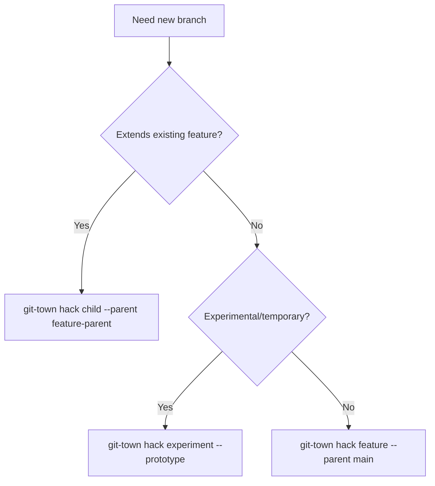
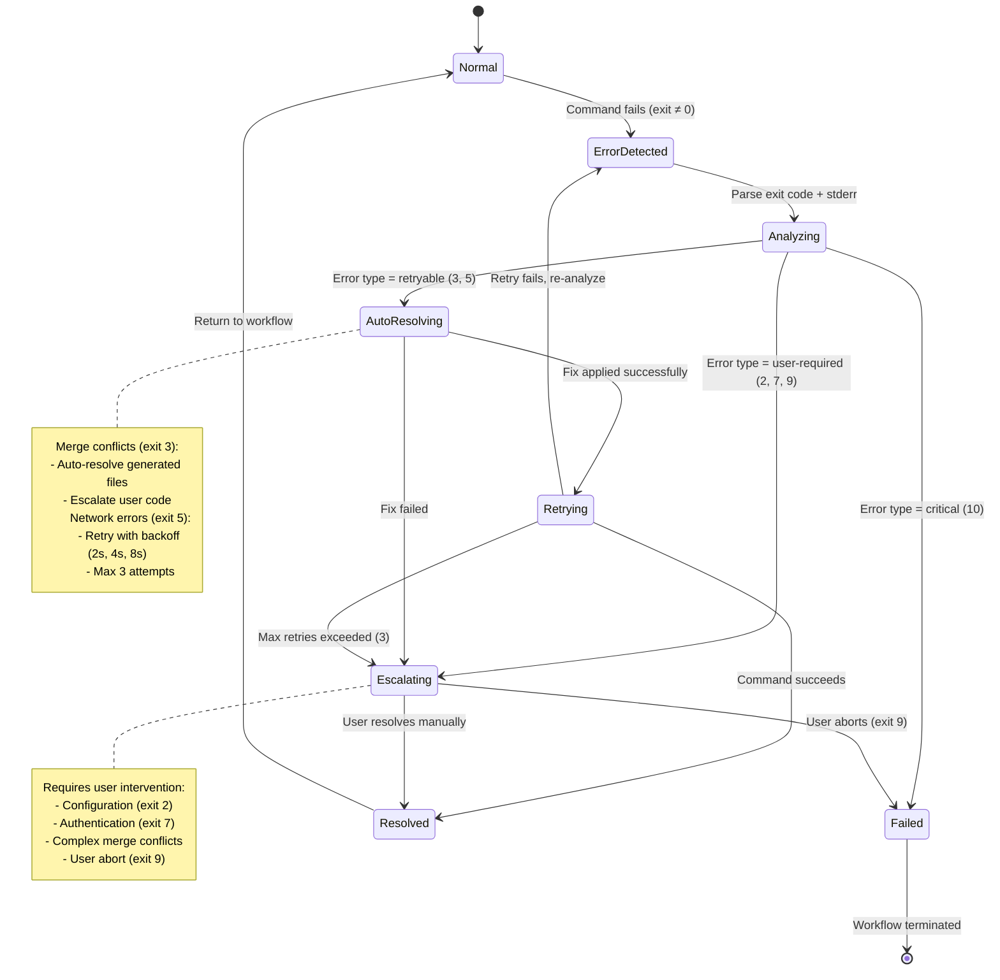

# Technical Requirements Document: Git-Town Workflow Skill

**Version**: 1.1.0
**Created**: 2025-12-29
**Last Updated**: 2025-12-29
**PRD Reference**: `docs/PRD/git-town-skill-extraction.md` (v1.1.0)
**Status**: Ready for Implementation
**Owner**: Technical Lead
**Estimated Duration**: 6-8 weeks

## Version History

| Version | Date | Changes | Author |
|---------|------|---------|--------|
| 1.0.0 | 2025-12-29 | Initial TRD creation | Technical Lead |
| 1.1.0 | 2025-12-29 | Added exit code mapping (3.4), skill file format spec (3.5), agent skill reference syntax examples (2.2), error recovery state machine (3.6), new tasks GT-038 through GT-041, new AC-11 through AC-14 | Technical Lead |

---

## 1. Master Task List

### Phase 1: Core Infrastructure (Week 1-2)

**GT-001** Create skill directory structure
- **Path**: `packages/git/skills/git-town/`
- **Subdirs**: `scripts/`, `templates/`, `guides/`
- **Dependencies**: None
- **Estimate**: 1h

**GT-002** Implement cross-platform validation script
- **File**: `scripts/validate-git-town.sh`
- **Requirements**: POSIX-compliant, exit codes 0/1, version check
- **Platforms**: macOS (Bash 3.2+), Linux (Bash 4.0+), Windows Git Bash (4.4+)
- **Dependencies**: GT-001
- **Estimate**: 4h

**GT-003** Create SKILL.md with skill loading mechanism
- **Sections**: Mission (100 words), Quick Start (200 words), Skill Loading (300 words), Common Patterns (300 words)
- **Requirements**: Document XDG-compliant skill search paths, loading performance targets (<100ms)
- **Dependencies**: GT-001
- **Estimate**: 6h

**GT-004** Create REFERENCE.md for basic commands
- **Commands**: hack, sync, propose, ship (each with 3+ examples)
- **Structure**: Command syntax, CLI flags, success example, 2 error examples per command
- **Dependencies**: GT-001
- **Estimate**: 12h

**GT-005** Create ERROR_HANDLING.md
- **Sections**: Merge conflicts, network errors, config errors, branch state errors, auth errors, version errors
- **Format**: Scenario → Detection → Resolution → Agent Decision Logic
- **Dependencies**: GT-001
- **Estimate**: 8h

**GT-006** Unit test validation script
- **Tests**: Git-town missing, unconfigured repo, version mismatch, platform detection
- **Framework**: Bash test framework (bats or shunit2)
- **Dependencies**: GT-002
- **Estimate**: 4h

**GT-007** Integration test: Skill loading performance
- **Requirements**: Load skill in agent context, measure overhead (<100ms), test cache behavior
- **Dependencies**: GT-003
- **Estimate**: 3h

**GT-038** Create git-town exit code reference
- **File**: `REFERENCE.md` (new section)
- **Requirements**: Document all exit codes (0-10), map to error categories, define agent handling logic
- **Dependencies**: GT-002, GT-004
- **Estimate**: 3h

**GT-039** Create SKILL.md template/schema
- **File**: `templates/SKILL_TEMPLATE.md`
- **Requirements**: Formalize structure with required sections, metadata format, validation criteria
- **Dependencies**: GT-003
- **Estimate**: 2h

**GT-040** Create agent skill reference examples
- **File**: `guides/agent-skill-integration.md`
- **Requirements**: YAML frontmatter examples, mission statement patterns, query syntax, performance notes
- **Dependencies**: GT-003
- **Estimate**: 3h

**GT-041** Create error recovery state machine diagram
- **File**: `ERROR_HANDLING.md` (new section)
- **Requirements**: Formal state definitions, transition conditions, Mermaid diagram, timeout handling
- **Dependencies**: GT-005
- **Estimate**: 4h

### Phase 2: Interview Templates & Decision Trees (Week 3)

**GT-008** Create branch creation interview template
- **File**: `templates/interview-branch-creation.md`
- **Fields**: branch name (required, format validation), base branch (default: main), prototype flag (boolean)
- **Validation**: Branch name regex, base branch existence check
- **Dependencies**: GT-001
- **Estimate**: 4h

**GT-009** Create PR creation interview template
- **File**: `templates/interview-pr-creation.md`
- **Fields**: title (required), body (optional, file path support), draft status (boolean)
- **Dependencies**: GT-001
- **Estimate**: 3h

**GT-010** Create completion interview template
- **File**: `templates/interview-completion.md`
- **Fields**: commit message (squash merge), confirmation prompt (yes/no)
- **Dependencies**: GT-001
- **Estimate**: 3h

**GT-011** Create branching strategy decision tree
- **File**: `REFERENCE.md` (append new section)
- **Format**: Mermaid flowchart showing when to use hack/append/prepend
- **Dependencies**: GT-004
- **Estimate**: 3h

**GT-012** Create sync scope decision tree
- **File**: `REFERENCE.md` (append)
- **Format**: Decision matrix for current/all/stack sync options
- **Dependencies**: GT-004
- **Estimate**: 2h

**GT-013** Create completion strategy decision tree
- **File**: `REFERENCE.md` (append)
- **Format**: Flowchart for ship vs. merge vs. manual completion
- **Dependencies**: GT-004
- **Estimate**: 2h

**GT-014** Create error recovery decision trees
- **File**: `ERROR_HANDLING.md` (append)
- **Format**: Flowcharts for retry vs. escalate decisions for each error type
- **Dependencies**: GT-005
- **Estimate**: 4h

### Phase 3: Agent Integration (Week 4)

**GT-015** Update git-workflow.yaml to reference skill
- **Changes**: Replace embedded git-town instructions with skill reference, add skill loading documentation to mission
- **Validation**: Agent prompt length reduced by 30%, no functional regression
- **Dependencies**: GT-003, GT-004
- **Estimate**: 4h

**GT-016** Update implement-trd.yaml to use interview templates
- **Changes**: Reference templates for branch creation, use skill-based command patterns
- **Dependencies**: GT-008, GT-015
- **Estimate**: 3h

**GT-017** Audit and remove duplicate git-town instructions
- **Agents**: ensemble-orchestrator.yaml, tech-lead-orchestrator.yaml, git-workflow.yaml
- **Target**: >80% reduction in embedded git-town content
- **Dependencies**: GT-015, GT-016
- **Estimate**: 4h

**GT-018** Integration test: Agent executes git-town workflow via skill
- **Scenario**: Agent creates feature branch using skill reference
- **Validation**: No interactive prompts, correct CLI flags used, skill loaded successfully
- **Dependencies**: GT-015
- **Estimate**: 3h

**GT-019** Integration test: Agent handles merge conflict error
- **Scenario**: Simulate merge conflict during sync, verify agent uses ERROR_HANDLING.md decision tree
- **Dependencies**: GT-015, GT-005
- **Estimate**: 3h

### Phase 4: Advanced Commands (Week 5)

**GT-020** Document advanced branching commands in REFERENCE.md
- **Commands**: append, prepend, detach, swap
- **Format**: Each with 3+ examples (success + 2 error scenarios)
- **Dependencies**: GT-004
- **Estimate**: 6h

**GT-021** Document error recovery commands in REFERENCE.md
- **Commands**: continue, skip, undo, status
- **Format**: Examples showing recovery from common failures
- **Dependencies**: GT-004, GT-005
- **Estimate**: 4h

**GT-022** Document offline mode in REFERENCE.md
- **Command**: `git-town offline`
- **Use Cases**: Air-gapped development, network failures
- **Dependencies**: GT-004
- **Estimate**: 2h

**GT-023** Document configuration commands in REFERENCE.md
- **Commands**: `git-town config`, config file format
- **Templates**: GitHub, GitLab, Gitea configurations
- **Dependencies**: GT-004
- **Estimate**: 4h

### Phase 5: Onboarding & Migration Guides (Week 6)

**GT-024** Create onboarding guide
- **File**: `guides/onboarding.md`
- **Sections**: Installation checklist, first feature walkthrough, common mistakes, team config templates
- **Dependencies**: GT-001
- **Estimate**: 6h

**GT-025** Create git-flow migration guide
- **File**: `guides/migration-git-flow.md`
- **Sections**: Comparison table, branch conversion, release workflow, incremental adoption
- **Dependencies**: GT-001
- **Estimate**: 5h

**GT-026** Create GitHub Flow migration guide
- **File**: `guides/migration-github-flow.md`
- **Sections**: Workflow mapping, PR creation differences, branch cleanup automation
- **Dependencies**: GT-001
- **Estimate**: 3h

**GT-027** Create trunk-based migration guide
- **File**: `guides/migration-trunk-based.md`
- **Sections**: Short-lived branch mapping, CI/CD adjustments, feature flags
- **Dependencies**: GT-001
- **Estimate**: 3h

### Phase 6: Monorepo & CI/CD (Week 7)

**GT-028** Create monorepo guide
- **File**: `guides/monorepo.md`
- **Sections**: Package-scoped branching, Nx/Turborepo/Lerna integration, changed-files detection, multi-package examples
- **Dependencies**: GT-001
- **Estimate**: 6h

**GT-029** Create CI/CD integration guide
- **File**: `guides/ci-cd-integration.md`
- **Sections**: GitHub Actions examples, GitLab CI examples, CircleCI examples, branch protection rules, env vars
- **Dependencies**: GT-001
- **Estimate**: 8h

**GT-030** Create example GitHub Actions workflow
- **File**: `guides/examples/github-actions-auto-sync.yml`
- **Features**: Scheduled sync, auto-ship on approval
- **Dependencies**: GT-029
- **Estimate**: 3h

**GT-031** Create example GitLab CI pipeline
- **File**: `guides/examples/gitlab-ci-stacked-branches.yml`
- **Features**: Test execution on stacked branches
- **Dependencies**: GT-029
- **Estimate**: 3h

### Phase 7: Quality Assurance (Week 8)

**GT-032** Cross-platform validation
- **Tests**: Run validation script on macOS, Linux, Windows Git Bash
- **Requirements**: 100% pass rate on all platforms
- **Dependencies**: GT-002, GT-006
- **Estimate**: 4h

**GT-033** Documentation quality review
- **Checklist**: All commands have 3+ examples, all flags documented, all templates have validation
- **Dependencies**: GT-004, GT-020, GT-021
- **Estimate**: 4h

**GT-034** Agent integration regression testing
- **Tests**: Existing agent test suites pass, no new interactive prompts, prompt length reduction verified
- **Dependencies**: GT-015, GT-016, GT-017
- **Estimate**: 4h

**GT-035** Performance benchmarking
- **Metrics**: Skill loading <100ms, validation script <500ms
- **Dependencies**: GT-007
- **Estimate**: 2h

**GT-036** User acceptance testing
- **Scenarios**: New developer onboarding, git-flow migration, monorepo workflow
- **Success Criteria**: 80% task completion without external docs
- **Dependencies**: GT-024, GT-025, GT-028
- **Estimate**: 6h

**GT-037** Update plugin documentation
- **Files**: `packages/git/README.md`, `CHANGELOG.md`
- **Content**: Skill usage instructions, migration notes for users with embedded git-town patterns
- **Dependencies**: All tasks
- **Estimate**: 3h

---

## 2. Architecture Overview

### 2.1 Directory Structure

```
packages/git/skills/git-town/
├── SKILL.md                           # Mission, quick start, skill loading (500-1000 words)
├── REFERENCE.md                       # Command documentation (3000-4000 words)
├── ERROR_HANDLING.md                  # Error scenarios, recovery workflows (1500-2000 words)
├── scripts/
│   ├── validate-git-town.sh          # Cross-platform validation (POSIX-compliant)
│   └── test-validate.sh              # Unit tests for validation script
├── templates/
│   ├── interview-branch-creation.md  # Branch creation user interview
│   ├── interview-pr-creation.md      # PR creation user interview
│   └── interview-completion.md       # Merge/ship user interview
└── guides/
    ├── onboarding.md                 # New developer setup
    ├── migration-git-flow.md         # Git-flow to git-town
    ├── migration-github-flow.md      # GitHub Flow to git-town
    ├── migration-trunk-based.md      # Trunk-based to git-town
    ├── monorepo.md                   # Monorepo patterns
    ├── ci-cd-integration.md          # CI/CD integration
    └── examples/
        ├── github-actions-auto-sync.yml
        └── gitlab-ci-stacked-branches.yml
```

### 2.2 Skill Loading Mechanism

**Discovery Process**:
1. Agent reads `packages/git/skills/git-town/SKILL.md` at runtime
2. Skill search paths (XDG-compliant):
   - `$XDG_CONFIG_HOME/ensemble/skills/git-town/`
   - `~/.config/ensemble/skills/git-town/`
   - `<plugin-root>/packages/git/skills/git-town/`
3. Cache skill content in agent context (invalidate on file change)
4. Loading overhead target: <100ms

**Agent Integration Pattern 1: YAML Frontmatter Reference**

Agents declare skill dependencies in YAML frontmatter for automatic loading:

```yaml
---
name: git-workflow
description: Execute git-town workflows with autonomous error handling
tools: [Bash, Read, Write, Edit, Grep, Task]
skills: [git-town]  # Skill loaded into agent context at initialization
---

## Mission
Execute git-town workflows following patterns defined in the git-town skill.
When encountering errors, consult ERROR_HANDLING.md section of skill for recovery strategies.

## Behavior
- Query skill sections: "git-town:REFERENCE:git-town hack" for command syntax
- Query skill sections: "git-town:ERROR_HANDLING:merge conflicts" for error recovery
- Always use explicit CLI flags (never rely on interactive prompts)
```

**Agent Integration Pattern 2: Mission Statement Reference**

Agents reference skill implicitly in mission statement for documentation purposes:

```yaml
---
name: implement-trd
description: TRD implementation with git-town branch workflow
tools: [Bash, Read, Write, Edit, Task]
---

## Mission
Implement TRD tasks using git-town workflow. Follow branch creation interview
template at `packages/git/skills/git-town/templates/interview-branch-creation.md`.

## Workflow
1. Validate git-town installation: `bash packages/git/skills/git-town/scripts/validate-git-town.sh`
2. Create feature branch: `git-town hack <branch-name> --parent main`
3. Execute TRD tasks with TDD methodology
4. Propose PR: `git-town propose --title "..." --body "..." --draft=false`
```

**Agent Skill Query Syntax**

Agents query specific skill sections using structured syntax:

```
Query Pattern: "<skill-name>:<file>:<section-heading>"

Examples:
- "git-town:SKILL:Quick Start" → Returns Quick Start section from SKILL.md
- "git-town:REFERENCE:git-town hack" → Returns hack command documentation
- "git-town:ERROR_HANDLING:merge conflicts" → Returns merge conflict recovery workflow
- "git-town:templates/interview-branch-creation" → Returns entire interview template
```

**Performance Implications**:
- **Full skill load**: ~80-120ms (entire SKILL.md + REFERENCE.md + ERROR_HANDLING.md)
- **Section query**: ~20-40ms (cached, indexed by heading)
- **Template load**: ~10-20ms (single file, small size)
- **Recommendation**: Use Pattern 1 (frontmatter) for agents that execute git-town commands frequently, Pattern 2 (mission reference) for agents that only need occasional access

### 2.3 Validation Script Architecture

**Inputs**:
- Current directory (git repository check)
- Git-town CLI availability

**Outputs**:
- Exit code 0: Validation passed
- Exit code 1: Git-town not installed
- Exit code 2: Git-town not configured
- Exit code 3: Unsupported git-town version
- Exit code 4: Not a git repository

**Checks**:
1. Verify git-town installed (`command -v git-town`)
2. Check git-town version (>=9.0.0 recommended)
3. Validate git repository (`git rev-parse --git-dir`)
4. Check git-town configuration (`git-town config`)
5. Verify main branch configured (`git-town config --get main-branch`)

---

## 3. Technical Specifications

### 3.1 SKILL.md Structure

```markdown
# Git-Town Workflow Skill

## Mission (100 words)
Provide comprehensive git-town workflow integration for Claude Code agents.
Enable non-interactive command execution through explicit CLI flags.
Support autonomous error handling and recovery workflows.

## Skill Loading Mechanism (300 words)
- XDG-compliant search paths with priority order
- Skill caching strategy and invalidation rules
- Performance targets and monitoring
- Error handling for missing/corrupted skills

## Quick Start (200 words)
- Validation script usage: `bash scripts/validate-git-town.sh`
- Basic workflow: hack → commit → sync → propose → ship
- Reference sections by heading for specific patterns

## Common Patterns (300 words)
- Feature branch creation (non-interactive)
- Stacked branches workflow
- Error recovery after merge conflicts
- Offline development mode
```

### 3.2 Validation Script Specification

**Filename**: `scripts/validate-git-town.sh`

**Shebang**: `#!/usr/bin/env bash`

**Function: check_git_town_installed()**
```bash
check_git_town_installed() {
  if ! command -v git-town &> /dev/null; then
    echo "ERROR: git-town not found. Install: https://www.git-town.com/install"
    exit 1
  fi
}
```

**Function: check_git_town_version()**
```bash
check_git_town_version() {
  local version=$(git-town version | grep -oE '[0-9]+\.[0-9]+\.[0-9]+')
  local major=$(echo "$version" | cut -d. -f1)
  if [ "$major" -lt 9 ]; then
    echo "WARNING: git-town $version detected. Version 9.0.0+ recommended."
  fi
}
```

**Function: check_git_repository()**
```bash
check_git_repository() {
  if ! git rev-parse --git-dir &> /dev/null; then
    echo "ERROR: Not a git repository"
    exit 4
  fi
}
```

**Function: check_git_town_config()**
```bash
check_git_town_config() {
  local main_branch=$(git-town config --get main-branch 2>/dev/null)
  if [ -z "$main_branch" ]; then
    echo "ERROR: git-town not configured. Run: git-town config --set main-branch main"
    exit 2
  fi
  echo "SUCCESS: git-town configured (main: $main_branch)"
}
```

**Platform Detection**:
```bash
detect_platform() {
  case "$(uname -s)" in
    Darwin*) echo "macOS" ;;
    Linux*)  echo "Linux" ;;
    MINGW*|MSYS*|CYGWIN*) echo "Windows" ;;
    *) echo "Unknown" ;;
  esac
}
```

### 3.3 Interview Template Structure

**Template Format** (Markdown with YAML frontmatter):

```markdown
---
template: branch-creation
version: 1.0.0
required_fields: [branch_name]
optional_fields: [base_branch, is_prototype]
---

# Branch Creation Interview

## Questions

### 1. Branch Name (Required)
**Prompt**: "What is the name of your feature branch?"
**Validation**: `/^[a-z0-9-]+$/` (lowercase, numbers, hyphens only)
**Error Message**: "Branch name must contain only lowercase letters, numbers, and hyphens"

### 2. Base Branch (Optional)
**Prompt**: "Which branch should this be created from?"
**Default**: "main"
**Validation**: Branch must exist in repository

### 3. Prototype Flag (Optional)
**Prompt**: "Is this a prototype branch? (yes/no)"
**Default**: "no"
**Type**: boolean

## Command Generation

```bash
git-town hack <branch_name> --parent <base_branch> [--prototype]
```

## Error Scenarios

1. Branch name already exists → Ask to choose different name or switch to existing
2. Base branch doesn't exist → List available branches, ask to select
3. Uncommitted changes → Ask to commit, stash, or abort
```

### 3.4 Git-Town Exit Codes

Git-town commands return standard exit codes that agents must interpret to determine next actions. This section provides comprehensive exit code documentation and agent handling logic.

#### 3.4.1 Exit Code Reference Table

| Exit Code | Category | Meaning | Common Commands | Agent Action |
|-----------|----------|---------|-----------------|--------------|
| 0 | Success | Command completed successfully | All commands | Continue workflow |
| 1 | General Error | Unspecified error, check stderr | All commands | Parse stderr, escalate if unknown |
| 2 | Configuration Error | Git-town not configured or invalid config | `hack`, `sync`, `propose`, `ship` | Run validation script, prompt configuration |
| 3 | Merge Conflict | Merge conflict detected during operation | `sync`, `ship` | Invoke ERROR_HANDLING.md merge conflict recovery |
| 4 | Uncommitted Changes | Working directory has uncommitted changes | `sync`, `hack`, `ship` | Prompt to commit, stash, or abort |
| 5 | Network Error | Remote operation failed (fetch/push) | `sync`, `propose`, `ship` | Retry with exponential backoff (max 3 attempts) |
| 6 | Branch State Error | Branch in invalid state for operation | `ship`, `propose` | Check git-town status, escalate if unresolvable |
| 7 | Authentication Error | Git credentials invalid or expired | `propose`, `ship` (with push) | Prompt credential refresh, escalate to user |
| 8 | Precondition Failed | Command preconditions not met | `ship` (no PR), `propose` (no commits) | Inform user of missing precondition, suggest fix |
| 9 | User Abort | User cancelled interactive operation | Any command with prompts | Respect cancellation, do not retry |
| 10 | Version Error | Git-town version incompatible | Any command | Prompt upgrade, show minimum version |

#### 3.4.2 Exit Code Handling Logic

**Agent Decision Tree for Exit Codes**:

```bash
# Agent execution pattern
exit_code=$?
case $exit_code in
  0)
    echo "Command succeeded, continuing workflow"
    ;;
  1)
    stderr=$(cat /tmp/git-town-stderr.log)
    echo "General error: $stderr"
    # Escalate to user with full context
    ;;
  2)
    echo "Configuration error detected"
    bash packages/git/skills/git-town/scripts/validate-git-town.sh
    # Validation script provides specific fix instructions
    ;;
  3)
    echo "Merge conflict detected"
    # Query skill: "git-town:ERROR_HANDLING:merge conflicts"
    # Follow auto-resolution strategy or escalate
    ;;
  4)
    echo "Uncommitted changes detected"
    git status --short
    # Prompt: "Commit changes? (yes/no/stash)"
    ;;
  5)
    echo "Network error, retrying..."
    for attempt in 1 2 3; do
      sleep $((2 ** attempt))  # Exponential backoff: 2s, 4s, 8s
      retry_command && break
    done
    ;;
  6)
    echo "Branch state error"
    git-town status
    # Show diagnostic output, escalate with context
    ;;
  7)
    echo "Authentication error"
    # Prompt: "Refresh GitHub credentials? (yes/no)"
    ;;
  8)
    echo "Precondition failed: $precondition_message"
    # Show specific missing requirement, suggest resolution
    ;;
  9)
    echo "User cancelled operation"
    # Do not retry, return control to user
    ;;
  10)
    echo "Git-town version incompatible"
    current_version=$(git-town version)
    echo "Current: $current_version, Minimum: 9.0.0"
    # Prompt upgrade with installation link
    ;;
  *)
    echo "Unexpected exit code: $exit_code"
    # Escalate to user with full command output
    ;;
esac
```

#### 3.4.3 Command-Specific Exit Codes

**git-town hack**:
- Exit 0: Branch created successfully
- Exit 2: Main branch not configured
- Exit 4: Uncommitted changes prevent branch creation
- Exit 1: Branch name invalid or already exists

**git-town sync**:
- Exit 0: Sync completed, all branches up to date
- Exit 3: Merge conflict during sync (requires resolution)
- Exit 5: Network error fetching from remote
- Exit 6: Branch diverged from parent, manual intervention needed

**git-town propose**:
- Exit 0: PR created successfully
- Exit 5: Network error pushing to remote
- Exit 7: GitHub authentication failed
- Exit 8: No commits to propose (branch matches parent)

**git-town ship**:
- Exit 0: Feature merged and branch deleted
- Exit 3: Merge conflict during ship
- Exit 6: No PR associated with branch
- Exit 8: PR not approved (if approval required)

#### 3.4.4 Error Detection Patterns

Agents should parse stderr for specific error patterns to supplement exit codes:

```bash
# Configuration errors (exit 2)
"main branch not configured" → Run: git-town config --set main-branch main
"perennial branches not configured" → Optional, can proceed
"git-town not initialized" → Run: git-town config

# Merge conflicts (exit 3)
"CONFLICT (content): Merge conflict in <file>" → Parse conflicted files
"Automatic merge failed" → Invoke conflict resolution workflow

# Network errors (exit 5)
"Could not resolve host" → DNS/network issue, suggest offline mode
"Connection timed out" → Retry with backoff
"403 Forbidden" → Authentication issue (exit 7)

# Branch state errors (exit 6)
"branch has diverged from parent" → Suggest: git-town sync --abort, manual rebase
"branch is not a feature branch" → User on main/perennial, abort operation

# Authentication errors (exit 7)
"remote: Permission denied" → GitHub token expired
"fatal: Authentication failed" → Credential helper issue
```

#### 3.4.5 Retry Strategies

**Network Errors (Exit 5)**: Exponential backoff with max 3 attempts
```bash
max_attempts=3
backoff=2
for attempt in $(seq 1 $max_attempts); do
  git-town sync && break
  [ $attempt -lt $max_attempts ] && sleep $((backoff ** attempt))
done
```

**Transient Errors**: Single immediate retry
```bash
git-town propose || {
  sleep 1
  git-town propose || escalate_to_user
}
```

**Non-Retryable Errors**: Immediate escalation
- Exit 3 (merge conflicts): Requires manual resolution
- Exit 7 (auth errors): Requires credential refresh
- Exit 9 (user abort): Respect user decision

### 3.5 Skill File Format Specification

This section formalizes the structure and metadata requirements for all skill files to ensure consistency, validation, and maintainability.

#### 3.5.1 SKILL.md Template

```markdown
---
skill_name: git-town
version: 1.0.0
author: Fortium Partners
created: 2025-12-29
updated: 2025-12-29
tags: [git, workflow, branching]
dependencies: [git-town >= 9.0.0]
---

# Git-Town Workflow Skill

**Skill Type**: Technical Workflow
**Estimated Learning Time**: 30 minutes
**Proficiency Levels**: Beginner, Intermediate, Advanced

---

## Mission (100-150 words)

Single paragraph describing the skill's purpose, target audience, and key capabilities.
Focus on what problems this skill solves and when agents should use it.

Example:
"Provide comprehensive git-town workflow integration for Claude Code agents, enabling
autonomous branch management, PR creation, and error recovery without interactive prompts..."

---

## Skill Loading Mechanism (250-350 words)

### Discovery Paths
- Primary: `$XDG_CONFIG_HOME/ensemble/skills/git-town/`
- Fallback: `~/.config/ensemble/skills/git-town/`
- Plugin: `<plugin-root>/packages/git/skills/git-town/`

### Loading Performance
- Target: <100ms for full skill load
- Caching: Skill content cached in agent context, invalidated on file modification
- Lazy loading: Templates and guides loaded on-demand

### Integration Patterns
See section 2.2 for YAML frontmatter and mission statement examples.

---

## Quick Start (200-300 words)

### Prerequisites
- Git-town installed (>= 9.0.0)
- Repository configured: `git-town config`

### Validation
```bash
bash packages/git/skills/git-town/scripts/validate-git-town.sh
# Exit 0 = ready to use
```

### Basic Workflow
1. Create feature branch: `git-town hack feature-name --parent main`
2. Make commits: `git commit -m "..."`
3. Sync with parent: `git-town sync`
4. Create PR: `git-town propose --title "..." --body "..."`
5. Complete feature: `git-town ship`

### Common Flags
- `--parent <branch>`: Specify parent branch (default: main)
- `--prototype`: Mark branch as prototype (no sync with parent)
- `--draft`: Create draft PR
- `--abort`: Abort in-progress operation

---

## Common Patterns (300-400 words)

### Pattern 1: Feature Branch Creation (Non-Interactive)
```bash
# Explicit parent, no prompts
git-town hack my-feature --parent main

# Prototype branch (won't sync with parent)
git-town hack experiment --prototype
```

### Pattern 2: Stacked Branches
```bash
# Create child branch from current feature branch
git checkout feature-parent
git-town hack feature-child  # Parent automatically set to feature-parent
```

### Pattern 3: Error Recovery
```bash
# After merge conflict
git add resolved-file.js
git-town continue

# Abort failed operation
git-town sync --abort
```

### Pattern 4: Offline Development
```bash
# Enable offline mode (no remote operations)
git-town offline

# Disable offline mode
git-town offline --off
```

---

## Advanced Usage

### Query Specific Sections
Agents can query subsections for targeted information:
- `git-town:REFERENCE:git-town hack` → Command documentation
- `git-town:ERROR_HANDLING:merge conflicts` → Recovery workflow

### Performance Tuning
- Full load: ~100ms (SKILL + REFERENCE + ERROR_HANDLING)
- Section query: ~30ms (cached, indexed)
- Template load: ~15ms (single file)

---

## Troubleshooting

### Skill Not Found
1. Check XDG paths: `echo $XDG_CONFIG_HOME`
2. Verify plugin installation: `claude plugin list`
3. Reinstall: `claude plugin install ensemble-git`

### Validation Fails
Run diagnostic: `bash scripts/validate-git-town.sh`
- Exit 1: Install git-town
- Exit 2: Configure main branch
- Exit 3: Upgrade git-town version

---

## References

- Full command documentation: `REFERENCE.md`
- Error handling workflows: `ERROR_HANDLING.md`
- Interview templates: `templates/*.md`
- Migration guides: `guides/migration-*.md`
```

#### 3.5.2 REFERENCE.md Template

```markdown
---
skill_name: git-town
file_type: reference
version: 1.0.0
command_count: 12
example_count: 48
---

# Git-Town Command Reference

**Last Updated**: 2025-12-29
**Minimum Git-Town Version**: 9.0.0

---

## Table of Contents

1. [Core Commands](#core-commands) (hack, sync, propose, ship)
2. [Advanced Branching](#advanced-branching) (append, prepend, detach)
3. [Error Recovery](#error-recovery) (continue, skip, undo, status)
4. [Configuration](#configuration) (config, offline)
5. [Exit Codes](#exit-codes)
6. [Decision Trees](#decision-trees)

---

## Core Commands

### git-town hack

**Purpose**: Create new feature branch with explicit parent

**Syntax**:
```bash
git-town hack <branch-name> [--parent <parent-branch>] [--prototype]
```

**Parameters**:
- `<branch-name>`: Required. Branch name (lowercase, hyphens, numbers)
- `--parent <branch>`: Optional. Parent branch (default: main)
- `--prototype`: Optional. Mark as prototype (no parent sync)

**Exit Codes**:
- 0: Success
- 1: Branch exists or invalid name
- 2: Main branch not configured
- 4: Uncommitted changes

**Example 1: Basic Feature Branch (Success)**
```bash
# Create feature branch from main
git-town hack user-authentication --parent main

# Output:
# Created branch 'user-authentication' from 'main'
# Switched to branch 'user-authentication'
```

**Example 2: Branch Name Exists (Error, Exit 1)**
```bash
git-town hack existing-branch

# Output:
# Error: Branch 'existing-branch' already exists
# Use 'git checkout existing-branch' to switch to it

# Agent Action: Suggest different name or switch to existing
```

**Example 3: Uncommitted Changes (Error, Exit 4)**
```bash
# Working directory has uncommitted changes
git-town hack new-feature

# Output:
# Error: You have uncommitted changes
# Commit, stash, or discard changes before creating a new branch

# Agent Action: Prompt to commit/stash, or suggest --force flag
```

---

(Continue for all commands with 3+ examples each)

---

## Exit Codes

(Reference table from section 3.4.1)

---

## Decision Trees

### Branching Strategy Decision Tree



(Continue with sync scope, completion strategy, error recovery trees)
```

#### 3.5.3 ERROR_HANDLING.md Template

```markdown
---
skill_name: git-town
file_type: error_handling
version: 1.0.0
error_categories: 6
recovery_workflows: 12
---

# Git-Town Error Handling

**Last Updated**: 2025-12-29
**State Machine**: See section 3.6

---

## Error Categories

1. [Merge Conflicts](#merge-conflicts) (Exit 3)
2. [Network Errors](#network-errors) (Exit 5)
3. [Configuration Errors](#configuration-errors) (Exit 2)
4. [Branch State Errors](#branch-state-errors) (Exit 6)
5. [Authentication Errors](#authentication-errors) (Exit 7)
6. [Version Errors](#version-errors) (Exit 10)

---

## Merge Conflicts

### Scenario
Git-town sync or ship encounters conflicting changes between branches.

### Detection
- Exit code: 3
- Stderr: "CONFLICT (content): Merge conflict in <file>"
- Git status shows: "both modified: <file>"

### Resolution Workflow

**Step 1: Identify Conflict Type**
```bash
git status --short | grep '^UU'  # Files with conflicts
git diff --name-only --diff-filter=U  # Conflicted files only
```

**Step 2: Auto-Resolution Strategy**
```bash
# Auto-resolve if conflict is in generated files
if [[ $conflicted_file =~ (package-lock\.json|yarn\.lock|Gemfile\.lock) ]]; then
  git checkout --theirs $conflicted_file
  git add $conflicted_file
fi
```

**Step 3: Manual Resolution Required**
```bash
# Escalate to user with context
echo "Manual resolution required for: $conflicted_file"
echo "Conflicted sections:"
git diff $conflicted_file | grep -A 5 -B 5 '<<<<<<<'
```

**Step 4: Continue Workflow**
```bash
# After resolution
git add resolved-file.js
git-town continue  # Resume sync/ship operation
```

### Agent Decision Logic
- **Auto-resolve**: Generated files (package-lock.json, yarn.lock), simple conflicts (<10 lines)
- **Escalate**: User code conflicts, complex merges (overlapping changes), 3+ conflicted files

---

(Continue for all error categories)

---

## Error Recovery State Machine

(Reference section 3.6 for formal state machine)
```

#### 3.5.4 Interview Template Schema

```markdown
---
template: <template-name>
version: 1.0.0
required_fields: [field1, field2]
optional_fields: [field3, field4]
validation_rules:
  field1:
    type: string
    pattern: ^[a-z0-9-]+$
    error_message: "Field must contain only lowercase letters, numbers, and hyphens"
  field2:
    type: choice
    options: [option1, option2]
    default: option1
---

# <Template Name> Interview

## Questions

### 1. <Field Name> (Required/Optional)
**Prompt**: "<Question text>"
**Type**: string | choice | boolean | integer
**Validation**: <Regex or rule>
**Default**: <Default value if optional>
**Error Message**: "<Error message if validation fails>"

## Command Generation

```bash
<git-town-command> <interpolated-fields>
```

## Error Scenarios

1. <Error condition> → <User action>
2. <Error condition> → <User action>
```

#### 3.5.5 Validation Criteria

**SKILL.md Requirements**:
- [ ] YAML frontmatter present with required fields (skill_name, version, author, created)
- [ ] Mission section: 100-150 words
- [ ] Quick Start section: 200-300 words with validation command
- [ ] Common Patterns section: 300-400 words with 4+ code examples
- [ ] File size: <10KB (fast parsing)

**REFERENCE.md Requirements**:
- [ ] YAML frontmatter with command_count and example_count
- [ ] Each command has ≥3 examples (1 success + 2 error scenarios)
- [ ] All CLI flags documented with defaults
- [ ] Exit codes section references 3.4.1 table
- [ ] Decision trees use Mermaid flowchart TD format
- [ ] File size: <50KB (reasonable load time)

**ERROR_HANDLING.md Requirements**:
- [ ] YAML frontmatter with error_categories count
- [ ] Each category has: Scenario, Detection, Resolution, Agent Decision Logic
- [ ] All exit codes (2-10) covered
- [ ] State machine section references 3.6
- [ ] Auto-resolution strategies for generated files
- [ ] Escalation criteria clearly defined

**Interview Template Requirements**:
- [ ] YAML frontmatter with required_fields and optional_fields
- [ ] Validation rules include regex patterns
- [ ] Error messages provided for all validations
- [ ] Command generation section shows interpolation
- [ ] Error scenarios section covers common user mistakes

### 3.6 Error Recovery State Machine

This section defines a formal state machine for agent error handling decisions, providing deterministic transitions between states based on error types and conditions.

#### 3.6.1 State Definitions

| State | Description | Entry Conditions | Exit Conditions |
|-------|-------------|------------------|-----------------|
| **Normal** | Agent executing git-town command | Initial state, or after successful recovery | Command returns exit code 0 OR timeout OR unrecoverable error |
| **Error Detected** | Command failed, analyzing exit code | Command returns exit code ≠ 0 | Error categorized, transition to appropriate handler |
| **Analyzing** | Parsing stderr, checking context | Error detected, categorization needed | Error type identified, decision made |
| **Auto Resolving** | Applying automated fix | Error type supports auto-resolution | Fix applied (success/failure) |
| **Retrying** | Re-executing command after fix | Auto-resolution succeeded, retry eligible | Command succeeds OR max retries exceeded |
| **Escalating** | Requesting user intervention | Error requires manual resolution OR max retries exceeded | User provides input OR user aborts |
| **Resolved** | Error handled successfully | Auto-resolution succeeded OR user resolved | Return to Normal state |
| **Failed** | Unrecoverable error, workflow aborted | Max retries exceeded, user aborted, or critical error | Workflow terminated |

#### 3.6.2 State Machine Diagram



#### 3.6.3 State Transition Conditions

**Normal → Error Detected**:
- Condition: Command returns exit code ≠ 0
- Actions: Capture exit code, stderr, stdout; timestamp error

**Error Detected → Analyzing**:
- Condition: Automatic transition
- Actions: Parse exit code using 3.4.1 table, scan stderr for patterns (3.4.4)

**Analyzing → Auto Resolving**:
- Conditions:
  - Exit code 3 (merge conflict) AND conflict in generated files
  - Exit code 5 (network error) AND retry count < 3
  - Exit code 4 (uncommitted changes) AND user pre-approved auto-commit
- Actions: Load appropriate recovery workflow from ERROR_HANDLING.md

**Analyzing → Escalating**:
- Conditions:
  - Exit code 2 (configuration error)
  - Exit code 7 (authentication error)
  - Exit code 3 (merge conflict) AND conflict in user code
  - Exit code 9 (user abort)
  - Retry count ≥ 3
- Actions: Format user-friendly error message, prepare resolution suggestions

**Analyzing → Failed**:
- Conditions:
  - Exit code 10 (version error) AND auto-upgrade disabled
  - Timeout exceeded (>5 minutes in error state)
  - Critical system error (git missing, filesystem error)
- Actions: Log failure, cleanup partial state, notify user

**Auto Resolving → Retrying**:
- Conditions: Resolution strategy completed successfully (exit 0)
- Actions: Increment retry counter, prepare command re-execution

**Auto Resolving → Escalating**:
- Conditions: Resolution strategy failed (exit ≠ 0)
- Actions: Add resolution attempt to context, escalate with additional details

**Retrying → Resolved**:
- Condition: Command succeeds (exit 0)
- Actions: Reset retry counter, clear error state, log resolution

**Retrying → Escalating**:
- Condition: Retry count ≥ 3
- Actions: Collect all retry logs, escalate with failure history

**Retrying → Error Detected**:
- Condition: Retry fails with different error
- Actions: Re-analyze new error (may be different type)

**Escalating → Resolved**:
- Condition: User provides valid input/resolution
- Actions: Apply user resolution, verify success, return to workflow

**Escalating → Failed**:
- Conditions:
  - User explicitly aborts (exit 9)
  - User input timeout (no response in 5 minutes)
  - User resolution fails 3+ times
- Actions: Log user abort reason, cleanup state, terminate workflow

**Resolved → Normal**:
- Condition: Automatic transition after successful resolution
- Actions: Clear error context, resume workflow from next step

#### 3.6.4 Timeout Handling

| State | Timeout | Action on Timeout |
|-------|---------|-------------------|
| Analyzing | 10 seconds | Escalate with "Unable to categorize error" |
| Auto Resolving | 60 seconds | Escalate with "Auto-resolution timed out" |
| Retrying | 120 seconds per attempt | Move to next retry OR escalate if max retries |
| Escalating | 300 seconds (5 minutes) | Transition to Failed, log "User response timeout" |

#### 3.6.5 Agent Decision Logic Matrix

| Exit Code | Auto-Resolvable? | Max Retries | Timeout | Escalation Criteria |
|-----------|------------------|-------------|---------|---------------------|
| 0 | N/A | N/A | N/A | Never (success) |
| 1 | No | 0 | N/A | Always (unknown error) |
| 2 | Partial | 0 | N/A | If validation script can't auto-fix |
| 3 | Yes (for generated files) | 0 | 60s | If conflict in user code OR >3 files |
| 4 | Yes (if auto-commit enabled) | 0 | N/A | If user code changes OR sensitive files |
| 5 | Yes | 3 | 30s each | After 3 failed retries OR timeout |
| 6 | No | 0 | N/A | Always (requires git-town status analysis) |
| 7 | No | 0 | N/A | Always (requires user credentials) |
| 8 | Partial | 0 | N/A | If precondition can't be auto-satisfied |
| 9 | No | 0 | N/A | Always (respect user abort) |
| 10 | Partial | 0 | N/A | If auto-upgrade disabled OR upgrade fails |

#### 3.6.6 Example State Machine Execution

**Scenario**: Agent executes `git-town sync`, encounters merge conflict in `package-lock.json`

```
1. Normal → ErrorDetected
   - Command: git-town sync
   - Exit code: 3
   - Stderr: "CONFLICT (content): Merge conflict in package-lock.json"

2. ErrorDetected → Analyzing
   - Parse exit code 3 → Merge conflict
   - Parse stderr → Conflicted file: package-lock.json
   - Check file type → Generated file (auto-resolvable)

3. Analyzing → AutoResolving
   - Decision: Auto-resolve (generated file)
   - Strategy: git checkout --theirs package-lock.json && git add package-lock.json

4. AutoResolving → Retrying
   - Resolution exit code: 0 (success)
   - Retry counter: 1
   - Command: git-town continue

5. Retrying → Resolved
   - Continue exit code: 0 (success)
   - Sync completed successfully

6. Resolved → Normal
   - Error context cleared
   - Resume workflow: Next task in TRD
```

**Scenario 2**: Agent executes `git-town propose`, encounters authentication error

```
1. Normal → ErrorDetected
   - Command: git-town propose --title "Feature" --body "Description"
   - Exit code: 7
   - Stderr: "remote: Permission denied (publickey)"

2. ErrorDetected → Analyzing
   - Parse exit code 7 → Authentication error
   - Parse stderr → GitHub credential issue

3. Analyzing → Escalating
   - Decision: Cannot auto-resolve (requires user credentials)
   - Message: "GitHub authentication failed. Please refresh credentials."
   - Suggestion: "Run: gh auth login"

4. Escalating → (Wait for user input)
   - User runs: gh auth login
   - User confirms: "Credentials refreshed"

5. Escalating → Resolved
   - User input: Retry command
   - Command: git-town propose --title "Feature" --body "Description"
   - Exit code: 0 (success)

6. Resolved → Normal
   - PR created successfully
   - Resume workflow
```

#### 3.6.7 Fallback Handling

If state machine enters unexpected state (logic error):

1. **Log full state context**: Current state, previous states, error details
2. **Attempt graceful degradation**:
   - If in auto-resolving loop: Escalate immediately
   - If in retry loop: Stop retrying, escalate
   - If in analyzing: Default to escalate
3. **Escalate to user** with diagnostic information:
   - State machine trace
   - Command history
   - Error logs
4. **Request manual intervention**: User decides next step

---

## 4. Sprint Planning

### Sprint 1: Foundation (Week 1-2)
**Goal**: Core skill infrastructure ready for agent integration

**Tasks**: GT-001 through GT-007, GT-038 through GT-041
**Deliverables**:
- Directory structure created
- SKILL.md, REFERENCE.md, ERROR_HANDLING.md written with formal specifications
- Exit code reference table and agent handling logic
- Skill file templates and validation criteria
- Agent skill reference integration guide
- Error recovery state machine
- Validation script implemented and tested cross-platform
- Skill loading performance verified

**Definition of Done**:
- [ ] Validation script passes on macOS, Linux, Windows Git Bash
- [ ] REFERENCE.md documents hack, sync, propose, ship with 3+ examples each and exit codes (AC-11)
- [ ] ERROR_HANDLING.md covers 6 error categories with decision trees and state machine (AC-14)
- [ ] Skill files conform to templates in 3.5 (AC-12)
- [ ] Agent integration examples demonstrate both skill reference patterns (AC-13)
- [ ] Skill loads in <100ms in agent context

### Sprint 2: Templates & Decision Trees (Week 3)
**Goal**: Agent-readable templates and decision support

**Tasks**: GT-008 through GT-014
**Deliverables**:
- 3 interview templates (branch, PR, completion)
- 4 decision trees (branching, sync, completion, error recovery)

**Definition of Done**:
- [ ] Templates include validation regex and error messages
- [ ] Decision trees use consistent Mermaid notation
- [ ] All decision trees cover 95% of common scenarios

### Sprint 3: Agent Integration (Week 4)
**Goal**: Refactor agents to use skill-based patterns

**Tasks**: GT-015 through GT-019
**Deliverables**:
- git-workflow.yaml updated
- implement-trd.yaml updated
- 3+ agents refactored
- Integration tests passing

**Definition of Done**:
- [ ] Agent prompt length reduced by 30%
- [ ] Zero regression in agent functionality
- [ ] Integration tests demonstrate skill loading and error handling

### Sprint 4: Advanced Features (Week 5)
**Goal**: Complete command coverage

**Tasks**: GT-020 through GT-023
**Deliverables**:
- Advanced branching commands documented (append, prepend, detach, swap)
- Error recovery commands documented (continue, skip, undo, status)
- Offline mode and configuration documented

**Definition of Done**:
- [ ] All git-town commands have 3+ examples
- [ ] Configuration templates for GitHub, GitLab, Gitea

### Sprint 5: Guides (Week 6)
**Goal**: User onboarding and migration support

**Tasks**: GT-024 through GT-027
**Deliverables**:
- Onboarding guide
- 3 migration guides (git-flow, GitHub Flow, trunk-based)

**Definition of Done**:
- [ ] Onboarding guide tested with 3+ new users (80% success rate)
- [ ] Migration guides include side-by-side comparison tables

### Sprint 6: Ecosystem Integration (Week 7)
**Goal**: Monorepo and CI/CD support

**Tasks**: GT-028 through GT-031
**Deliverables**:
- Monorepo guide with Nx/Turborepo/Lerna examples
- CI/CD guide with 3+ platform examples
- 2 example CI/CD workflow files

**Definition of Done**:
- [ ] CI/CD examples tested in GitHub Actions and GitLab CI
- [ ] Monorepo guide includes changed-files detection patterns

### Sprint 7: Quality Assurance (Week 8)
**Goal**: Production-ready skill

**Tasks**: GT-032 through GT-037
**Deliverables**:
- Cross-platform validation complete
- Documentation quality review complete
- Performance benchmarks met
- User acceptance testing passed

**Definition of Done**:
- [ ] 100% cross-platform compatibility
- [ ] All performance targets met (<100ms skill loading, <500ms validation)
- [ ] User acceptance: 80% task completion without external docs

---

## 5. Acceptance Criteria Mapping

### AC-1: Skill Structure (PRD 4.1.1)
**Technical Test**: Directory structure matches 2.1 specification
**Validation**: `ls -R packages/git/skills/git-town/ | diff - expected_structure.txt`
**Tasks**: GT-001

### AC-2: Command Coverage (PRD 4.1.2)
**Technical Test**: REFERENCE.md includes all 8 core commands with 3+ examples each
**Validation**: Grep count for each command section ≥3 code blocks
**Tasks**: GT-004, GT-020, GT-021

### AC-3: Error Handling Documentation (PRD 4.1.3)
**Technical Test**: ERROR_HANDLING.md includes 6 error categories with decision trees
**Validation**: Mermaid diagram count ≥6, each category has scenario/detection/resolution/logic sections
**Tasks**: GT-005, GT-014

### AC-4: Interview Templates (PRD 4.1.4)
**Technical Test**: Templates include YAML frontmatter with required/optional fields
**Validation**: Parse YAML frontmatter, verify validation regex exists for required fields
**Tasks**: GT-008, GT-009, GT-010

### AC-5: Decision Trees (PRD 4.1.5)
**Technical Test**: 4+ Mermaid diagrams in REFERENCE.md and ERROR_HANDLING.md
**Validation**: `grep -c 'flowchart TD' *.md ≥4`
**Tasks**: GT-011, GT-012, GT-013, GT-014

### AC-6: Agent Integration (PRD 4.1.6)
**Technical Test**: git-workflow.yaml and implement-trd.yaml reference git-town skill
**Validation**: Grep for skill reference, measure prompt length before/after (30% reduction)
**Tasks**: GT-015, GT-016, GT-017

### AC-7: Onboarding Guides (PRD 4.1.7)
**Technical Test**: 4 guide files exist with required sections
**Validation**: Check for installation checklist, comparison tables, example workflows
**Tasks**: GT-024, GT-025, GT-026, GT-027

### AC-8: Monorepo & CI/CD (PRD 4.1.8)
**Technical Test**: Guides include 3+ platform examples and executable workflow files
**Validation**: Lint YAML workflow files, verify example scripts are executable
**Tasks**: GT-028, GT-029, GT-030, GT-031

### AC-9: Cross-Platform Compatibility (PRD 4.1.9)
**Technical Test**: Validation script passes on macOS, Linux, Windows Git Bash
**Validation**: Run script in 3 environments, verify exit codes 0-4 behavior
**Tasks**: GT-002, GT-006, GT-032

### AC-10: Skill Loading Mechanism (PRD 4.1.10)
**Technical Test**: Skill loads in <100ms with XDG-compliant search paths
**Validation**: Performance benchmark, verify search path priority order
**Tasks**: GT-003, GT-007, GT-035

### AC-11: Git-Town Exit Codes Documented
**Technical Test**: REFERENCE.md includes exit code table (3.4.1) with all codes 0-10
**Validation**: Verify each command documents expected exit codes, agent handling logic provided for each
**Tasks**: GT-038

### AC-12: Skill File Templates Validate
**Technical Test**: All delivered skill files (SKILL.md, REFERENCE.md, ERROR_HANDLING.md, templates/*.md) conform to templates in 3.5
**Validation**: Parse YAML frontmatter, verify required sections present, check file size limits
**Tasks**: GT-039

### AC-13: Agent Skill Reference Examples Work
**Technical Test**: Agents successfully load skills using patterns from 2.2, query sections using documented syntax
**Validation**: Integration test demonstrates both YAML frontmatter and mission statement patterns
**Tasks**: GT-040

### AC-14: Error State Machine Covers All Error Types
**Technical Test**: State machine (3.6) includes transitions for all exit codes (0-10)
**Validation**: Each error type has path to resolution or escalation, no dead-end states, timeout handling defined
**Tasks**: GT-041

---

## 6. Quality Requirements

### 6.1 Security

**No Embedded Credentials**:
- Validation script must NOT contain hardcoded tokens or passwords
- CI/CD examples must use `${{ secrets.GITHUB_TOKEN }}` syntax
- Interview templates must prompt for sensitive data, never store

**Input Validation**:
- Branch names: `/^[a-z0-9-]+$/` (prevent command injection)
- File paths: Reject paths containing `..` or absolute paths outside repo
- PR titles/bodies: Escape shell special characters before passing to git-town

**Audit Logging**:
- Validation script logs executed commands (for troubleshooting, not security)
- Do NOT log user input that may contain sensitive data

### 6.2 Performance

**Skill Loading**: <100ms (measured via GT-007)
**Validation Script**: <500ms execution time (measured via GT-035)
**Documentation Size**: SKILL.md <10KB, REFERENCE.md <50KB (fast parsing)

**Optimization Strategies**:
- Cache skill content in agent context (invalidate on file change)
- Use lazy loading for guides (load only when referenced)
- Minimize external dependencies in validation script (pure Bash)

### 6.3 Testing

**Unit Tests** (GT-006):
- Validation script: 10+ test cases covering success/failure scenarios
- Platform detection: Test on macOS, Linux, Windows Git Bash
- Version checking: Mock git-town version output

**Integration Tests** (GT-018, GT-019):
- Agent creates branch via skill reference (no interactive prompts)
- Agent handles merge conflict using ERROR_HANDLING.md decision tree
- Skill loading performance test (<100ms)

**User Acceptance Tests** (GT-036):
- New developer completes onboarding guide (80% success rate)
- User migrates from git-flow using migration guide (75% success rate)
- User executes monorepo workflow (task completion without external docs)

**Test Coverage Targets**:
- Validation script: 90% line coverage
- Interview template parsing (if scripted): 80% branch coverage
- Agent integration: 100% of refactored agents pass existing test suites

### 6.4 Documentation Quality

**Consistency**:
- All command examples use explicit CLI flags (no implicit defaults)
- All Mermaid diagrams use `flowchart TD` format
- All error scenarios follow structure: Scenario → Detection → Resolution → Agent Logic

**Completeness**:
- Every git-town command has ≥3 examples (1 success + 2 error scenarios)
- Every CLI flag documented with purpose and default value
- Every interview template has validation regex and error messages

**Readability**:
- SKILL.md: 500-1000 words (quick reference)
- REFERENCE.md: 3000-4000 words (comprehensive)
- ERROR_HANDLING.md: 1500-2000 words (focused on recovery)
- Use code blocks for all command examples (syntax highlighting)

---

## 7. Risk Mitigation

### Risk 1: Git-Town Version Fragmentation
**Impact**: High (users on different versions may have incompatible commands)
**Mitigation**:
- Validation script checks version, warns if <9.0.0
- Document minimum supported version in SKILL.md
- Provide version-specific notes for breaking changes

### Risk 2: Cross-Platform Compatibility Issues
**Impact**: Medium (script may fail on Windows Git Bash)
**Mitigation**:
- Use POSIX-compliant Bash (avoid bashisms)
- Test on all 3 platforms before release (GT-032)
- Document known platform-specific limitations in REFERENCE.md

### Risk 3: Agent Prompt Length Limits
**Impact**: Medium (skill content may exceed context window)
**Mitigation**:
- Keep SKILL.md <10KB (quick reference only)
- Use lazy loading for guides (load on demand)
- Agent references specific sections, not entire skill

### Risk 4: Skill Loading Performance Degradation
**Impact**: Low (may slow agent response time)
**Mitigation**:
- Implement caching (invalidate on file change)
- Measure performance in integration tests (GT-007)
- Optimize file I/O (read once, cache in memory)

### Risk 5: User Resistance to Git-Town
**Impact**: Low (developers prefer familiar workflows)
**Mitigation**:
- Provide migration guides (GT-025, GT-026, GT-027)
- Document incremental adoption patterns
- Show side-by-side comparisons (git-flow vs. git-town)

---

## 8. Implementation Notes

### 8.1 Agent Skill Reference Syntax

**Option 1: YAML Frontmatter**
```yaml
---
name: git-workflow
skills: [git-town]
---
```

**Option 2: Mission Statement**
```markdown
## Mission
Execute git-town workflows following patterns in `git-town` skill.
Reference ERROR_HANDLING.md for conflict resolution.
```

**Recommendation**: Use Option 1 for explicit skill loading, Option 2 for inline documentation.

### 8.2 Validation Script Exit Codes

```bash
0 = Success (git-town installed, configured, repository valid)
1 = Git-town not installed
2 = Git-town not configured (missing main branch)
3 = Unsupported git-town version (<9.0.0)
4 = Not a git repository
```

**Agent Integration**:
```bash
if ! bash scripts/validate-git-town.sh; then
  exit_code=$?
  case $exit_code in
    1) echo "Install git-town: https://www.git-town.com/install" ;;
    2) echo "Configure git-town: git-town config --set main-branch main" ;;
    3) echo "Upgrade git-town to version 9.0.0+" ;;
    4) echo "Not a git repository" ;;
  esac
  exit $exit_code
fi
```

### 8.3 Performance Benchmarking

**Skill Loading Test** (GT-007):
```bash
#!/bin/bash
start=$(date +%s%N)
# Simulate agent loading skill
cat packages/git/skills/git-town/SKILL.md > /dev/null
end=$(date +%s%N)
duration=$(( (end - start) / 1000000 )) # Convert to ms
echo "Skill loading: ${duration}ms"
[ $duration -lt 100 ] || exit 1 # Fail if >100ms
```

**Validation Script Test** (GT-035):
```bash
start=$(date +%s%N)
bash scripts/validate-git-town.sh
end=$(date +%s%N)
duration=$(( (end - start) / 1000000 ))
echo "Validation: ${duration}ms"
[ $duration -lt 500 ] || exit 1 # Fail if >500ms
```

---

## 9. Success Metrics

### Quantitative Metrics

| Metric | Target | Measurement Method | Task |
|--------|--------|-------------------|------|
| Agent prompt length reduction | ≥30% | Character count before/after refactoring | GT-017 |
| Skill loading time | <100ms | Performance benchmark | GT-007 |
| Validation script execution | <500ms | Performance benchmark | GT-035 |
| Cross-platform compatibility | 100% | Test pass rate on macOS/Linux/Windows | GT-032 |
| Test coverage (validation script) | ≥90% | Coverage report | GT-006 |
| User onboarding success rate | ≥80% | UAT task completion | GT-036 |
| Migration guide success rate | ≥75% | UAT task completion | GT-036 |

### Qualitative Metrics

| Metric | Target | Measurement Method |
|--------|--------|-------------------|
| Zero interactive prompts | 100% of agent executions | Log analysis |
| Documentation completeness | All commands have 3+ examples | Manual review (GT-033) |
| Error recovery autonomy | 95% of errors handled without user | Integration test (GT-019) |
| Single source of truth | All git-town updates in 1 location | Code audit |

---

## 10. Deliverables Checklist

### Documentation
- [ ] SKILL.md (500-1000 words, conforming to template 3.5.1)
- [ ] REFERENCE.md (3000-4000 words, conforming to template 3.5.2, includes exit code table 3.4.1)
- [ ] ERROR_HANDLING.md (1500-2000 words, conforming to template 3.5.3, includes state machine 3.6)
- [ ] 3 interview templates (branch, PR, completion, conforming to schema 3.5.4)
- [ ] 4 guides (onboarding, 3 migration guides)
- [ ] 2 advanced guides (monorepo, CI/CD)
- [ ] Agent skill reference integration guide (guides/agent-skill-integration.md)

### Code
- [ ] Validation script (validate-git-town.sh, exit codes 0-4 per 3.4)
- [ ] Unit tests for validation script
- [ ] 2 example CI/CD workflow files
- [ ] Updated git-workflow.yaml (with skill reference pattern)
- [ ] Updated implement-trd.yaml (with interview template usage)

### Specifications
- [ ] Git-town exit code reference table (3.4.1)
- [ ] Exit code handling logic (3.4.2)
- [ ] Command-specific exit codes (3.4.3)
- [ ] Error detection patterns (3.4.4)
- [ ] Retry strategies (3.4.5)
- [ ] Skill file format templates (3.5.1 through 3.5.4)
- [ ] Skill file validation criteria (3.5.5)
- [ ] Error recovery state machine (3.6)

### Tests
- [ ] Unit tests (validation script)
- [ ] Integration tests (skill loading, error handling, state machine transitions)
- [ ] Cross-platform tests (macOS, Linux, Windows)
- [ ] Performance benchmarks (skill loading, validation)
- [ ] User acceptance tests (onboarding, migration)
- [ ] Agent skill reference tests (YAML frontmatter and mission statement patterns)

### Quality Gates
- [ ] All tasks (GT-001 through GT-041) completed
- [ ] All acceptance criteria (AC-1 through AC-14) met
- [ ] All success metrics achieved
- [ ] Documentation quality review passed (GT-033)
- [ ] Agent integration regression tests passed (GT-034)
- [ ] All skill files validate against templates (3.5.5)

---

**End of TRD**

**Next Steps**:
1. Review TRD with stakeholders
2. Create GitHub issues for each task (GT-001 through GT-037)
3. Assign tasks to sprints (Week 1-8)
4. Begin Phase 1 implementation (GT-001)
