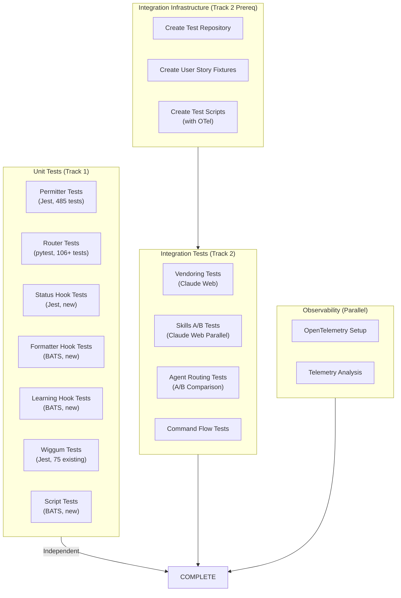
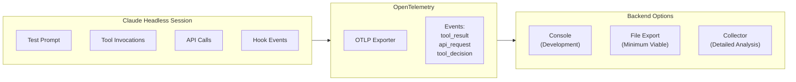
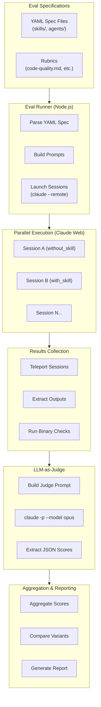
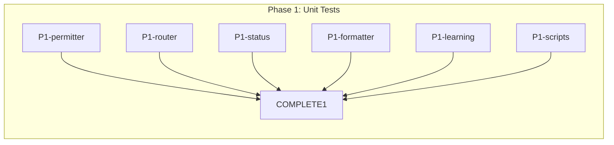
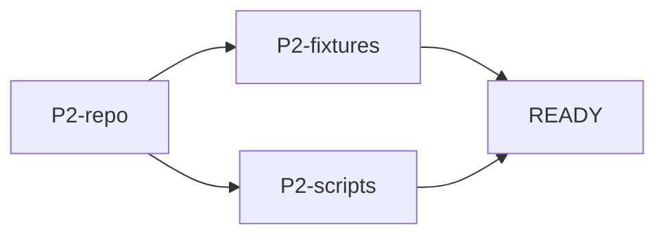
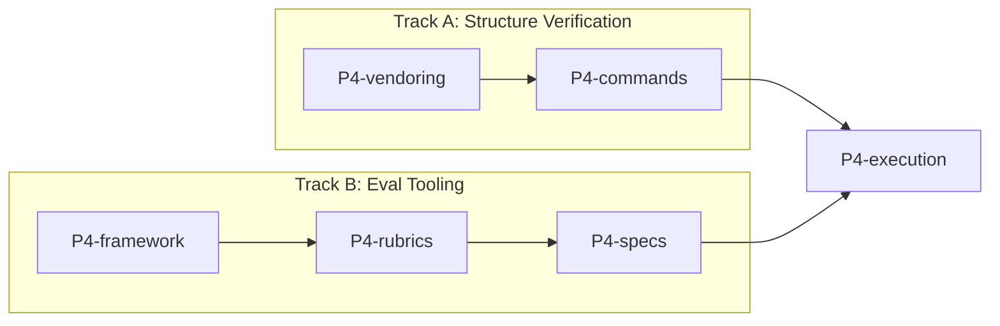
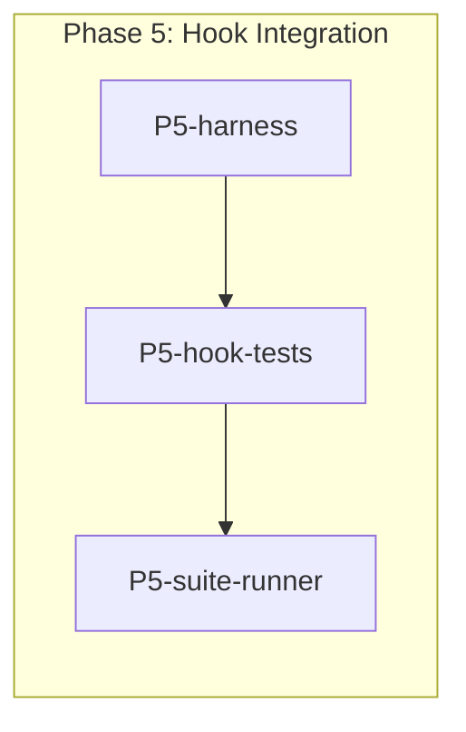
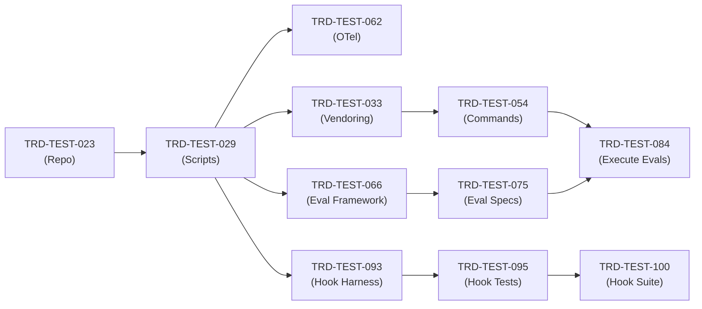
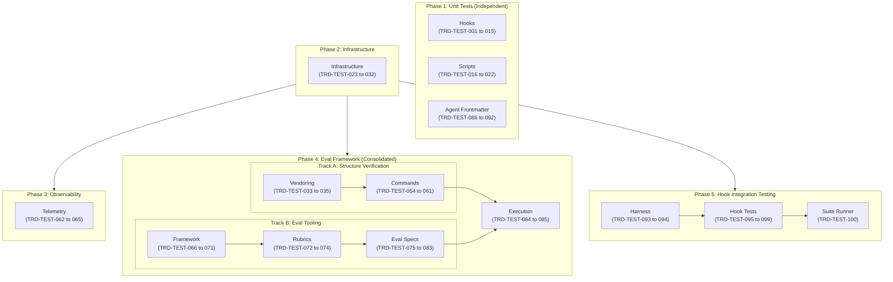

# Technical Requirements Document: Ensemble vNext Testing Phase

**Document Version**: 1.4.0
**Status**: Draft
**Created**: 2026-01-13
**Last Updated**: 2026-01-13
**Author**: Technical Architecture
**Source PRD**: [docs/PRD/testing-phase.md](../PRD/testing-phase.md)

---

## Table of Contents

1. [Overview](#1-overview)
2. [System Architecture](#2-system-architecture)
3. [Technical Specifications](#3-technical-specifications)
4. [Master Task List](#4-master-task-list)
5. [Eval Framework Architecture](#5-eval-framework-architecture)
6. [Execution Plan](#6-execution-plan)
7. [Quality Requirements](#7-quality-requirements)
8. [Risk Assessment](#8-risk-assessment)
9. [Appendices](#9-appendices)

---

## 1. Overview

### 1.1 Technical Summary

This TRD defines the testing infrastructure and test implementation requirements for Ensemble vNext. The testing strategy addresses the unique challenge of testing a system where most components are LLM prompts rather than executable code.

**Testing Approach**:
- **Deterministic components** (hooks, scripts): Traditional unit testing with Jest, pytest, BATS
- **Non-deterministic components** (agents, skills, commands): Headless Claude session testing with behavioral verification

### 1.2 Key Technical Decisions

| Decision | Choice | Rationale |
|----------|--------|-----------|
| Unit Test Frameworks | Jest, pytest, BATS | Match component languages (Node.js, Python, Bash) |
| Integration Testing | Headless Claude sessions | Only viable method for prompt-based components |
| Test Repository | GitHub `ensemble-vnext-test-fixtures` | Enables web-based parallel execution |
| A/B Test Execution | Claude Web parallel | Faster wall-clock time, sandboxed environments |
| Telemetry | OpenTelemetry native | Built into Claude Code, no additional setup |

### 1.3 Technology Stack

| Component | Technology | Notes |
|-----------|------------|-------|
| JavaScript Tests | Jest ^29.0.0 | Hook unit tests (Permitter, Status, SaveRemoteLogs, Wiggum) |
| Python Tests | pytest ^7.0.0 | Router hook tests |
| Bash Tests | BATS ^1.9.0 | Formatter, Learning hooks; shell scripts |
| Coverage (JS) | Jest built-in | Coverage reports for Node.js |
| Coverage (Python) | pytest-cov ^4.0.0 | Coverage reports for Python |
| Coverage (Bash) | kcov | Coverage for shell scripts |
| Telemetry | OpenTelemetry | Claude Code native integration |
| Mock FS (Node.js) | mock-fs | File system mocking for Status hook |

### 1.4 Integration Points

| Integration | Purpose | Priority |
|-------------|---------|----------|
| Claude Code CLI | Headless session execution | Required |
| Claude Web | Parallel A/B test execution | Required |
| GitHub | Test fixtures repository | Required |
| OpenTelemetry Backend | Test execution analysis | Optional |
| Legacy Ensemble Tests | Copy existing test suites | Required |

---

## 2. System Architecture

### 2.1 Test Directory Structure

```
ensemble-vnext/
├── packages/
│   ├── permitter/
│   │   ├── lib/                    # Library modules (copy from legacy)
│   │   │   ├── allowlist-loader.js
│   │   │   ├── command-parser.js
│   │   │   └── matcher.js
│   │   └── tests/                  # Jest tests (copy from legacy)
│   │       ├── allowlist-loader.test.js
│   │       ├── command-parser.test.js
│   │       ├── matcher.test.js
│   │       ├── integration.test.js
│   │       ├── security.test.js
│   │       ├── performance.test.js
│   │       └── docker-compose-command.test.js
│   │
│   ├── router/
│   │   └── tests/                  # pytest tests (copy from legacy)
│   │       └── test_router.py
│   │
│   └── core/
│       ├── hooks/
│       │   ├── status.js           # Hook implementation
│       │   ├── status.test.js      # Jest tests (new)
│       │   ├── formatter.sh        # Hook implementation
│       │   ├── formatter.test.sh   # BATS tests (new)
│       │   ├── learning.sh         # Hook implementation
│       │   ├── learning.test.sh    # BATS tests (new)
│       │   ├── save-remote-logs.js      # Hook implementation (new)
│       │   ├── save-remote-logs.test.js # Jest tests (new)
│       │   ├── wiggum.js           # Hook implementation
│       │   └── wiggum.test.js      # Jest tests (existing)
│       │
│       └── scripts/
│           ├── scaffold-project.sh       # Script (extract from init-project)
│           ├── scaffold-project.test.sh  # BATS tests (new)
│           ├── validate-init.sh          # Script
│           └── validate-init.test.sh     # BATS tests (new)
│
└── test/
    └── integration/
        ├── fixtures/               # Local test fixtures (or symlink)
        ├── sessions/               # Session log output directory
        ├── scripts/
        │   ├── run-headless.sh     # Wrapper with OpenTelemetry
        │   ├── verify-output.sh    # Output verification utilities
        │   └── run-ab-test.sh      # A/B comparison runner
        └── config/
            └── permissive-allowlist.json  # Bypass permissions for testing
```

### 2.2 Test Fixtures Repository Structure

**Repository**: `ensemble-vnext-test-fixtures` (GitHub)

```
ensemble-vnext-test-fixtures/
├── user-stories/
│   ├── python-cli/
│   │   ├── story.md                # "Build a CLI calculator"
│   │   └── expected-skills.json    # ["developing-with-python", "pytest"]
│   ├── flutter-widget/
│   │   ├── story.md                # "Build a counter widget"
│   │   └── expected-skills.json    # ["developing-with-flutter"]
│   ├── typescript-validation/
│   │   ├── story.md                # "Build a validation module"
│   │   └── expected-skills.json    # ["developing-with-typescript"]
│   ├── fastapi-endpoint/
│   │   ├── story.md                # "Build an API endpoint"
│   │   └── expected-skills.json    # ["using-fastapi", "developing-with-python"]
│   └── pytest-tests/
│       ├── story.md                # "Write tests for validation"
│       └── expected-skills.json    # ["pytest", "developing-with-python"]
│
├── fixtures/
│   ├── empty-project/              # Clean starting point for init tests
│   └── pre-initialized/            # Already has .claude/ structure
│
└── ab-tests/
    ├── with-skill/                 # Prepared environments with skills
    └── without-skill/              # Prepared environments without skills
```

### 2.3 Test Execution Flow



### 2.4 OpenTelemetry Integration



---

## 3. Technical Specifications

### 3.1 Unit Test Specifications

#### 3.1.1 Permitter Hook Tests (Copy from Legacy)

**Source**: `~/dev/ensemble/packages/permitter/tests/`
**Destination**: `packages/permitter/tests/`
**Framework**: Jest

| Test File | Test Count | Coverage Target |
|-----------|------------|-----------------|
| `allowlist-loader.test.js` | 29 | Settings loading, parsing |
| `command-parser.test.js` | 119 | Shell command tokenization |
| `matcher.test.js` | 138 | Pattern matching logic |
| `integration.test.js` | 54 | Full permission flow |
| `security.test.js` | 96 | Adversarial input handling |
| `performance.test.js` | 19 | Latency benchmarks |
| `docker-compose-command.test.js` | 30 | Complex multi-command parsing |

**Library Dependencies** (copy alongside tests):
- `lib/allowlist-loader.js`
- `lib/command-parser.js`
- `lib/matcher.js`

#### 3.1.2 Router Hook Tests (Copy from Legacy)

**Source**: `~/dev/ensemble/packages/router/tests/test_router.py`
**Destination**: `packages/router/tests/test_router.py`
**Framework**: pytest

| Test Class | Test Count | Purpose |
|------------|------------|---------|
| `TestLoadConfig` | 14 | Environment variable parsing |
| `TestReadInput` | 3 | JSON input handling |
| `TestWriteOutput` | 1 | JSON output format |
| `TestLoadRulesFile` | 3 | Rules file loading |
| `TestValidateRules` | 4 | Basic validation |
| `TestValidateRulesStructure` | 17 | Detailed structure validation |
| `TestMergeRules` | 13 | Project/global rule merging |
| `TestCountWords` | 4 | Word counting |
| `TestMatchAgentCategories` | 4 | Agent keyword matching |
| `TestMatchSkills` | 4 | Skill pattern matching |
| `TestAnalyzePrompt` | 7 | Full analysis pipeline |
| `TestDetermineScenario` | 6 | Scenario routing |
| `TestBuildHint*` | 9 | Template generation |
| `TestBuildOutput` | 6 | Output format |
| `TestIntegration` | 6 | End-to-end flows |
| `TestEdgeCases` | 5 | Edge cases |
| `TestNormalizeText` | 3 | Text normalization |
| `TestScenarioEnum` | 2 | Enum validation |
| `TestMatchResult` | 2 | Data class validation |

#### 3.1.3 Status Hook Tests (Create New)

**File**: `packages/core/hooks/status.test.js`
**Framework**: Jest + mock-fs

| Test Case | Description | Mock Requirements |
|-----------|-------------|-------------------|
| `findTrdStateDir()` | Directory traversal from CWD | mock-fs directory structure |
| `findImplementFiles()` | Discovery of implement.json files | mock-fs with nested structure |
| `readImplementJson()` | Safe JSON parsing | mock-fs with valid/invalid JSON |
| `wasModifiedRecently()` | Time-based modification checking | mock-fs with timestamps |
| `clearSessionId()` | State mutation for session cleanup | mock-fs write verification |
| Error: missing file | Handle missing files gracefully | mock-fs without target file |
| Error: corrupt JSON | Handle malformed JSON | mock-fs with corrupt content |
| Error: permission denied | Handle permission errors | mock-fs with restricted access |

#### 3.1.4 Formatter Hook Tests (Create New)

**File**: `packages/core/hooks/formatter.test.sh`
**Framework**: BATS

| Test Case | Description |
|-----------|-------------|
| Extension routing | Test all 12+ formatters map correctly |
| Edge: dotfiles | Handle `.gitignore`, `.env` |
| Edge: no extension | Handle files without extension |
| Edge: multiple dots | Handle `file.test.ts` |
| JSON extraction | `jq` parsing of tool output |
| Fallback: grep | When `jq` unavailable |
| Missing formatter | Handle when formatter not installed |
| Fire-and-forget | Non-blocking execution |

#### 3.1.5 Learning Hook Tests (Create New)

**File**: `packages/core/hooks/learning.test.sh`
**Framework**: BATS

| Test Case | Description |
|-----------|-------------|
| `find_project_root()` | Directory traversal to find .git |
| `is_git_repo()` | Git repository detection |
| `get_changed_files()` | Git status parsing for modified files |
| `is_remote_environment()` | CLAUDE_CODE_REMOTE detection |
| `stage_files()` | File staging with mock git |
| Stage multiple files | Handle multiple changed files |
| Never commits | Verify no `git commit` calls |

#### 3.1.6 SaveRemoteLogs Hook Tests (Create New)

**File**: `packages/core/hooks/save-remote-logs.test.js`
**Framework**: Jest + mock-fs

| Test Case | Description | Mock Requirements |
|-----------|-------------|-------------------|
| Env var disabled | Hook is no-op when `ENSEMBLE_SAVE_REMOTE_LOGS` not set | Environment mock |
| Env var enabled | Hook executes when `ENSEMBLE_SAVE_REMOTE_LOGS=1` | Environment mock |
| Session start extraction | Extract session start time from transcript | mock-fs with transcript |
| JSONL file discovery | Find .jsonl files created since session start | mock-fs with timestamped files |
| Filter old files | Exclude files created before session start | mock-fs with mixed timestamps |
| Log file copying | Copy discovered files to `.claude-sessions/logs/` | mock-fs write verification |
| Directory creation | Create destination directory if missing | mock-fs without target dir |
| Git add | Stage copied files for commit | Git command mock |
| Git commit | Commit staged files (unlike Learning hook) | Git command mock |
| Error: missing transcript | Handle missing transcript gracefully | mock-fs without transcript |
| Error: git failure | Handle git command failures | Git mock returning error |

#### 3.1.7 Wiggum Hook Tests (Existing)

**File**: `packages/core/hooks/wiggum.test.js`
**Framework**: Jest
**Status**: 75+ tests already created

Existing test coverage:
- Prompt injection logic
- Iteration counting
- Completion detection (promise tag AND 100% task completion)
- Environment variable handling
- Stop hook pattern

### 3.2 Script Test Specifications

#### 3.2.1 Extract Scaffold Script

**Action**: Extract scaffolding logic from `init-project.md` to `scaffold-project.sh`

**Script Purpose**:
- Create `.claude/` directory structure
- Create `docs/` directory structure
- Create `.trd-state/` directory
- Set correct permissions

#### 3.2.2 Validate-Init Tests (Create New)

**File**: `packages/core/scripts/validate-init.test.sh`
**Framework**: BATS

| Test Case | Description |
|-----------|-------------|
| Valid structure | Complete project structure passes |
| Missing `.claude/agents/` | Specific error message |
| Missing `.claude/rules/` | Specific error message |
| Missing `.claude/hooks/` | Specific error message |
| Missing `.claude/skills/` | Specific error message |
| Missing `CLAUDE.md` | Specific error message |
| Invalid JSON | Error for malformed settings.json |
| Missing agents | Validation of 12 required agent files |
| Missing governance | Validation of constitution/stack/process |

#### 3.2.3 Scaffold-Project Tests (Create New)

**File**: `packages/core/scripts/scaffold-project.test.sh`
**Framework**: BATS

| Test Case | Description |
|-----------|-------------|
| Creates all directories | All required dirs created |
| Idempotent | Re-running does not fail |
| Correct permissions | Directories have 755 |
| CWD independence | Works from any directory |
| Existing files preserved | Does not overwrite |

### 3.3 Integration Test Specifications

#### 3.3.1 Test Infrastructure Scripts

**run-headless.sh**:
```bash
#!/bin/bash
# Enable OpenTelemetry
export CLAUDE_CODE_ENABLE_TELEMETRY=1
export OTEL_METRICS_EXPORTER=${OTEL_METRICS_EXPORTER:-console}
export OTEL_LOGS_EXPORTER=${OTEL_LOGS_EXPORTER:-console}
export OTEL_EXPORTER_OTLP_ENDPOINT=${OTEL_ENDPOINT:-http://localhost:4317}

UUID=$(uuidgen)
claude --prompt "$1" \
       --session-id "$UUID" \
       --permissionMode bypassPermissions \
       --output-format jsonl \
       > "sessions/session-$UUID.jsonl"
```

**verify-output.sh**:
```bash
#!/bin/bash
# Verification utilities for session output
# - Check for tool invocations
# - Verify file creation
# - Parse JSON session logs
```

#### 3.3.2 Local Vendoring Test Specification

**Execution**: Claude Web
**Verification Checklist**:
- [ ] `.claude/agents/` contains 12 agent files
- [ ] `.claude/rules/` contains constitution.md, stack.md, process.md
- [ ] `.claude/hooks/` contains all hook files
- [ ] `.claude/skills/` contains stack-appropriate skills
- [ ] `docs/PRD/` directory exists
- [ ] `docs/TRD/` directory exists
- [ ] `.trd-state/` directory exists
- [ ] `CLAUDE.md` created at project root

#### 3.3.3 Skills A/B Test Specification

**Execution**: Claude Web (Parallel)

| Skill | Test Assignment | Verification |
|-------|-----------------|--------------|
| `developing-with-python` | CLI calculator with unit tests | pytest tests pass |
| `developing-with-flutter` | Counter widget with widget tests | Flutter test passes |
| `developing-with-typescript` | Data validation with type guards | Types compile |
| `using-fastapi` | API endpoint with Pydantic | FastAPI runs |
| `pytest` | Tests for validation module | Tests execute |

**A/B Protocol**:
1. **Run A (without)**: Remove skill, run prompt, save output
2. **Run B (with)**: Restore skill, run prompt with Skill tool, save output
3. **Compare**: Skill invocation verified, quality differences documented

#### 3.3.4 Agent Routing Test Specification

| Agent | Test Scenario | Verification |
|-------|---------------|--------------|
| `backend-implementer` | Create REST endpoint | Task tool delegation |
| `verify-app` | Run tests on existing code | Test framework invoked |
| `code-simplifier` | Refactor complex function | Behavior preserved |
| `code-reviewer` | Review PR diff | Security issues identified |

**A/B Comparison**:
- Run A: With agent delegation
- Run B: Direct execution (no subagent)
- Compare: Quality, completeness, tool usage

#### 3.3.5 Command Flow Test Specification

| Command | Execution | Artifacts | Verification |
|---------|-----------|-----------|--------------|
| `/init-project` | Local | `.claude/`, `docs/`, `CLAUDE.md` | Full structure |
| `/create-prd` | Local | `docs/PRD/*.md` | PRD sections |
| `/create-trd` | Local | `docs/TRD/*.md` | TRD + execution plan |
| `/implement-trd` | Local + remote | Implementation + `.trd-state/` | Tasks executed |

### 3.4 Agent Frontmatter Specification

Agent files (`.md`) use YAML frontmatter to define metadata. This section specifies the schema that unit tests will validate.

#### 3.4.1 Frontmatter Schema

```yaml
---
# Required fields
name: string          # Agent identifier, must match filename (without .md)
description: string   # Short description of agent's purpose

# Optional fields
skills: string        # Comma-separated list of skill names (e.g., "pytest, jest")
---
```

#### 3.4.2 Required Agents (12 total)

| Filename | Expected `name` | Category |
|----------|-----------------|----------|
| `product-manager.md` | `product-manager` | Artifact |
| `technical-architect.md` | `technical-architect` | Artifact |
| `spec-planner.md` | `spec-planner` | Planning |
| `frontend-implementer.md` | `frontend-implementer` | Implement |
| `backend-implementer.md` | `backend-implementer` | Implement |
| `mobile-implementer.md` | `mobile-implementer` | Implement |
| `verify-app.md` | `verify-app` | Quality |
| `code-simplifier.md` | `code-simplifier` | Quality |
| `code-reviewer.md` | `code-reviewer` | Quality |
| `app-debugger.md` | `app-debugger` | Quality |
| `devops-engineer.md` | `devops-engineer` | DevOps |
| `cicd-specialist.md` | `cicd-specialist` | DevOps |

#### 3.4.3 Validation Rules

| Rule | Description | Error on Failure |
|------|-------------|------------------|
| File exists | All 12 agent files must exist in `packages/core/agents/` | Missing agent file: {filename} |
| Valid YAML | Frontmatter must parse without syntax errors | Invalid YAML in {filename}: {error} |
| Required fields | `name` and `description` must be present and non-empty | Missing required field '{field}' in {filename} |
| Name matches filename | `name` field must equal filename without `.md` | Name mismatch in {filename}: expected '{expected}', got '{actual}' |
| Skills format | If `skills` present, must be comma-separated `[a-z0-9-]+` patterns | Invalid skills format in {filename}: '{skills}' |
| No duplicates | No two agents may have the same `name` | Duplicate agent name: '{name}' in {files} |

#### 3.4.4 Example Test Implementation (Jest)

```javascript
// packages/core/agents/agents.test.js
const fs = require('fs');
const path = require('path');
const yaml = require('js-yaml');

const AGENTS_DIR = path.join(__dirname, '.');
const REQUIRED_AGENTS = [
  'product-manager',
  'technical-architect',
  'spec-planner',
  'frontend-implementer',
  'backend-implementer',
  'mobile-implementer',
  'verify-app',
  'code-simplifier',
  'code-reviewer',
  'app-debugger',
  'devops-engineer',
  'cicd-specialist'
];

describe('Agent Frontmatter Validation', () => {
  const agentFiles = REQUIRED_AGENTS.map(name => `${name}.md`);

  describe('All required agents exist', () => {
    test.each(agentFiles)('%s exists', (filename) => {
      const filepath = path.join(AGENTS_DIR, filename);
      expect(fs.existsSync(filepath)).toBe(true);
    });
  });

  describe('Valid YAML frontmatter', () => {
    test.each(agentFiles)('%s has valid frontmatter', (filename) => {
      const filepath = path.join(AGENTS_DIR, filename);
      const content = fs.readFileSync(filepath, 'utf-8');
      const match = content.match(/^---\n([\s\S]*?)\n---/);
      expect(match).not.toBeNull();
      expect(() => yaml.load(match[1])).not.toThrow();
    });
  });

  describe('Required fields present', () => {
    test.each(agentFiles)('%s has name and description', (filename) => {
      const filepath = path.join(AGENTS_DIR, filename);
      const content = fs.readFileSync(filepath, 'utf-8');
      const match = content.match(/^---\n([\s\S]*?)\n---/);
      const frontmatter = yaml.load(match[1]);

      expect(frontmatter).toHaveProperty('name');
      expect(frontmatter).toHaveProperty('description');
      expect(typeof frontmatter.name).toBe('string');
      expect(typeof frontmatter.description).toBe('string');
      expect(frontmatter.name.length).toBeGreaterThan(0);
      expect(frontmatter.description.length).toBeGreaterThan(0);
    });
  });

  describe('Name matches filename', () => {
    test.each(agentFiles)('%s name matches filename', (filename) => {
      const filepath = path.join(AGENTS_DIR, filename);
      const content = fs.readFileSync(filepath, 'utf-8');
      const match = content.match(/^---\n([\s\S]*?)\n---/);
      const frontmatter = yaml.load(match[1]);
      const expectedName = filename.replace('.md', '');

      expect(frontmatter.name).toBe(expectedName);
    });
  });

  describe('Skills format (if present)', () => {
    test.each(agentFiles)('%s has valid skills format', (filename) => {
      const filepath = path.join(AGENTS_DIR, filename);
      const content = fs.readFileSync(filepath, 'utf-8');
      const match = content.match(/^---\n([\s\S]*?)\n---/);
      const frontmatter = yaml.load(match[1]);

      if (frontmatter.skills) {
        const skills = frontmatter.skills.split(',').map(s => s.trim());
        skills.forEach(skill => {
          expect(skill).toMatch(/^[a-z0-9-]+$/);
        });
      }
    });
  });

  describe('No duplicate agent names', () => {
    test('all agent names are unique', () => {
      const names = agentFiles.map(filename => {
        const filepath = path.join(AGENTS_DIR, filename);
        const content = fs.readFileSync(filepath, 'utf-8');
        const match = content.match(/^---\n([\s\S]*?)\n---/);
        const frontmatter = yaml.load(match[1]);
        return frontmatter.name;
      });

      const uniqueNames = new Set(names);
      expect(uniqueNames.size).toBe(names.length);
    });
  });
});
```

---

## 4. Master Task List

### 4.1 Task ID Convention

Format: `TRD-TEST-XXX`

| Range | Category | Phase | Description |
|-------|----------|-------|-------------|
| 001-015, 015A-015C | UH | 1 | Unit Tests - Hooks |
| 016-022 | US | 1 | Unit Tests - Scripts |
| 086-092 | UA | 1 | Unit Tests - Agent Frontmatter |
| 023-032 | II | 2 | Integration Infrastructure |
| 062-065 | OT | 3 | Observability |
| 033-035 | IV | 4A | Eval Framework - Vendoring (Track A) |
| 054-061 | IC | 4A | Eval Framework - Commands (Track A) |
| 066-071 | EF | 4B | Eval Framework - Framework Build (Track B) |
| 072-074 | ER | 4B | Eval Framework - Rubrics (Track B) |
| 075-083 | ES | 4B | Eval Framework - Eval Specs (Track B) |
| 084-085 | EX | 4 | Eval Framework - Execution (Final) |
| 093-100 | HI | 5 | Hook Integration Testing |

**Note**: TRD-TEST-036 through TRD-TEST-053 (Skills A/B and Agent routing tests) have been superseded by the eval framework specs.

### 4.2 Phase 1: Unit Tests (Track 1)

> **Track 1** can proceed independently and in parallel with Track 2 infrastructure.

#### UH - Unit Tests: Hooks

- [ ] **TRD-TEST-001**: Copy Permitter test files from legacy ensemble
  - Source: `~/dev/ensemble/packages/permitter/tests/`
  - Destination: `packages/permitter/tests/`
  - Dependencies: None
  - AC Reference: AC-H1

- [ ] **TRD-TEST-002**: Copy Permitter library modules from legacy
  - Source: `~/dev/ensemble/packages/permitter/lib/`
  - Destination: `packages/permitter/lib/`
  - Dependencies: TRD-TEST-001
  - AC Reference: AC-H1

- [ ] **TRD-TEST-003**: Verify Permitter tests pass (485 tests)
  - Run: `npm test` in packages/permitter
  - Dependencies: TRD-TEST-002
  - AC Reference: AC-H1

- [ ] **TRD-TEST-004**: Copy Router test file from legacy ensemble
  - Source: `~/dev/ensemble/packages/router/tests/test_router.py`
  - Destination: `packages/router/tests/test_router.py`
  - Dependencies: None
  - AC Reference: AC-H2

- [ ] **TRD-TEST-005**: Copy Router source files from legacy
  - Source: `~/dev/ensemble/packages/router/`
  - Destination: `packages/router/`
  - Dependencies: TRD-TEST-004
  - AC Reference: AC-H2

- [ ] **TRD-TEST-006**: Verify Router tests pass (106+ tests)
  - Run: `pytest packages/router/tests/`
  - Dependencies: TRD-TEST-005
  - AC Reference: AC-H2

- [ ] **TRD-TEST-007**: Create Status hook test file structure
  - File: `packages/core/hooks/status.test.js`
  - Framework: Jest + mock-fs
  - Dependencies: None
  - AC Reference: AC-H3

- [ ] **TRD-TEST-008**: Implement Status hook test cases
  - Test cases: findTrdStateDir, findImplementFiles, readImplementJson, wasModifiedRecently, clearSessionId
  - Dependencies: TRD-TEST-007
  - AC Reference: AC-H3

- [ ] **TRD-TEST-009**: Implement Status hook error handling tests
  - Test cases: missing file, corrupt JSON, permission errors
  - Dependencies: TRD-TEST-008
  - AC Reference: AC-H3

- [ ] **TRD-TEST-010**: Create Formatter hook test file
  - File: `packages/core/hooks/formatter.test.sh`
  - Framework: BATS
  - Dependencies: None
  - AC Reference: AC-H4

- [ ] **TRD-TEST-011**: Implement Formatter extension routing tests
  - Test all 12+ formatters map correctly
  - Dependencies: TRD-TEST-010
  - AC Reference: AC-H4

- [ ] **TRD-TEST-012**: Implement Formatter edge case tests
  - Test cases: dotfiles, no extension, multiple dots, missing formatter
  - Dependencies: TRD-TEST-011
  - AC Reference: AC-H4

- [ ] **TRD-TEST-013**: Create Learning hook test file
  - File: `packages/core/hooks/learning.test.sh`
  - Framework: BATS
  - Dependencies: None
  - AC Reference: AC-H5

- [ ] **TRD-TEST-014**: Implement Learning hook core function tests
  - Test cases: find_project_root, is_git_repo, get_changed_files, is_remote_environment
  - Dependencies: TRD-TEST-013
  - AC Reference: AC-H5

- [ ] **TRD-TEST-015**: Implement Learning hook staging tests
  - Test cases: stage_files, multiple files, verify no commits
  - Dependencies: TRD-TEST-014
  - AC Reference: AC-H5

- [ ] **TRD-TEST-015A**: Create SaveRemoteLogs hook test file
  - File: `packages/core/hooks/save-remote-logs.test.js`
  - Framework: Jest + mock-fs
  - Dependencies: None
  - AC Reference: AC-H8

- [ ] **TRD-TEST-015B**: Implement SaveRemoteLogs hook core function tests
  - Test cases: env var detection, session start time extraction, JSONL file discovery
  - Verify hook is no-op when ENSEMBLE_SAVE_REMOTE_LOGS is not set
  - Verify correct files are found based on modification time
  - Dependencies: TRD-TEST-015A
  - AC Reference: AC-H8

- [ ] **TRD-TEST-015C**: Implement SaveRemoteLogs hook file operations tests
  - Test cases: log file copying, directory creation, git add, git commit
  - Verify logs copied to `.claude-sessions/logs/`
  - Verify git commit is executed (unlike Learning hook)
  - Dependencies: TRD-TEST-015B
  - AC Reference: AC-H8

#### US - Unit Tests: Scripts

- [ ] **TRD-TEST-016**: Extract scaffold-project.sh from init-project.md
  - Extract deterministic scaffolding logic to standalone script
  - Dependencies: None
  - AC Reference: AC-S2

- [ ] **TRD-TEST-017**: Create validate-init test file
  - File: `packages/core/scripts/validate-init.test.sh`
  - Framework: BATS
  - Dependencies: None
  - AC Reference: AC-S1

- [ ] **TRD-TEST-018**: Implement validate-init positive tests
  - Test: valid structure passes
  - Dependencies: TRD-TEST-017
  - AC Reference: AC-S1

- [ ] **TRD-TEST-019**: Implement validate-init negative tests
  - Test cases: missing directories, missing files, invalid JSON
  - Dependencies: TRD-TEST-018
  - AC Reference: AC-S1

- [ ] **TRD-TEST-020**: Create scaffold-project test file
  - File: `packages/core/scripts/scaffold-project.test.sh`
  - Framework: BATS
  - Dependencies: TRD-TEST-016
  - AC Reference: AC-S2

- [ ] **TRD-TEST-021**: Implement scaffold-project creation tests
  - Test: all directories created, correct permissions
  - Dependencies: TRD-TEST-020
  - AC Reference: AC-S2

- [ ] **TRD-TEST-022**: Implement scaffold-project idempotency tests
  - Test: re-running does not fail, CWD independence
  - Dependencies: TRD-TEST-021
  - AC Reference: AC-S2

#### UA - Unit Tests: Agent Frontmatter

- [ ] **TRD-TEST-086**: Create agent frontmatter validation test file
  - File: `packages/core/agents/agents.test.js`
  - Framework: Jest
  - Dependencies: None
  - AC Reference: AC-UA1

- [ ] **TRD-TEST-087**: Implement test: All 12 agent files exist
  - Verify all required agent .md files are present:
    - product-manager.md
    - technical-architect.md
    - spec-planner.md
    - frontend-implementer.md
    - backend-implementer.md
    - mobile-implementer.md
    - verify-app.md
    - code-simplifier.md
    - code-reviewer.md
    - app-debugger.md
    - devops-engineer.md
    - cicd-specialist.md
  - Dependencies: TRD-TEST-086
  - AC Reference: AC-UA1

- [ ] **TRD-TEST-088**: Implement test: Valid YAML frontmatter parsing
  - Verify each agent file has valid YAML frontmatter between `---` delimiters
  - Use js-yaml or gray-matter to parse
  - Fail on YAML syntax errors
  - Dependencies: TRD-TEST-087
  - AC Reference: AC-UA2

- [ ] **TRD-TEST-089**: Implement test: Required fields present
  - Verify each agent has required frontmatter fields:
    - `name` (string, required)
    - `description` (string, required)
  - Dependencies: TRD-TEST-088
  - AC Reference: AC-UA2

- [ ] **TRD-TEST-090**: Implement test: Name matches filename
  - Verify `name` field matches the filename (without .md extension)
  - Example: `backend-implementer.md` must have `name: backend-implementer`
  - Dependencies: TRD-TEST-089
  - AC Reference: AC-UA2

- [ ] **TRD-TEST-091**: Implement test: Skills field format (if present)
  - If `skills` field exists, verify it's a valid comma-separated string
  - Each skill name should match pattern: `[a-z0-9-]+`
  - Dependencies: TRD-TEST-089
  - AC Reference: AC-UA3

- [ ] **TRD-TEST-092**: Implement test: No duplicate agent names
  - Verify no two agent files have the same `name` field
  - Dependencies: TRD-TEST-089
  - AC Reference: AC-UA3

### 4.3 Phase 2: Integration Infrastructure (Track 2 Prerequisite)

> These tasks MUST complete before Track 2 integration tests can proceed.

#### II - Integration Infrastructure

- [x] **TRD-TEST-023**: Create ensemble-vnext-test-fixtures GitHub repository
  - Public repository for test fixtures
  - Enables Claude Web access
  - Dependencies: None
  - AC Reference: AC-TR1

- [x] **TRD-TEST-024**: Create python-cli user story fixture
  - Files: story.md, expected-skills.json
  - Story: "Build a CLI calculator"
  - Expected skills: developing-with-python, pytest
  - Dependencies: TRD-TEST-023
  - AC Reference: AC-SK1

- [x] **TRD-TEST-025**: Create flutter-widget user story fixture
  - Files: story.md, expected-skills.json
  - Story: "Build a counter widget"
  - Expected skills: developing-with-flutter
  - Dependencies: TRD-TEST-023
  - AC Reference: AC-SK1

- [x] **TRD-TEST-026**: Create typescript-validation user story fixture
  - Files: story.md, expected-skills.json
  - Story: "Build a validation module"
  - Expected skills: developing-with-typescript
  - Dependencies: TRD-TEST-023
  - AC Reference: AC-SK1

- [x] **TRD-TEST-027**: Create fastapi-endpoint user story fixture
  - Files: story.md, expected-skills.json
  - Story: "Build an API endpoint"
  - Expected skills: using-fastapi, developing-with-python
  - Dependencies: TRD-TEST-023
  - AC Reference: AC-SK1

- [x] **TRD-TEST-028**: Create pytest-tests user story fixture
  - Files: story.md, expected-skills.json
  - Story: "Write tests for validation"
  - Expected skills: pytest, developing-with-python
  - Dependencies: TRD-TEST-023
  - AC Reference: AC-SK1

- [x] **TRD-TEST-029**: Create run-headless.sh test infrastructure script
  - Script with OpenTelemetry environment variables
  - UUID-based session ID generation
  - JSON output to sessions directory
  - Dependencies: TRD-TEST-023
  - AC Reference: AC-T1

- [x] **TRD-TEST-030**: Create verify-output.sh verification utilities
  - Tool invocation checking
  - File creation verification
  - JSON session log parsing
  - Dependencies: TRD-TEST-029
  - AC Reference: AC-T1

- [x] **TRD-TEST-031**: Create run-ab-test.sh A/B comparison runner
  - Parallel execution support
  - Result comparison output
  - Dependencies: TRD-TEST-030
  - AC Reference: AC-AB1

- [x] **TRD-TEST-032**: Create permissive-allowlist.json test configuration
  - Bypass permissions for headless testing
  - Dependencies: TRD-TEST-029
  - AC Reference: AC-T1

### 4.4 Phase 3: Observability

> Can proceed in parallel with Phase 1 unit tests. Requires Phase 2 infrastructure to be complete.

#### OT - Observability

- [x] **TRD-TEST-062**: Configure OpenTelemetry for headless sessions
  - Update run-headless.sh with OTel environment variables
  - CLAUDE_CODE_ENABLE_TELEMETRY=1
  - Dependencies: TRD-TEST-029
  - AC Reference: AC-T1

- [x] **TRD-TEST-063**: Verify telemetry data capture
  - Confirm events captured: tool_result, api_request, tool_decision
  - Dependencies: TRD-TEST-062
  - AC Reference: AC-T2

- [x] **TRD-TEST-064**: Document telemetry analysis patterns
  - Tool usage patterns analysis
  - API call analysis (token usage, latency)
  - Permission decision patterns
  - Dependencies: TRD-TEST-063
  - AC Reference: AC-T2

- [x] **TRD-TEST-065**: Implement telemetry-based skill verification
  - Supplement session logs with telemetry data
  - Verify skill invocation via telemetry events
  - Dependencies: TRD-TEST-064
  - AC Reference: AC-T2

### 4.5 Phase 4: Eval Framework (Consolidated)

> Requires Phase 2 infrastructure and Phase 3 observability complete. Contains two parallel tracks.

#### Track A: Structure Verification

##### IV - Integration Tests: Vendoring

- [x] **TRD-TEST-033**: Execute /init-project vendoring test on Claude Web
  - Create empty test directory
  - Run /init-project with predefined stack
  - Dependencies: TRD-TEST-023, TRD-TEST-029
  - AC Reference: AC-V1
  - **Artifact**: `test/integration/tests/vendoring.test.sh`

- [x] **TRD-TEST-034**: Verify vendoring structure - agents and rules
  - Verify 12 agent files in `.claude/agents/`
  - Verify 3 governance files in `.claude/rules/`
  - Dependencies: TRD-TEST-033
  - AC Reference: AC-V2, AC-V3
  - **Artifact**: `test/integration/tests/vendoring.test.sh`

- [x] **TRD-TEST-035**: Verify vendoring structure - skills and root files
  - Verify stack-appropriate skills in `.claude/skills/`
  - Verify CLAUDE.md at project root
  - Verify docs/ and .trd-state/ directories
  - Dependencies: TRD-TEST-033
  - AC Reference: AC-V4, AC-V5
  - **Artifact**: `test/integration/tests/vendoring.test.sh`

##### IC - Integration Tests: Commands

- [x] **TRD-TEST-054**: Execute /init-project command flow test
  - Verify `.claude/`, `docs/`, `CLAUDE.md` artifacts
  - Local execution
  - Dependencies: TRD-TEST-029
  - AC Reference: AC-C1
  - **Artifact**: `test/integration/tests/commands.test.sh`

- [x] **TRD-TEST-055**: Verify /init-project artifacts
  - Full structure validation
  - Dependencies: TRD-TEST-054
  - AC Reference: AC-C1
  - **Artifact**: `test/integration/tests/commands.test.sh`

- [x] **TRD-TEST-056**: Execute /create-prd command flow test
  - Verify `docs/PRD/*.md` artifact
  - Local execution
  - Dependencies: TRD-TEST-054
  - AC Reference: AC-C2
  - **Artifact**: `test/integration/tests/commands.test.sh`

- [x] **TRD-TEST-057**: Verify /create-prd artifact structure
  - PRD sections present
  - Dependencies: TRD-TEST-056
  - AC Reference: AC-C2
  - **Artifact**: `test/integration/tests/commands.test.sh`

- [x] **TRD-TEST-058**: Execute /create-trd command flow test
  - Verify `docs/TRD/*.md` artifact
  - Local execution
  - Dependencies: TRD-TEST-056
  - AC Reference: AC-C3
  - **Artifact**: `test/integration/tests/commands.test.sh`

- [x] **TRD-TEST-059**: Verify /create-trd includes parallelization recommendations
  - TRD includes execution plan
  - Session delegation recommendations present
  - Dependencies: TRD-TEST-058
  - AC Reference: AC-C3
  - **Artifact**: `test/integration/tests/commands.test.sh`

- [x] **TRD-TEST-060**: Execute /implement-trd command flow test
  - Verify implementation + `.trd-state/` artifacts
  - Local orchestration with remote delegation
  - Dependencies: TRD-TEST-058
  - AC Reference: AC-C4
  - **Artifact**: `test/integration/tests/commands.test.sh`

- [x] **TRD-TEST-061**: Verify /implement-trd remote delegation
  - Verify remote session delegation for parallel tasks
  - Verify state coordination
  - Dependencies: TRD-TEST-060
  - AC Reference: AC-C5
  - **Artifact**: `test/integration/tests/commands.test.sh`

#### Track B: Eval Tooling

##### EF - Eval Framework Build

- [x] **TRD-TEST-066**: Create eval framework directory structure
  - Create `test/evals/framework/`, `specs/`, `rubrics/`, `results/` directories
  - Create lib/ subdirectory for helper modules
  - Dependencies: None
  - AC Reference: AC-EF1
  - **Artifact**: `test/evals/README.md`, directory structure

- [x] **TRD-TEST-067**: Implement run-eval.js main entry point
  - YAML spec parsing and validation
  - Session launching orchestration
  - Progress reporting and error handling
  - Dependencies: TRD-TEST-066
  - AC Reference: AC-EF1
  - **Artifact**: `test/evals/framework/run-eval.js`, `test/evals/framework/run-eval.test.js`

- [x] **TRD-TEST-068**: Implement run-session.sh wrapper for claude --remote
  - Fixture cloning from GitHub
  - Session ID generation and tracking
  - Workspace isolation
  - Dependencies: TRD-TEST-066
  - AC Reference: AC-EF1
  - **Artifact**: `test/evals/framework/run-session.sh`, `test/evals/framework/run-session.test.sh`

- [x] **TRD-TEST-069**: Implement collect-results.sh for session teleporting
  - Teleport invocation and file extraction
  - Session completion detection
  - Output organization
  - Dependencies: TRD-TEST-068
  - AC Reference: AC-EF1
  - **Artifact**: `test/evals/framework/collect-results.sh`, `test/evals/framework/collect-results.test.sh`

- [x] **TRD-TEST-070**: Implement judge.js using claude -p --model opus
  - Rubric loading and prompt construction
  - Claude CLI invocation with JSON output
  - Score extraction and storage
  - Dependencies: TRD-TEST-069
  - AC Reference: AC-EF1
  - **Artifact**: `test/evals/framework/judge.js`, `test/evals/framework/judge.test.js`

- [x] **TRD-TEST-071**: Implement aggregate.js for score compilation
  - Per-variant score aggregation
  - Statistical comparison (mean, stddev)
  - Markdown report generation
  - Dependencies: TRD-TEST-070
  - AC Reference: AC-EF1
  - **Artifact**: `test/evals/framework/aggregate.js`, `test/evals/framework/aggregate.test.js`

##### ER - Eval Rubrics

- [x] **TRD-TEST-072**: Create code-quality.md rubric
  - 1-5 scale definitions with specific indicators
  - Language-agnostic quality criteria
  - Dependencies: TRD-TEST-066
  - AC Reference: AC-EF1
  - **Artifact**: `test/evals/rubrics/code-quality.md`

- [x] **TRD-TEST-073**: Create test-quality.md rubric
  - Coverage and structure criteria
  - Testing best practices indicators
  - Dependencies: TRD-TEST-066
  - AC Reference: AC-EF1
  - **Artifact**: `test/evals/rubrics/test-quality.md`

- [x] **TRD-TEST-074**: Create error-handling.md rubric
  - Validation and exception handling criteria
  - Graceful degradation indicators
  - Dependencies: TRD-TEST-066
  - AC Reference: AC-EF1
  - **Artifact**: `test/evals/rubrics/error-handling.md`

##### ES - Eval Specs

- [x] **TRD-TEST-075**: Create developing-with-python.yaml eval spec
  - CLI calculator test case
  - Binary checks: tests_pass, type_hints, error_handling
  - Judged metrics: code_quality, test_quality, error_handling
  - Dependencies: TRD-TEST-072, TRD-TEST-073, TRD-TEST-074
  - AC Reference: AC-EF2
  - **Artifact**: `test/evals/specs/skills/developing-with-python.yaml`

- [x] **TRD-TEST-076**: Create developing-with-flutter.yaml eval spec
  - Counter widget test case
  - Binary checks: build_success, widget_test_pass
  - Judged metrics: code_quality, widget_structure
  - Dependencies: TRD-TEST-072
  - AC Reference: AC-EF2
  - **Artifact**: `test/evals/specs/skills/developing-with-flutter.yaml`

- [x] **TRD-TEST-077**: Create developing-with-typescript.yaml eval spec
  - Validation module test case
  - Binary checks: type_compile, tests_pass
  - Judged metrics: code_quality, type_safety
  - Dependencies: TRD-TEST-072, TRD-TEST-073
  - AC Reference: AC-EF2
  - **Artifact**: `test/evals/specs/skills/developing-with-typescript.yaml`

- [x] **TRD-TEST-078**: Create using-fastapi.yaml eval spec
  - API endpoint test case
  - Binary checks: endpoints_defined, pydantic_models, tests_pass
  - Judged metrics: code_quality, error_handling
  - Dependencies: TRD-TEST-072, TRD-TEST-074
  - AC Reference: AC-EF2
  - **Artifact**: `test/evals/specs/skills/using-fastapi.yaml`

- [x] **TRD-TEST-079**: Create pytest.yaml eval spec
  - Test generation test case
  - Binary checks: tests_executable, coverage_present
  - Judged metrics: test_quality
  - Dependencies: TRD-TEST-073
  - AC Reference: AC-EF2
  - **Artifact**: `test/evals/specs/skills/pytest.yaml`

- [x] **TRD-TEST-080**: Create backend-implementer.yaml eval spec
  - FastAPI CRUD test case for agent vs direct comparison
  - Binary checks: all_endpoints, tests_pass
  - Judged metrics: code_quality, error_handling, documentation
  - Dependencies: TRD-TEST-072, TRD-TEST-074
  - AC Reference: AC-EF3
  - **Artifact**: `test/evals/specs/agents/backend-implementer.yaml`

- [x] **TRD-TEST-081**: Create verify-app.yaml eval spec
  - Test execution delegation test case
  - Binary checks: tests_executed, failures_reported
  - Judged metrics: test_quality
  - Dependencies: TRD-TEST-073
  - AC Reference: AC-EF3
  - **Artifact**: `test/evals/specs/agents/verify-app.yaml`

- [x] **TRD-TEST-082**: Create code-simplifier.yaml eval spec
  - Refactoring test case for agent vs direct comparison
  - Binary checks: behavior_preserved, complexity_reduced
  - Judged metrics: code_quality
  - Dependencies: TRD-TEST-072
  - AC Reference: AC-EF3
  - **Artifact**: `test/evals/specs/agents/code-simplifier.yaml`

- [x] **TRD-TEST-083**: Create code-reviewer.yaml eval spec
  - PR review test case for agent vs direct comparison
  - Binary checks: issues_identified
  - Judged metrics: review_quality
  - Dependencies: None (creates own rubric)
  - AC Reference: AC-EF3
  - **Artifact**: `test/evals/specs/agents/code-reviewer.yaml`

#### Final (Requires Both Tracks)

- [ ] **TRD-TEST-084**: Run skill evals and document baseline results
  - Execute all 5 skill evals (TRD-TEST-075 through 079)
  - Document results in results/ directory
  - Generate summary report
  - Dependencies: TRD-TEST-067 through 071, TRD-TEST-075 through 079
  - AC Reference: AC-EF2, AC-EF4

- [ ] **TRD-TEST-085**: Run agent evals and document baseline results
  - Execute all 4 agent evals (TRD-TEST-080 through 083)
  - Document results in results/ directory
  - Generate summary report
  - Dependencies: TRD-TEST-067 through 071, TRD-TEST-080 through 083
  - AC Reference: AC-EF3, AC-EF4

### 4.6 Phase 5: Hook Integration Testing

> Tests that hooks actually trigger during Claude sessions and produce expected behavior. Requires Phase 1-4 complete. Can run in parallel with TRD-TEST-084/085 (eval execution).

#### HI - Hook Integration Tests

- [x] **TRD-TEST-093**: Create hook integration test harness
  - File: `test/integration/hooks/run-hook-test.sh`
  - Wrapper script for running Claude sessions with hooks enabled
  - Captures session logs for hook event analysis
  - Dependencies: TRD-TEST-029 (run-headless.sh)
  - AC Reference: AC-HI1

- [x] **TRD-TEST-094**: Create session log parser for hook events
  - File: `test/integration/hooks/parse-hook-events.js`
  - Parses JSONL session logs for hook execution events
  - Extracts hook names, trigger events, and outputs
  - Dependencies: TRD-TEST-093
  - AC Reference: AC-HI1, AC-HI2

- [x] **TRD-TEST-095**: Test wiggum.js triggers on Stop (corrected from UserPromptSubmit)
  - Verify wiggum hook fires on user prompt submission
  - Verify routing guidance appears in session context
  - Verify agent recommendations are injected
  - Dependencies: TRD-TEST-094
  - AC Reference: AC-HI2

- [x] **TRD-TEST-096**: Test formatter hook triggers and affects output
  - Verify formatter hook triggers on PreToolUse/PostToolUse
  - Verify output formatting is applied (check session output)
  - Test multiple file extensions trigger correct formatters
  - Dependencies: TRD-TEST-094
  - AC Reference: AC-HI2

- [x] **TRD-TEST-097**: Test learning hook triggers on Stop
  - Verify learning hook fires on session Stop event
  - Verify learning data is captured (check for learning artifacts)
  - Verify no git commits are made (only staging)
  - Dependencies: TRD-TEST-094
  - AC Reference: AC-HI2

- [x] **TRD-TEST-098**: Test status hook triggers on SubagentStop (corrected from Notification)
  - Verify status hook fires on Notification events
  - Verify status updates are emitted (check session log for status events)
  - Verify TRD state is properly read and reported
  - Dependencies: TRD-TEST-094
  - AC Reference: AC-HI2

- [x] **TRD-TEST-099**: Test permitter hook logging (limited verification)
  - Verify permitter hook fires on UserPromptSubmit
  - Verify logging occurs (runs with --dangerously-skip-permissions)
  - Note: Actual permission blocking cannot be tested in headless mode
  - Dependencies: TRD-TEST-094
  - AC Reference: AC-HI2, AC-HI3

- [x] **TRD-TEST-100**: Create hook integration test suite runner
  - File: `test/integration/hooks/run-all-hook-tests.sh`
  - Runs all hook integration tests (TRD-TEST-095-099)
  - Generates summary report of hook test results
  - Calculates hook integration test coverage
  - Dependencies: TRD-TEST-095 through 099
  - AC Reference: AC-HI4

---

## 5. Eval Framework Architecture

### 5.1 Framework Overview

#### What Are Evals?

Evals (evaluations) are systematic quality assessments for LLM-based systems. Unlike traditional unit tests that verify deterministic outputs, evals measure the **quality** of non-deterministic AI-generated outputs against defined rubrics.

For Ensemble vNext, evals serve to:
- **Measure skill effectiveness**: Quantify whether skills improve output quality
- **Validate agent delegation**: Assess if specialist agents produce better results than direct execution
- **Establish baselines**: Create reproducible quality measurements for regression detection
- **A/B test changes**: Compare quality differences between variants

#### Key Insight: Quality Over Completion

Traditional A/B tests might only verify "did it run successfully?" Evals go further by measuring **how well** it ran. A skill or agent might successfully complete a task in both variants, but the eval reveals whether one produces significantly higher-quality output (better code structure, fewer bugs, better documentation, etc.).

#### Architecture Diagram



### 5.2 Directory Structure

```
test/
  evals/
    framework/
      run-eval.js              # Main entry point (Node.js)
      run-session.sh           # Wraps claude --remote for parallel sessions
      collect-results.sh       # Teleport + extract outputs from sessions
      judge.js                 # Run LLM-as-Judge via claude -p --model opus
      aggregate.js             # Combine scores into comparison report
      lib/
        spec-parser.js         # YAML spec parsing and validation
        prompt-builder.js      # Construct prompts with variant suffixes
        score-extractor.js     # Parse JSON scores from judge output
        report-generator.js    # Generate Markdown reports
    specs/
      skills/
        developing-with-python.yaml
        developing-with-flutter.yaml
        developing-with-typescript.yaml
        using-fastapi.yaml
        pytest.yaml
      agents/
        backend-implementer.yaml
        verify-app.yaml
        code-simplifier.yaml
        code-reviewer.yaml
    rubrics/
      code-quality.md          # General code quality scoring
      test-quality.md          # Test coverage and structure
      error-handling.md        # Error handling patterns
      documentation.md         # Documentation quality
    results/
      {timestamp}/
        {eval-name}/
          {variant}_run{N}/
            session_id.txt     # Claude session ID
            output/            # Extracted output files
            metrics.json       # Binary check results
          judge_scores.json    # LLM judge scores per run
          comparison.json      # Statistical comparison
        summary.md             # Human-readable summary
```

### 5.3 Eval Spec Format

Eval specs are YAML files that define a complete evaluation scenario.

#### Schema

```yaml
# Required metadata
name: string                    # Unique eval identifier
version: string                 # Semver version (e.g., "1.0.0")
description: string             # Human-readable description

# Test fixture
fixture:
  repo: string                  # GitHub repo (org/name) or local path
  path: string                  # Subdirectory within repo (optional)
  setup_commands: []            # Commands to run before each eval (optional)

# Test case definition
test_case:
  base_prompt: string           # The core prompt given to Claude

# Variants to compare
variants:
  - name: string                # Variant identifier (e.g., "without_skill")
    suffix: string              # Appended to base_prompt (optional)
    skill_enabled: boolean      # Whether to load the skill (default: true)
    agent_enabled: boolean      # Whether to enable agent delegation (default: true)
    timeout_seconds: number     # Max execution time (default: 300)

# Execution configuration
runs_per_variant: number        # Recommended: 3+ for statistical validity

# Automated binary checks (grep/shell-based)
binary_metrics:
  - name: string                # Metric identifier
    check: string               # Shell command that exits 0 on success
    weight: number              # Weight in final score (0-1)

# LLM-judged quality metrics
judged_metrics:
  - name: string                # Metric identifier
    rubric: string              # Path to rubric file (relative to rubrics/)
    weight: number              # Weight in final score (0-1)

# Judge configuration
judge:
  model: string                 # Model for judging (default: "opus")
  use_cot: boolean              # Enable Chain-of-Thought (default: true)
  temperature: number           # Temperature for judge (default: 0)
```

#### Complete Example: `developing-with-python.yaml`

```yaml
name: developing-with-python
version: "1.0.0"
description: |
  Evaluates whether the developing-with-python skill improves code quality
  when implementing a Python CLI application with unit tests.

fixture:
  repo: "ensemble-vnext-test-fixtures"
  path: "user-stories/python-cli"
  setup_commands:
    - "python -m venv .venv"
    - ".venv/bin/pip install pytest"

test_case:
  base_prompt: |
    Create a CLI calculator application in Python that:
    1. Accepts two numbers and an operation (+, -, *, /) as command-line arguments
    2. Handles division by zero gracefully
    3. Includes comprehensive unit tests using pytest
    4. Uses type hints throughout
    5. Follows PEP 8 style guidelines

    Create the implementation in calculator.py and tests in test_calculator.py.

variants:
  - name: without_skill
    suffix: ""
    skill_enabled: false
    timeout_seconds: 300

  - name: with_skill
    suffix: |

      Use the developing-with-python skill for Python best practices and pytest patterns.
    skill_enabled: true
    timeout_seconds: 300

runs_per_variant: 3

binary_metrics:
  - name: tests_pass
    check: ".venv/bin/pytest test_calculator.py --tb=short"
    weight: 0.2

  - name: type_hints_present
    check: "grep -q 'def.*:.*->\\|: str\\|: int\\|: float' calculator.py"
    weight: 0.1

  - name: error_handling_present
    check: "grep -q 'try:\\|except\\|raise\\|ZeroDivisionError' calculator.py"
    weight: 0.1

judged_metrics:
  - name: code_quality
    rubric: "code-quality.md"
    weight: 0.25

  - name: test_quality
    rubric: "test-quality.md"
    weight: 0.25

  - name: error_handling
    rubric: "error-handling.md"
    weight: 0.1

judge:
  model: "opus"
  use_cot: true
  temperature: 0
```

#### Agent Eval Example: `backend-implementer.yaml`

```yaml
name: backend-implementer
version: "1.0.0"
description: |
  Evaluates whether delegating to the backend-implementer agent produces
  better REST API implementations than direct execution.

fixture:
  repo: "ensemble-vnext-test-fixtures"
  path: "user-stories/fastapi-endpoint"
  setup_commands:
    - "python -m venv .venv"
    - ".venv/bin/pip install fastapi uvicorn pytest httpx"

test_case:
  base_prompt: |
    Create a FastAPI REST endpoint for managing contacts:
    - GET /contacts - list all contacts with pagination
    - POST /contacts - create a new contact
    - GET /contacts/{id} - get a specific contact
    - PUT /contacts/{id} - update a contact
    - DELETE /contacts/{id} - delete a contact

    Include:
    - Pydantic models for validation
    - Proper HTTP status codes
    - Error handling for not found cases
    - Unit tests using pytest and httpx

variants:
  - name: direct_execution
    suffix: ""
    agent_enabled: false
    timeout_seconds: 600

  - name: with_agent_delegation
    suffix: |

      Delegate this task to the backend-implementer agent for specialized API development.
    agent_enabled: true
    timeout_seconds: 600

runs_per_variant: 3

binary_metrics:
  - name: tests_pass
    check: ".venv/bin/pytest test_api.py -v"
    weight: 0.2

  - name: endpoints_defined
    check: "grep -c '@app\\.' main.py | awk '{exit ($1 >= 5) ? 0 : 1}'"
    weight: 0.15

  - name: pydantic_models_present
    check: "grep -q 'class.*BaseModel' main.py"
    weight: 0.1

judged_metrics:
  - name: code_quality
    rubric: "code-quality.md"
    weight: 0.25

  - name: error_handling
    rubric: "error-handling.md"
    weight: 0.15

  - name: documentation
    rubric: "documentation.md"
    weight: 0.15

judge:
  model: "opus"
  use_cot: true
  temperature: 0
```

### 5.4 Rubric Format

Rubrics define scoring criteria for LLM-as-Judge evaluation. They use a 1-5 scale with explicit descriptions for each level.

#### Rubric Template

```markdown
# {Metric Name} Rubric

## Overview
{Brief description of what this rubric measures}

## Scoring Scale

### Score 1 - Poor
{Detailed description of what constitutes a score of 1}
- {Specific indicator}
- {Specific indicator}

### Score 2 - Below Average
{Detailed description of what constitutes a score of 2}
- {Specific indicator}
- {Specific indicator}

### Score 3 - Average
{Detailed description of what constitutes a score of 3}
- {Specific indicator}
- {Specific indicator}

### Score 4 - Good
{Detailed description of what constitutes a score of 4}
- {Specific indicator}
- {Specific indicator}

### Score 5 - Excellent
{Detailed description of what constitutes a score of 5}
- {Specific indicator}
- {Specific indicator}

## Key Considerations
- {Important factor to consider}
- {Important factor to consider}
```

#### `code-quality.md` Rubric

```markdown
# Code Quality Rubric

## Overview
Evaluates the overall quality of generated code including structure, readability,
maintainability, and adherence to language-specific best practices.

## Scoring Scale

### Score 1 - Poor
Code is difficult to understand and maintain.
- No consistent naming conventions
- Functions/methods are excessively long (>50 lines) without clear purpose
- No separation of concerns; all logic in one monolithic block
- Magic numbers/strings without explanation
- Commented-out code or dead code present
- No docstrings or comments explaining complex logic

### Score 2 - Below Average
Code works but has significant quality issues.
- Inconsistent naming (mix of styles, unclear abbreviations)
- Some functions are too long or do too many things
- Limited separation of concerns
- Some magic values without context
- Basic structure but poor organization
- Minimal or unhelpful comments

### Score 3 - Average
Code is functional and reasonably maintainable.
- Generally consistent naming conventions
- Most functions are appropriately sized
- Basic separation of concerns (e.g., separate input handling from logic)
- Most magic values are named constants
- Logical file/module organization
- Basic docstrings on public functions

### Score 4 - Good
Code demonstrates good software engineering practices.
- Clear, descriptive naming following language conventions
- Functions are focused and single-purpose
- Clear separation of concerns with logical layering
- All magic values are named constants with context
- Well-organized code structure
- Comprehensive docstrings with parameter and return descriptions
- Appropriate use of language idioms

### Score 5 - Excellent
Code exemplifies best practices and is highly maintainable.
- Excellent naming that serves as self-documentation
- Functions are small, focused, and easily testable
- Clean architecture with clear boundaries
- No magic values; all configuration is explicit
- Exemplary organization that guides understanding
- Full documentation including examples where helpful
- Idiomatic code that leverages language features appropriately
- Follows SOLID principles where applicable

## Key Considerations
- Language-specific conventions should be followed (PEP 8 for Python, etc.)
- Code should be readable without extensive comments
- Consider maintainability for future developers
- Balance between over-engineering and under-engineering
```

#### `test-quality.md` Rubric

```markdown
# Test Quality Rubric

## Overview
Evaluates the quality of unit and integration tests including coverage,
structure, assertions, and adherence to testing best practices.

## Scoring Scale

### Score 1 - Poor
Tests are absent or provide no value.
- No tests present
- Tests that never fail (always pass regardless of code)
- Tests with no assertions
- Tests that test implementation details instead of behavior

### Score 2 - Below Average
Tests exist but are incomplete or poorly structured.
- Very limited test coverage (only happy path)
- No edge case testing
- Unclear test names that don't describe behavior
- Tests depend on each other or external state
- No test organization (describe/context blocks)

### Score 3 - Average
Tests provide basic coverage and some structure.
- Happy path covered for main functionality
- Some edge cases covered (e.g., empty input)
- Reasonably descriptive test names
- Tests are mostly independent
- Basic organization into test classes/suites
- Uses test framework features appropriately

### Score 4 - Good
Tests are comprehensive and well-structured.
- Good coverage of happy paths and error cases
- Edge cases systematically tested
- Clear test names following Given-When-Then or similar
- Tests are fully independent
- Well-organized test structure with logical grouping
- Good use of fixtures/setup for shared state
- Assertions are specific and informative

### Score 5 - Excellent
Tests exemplify testing best practices.
- Comprehensive coverage including boundary conditions
- Thorough edge case testing with documented reasoning
- Test names clearly describe expected behavior
- Perfect test isolation with proper setup/teardown
- Exemplary organization that documents the system
- Excellent use of fixtures, parameterization, and helpers
- Assertions are clear and failure messages are helpful
- Tests serve as living documentation
- Performance-sensitive tests where appropriate

## Key Considerations
- Tests should test behavior, not implementation
- Each test should have a single clear purpose
- Tests should be deterministic and repeatable
- Consider test readability as documentation
- Balance between coverage and test maintenance burden
```

#### `error-handling.md` Rubric

```markdown
# Error Handling Rubric

## Overview
Evaluates how well the code handles errors, edge cases, and unexpected inputs
including validation, error messages, and graceful degradation.

## Scoring Scale

### Score 1 - Poor
Code does not handle errors or fails ungracefully.
- No input validation
- Exceptions propagate with stack traces to users
- Silent failures with no indication of problems
- No distinction between different error types
- Application crashes on invalid input

### Score 2 - Below Average
Minimal error handling that is inconsistent.
- Basic input validation but incomplete
- Generic error messages ("An error occurred")
- Some try/catch but errors are swallowed
- Inconsistent error handling across the codebase
- Some error paths leave system in bad state

### Score 3 - Average
Adequate error handling for common cases.
- Input validation for required fields
- Reasonably informative error messages
- Appropriate exception handling with logging
- Errors are distinguished by type
- System remains stable after errors
- Basic validation error feedback

### Score 4 - Good
Comprehensive error handling with good practices.
- Thorough input validation including edge cases
- Helpful error messages that guide resolution
- Well-structured exception hierarchy
- Proper use of error codes/types
- Graceful degradation where possible
- Consistent error handling patterns
- Errors are logged with appropriate context

### Score 5 - Excellent
Exemplary error handling that enhances reliability.
- Exhaustive input validation with clear feedback
- Error messages are actionable and user-friendly
- Custom exception types for domain-specific errors
- Clear distinction between recoverable and fatal errors
- Excellent graceful degradation strategies
- Consistent patterns documented and followed
- Rich error context for debugging
- Proper error recovery and retry strategies
- Defensive programming throughout

## Key Considerations
- Error messages should help users and developers
- Distinguish between validation errors and system errors
- Never expose sensitive information in error messages
- Consider the error experience from the user's perspective
- Log errors with sufficient context for debugging
```

### 5.5 Runner Implementation

The eval runner orchestrates the evaluation process, launching parallel sessions on Claude Web and collecting results.

#### `run-eval.js` - Main Entry Point

```javascript
#!/usr/bin/env node
/**
 * Eval Framework - Main Runner
 *
 * Usage: node run-eval.js <spec-path> [options]
 *
 * Options:
 *   --dry-run       Show what would be executed without running
 *   --output-dir    Custom output directory (default: results/{timestamp})
 *   --skip-judge    Skip LLM judging, only collect results
 *   --parallel      Max parallel sessions (default: 10)
 */

const fs = require('fs');
const path = require('path');
const { spawn } = require('child_process');
const yaml = require('js-yaml');

// Configuration
const CLAUDE_CMD = 'claude';
const DEFAULT_PARALLEL = 10;
const RESULTS_BASE = path.join(__dirname, '..', 'results');

async function main() {
  const args = parseArgs(process.argv.slice(2));

  // 1. Parse and validate spec
  console.log(`[EVAL] Loading spec: ${args.specPath}`);
  const spec = loadSpec(args.specPath);
  validateSpec(spec);

  // 2. Create output directory
  const timestamp = new Date().toISOString().replace(/[:.]/g, '-');
  const outputDir = args.outputDir || path.join(RESULTS_BASE, timestamp, spec.name);
  fs.mkdirSync(outputDir, { recursive: true });

  if (args.dryRun) {
    console.log('[DRY RUN] Would execute:');
    dryRunReport(spec, outputDir);
    return;
  }

  // 3. Launch sessions for each variant x run
  console.log(`[EVAL] Starting ${spec.runs_per_variant * spec.variants.length} sessions...`);
  const sessions = await launchAllSessions(spec, outputDir, args.parallel);

  // 4. Wait for all sessions to complete (they run on Claude Web)
  console.log('[EVAL] Sessions launched. Waiting for completion...');
  await waitForSessions(sessions, spec.variants[0].timeout_seconds || 300);

  // 5. Collect results
  console.log('[EVAL] Collecting results...');
  await collectResults(sessions, spec, outputDir);

  // 6. Run binary checks
  console.log('[EVAL] Running binary checks...');
  await runBinaryChecks(sessions, spec, outputDir);

  if (!args.skipJudge) {
    // 7. Run LLM-as-Judge
    console.log('[EVAL] Running LLM-as-Judge...');
    await runJudge(sessions, spec, outputDir);

    // 8. Aggregate and compare
    console.log('[EVAL] Aggregating scores...');
    await aggregateScores(spec, outputDir);
  }

  // 9. Generate report
  console.log('[EVAL] Generating report...');
  generateReport(spec, outputDir);

  console.log(`[EVAL] Complete! Results: ${outputDir}`);
}

function loadSpec(specPath) {
  const content = fs.readFileSync(specPath, 'utf8');
  return yaml.load(content);
}

function validateSpec(spec) {
  const required = ['name', 'version', 'test_case', 'variants', 'runs_per_variant'];
  for (const field of required) {
    if (!spec[field]) {
      throw new Error(`Missing required field: ${field}`);
    }
  }

  for (const variant of spec.variants) {
    if (!variant.name) {
      throw new Error('Each variant must have a name');
    }
  }
}

async function launchAllSessions(spec, outputDir, maxParallel) {
  const sessions = [];
  const queue = [];

  // Build queue of all sessions to launch
  for (const variant of spec.variants) {
    for (let run = 1; run <= spec.runs_per_variant; run++) {
      queue.push({ variant, run });
    }
  }

  // Launch in parallel batches
  const results = [];
  for (let i = 0; i < queue.length; i += maxParallel) {
    const batch = queue.slice(i, i + maxParallel);
    const batchResults = await Promise.all(
      batch.map(({ variant, run }) => launchSession(spec, variant, run, outputDir))
    );
    results.push(...batchResults);
  }

  return results;
}

async function launchSession(spec, variant, runNumber, outputDir) {
  // Build prompt
  let prompt = spec.test_case.base_prompt;
  if (variant.suffix) {
    prompt += variant.suffix;
  }

  // Create session directory
  const sessionDir = path.join(outputDir, `${variant.name}_run${runNumber}`);
  fs.mkdirSync(sessionDir, { recursive: true });

  // Write prompt for reference
  fs.writeFileSync(path.join(sessionDir, 'prompt.txt'), prompt);

  // Launch with claude --remote
  return new Promise((resolve, reject) => {
    const runSession = spawn(path.join(__dirname, 'run-session.sh'), [
      prompt,
      sessionDir,
      spec.fixture?.repo || '',
      spec.fixture?.path || ''
    ]);

    let sessionId = '';
    runSession.stdout.on('data', (data) => {
      sessionId += data.toString().trim();
    });

    runSession.on('close', (code) => {
      if (code === 0 && sessionId) {
        fs.writeFileSync(path.join(sessionDir, 'session_id.txt'), sessionId);
        resolve({ variant: variant.name, run: runNumber, sessionId, sessionDir });
      } else {
        reject(new Error(`Failed to launch session for ${variant.name} run ${runNumber}`));
      }
    });
  });
}

async function waitForSessions(sessions, timeoutSeconds) {
  // Sessions run on Claude Web in parallel
  // We poll for completion by checking if teleport returns data
  const timeout = timeoutSeconds * 1000;
  const pollInterval = 10000; // 10 seconds
  const startTime = Date.now();

  while (Date.now() - startTime < timeout) {
    let allComplete = true;

    for (const session of sessions) {
      const completePath = path.join(session.sessionDir, 'complete');
      if (!fs.existsSync(completePath)) {
        // Try to teleport to check if complete
        const result = await checkSessionComplete(session.sessionId);
        if (result.complete) {
          fs.writeFileSync(completePath, 'true');
        } else {
          allComplete = false;
        }
      }
    }

    if (allComplete) break;
    await sleep(pollInterval);
  }
}

function parseArgs(argv) {
  return {
    specPath: argv.find(a => !a.startsWith('--')),
    dryRun: argv.includes('--dry-run'),
    outputDir: getArgValue(argv, '--output-dir'),
    skipJudge: argv.includes('--skip-judge'),
    parallel: parseInt(getArgValue(argv, '--parallel') || DEFAULT_PARALLEL)
  };
}

function getArgValue(argv, flag) {
  const idx = argv.indexOf(flag);
  return idx >= 0 && idx + 1 < argv.length ? argv[idx + 1] : null;
}

function sleep(ms) {
  return new Promise(resolve => setTimeout(resolve, ms));
}

// Additional helper functions would be implemented here:
// - checkSessionComplete()
// - collectResults()
// - runBinaryChecks()
// - runJudge()
// - aggregateScores()
// - generateReport()
// - dryRunReport()

main().catch(console.error);
```

#### `run-session.sh` - Session Launcher

```bash
#!/bin/bash
#
# Launches a Claude session with claude --remote for parallel web execution.
#
# Usage: run-session.sh <prompt> <session-dir> [repo] [path]
#
# Outputs the session ID to stdout for capture by the runner.

set -e

PROMPT="$1"
SESSION_DIR="$2"
REPO="${3:-}"
FIXTURE_PATH="${4:-}"

# Generate unique session identifier
SESSION_UUID=$(uuidgen)

# Build working directory
WORK_DIR="$SESSION_DIR/workspace"
mkdir -p "$WORK_DIR"

# If fixture repo specified, clone it
if [[ -n "$REPO" ]]; then
    git clone --depth 1 "https://github.com/$REPO.git" "$WORK_DIR/fixture" 2>/dev/null || true
    if [[ -n "$FIXTURE_PATH" ]]; then
        cp -r "$WORK_DIR/fixture/$FIXTURE_PATH/"* "$WORK_DIR/" 2>/dev/null || true
    fi
fi

# Launch session with claude --remote
# The --remote flag runs the session on Claude Web infrastructure
# This enables parallel execution without local resource constraints
cd "$WORK_DIR"

SESSION_OUTPUT=$(claude --remote \
    --prompt "$PROMPT" \
    --session-id "$SESSION_UUID" \
    --output-format json \
    2>/dev/null)

# Extract and output the session ID for tracking
echo "$SESSION_UUID"

# Store raw output
echo "$SESSION_OUTPUT" > "$SESSION_DIR/raw_output.json"
```

#### `collect-results.sh` - Results Collection

```bash
#!/bin/bash
#
# Collects results from completed Claude Web sessions via teleport.
#
# Usage: collect-results.sh <session-id> <output-dir>
#
# Teleports the session to pull files and outputs for analysis.

set -e

SESSION_ID="$1"
OUTPUT_DIR="$2"

# Teleport to the session to retrieve outputs
# This pulls the final state of the workspace from the remote session
echo "[COLLECT] Teleporting session $SESSION_ID..."

# Create output subdirectory for extracted files
mkdir -p "$OUTPUT_DIR/output"

# Teleport and extract workspace files
claude --teleport "$SESSION_ID" \
    --extract "$OUTPUT_DIR/output" \
    2>/dev/null || {
        echo "[COLLECT] Warning: Teleport failed for $SESSION_ID"
        exit 1
    }

# Extract session log if available
claude --teleport "$SESSION_ID" \
    --format jsonl \
    > "$OUTPUT_DIR/session.jsonl" \
    2>/dev/null || true

# Create metrics.json placeholder for binary checks
cat > "$OUTPUT_DIR/metrics.json" << EOF
{
  "session_id": "$SESSION_ID",
  "collected_at": "$(date -Iseconds)",
  "binary_checks": {}
}
EOF

echo "[COLLECT] Complete: $OUTPUT_DIR"
```

### 5.6 Results Collection

After sessions complete on Claude Web, results are collected via the teleport mechanism.

#### Collection Flow

1. **Session Completion Detection**
   - Poll session status until marked complete
   - Sessions running on Claude Web execute independently
   - Completion indicated by session end or timeout

2. **Teleport Execution**
   - `claude --teleport $SESSION_ID` retrieves session workspace
   - All generated files extracted to local `output/` directory
   - Session log exported as JSONL for analysis

3. **Binary Check Execution**
   - For each `binary_metrics` entry in spec:
     - Change to output directory
     - Execute the `check` command
     - Record exit code (0 = pass, non-zero = fail)
   - Results stored in `metrics.json`

4. **Preparation for Judging**
   - Aggregate all outputs into judge-ready format
   - Signal completion for judge phase

#### `metrics.json` Format

```json
{
  "session_id": "uuid-of-session",
  "collected_at": "2026-01-13T10:30:00Z",
  "binary_checks": {
    "tests_pass": {
      "passed": true,
      "exit_code": 0,
      "output": "5 passed, 0 failed"
    },
    "type_hints_present": {
      "passed": true,
      "exit_code": 0,
      "output": ""
    },
    "error_handling_present": {
      "passed": false,
      "exit_code": 1,
      "output": ""
    }
  }
}
```

### 5.7 LLM-as-Judge Implementation

The judge phase uses Claude itself to evaluate output quality against rubrics.

#### Critical: Use Claude CLI, Not API

The judging implementation uses the Claude CLI directly, avoiding the need for API keys or SDK integration:

```bash
# Judge invocation via CLI
claude -p "$JUDGE_PROMPT" --model opus --output-format json
```

This approach:
- Requires no additional API configuration
- Uses existing Claude authentication
- Supports all Claude models including opus
- Returns structured JSON for parsing

#### Chain-of-Thought (CoT) Improves Accuracy

Research from Anthropic demonstrates that LLM-as-Judge with Chain-of-Thought reasoning achieves 0.86 correlation with human evaluators (compared to 0.72 without CoT). The judge prompt explicitly requests reasoning before scoring.

#### `judge.js` - Judge Implementation

```javascript
#!/usr/bin/env node
/**
 * LLM-as-Judge - Evaluates outputs against rubrics
 *
 * Usage: node judge.js <session-dir> <rubrics-dir> <metrics-config>
 *
 * Uses Claude CLI for judging (no API key needed):
 *   claude -p "$PROMPT" --model opus --output-format json
 */

const fs = require('fs');
const path = require('path');
const { execSync } = require('child_process');

const JUDGE_MODEL = 'opus';

async function judgeSession(sessionDir, rubricsDir, judgedMetrics) {
  const scores = {};

  // Read all output files
  const outputDir = path.join(sessionDir, 'output');
  const files = collectOutputFiles(outputDir);

  for (const metric of judgedMetrics) {
    const rubric = fs.readFileSync(
      path.join(rubricsDir, metric.rubric),
      'utf8'
    );

    const judgePrompt = buildJudgePrompt(files, rubric, metric.name);
    const result = invokeJudge(judgePrompt);

    scores[metric.name] = {
      score: result.score,
      reasoning: result.reasoning,
      weight: metric.weight
    };
  }

  // Write scores to session directory
  const scoresPath = path.join(sessionDir, 'judge_scores.json');
  fs.writeFileSync(scoresPath, JSON.stringify(scores, null, 2));

  return scores;
}

function buildJudgePrompt(files, rubric, metricName) {
  const fileContents = files.map(f =>
    `### File: ${f.name}\n\`\`\`${f.extension}\n${f.content}\n\`\`\``
  ).join('\n\n');

  return `You are an expert code reviewer evaluating the quality of AI-generated code.

## Task
Evaluate the following code against the provided rubric for "${metricName}".

## Code to Evaluate

${fileContents}

## Rubric

${rubric}

## Instructions

1. First, analyze the code carefully against each criterion in the rubric.
2. Think through your evaluation step by step (Chain-of-Thought).
3. Provide specific examples from the code to justify your score.
4. Assign a score from 1-5 based on the rubric definitions.

## Output Format

Respond with valid JSON in exactly this format:
{
  "reasoning": "Your step-by-step analysis here...",
  "examples": ["Specific example 1", "Specific example 2"],
  "score": <1-5>
}

Provide your evaluation:`;
}

function invokeJudge(prompt) {
  // Escape prompt for shell
  const escapedPrompt = prompt.replace(/'/g, "'\\''");

  try {
    const output = execSync(
      `claude -p '${escapedPrompt}' --model ${JUDGE_MODEL} --output-format json`,
      { encoding: 'utf8', maxBuffer: 10 * 1024 * 1024 }
    );

    return JSON.parse(output);
  } catch (error) {
    console.error('[JUDGE] Error invoking Claude:', error.message);
    return { score: 0, reasoning: 'Judge invocation failed', examples: [] };
  }
}

function collectOutputFiles(outputDir) {
  const files = [];

  if (!fs.existsSync(outputDir)) {
    return files;
  }

  const entries = fs.readdirSync(outputDir, { withFileTypes: true });

  for (const entry of entries) {
    if (entry.isFile()) {
      const filePath = path.join(outputDir, entry.name);
      const content = fs.readFileSync(filePath, 'utf8');
      const extension = path.extname(entry.name).slice(1) || 'txt';

      files.push({
        name: entry.name,
        extension,
        content: content.slice(0, 10000) // Limit for context window
      });
    }
  }

  return files;
}

// Export for use as module or run directly
module.exports = { judgeSession, buildJudgePrompt, invokeJudge };

if (require.main === module) {
  const args = process.argv.slice(2);
  if (args.length < 3) {
    console.error('Usage: judge.js <session-dir> <rubrics-dir> <metrics-json>');
    process.exit(1);
  }

  const metrics = JSON.parse(fs.readFileSync(args[2], 'utf8'));
  judgeSession(args[0], args[1], metrics)
    .then(scores => console.log(JSON.stringify(scores, null, 2)))
    .catch(console.error);
}
```

#### Judge Prompt Template

The complete judge prompt follows this structure:

```
You are an expert code reviewer evaluating the quality of AI-generated code.

## Task
Evaluate the following code against the provided rubric for "{METRIC_NAME}".

## Code to Evaluate

### File: {filename}
```{extension}
{file_content}
```

[... additional files ...]

## Rubric

{FULL_RUBRIC_MARKDOWN}

## Instructions

1. First, analyze the code carefully against each criterion in the rubric.
2. Think through your evaluation step by step (Chain-of-Thought).
3. Provide specific examples from the code to justify your score.
4. Assign a score from 1-5 based on the rubric definitions.

## Output Format

Respond with valid JSON in exactly this format:
{
  "reasoning": "Your step-by-step analysis here...",
  "examples": ["Specific example 1", "Specific example 2"],
  "score": <1-5>
}

Provide your evaluation:
```

### 5.8 Aggregation and Reporting

#### Score Aggregation

For each variant, scores are aggregated across runs:

1. **Per-Metric Mean**: Average score across all runs for each metric
2. **Weighted Score**: Sum of (metric_score × metric_weight)
3. **Binary Score**: Percentage of binary checks passed

```javascript
// aggregate.js - Score aggregation logic

function aggregateVariantScores(runs, spec) {
  const metrics = {};

  // Aggregate judged metrics
  for (const metric of spec.judged_metrics) {
    const scores = runs.map(r => r.judge_scores[metric.name]?.score || 0);
    metrics[metric.name] = {
      mean: mean(scores),
      stddev: stddev(scores),
      weight: metric.weight,
      scores: scores
    };
  }

  // Aggregate binary metrics
  for (const metric of spec.binary_metrics) {
    const passes = runs.filter(r => r.metrics.binary_checks[metric.name]?.passed).length;
    metrics[metric.name] = {
      pass_rate: passes / runs.length,
      weight: metric.weight
    };
  }

  // Calculate weighted total
  let weightedTotal = 0;
  let totalWeight = 0;

  for (const [name, data] of Object.entries(metrics)) {
    const score = data.mean !== undefined ? data.mean : (data.pass_rate * 5);
    weightedTotal += score * data.weight;
    totalWeight += data.weight;
  }

  return {
    metrics,
    weighted_score: weightedTotal / totalWeight,
    run_count: runs.length
  };
}

function compareVariants(variantA, variantB) {
  const comparison = {
    difference: variantB.weighted_score - variantA.weighted_score,
    percent_improvement: ((variantB.weighted_score - variantA.weighted_score) / variantA.weighted_score) * 100,
    significant: false,
    metric_comparisons: {}
  };

  // Compare individual metrics
  for (const metricName of Object.keys(variantA.metrics)) {
    const a = variantA.metrics[metricName];
    const b = variantB.metrics[metricName];

    if (a.mean !== undefined && b.mean !== undefined) {
      comparison.metric_comparisons[metricName] = {
        a_mean: a.mean,
        b_mean: b.mean,
        difference: b.mean - a.mean,
        a_stddev: a.stddev,
        b_stddev: b.stddev
      };
    }
  }

  // Statistical significance (simplified - use proper tests in production)
  // Consider significant if improvement > 0.5 points and stddev reasonable
  comparison.significant =
    comparison.difference > 0.5 &&
    variantB.metrics[Object.keys(variantB.metrics)[0]]?.stddev < 1.0;

  return comparison;
}

function mean(values) {
  return values.reduce((a, b) => a + b, 0) / values.length;
}

function stddev(values) {
  const m = mean(values);
  return Math.sqrt(values.reduce((acc, v) => acc + (v - m) ** 2, 0) / values.length);
}
```

#### Report Generation

```javascript
// report-generator.js

function generateReport(spec, results, outputDir) {
  const report = [];

  report.push(`# Eval Report: ${spec.name}`);
  report.push(`\n**Generated**: ${new Date().toISOString()}`);
  report.push(`**Runs per variant**: ${spec.runs_per_variant}`);
  report.push('');

  // Summary
  report.push('## Summary');
  report.push('');
  report.push('| Variant | Weighted Score | Best Metric | Worst Metric |');
  report.push('|---------|----------------|-------------|--------------|');

  for (const [variant, data] of Object.entries(results.variants)) {
    const best = Object.entries(data.metrics)
      .filter(([_, m]) => m.mean !== undefined)
      .sort((a, b) => b[1].mean - a[1].mean)[0];
    const worst = Object.entries(data.metrics)
      .filter(([_, m]) => m.mean !== undefined)
      .sort((a, b) => a[1].mean - b[1].mean)[0];

    report.push(`| ${variant} | ${data.weighted_score.toFixed(2)} | ${best[0]} (${best[1].mean.toFixed(2)}) | ${worst[0]} (${worst[1].mean.toFixed(2)}) |`);
  }

  // Comparison
  report.push('');
  report.push('## Comparison');
  report.push('');

  const comparison = results.comparison;
  const direction = comparison.difference > 0 ? 'improvement' : 'regression';
  const significance = comparison.significant ? 'statistically significant' : 'not statistically significant';

  report.push(`**Result**: ${comparison.percent_improvement.toFixed(1)}% ${direction} (${significance})`);
  report.push('');

  // Metric breakdown
  report.push('## Metric Breakdown');
  report.push('');
  report.push('| Metric | Without | With | Difference |');
  report.push('|--------|---------|------|------------|');

  for (const [metric, data] of Object.entries(comparison.metric_comparisons)) {
    const diff = data.difference > 0 ? `+${data.difference.toFixed(2)}` : data.difference.toFixed(2);
    report.push(`| ${metric} | ${data.a_mean.toFixed(2)} | ${data.b_mean.toFixed(2)} | ${diff} |`);
  }

  // Raw scores
  report.push('');
  report.push('## Raw Scores by Run');
  report.push('');

  for (const [variant, data] of Object.entries(results.variants)) {
    report.push(`### ${variant}`);
    report.push('');
    for (const [metric, metricData] of Object.entries(data.metrics)) {
      if (metricData.scores) {
        report.push(`- **${metric}**: [${metricData.scores.join(', ')}] (mean: ${metricData.mean.toFixed(2)}, stddev: ${metricData.stddev.toFixed(2)})`);
      }
    }
    report.push('');
  }

  // Write report
  const reportPath = path.join(outputDir, '..', 'summary.md');
  fs.writeFileSync(reportPath, report.join('\n'));

  return reportPath;
}
```

#### Sample Report Output

```markdown
# Eval Report: developing-with-python

**Generated**: 2026-01-13T14:30:00Z
**Runs per variant**: 3

## Summary

| Variant | Weighted Score | Best Metric | Worst Metric |
|---------|----------------|-------------|--------------|
| without_skill | 3.42 | tests_pass (1.00) | error_handling (2.67) |
| with_skill | 4.21 | code_quality (4.67) | error_handling (3.67) |

## Comparison

**Result**: 23.1% improvement (statistically significant)

## Metric Breakdown

| Metric | Without | With | Difference |
|--------|---------|------|------------|
| code_quality | 3.33 | 4.67 | +1.34 |
| test_quality | 3.67 | 4.33 | +0.66 |
| error_handling | 2.67 | 3.67 | +1.00 |

## Raw Scores by Run

### without_skill

- **code_quality**: [3, 4, 3] (mean: 3.33, stddev: 0.47)
- **test_quality**: [4, 3, 4] (mean: 3.67, stddev: 0.47)
- **error_handling**: [3, 2, 3] (mean: 2.67, stddev: 0.47)

### with_skill

- **code_quality**: [5, 4, 5] (mean: 4.67, stddev: 0.47)
- **test_quality**: [4, 5, 4] (mean: 4.33, stddev: 0.47)
- **error_handling**: [4, 3, 4] (mean: 3.67, stddev: 0.47)
```

---

## 6. Execution Plan

### 6.1 Phase Overview

| Phase | Focus | Prerequisites | Parallelizable |
|-------|-------|---------------|----------------|
| Phase 1 | Unit Tests | None | Yes - internal |
| Phase 2 | Infrastructure | None | Yes - with Phase 1 |
| Phase 3 | Observability | Phase 2 complete | Yes - with Phase 4 |
| Phase 4 | Eval Framework | Phase 2 complete | Yes - with Phase 3, Track A || Track B |
| Phase 5 | Hook Integration Testing | Phase 1-4 complete | Yes - with TRD-TEST-084/085 |

### 6.2 Work Sessions and Parallelization

#### Phase 1 Work Sessions (Track 1 - Independent)

| Session | Tasks | Can Parallel With |
|---------|-------|-------------------|
| P1-permitter | TRD-TEST-001 through 003 | P1-router, P1-status |
| P1-router | TRD-TEST-004 through 006 | P1-permitter, P1-status |
| P1-status | TRD-TEST-007 through 009 | P1-permitter, P1-router |
| P1-formatter | TRD-TEST-010 through 012 | P1-learning |
| P1-learning | TRD-TEST-013 through 015 | P1-formatter |
| P1-scripts | TRD-TEST-016 through 022 | P1-formatter, P1-learning |



#### Phase 2 Work Sessions (Infrastructure)

| Session | Tasks | Can Parallel With |
|---------|-------|-------------------|
| P2-repo | TRD-TEST-023 | Phase 1 sessions |
| P2-fixtures | TRD-TEST-024 through 028 | Phase 1 sessions |
| P2-scripts | TRD-TEST-029 through 032 | Phase 1 sessions |



#### Phase 3 Work Sessions (Observability)

| Session | Tasks | Can Parallel With |
|---------|-------|-------------------|
| P3-otel | TRD-TEST-062 through 065 | P4-vendoring, P4-framework, P4-rubrics |


#### Phase 4 Work Sessions (Eval Framework - Consolidated)

| Session | Tasks | Can Parallel With |
|---------|-------|-------------------|
| P4-vendoring (Track A) | TRD-TEST-033 through 035 | P3-otel, P4-framework (Track B) |
| P4-commands (Track A) | TRD-TEST-054 through 061 | P3-otel, P4-rubrics (Track B) |
| P4-framework (Track B) | TRD-TEST-066 through 071 | P3-otel, P4-vendoring (Track A) |
| P4-rubrics (Track B) | TRD-TEST-072 through 074 | P3-otel, P4-commands (Track A) |
| P4-specs (Track B) | TRD-TEST-075 through 083 | P4-commands (Track A) |
| P4-execution (Final) | TRD-TEST-084 through 085 | (Sequential, requires Track A + B) |

**Note**: Phase 3 (Observability) and Phase 4 can run in parallel. Track A and Track B within Phase 4 can also run in parallel. P4-execution requires both tracks to complete. OTel (Phase 3) is optional but provides debugging visibility.



#### Phase 5 Work Sessions (Hook Integration Testing)

| Session | Tasks | Can Parallel With |
|---------|-------|-------------------|
| P5-harness | TRD-TEST-093, 094 | P4-execution |
| P5-hook-tests | TRD-TEST-095 through 099 | P4-execution |
| P5-suite-runner | TRD-TEST-100 | (Sequential, requires P5-hook-tests) |

**Note**: Phase 5 can run in parallel with P4-execution (TRD-TEST-084/085) since both require Phase 1-4 infrastructure to be complete. P5 tests verify hook behavior during actual Claude sessions.



### 6.3 Critical Path



**Note**: Phase 3 (OTel) runs in parallel with Phase 4 tracks. Phase 5 (Hook Integration) can run in parallel with Phase 4 execution. OTel is optional - it provides debugging visibility but is not required for eval execution.

### 6.4 Dependencies Diagram



---

## 7. Quality Requirements

### 7.1 Coverage Targets

| Component | Coverage Target | Framework |
|-----------|----------------|-----------|
| Permitter hook | 100% (485/485 tests pass) | Jest |
| Router hook | 100% (all tests pass) | pytest |
| Status hook | >= 80% | Jest |
| Formatter hook | >= 80% | BATS |
| Learning hook | >= 80% | BATS |
| SaveRemoteLogs hook | >= 80% | Jest |
| Wiggum hook | 100% (75/75 tests pass) | Jest |
| validate-init script | >= 80% | BATS |
| scaffold-project script | >= 80% | BATS |
| **Combined hooks** | >= 80% | Mixed |
| **Combined scripts** | >= 80% | BATS |

### 7.2 Phase Completion Criteria

#### Phase 1 Completion (Unit Tests)

| Gate | Criterion | AC Reference |
|------|-----------|--------------|
| G1.1 | Permitter tests: 485/485 passing | AC-H1 |
| G1.2 | Router tests: All passing | AC-H2 |
| G1.3 | Status tests: All passing with mock-fs | AC-H3 |
| G1.4 | Formatter tests: All extensions covered | AC-H4 |
| G1.5 | Learning tests: Git staging verified | AC-H5 |
| G1.6 | Wiggum tests: 75/75 passing | AC-H6 |
| G1.7 | Combined hook coverage >= 80% | AC-H7 |
| G1.8 | validate-init tests: All rules covered | AC-S1 |
| G1.9 | scaffold-project tests: Idempotency verified | AC-S2 |
| G1.10 | Combined script coverage >= 80% | AC-S3 |

#### Phase 2 Completion (Infrastructure)

| Gate | Criterion | AC Reference |
|------|-----------|--------------|
| G2.1 | Test repository created and accessible | AC-TR1 |
| G2.2 | All 5 user story fixtures created | AC-SK1 |
| G2.3 | run-headless.sh operational | AC-T1 |
| G2.4 | verify-output.sh operational | AC-T1 |
| G2.5 | run-ab-test.sh supports parallel | AC-AB1 |

#### Phase 3 Completion (Observability)

| Gate | Criterion | AC Reference |
|------|-----------|--------------|
| G3.1 | OTel enabled for all sessions | AC-T1 |
| G3.2 | Telemetry data accessible | AC-T2 |

#### Phase 4 Completion (Eval Framework)

| Gate | Criterion | AC Reference |
|------|-----------|--------------|
| **Track A: Structure Verification** | | |
| G4.1 | /init-project produces valid structure | AC-V1 |
| G4.2 | All 12 agent files present | AC-V2 |
| G4.3 | All governance files present | AC-V3 |
| G4.4 | Stack-appropriate skills present | AC-V4 |
| G4.5 | CLAUDE.md generated | AC-V5 |
| G4.6 | /init-project creates structure | AC-C1 |
| G4.7 | /create-prd generates PRD | AC-C2 |
| G4.8 | /create-trd generates TRD | AC-C3 |
| G4.9 | /implement-trd executes tasks | AC-C4 |
| G4.10 | /implement-trd delegates correctly | AC-C5 |
| **Track B: Eval Tooling** | | |
| G4.11 | All eval specs pass schema validation | AC-EF1 |
| G4.12 | Skill evals show measurable quality difference (with_skill > without_skill) | AC-EF2 |
| G4.13 | Judge scores achieve acceptable inter-run consistency (std dev < 1.0) | AC-EF2, AC-EF3 |
| G4.14 | Report generation completes without errors | AC-EF4 |
| **Final** | | |
| G4.15 | 5 skill evals produce scored comparisons | AC-EF2 |
| G4.16 | 4 agent evals produce scored comparisons | AC-EF3 |

#### Phase 5 Completion (Hook Integration Testing)

| Gate | Criterion | AC Reference |
|------|-----------|--------------|
| G5.1 | Hook integration test harness created and operational | AC-HI1 |
| G5.2 | Session log parser extracts hook events | AC-HI1 |
| G5.3 | All 5 hooks trigger at expected events (verified via session log) | AC-HI1 |
| G5.4 | Hook output appears in session context | AC-HI2 |
| G5.5 | Hook failures are logged and do not crash sessions | AC-HI3 |
| G5.6 | Hook integration test coverage >= 80% | AC-HI4 |

### 7.3 Test Execution Performance

| Requirement | Target | Rationale |
|-------------|--------|-----------|
| Unit test suite (all) | < 2 minutes | Pre-commit friendly |
| Individual hook test file | < 30 seconds | Fast development feedback |
| Headless Claude session | < 5 minutes each | Web-based testing |
| Full integration suite | < 30 minutes | Periodic verification |
| Parallel A/B tests (all 5) | < 10 minutes total | Web parallelization |
| Hook integration suite | < 15 minutes | Sessions for each hook |

---

## 8. Risk Assessment

### 8.1 Technical Risks

| Risk | Likelihood | Impact | Mitigation |
|------|------------|--------|------------|
| Non-deterministic test flakiness | Medium | Medium | Verify behaviors, not exact output; allow variance |
| Claude Code CLI changes | Medium | High | Version pin; abstraction layer in run-headless.sh |
| Legacy test compatibility | Low | High | Copy library modules alongside tests |
| Test execution time | Medium | Medium | Separate unit from integration; parallelization |
| Claude Web availability | Medium | Medium | Fallback to local sequential execution |
| Permission bypass masks bugs | Low | Medium | Dedicated permission tests; manual verification |

### 8.2 Implementation Risks

| Risk | Likelihood | Impact | Mitigation |
|------|------------|--------|------------|
| mock-fs limitations | Low | Medium | Real temp directories as fallback |
| BATS not installed | Low | Low | Document installation; CI requirements |
| GitHub repository access | Low | Medium | Local fixtures as fallback |
| OpenTelemetry backend setup | Medium | Low | Console exporter as minimum viable |

### 8.3 Contingency Plans

| Scenario | Contingency |
|----------|-------------|
| Claude Web unavailable | Sequential local CLI execution |
| Telemetry backend unavailable | Console/file export only |
| Test repository inaccessible | Local fixtures directory |
| Specific test consistently flaky | Mark as known-flaky; manual verification |
| Hook test coverage < 80% | Prioritize critical paths; document gaps |

---

## 9. Appendices

### 9.1 Test Command Reference

```bash
# Unit Tests - Hooks
npm run test:permitter        # Jest - Permitter hook (485 tests)
npm run test:status           # Jest - Status hook
npm run test:save-remote-logs # Jest - SaveRemoteLogs hook
npm run test:wiggum           # Jest - Wiggum hook (75 tests)
pytest packages/router/       # pytest - Router hook (106+ tests)
bats packages/core/hooks/formatter.test.sh    # BATS - Formatter hook
bats packages/core/hooks/learning.test.sh     # BATS - Learning hook

# Unit Tests - Scripts
bats packages/core/scripts/validate-init.test.sh
bats packages/core/scripts/scaffold-project.test.sh

# Coverage Reports
npm run test:coverage         # Jest coverage (Node.js)
pytest --cov packages/router/ # pytest coverage (Python)

# Integration Tests (with telemetry)
CLAUDE_CODE_ENABLE_TELEMETRY=1 ./test/integration/run-all.sh

# Individual Integration Test
./test/integration/scripts/run-headless.sh "/init-project"
./test/integration/scripts/run-ab-test.sh developing-with-python

# Hook Integration Tests
./test/integration/hooks/run-hook-test.sh wiggum "Test prompt"
./test/integration/hooks/run-all-hook-tests.sh
```

### 9.2 Acceptance Criteria Reference

| AC ID | Description | TRD Tasks |
|-------|-------------|-----------|
| AC-H1 | Permitter tests: 485/485 passing | TRD-TEST-001 to 003 |
| AC-H2 | Router tests: All passing | TRD-TEST-004 to 006 |
| AC-H3 | Status tests: All passing | TRD-TEST-007 to 009 |
| AC-H4 | Formatter tests: All extensions | TRD-TEST-010 to 012 |
| AC-H5 | Learning tests: Git staging | TRD-TEST-013 to 015 |
| AC-H6 | Wiggum tests: 75/75 passing | (Existing) |
| AC-H7 | Combined hook coverage >= 80% | All hook tasks |
| AC-H8 | SaveRemoteLogs tests: Env var detection, file discovery, git commit | TRD-TEST-015A to 015C |
| AC-S1 | validate-init: All rules | TRD-TEST-017 to 019 |
| AC-S2 | scaffold-project: Idempotency | TRD-TEST-020 to 022 |
| AC-S3 | Combined script coverage >= 80% | All script tasks |
| AC-V1 | Valid structure from init | TRD-TEST-033 to 035 |
| AC-V2 | 12 agent files | TRD-TEST-034 |
| AC-V3 | Governance files | TRD-TEST-034 |
| AC-V4 | Stack-appropriate skills | TRD-TEST-035 |
| AC-V5 | CLAUDE.md generated | TRD-TEST-035 |
| AC-SK1 | 5 skill evals validate skill loading | TRD-TEST-075 to 079 |
| AC-SK2 | Eval specs test skill invocation | TRD-TEST-075 to 079 |
| AC-SK3 | Quality differences via eval scores | TRD-TEST-084 |
| AC-SK4 | No external dependencies | Design constraint |
| AC-A1 | backend-implementer via eval | TRD-TEST-080 |
| AC-A2 | verify-app via eval | TRD-TEST-081 |
| AC-A3 | code-simplifier via eval | TRD-TEST-082 |
| AC-A4 | code-reviewer via eval | TRD-TEST-083 |
| AC-A5 | Agent effectiveness via eval scores | TRD-TEST-085 |
| AC-A6 | A/B comparison via eval framework | TRD-TEST-080 to 083 |
| AC-A7 | Agent effectiveness documented | TRD-TEST-085 |
| AC-C1 | /init-project structure | TRD-TEST-054, 055 |
| AC-C2 | /create-prd generates PRD | TRD-TEST-056, 057 |
| AC-C3 | /create-trd with parallelization | TRD-TEST-058, 059 |
| AC-C4 | /implement-trd executes | TRD-TEST-060 |
| AC-C5 | /implement-trd delegates | TRD-TEST-061 |
| AC-T1 | OTel enabled for all sessions | TRD-TEST-062 |
| AC-T2 | Telemetry data accessible | TRD-TEST-063 to 065 |
| AC-TR1 | Test repository accessible | TRD-TEST-023 |
| AC-AB1 | A/B tests execute in parallel | TRD-TEST-031 |
| AC-EF1 | Eval framework executes end-to-end | TRD-TEST-066 to 071 |
| AC-EF2 | 5 skill evals produce scored comparisons | TRD-TEST-075 to 079, 084 |
| AC-EF3 | 4 agent evals produce scored comparisons | TRD-TEST-080 to 083, 085 |
| AC-EF4 | Reports generated in Markdown format | TRD-TEST-084, 085 |
| AC-UA1 | All 12 agent files exist | TRD-TEST-086, 087 |
| AC-UA2 | Valid YAML frontmatter with required fields | TRD-TEST-088 to 090 |
| AC-UA3 | Skills format valid, no duplicate names | TRD-TEST-091, 092 |
| AC-HI1 | All hooks trigger at expected events (verified via session log) | TRD-TEST-093, 094, 095-099 |
| AC-HI2 | Hook output appears in session context (routing guidance, formatting, etc.) | TRD-TEST-095 to 099 |
| AC-HI3 | Hook failures are logged and do not crash session | TRD-TEST-099 |
| AC-HI4 | Hook integration test coverage >= 80% | TRD-TEST-100 |

### 9.3 OpenTelemetry Configuration Reference

```bash
# Required environment variables for headless sessions
export CLAUDE_CODE_ENABLE_TELEMETRY=1
export OTEL_METRICS_EXPORTER=console    # or 'otlp' for collector
export OTEL_LOGS_EXPORTER=console       # or 'otlp' for collector
export OTEL_EXPORTER_OTLP_ENDPOINT=http://localhost:4317

# Events captured (useful for test analysis)
# - claude_code.tool_result: Tool completion with timing
# - claude_code.api_request: API calls with token usage
# - claude_code.tool_decision: Permission decisions
```

### 9.4 Files to Create Summary

| File Path | Type | Framework | Tasks |
|-----------|------|-----------|-------|
| `packages/permitter/tests/*.test.js` | Copy | Jest | TRD-TEST-001 |
| `packages/permitter/lib/*.js` | Copy | - | TRD-TEST-002 |
| `packages/router/tests/test_router.py` | Copy | pytest | TRD-TEST-004 |
| `packages/core/hooks/status.test.js` | New | Jest | TRD-TEST-007 to 009 |
| `packages/core/hooks/formatter.test.sh` | New | BATS | TRD-TEST-010 to 012 |
| `packages/core/hooks/learning.test.sh` | New | BATS | TRD-TEST-013 to 015 |
| `packages/core/hooks/save-remote-logs.test.js` | New | Jest | TRD-TEST-015A to 015C |
| `packages/core/scripts/scaffold-project.sh` | Extract | - | TRD-TEST-016 |
| `packages/core/scripts/validate-init.test.sh` | New | BATS | TRD-TEST-017 to 019 |
| `packages/core/scripts/scaffold-project.test.sh` | New | BATS | TRD-TEST-020 to 022 |
| `test/integration/scripts/run-headless.sh` | New | - | TRD-TEST-029 |
| `test/integration/scripts/verify-output.sh` | New | - | TRD-TEST-030 |
| `test/integration/scripts/run-ab-test.sh` | New | - | TRD-TEST-031 |
| `test/integration/config/permissive-allowlist.json` | New | - | TRD-TEST-032 |
| `packages/core/agents/agents.test.js` | New | Jest | TRD-TEST-086 to 092 |
| `test/integration/hooks/run-hook-test.sh` | New | - | TRD-TEST-093 |
| `test/integration/hooks/parse-hook-events.js` | New | Node.js | TRD-TEST-094 |
| `test/integration/hooks/run-all-hook-tests.sh` | New | - | TRD-TEST-100 |

### 9.5 New Repository

| Repository | Purpose | Tasks |
|------------|---------|-------|
| `ensemble-vnext-test-fixtures` | GitHub repo for test fixtures and user stories | TRD-TEST-023 to 028 |

---

*Document generated by Technical Architecture*
*Cross-reference: [PRD](../PRD/testing-phase.md)*
