# Ensemble vNext Architecture

> A workflow framework for Claude Code that brings structure and guardrails to AI-augmented development.

---

## Vision

Ensemble vNext standardizes how teams go from idea to production through:

- **Repeatable artifact generation** - Story → PRD → TRD with consistent structure
- **Explicit planning before execution** - Identify parallelization and remote offload opportunities
- **Staged execution with verification gates** - Implement → Verify → Simplify → Verify → Review
- **Command-led orchestration** - Workflow encoded in commands, not scattered across prompts
- **Vendored runtime** - Consistent behavior across local CLI and web/cloud sessions
- **Continuous learning** - Session learnings flow back into project memory

### The Goal: Autonomous Development with Engineer Oversight

Ensemble vNext is designed to evolve teams toward **autonomous development**—where AI handles the bulk of implementation while engineers provide oversight, make architectural decisions, and handle edge cases.

This means supporting:

- **Long-running development sessions** that execute without constant intervention
- **Multiple parallel workstreams** across local and cloud environments
- **Fire-and-forget task offloading** that completes reliably
- **Continuous verification** that catches issues before they compound

The framework enables less experienced engineers to operate at a level approaching what power users achieve intuitively—running parallel sessions, maintaining verification discipline, and delegating effectively.

---

## The Problem

Claude Code is extraordinarily capable out of the box. Power users like Boris Jabes (Claude Code's creator) run 5+ parallel local sessions, 10+ web sessions, and achieve remarkable throughput through intuitive mastery of plan mode, verification patterns, and subagent delegation.

**The challenge**: This workflow is implicit. Less experienced engineers struggle to:

1. Know when to plan vs execute
2. Structure work for parallel execution
3. Maintain verification discipline
4. Delegate effectively to subagents
5. Capture and retain learnings

**Ensemble vNext** encodes these patterns into a repeatable framework with appropriate guardrails—preserving the power while making the workflow accessible.

---

## Core Concepts

### Artifacts

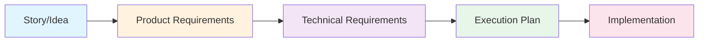

| Artifact | Purpose | Owner |
|----------|---------|-------|
| **PRD** | What to build and why | Product Manager |
| **TRD** | How to build it technically | Technical Architect |
| **Plan** | Execution strategy (parallel, remote) | Spec Planner |
| **Status** | Implementation progress tracking | System (automated) |

### Governance Split

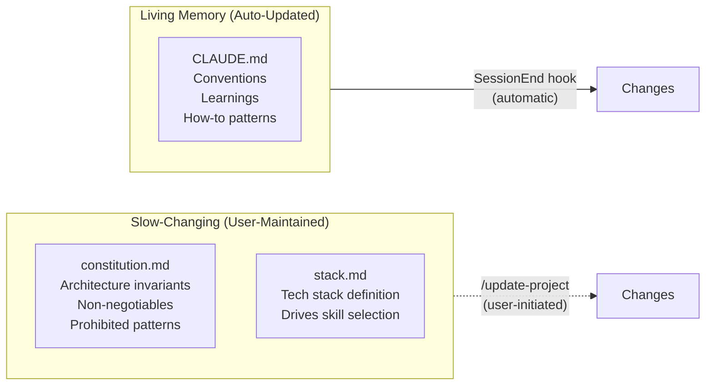

**Constitution** (`.claude/rules/constitution.md`): Project absolutes that rarely change. Architecture decisions, security requirements, prohibited patterns. Changes require explicit user action via `/update-project`.

**Stack** (`.claude/rules/stack.md`): Explicit tech stack definition used to determine which subagents and skills apply to the project.

**CLAUDE.md**: Living runbook updated automatically with conventions, learnings, and "do not repeat" knowledge.

---

## Two-Layer Architecture

Ensemble vNext separates **generation** from **runtime**.

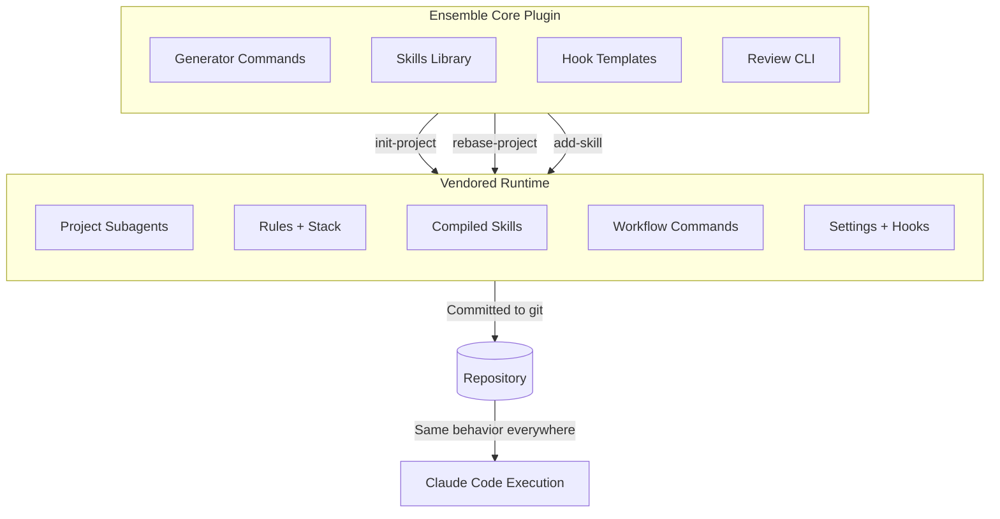

### Why Vendor?

1. **Consistency** - Same behavior in CLI, web, and cloud sessions
2. **Version control** - Runtime is committed; changes are reviewable
3. **Reproducibility** - Project pins its Ensemble version
4. **Customization** - Teams can modify vendored components

### Plugin Responsibilities

The plugin distributed via Claude Code marketplace provides:

| Command | Purpose |
|---------|---------|
| `init-project` | Generate initial vendored runtime |
| `rebase-project` | Upgrade vendored runtime to newer plugin version |
| `add-skill` | Add additional skills without full rebase |

Plus: template library, hook helpers, and the optional external review CLI.

### Vendored Runtime

The repository contains everything needed for execution. The `.claude/` directory is committed to git (with appropriate `.gitignore` entries for local-only files like `settings.local.json`).

---

## Workflow: From Story to Implementation

### The Full Flow

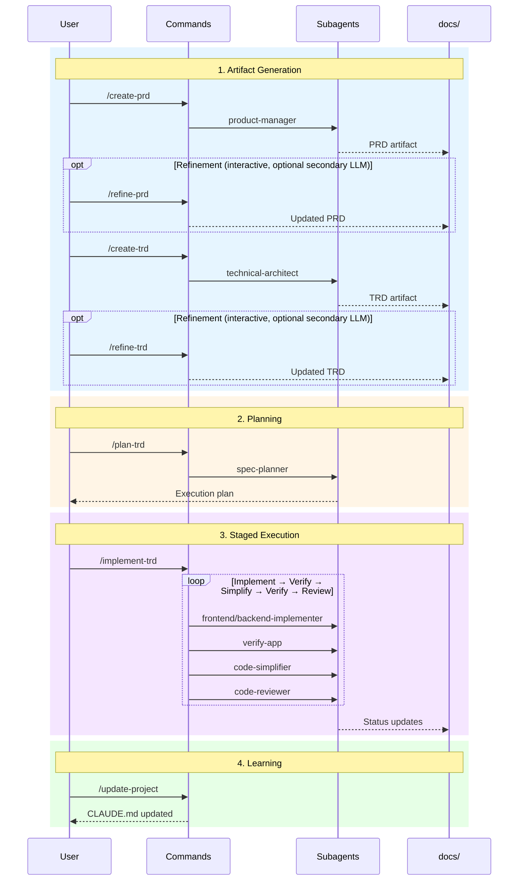

### Commands vs Subagents

A key distinction in Ensemble vNext:

| Concept | What It Is | Who Invokes It | Visual |
|---------|------------|----------------|--------|
| **Command** | User-facing workflow entry point | User | `/create-prd` |
| **Subagent** | Specialist worker with isolated context | Commands | `product-manager` |

**Commands orchestrate. Subagents execute.** The command is responsible for the workflow; subagents do the specialized work.

### Artifact Commands

| Command | Input | Subagent | Output |
|---------|-------|----------|--------|
| `/create-prd` | Story/idea | `product-manager` | PRD in `docs/PRD/` |
| `/refine-prd` | PRD + feedback | (interactive, plan mode) | Improved PRD |
| `/create-trd` | PRD | `technical-architect` | TRD in `docs/TRD/` |
| `/refine-trd` | TRD + feedback | (interactive, plan mode) | Improved TRD |

---

## Staged Execution: The Implementation Loop

The `/implement-trd` command orchestrates a disciplined implementation cycle. The command itself acts as the orchestrator—there is no separate orchestrator subagent.

### Why Command-Led Orchestration?

Putting orchestration logic in the command (rather than SubagentStop hooks or a dedicated orchestrator agent) provides:

1. **Visibility** - The workflow is explicit in the command definition
2. **Debuggability** - Easy to understand what's happening and why
3. **Determinism** - Consistent execution path every time
4. **Simplicity** - No hook ordering concerns or hidden state

### The Staged Loop

Each phase of implementation follows this cycle:

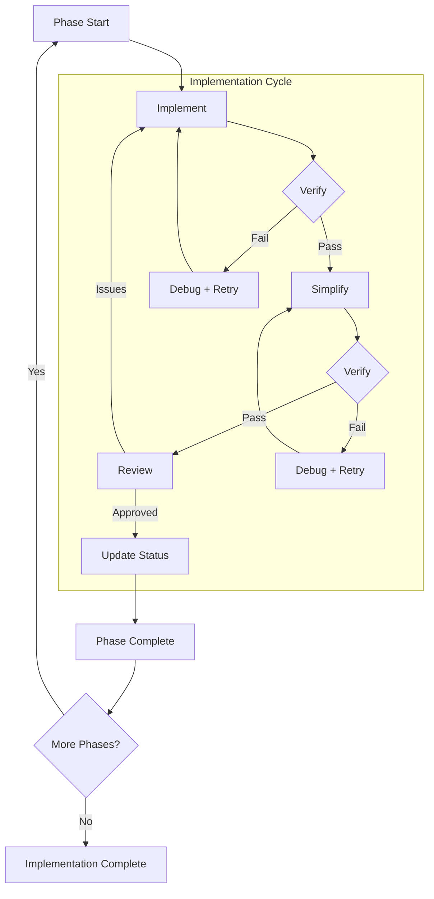

### What Happens at Each Stage

| Stage | What Happens | Subagent(s) |
|-------|--------------|-------------|
| **Implement** | Write code according to TRD tasks | `frontend-implementer`, `backend-implementer` |
| **Verify** | Run tests, check coverage thresholds | `verify-app` |
| **Debug** | Analyze failures, propose fixes | `verify-app` (retry loop) |
| **Simplify** | Refactor for clarity (only after verify passes) | `code-simplifier` |
| **Review** | Security scan, quality check | `code-reviewer` |
| **Update** | Mark tasks complete, update status artifact | (command) |

### Gates Are Automated

The goal is minimal user intervention:

| Gate | Automation |
|------|------------|
| **Verify** | Run test suite; check coverage thresholds |
| **Simplify** | Only runs after verification passes |
| **Review** | Code review agent scans for issues |
| **Retry** | Automatic with debug loop (bounded retries) |

The system retries until success within reasonable bounds, then pauses for user decision only when stuck.

---

## Subagent Architecture

Ensemble vNext defines a streamlined set of project subagents, vendored into `.claude/agents/`.

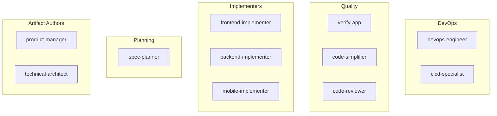

### Subagent Design Principles

1. **No tool restrictions** - Subagents have all tools enabled (no `tools:` line in frontmatter)
2. **Explicit skills** - Each subagent declares which skills to invoke based on the project's stack
3. **Mandatory split** - Implementation is always split between frontend and backend
4. **Permissive start** - Tighten restrictions only when measurably beneficial

### Subagent Roster

| Role | Subagent | Responsibility |
|------|----------|----------------|
| Artifact | `product-manager` | PRD creation and refinement |
| Artifact | `technical-architect` | TRD creation and refinement |
| Planning | `spec-planner` | Execution planning (plan mode) |
| Implement | `frontend-implementer` | UI, components, client logic |
| Implement | `backend-implementer` | APIs, services, data layer |
| Implement | `mobile-implementer` | Mobile apps (enabled when scope exists) |
| Quality | `verify-app` | Test execution and verification |
| Quality | `code-simplifier` | Post-verification refactoring |
| Quality | `code-reviewer` | Security and quality review |
| DevOps | `devops-engineer` | Infrastructure and deployment |
| DevOps | `cicd-specialist` | Pipeline configuration |

---

## Hook System

Hooks enforce invariants without sprawling orchestration logic. They are minimal and high-signal.

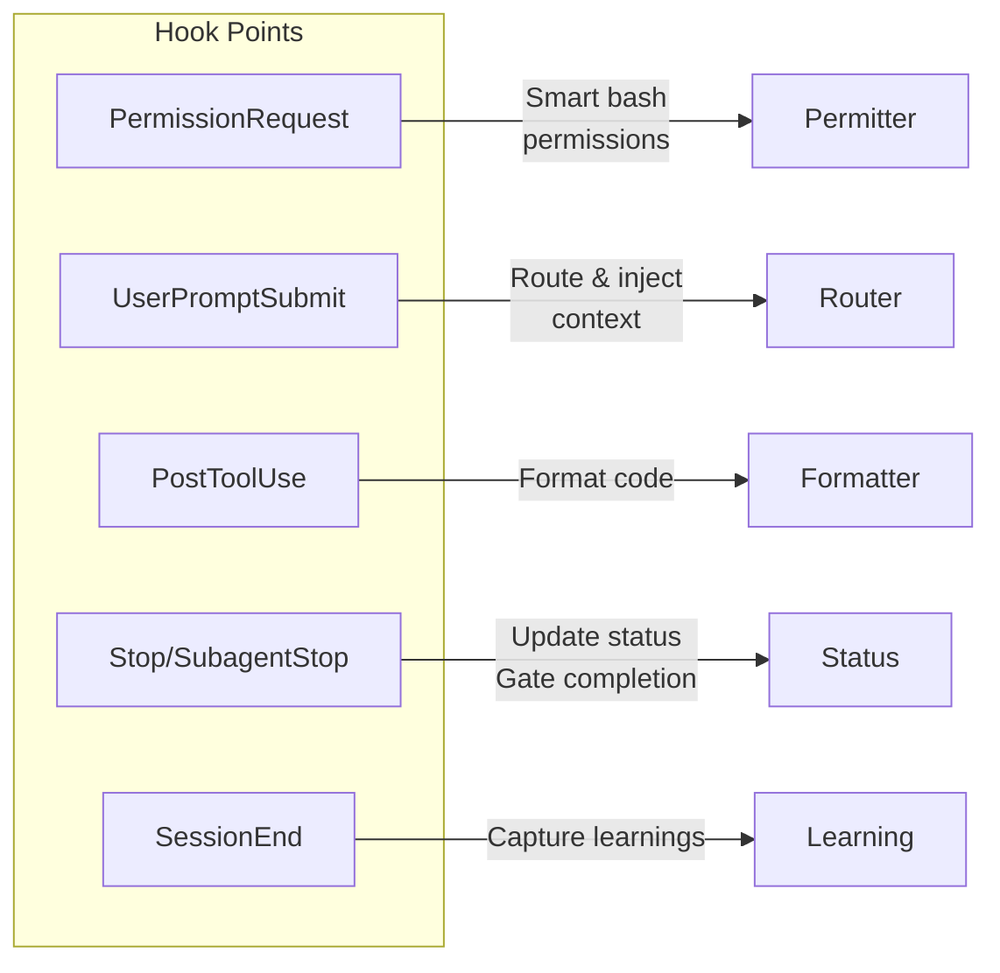

### Hook Responsibilities

| Hook | Event | Purpose | Blocking? |
|------|-------|---------|-----------|
| **Permitter** | PermissionRequest | Semantic bash permission expansion—auto-approves commands that match allowlist after normalizing env vars, wrappers, and chains | No (ask on uncertainty) |
| **Router** | UserPromptSubmit | Classify prompts, inject context steering to commands/skills | Never |
| **Formatter** | PostToolUse (Edit/Write) | Format code output (project-configurable) | No |
| **Status** | SubagentStop | Update status artifact on task completion | No |
| **Completion Gate** | Stop | Enforce completion criteria in autonomy mode | When needed |
| **Learning** | SessionEnd | Auto-capture learnings to CLAUDE.md (not Constitution) | No |

### Key Constraint

Hooks run in parallel. Design must not depend on ordering between hooks.

---

## Autonomy Mode (Wiggum)

For extended autonomous execution, use `/implement-trd --wiggum`. This mode is designed to work with cloud/web offload for "fire and forget" tasks.

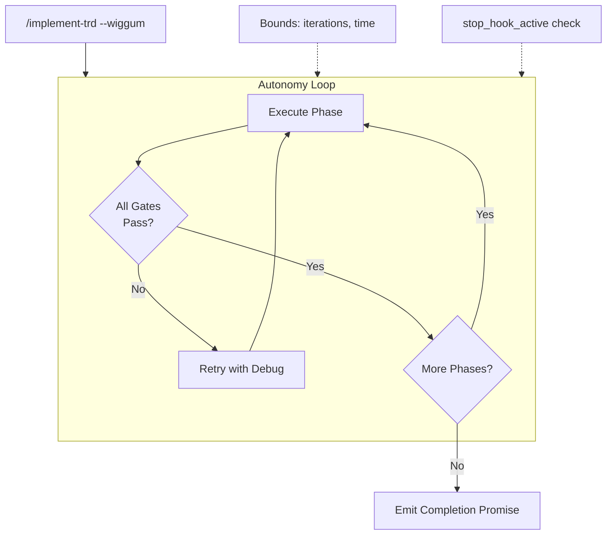

### Completion Promise

The autonomy loop emits a unique completion promise only when ALL gates pass:

1. Implementation complete
2. Tests passing
3. Coverage thresholds met
4. Code simplified
5. Review approved
6. Artifacts/status updated

### Wiggum + Cloud Offload

Wiggum mode and cloud/web offload are intended to work together. The pattern:

1. **Plan locally** - Use `/plan-trd` to identify offloadable work
2. **Offload with wiggum** - Launch `& /implement-trd --wiggum` to cloud
3. **Fire and forget** - Cloud session runs autonomously until completion promise
4. **Monitor with /tasks** - Check progress periodically
5. **Pull when done** - Use `/teleport` to retrieve completed work

### Bounds and Safety

- Configurable iteration/time limits
- `stop_hook_active` prevents infinite loops
- Falls back to vendored loop if official implementation has issues

---

## Remote/Web Offload

When `/plan-trd` identifies offloadable work:

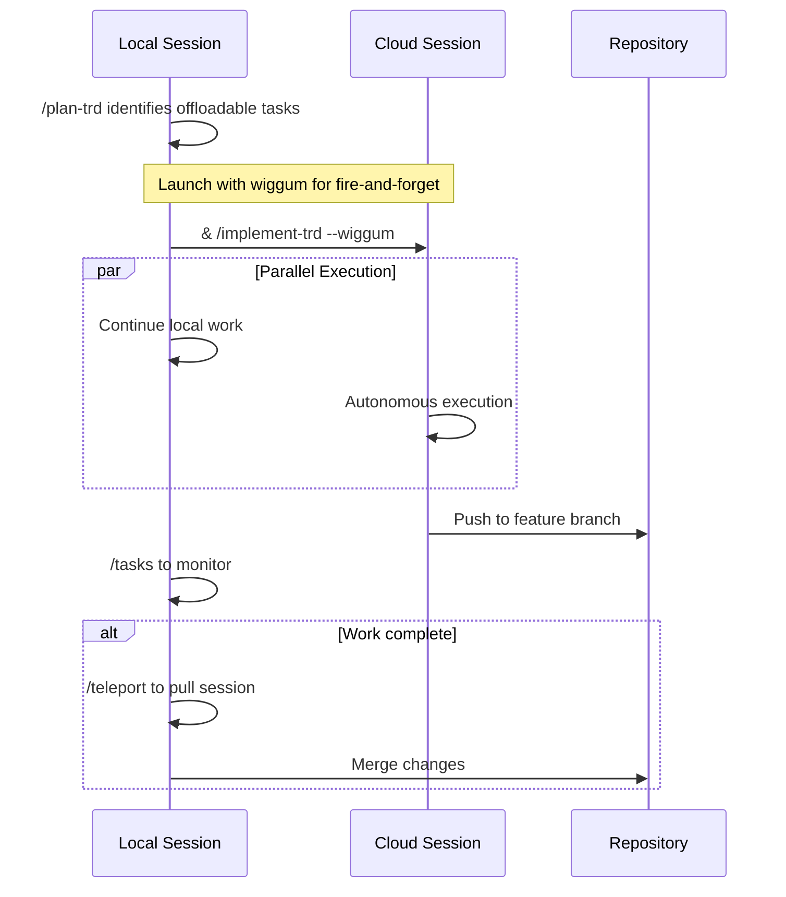

### Operational Pattern

| Action | Method |
|--------|--------|
| Start remote work | `&` prefix or `claude --remote "..."` |
| Monitor progress | `/tasks` |
| Pull back to local | `/teleport` or `/tp` |

### Environmental Reality

- Web/cloud sessions clone repo to Anthropic-managed VM
- Session handoff is one-way (pull only)
- Hooks run in both contexts; gate with `CLAUDE_CODE_REMOTE` env var if needed

---

## Learning Loop

The learning loop captures session knowledge and flows it back into project memory.

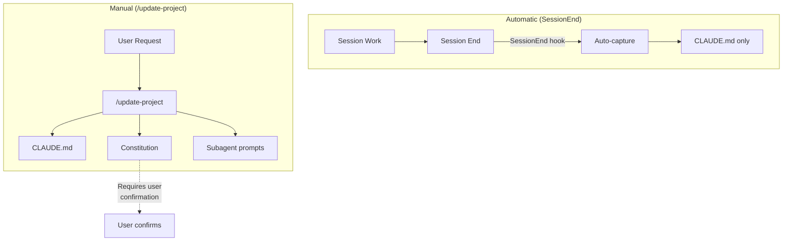

### Automatic Learning (SessionEnd)

At the end of each session, the SessionEnd hook automatically:

1. Analyzes the session for learnings
2. Updates CLAUDE.md with conventions, patterns, and "do not repeat" knowledge
3. Keeps updates brief to prevent bloat

**Important**: SessionEnd only updates CLAUDE.md. It cannot modify the Constitution.

### Manual Learning (/update-project)

The `/update-project` command provides fuller control:

| Target | Behavior |
|--------|----------|
| **CLAUDE.md** | Updated automatically |
| **Constitution** | Proposes changes; requires user confirmation |
| **Subagent prompts** | Updated when delegation quality needs improvement |

Use `/update-project` when you want to:
- Force a learning capture mid-session
- Propose Constitution changes based on session learnings
- Improve subagent delegation prompts

---

## Secondary LLM Review

Ensemble vNext supports an optional secondary LLM review gate for PRD and TRD refinement. This provides an automated "second opinion" from a different model before finalizing artifacts.

### What It Is

A shipped CLI tool that submits artifacts to a secondary LLM (OpenAI, Gemini, etc.) and returns structured critique. This is:

- **Automated** - No manual copy/paste; integrates into the refinement workflow
- **Structured** - Returns critique in a consistent format for easy processing
- **Optional** - Disabled by default; requires explicit enablement
- **Complementary** - A second perspective, not a replacement for Claude's work

### How It Works

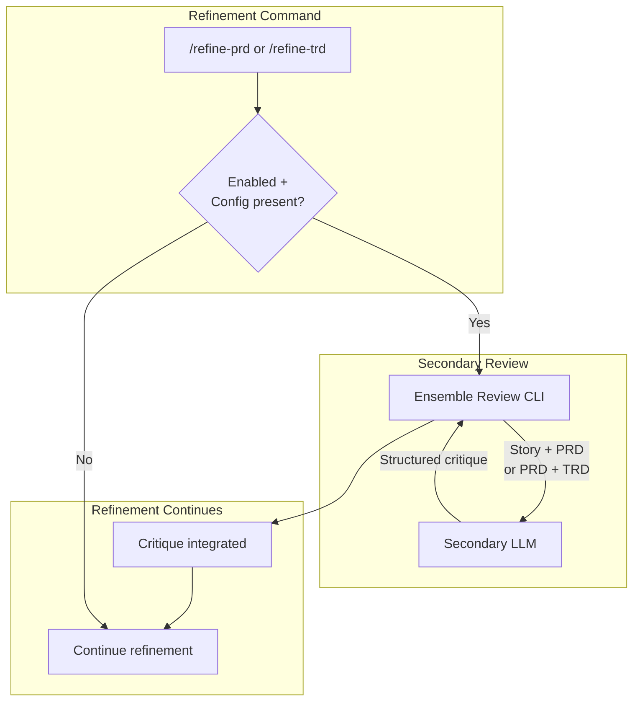

### Configuration

Secondary review is **disabled by default**. To enable:

1. Set environment variable: `ENSEMBLE_SECONDARY_REVIEW=1`
2. Configure credentials in `.claude/settings.local.json` (gitignored):

```json
{
  "ensemble": {
    "secondaryReview": {
      "provider": "openai",
      "model": "gpt-4o"
    }
  }
}
```

Both the environment variable AND credentials must be present for the feature to activate.

### When to Use

- **PRD Review**: Submits (Story + PRD) for product requirements critique
- **TRD Review**: Submits (PRD + TRD) for technical approach critique

The secondary LLM doesn't see your codebase—only the artifacts. This provides a fresh perspective focused purely on the specification quality.

---

## Skills Strategy

Skills flow from the plugin library to a compiled project subset.

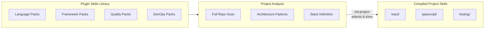

### Compile Strategy

`init-project` doesn't just look at `package.json` or `requirements.txt`. It performs a comprehensive scan:

1. **Dependency files** - package.json, requirements.txt, Gemfile, etc.
2. **Project structure** - Directory layout, file organization
3. **Architecture patterns** - How code is organized (MVC, Clean Architecture, etc.)
4. **Existing conventions** - Code style, naming patterns, module structure

This analysis produces `.claude/rules/stack.md`, which explicitly defines the tech stack and drives skill selection.

### Adding Skills Without Rebasing

Use `/add-skill` to add additional skills to the project without a full rebase:

```bash
/add-skill playwright   # Add Playwright testing skill
/add-skill terraform    # Add Terraform IaC skill
```

### Pull-Based Loading

Skills are invoked when needed, not always injected. Subagent prompts define when to invoke skills; the router ensures Task tool invocations recommend appropriate skills.

---

## Vendored File Structure

```
project-root/
├── .claude/
│   ├── agents/
│   │   ├── product-manager.md
│   │   ├── technical-architect.md
│   │   ├── spec-planner.md
│   │   ├── frontend-implementer.md
│   │   ├── backend-implementer.md
│   │   ├── verify-app.md
│   │   ├── code-simplifier.md
│   │   ├── code-reviewer.md
│   │   ├── devops-engineer.md
│   │   └── cicd-specialist.md
│   │
│   ├── rules/
│   │   ├── constitution.md       # Project absolutes (user-maintained)
│   │   ├── stack.md              # Tech stack definition (drives skills)
│   │   └── process.md            # Workflow expectations
│   │
│   ├── skills/                   # Compiled from plugin based on stack
│   │   ├── react/
│   │   │   ├── SKILL.md          # Main skill definition
│   │   │   ├── REFERENCE.md      # Additional reference material
│   │   │   └── examples/         # Code examples
│   │   ├── typescript/
│   │   │   └── SKILL.md
│   │   └── testing/
│   │       └── SKILL.md
│   │
│   ├── commands/
│   │   ├── create-prd.md
│   │   ├── refine-prd.md
│   │   ├── create-trd.md
│   │   ├── refine-trd.md
│   │   ├── plan-trd.md
│   │   ├── implement-trd.md
│   │   └── update-project.md
│   │
│   ├── settings.json             # Permissions + hooks (committed)
│   └── settings.local.json       # Local overrides (gitignored)
│
├── .gitignore                    # Updated to track .claude/ except locals
│
├── CLAUDE.md                     # Living project memory (auto-updated)
│
├── docs/
│   ├── PRD/
│   │   └── feature-name.md
│   └── TRD/
│       └── feature-name.md
│
└── .trd-state/                   # Implementation status
    └── feature-name/
        └── implement.json
```

### Git Tracking

When vendoring, `init-project` updates `.gitignore` appropriately:

```gitignore
# Track .claude/ directory
!.claude/

# But ignore local settings
.claude/settings.local.json
.claude/*.local.*
```

---

## Project Lifecycle

### Initialization

```bash
/init-project
```

Generates the vendored runtime:
- `.claude/` directory structure
- Project subagents
- Compiled skills based on repo analysis
- Workflow commands
- Hook configuration
- Constitution and stack templates
- Updated `.gitignore`
- CLAUDE.md template

### Upgrade

```bash
/rebase-project
```

Upgrades the vendored runtime to a newer plugin version:
- Recomputes compiled skills
- Updates templates and commands
- Preserves local edits where possible
- Produces a rebase report for review

### Add Skills

```bash
/add-skill <skill-name>
```

Adds additional skills without a full rebase:
- Validates skill exists in plugin library
- Compiles and trims for project context
- Adds to `.claude/skills/<skill-name>/`

### Update Project Memory

```bash
/update-project
```

Manual learning capture:
- Analyzes current session
- Updates CLAUDE.md with learnings
- Proposes Constitution changes (requires user confirmation)
- Optionally updates subagent prompts

---

## Summary

Ensemble vNext provides:

| Capability | Mechanism |
|------------|-----------|
| **Repeatable artifacts** | `/create-prd` → `/create-trd` commands |
| **Explicit planning** | `/plan-trd` with parallelization/offload analysis |
| **Staged execution** | `/implement-trd` with verification gates |
| **Autonomous operation** | Wiggum mode + cloud offload |
| **Consistent runtime** | Vendored `.claude/` directory |
| **Governance** | Constitution (manual) + Stack (skills) + CLAUDE.md (auto) |
| **Learning** | SessionEnd capture + `/update-project` |
| **Smart permissions** | Permitter hook for bash commands |
| **Secondary review** | Optional external LLM critique |

The framework encodes power-user workflows into a repeatable system that less experienced teams can follow, enabling them to operate closer to the level of experts who run multiple parallel sessions, maintain verification discipline, and delegate effectively—while preserving flexibility for experts to operate outside the guardrails when needed.
