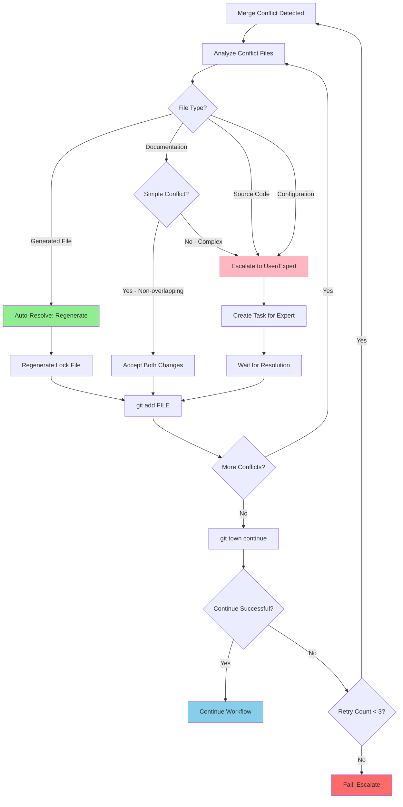
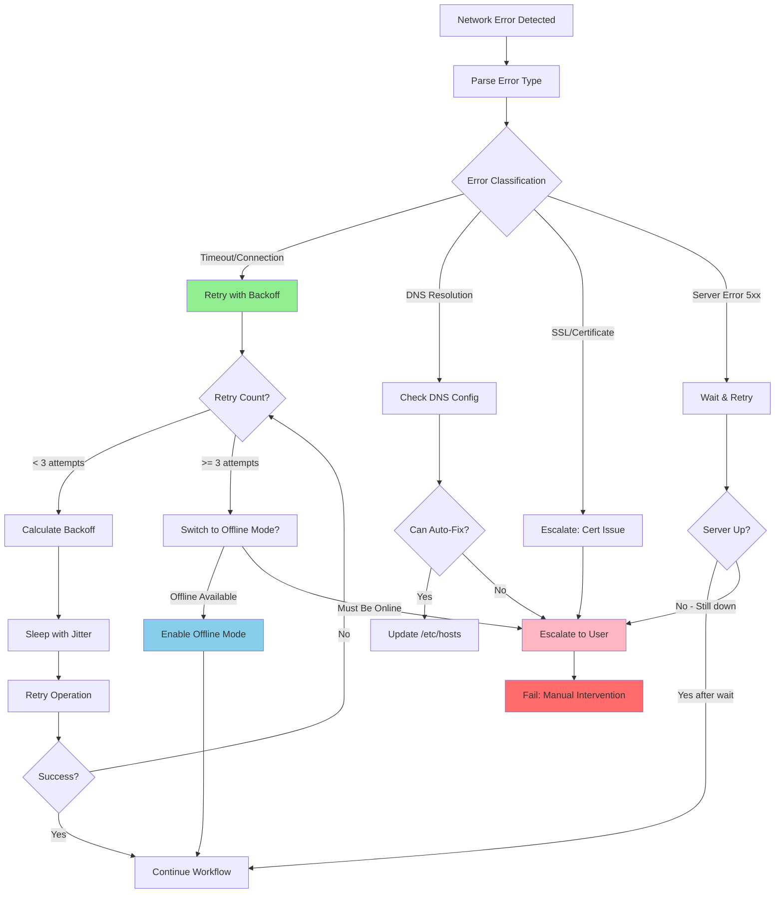
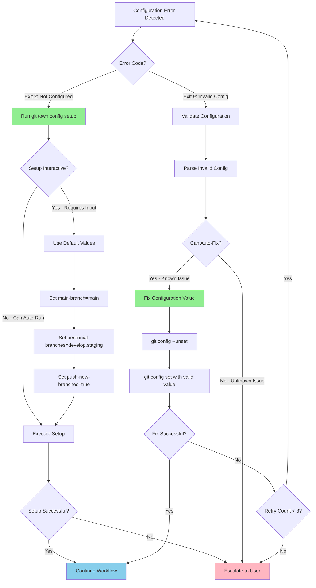
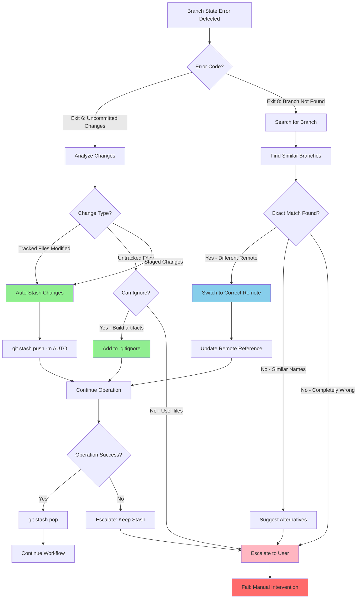
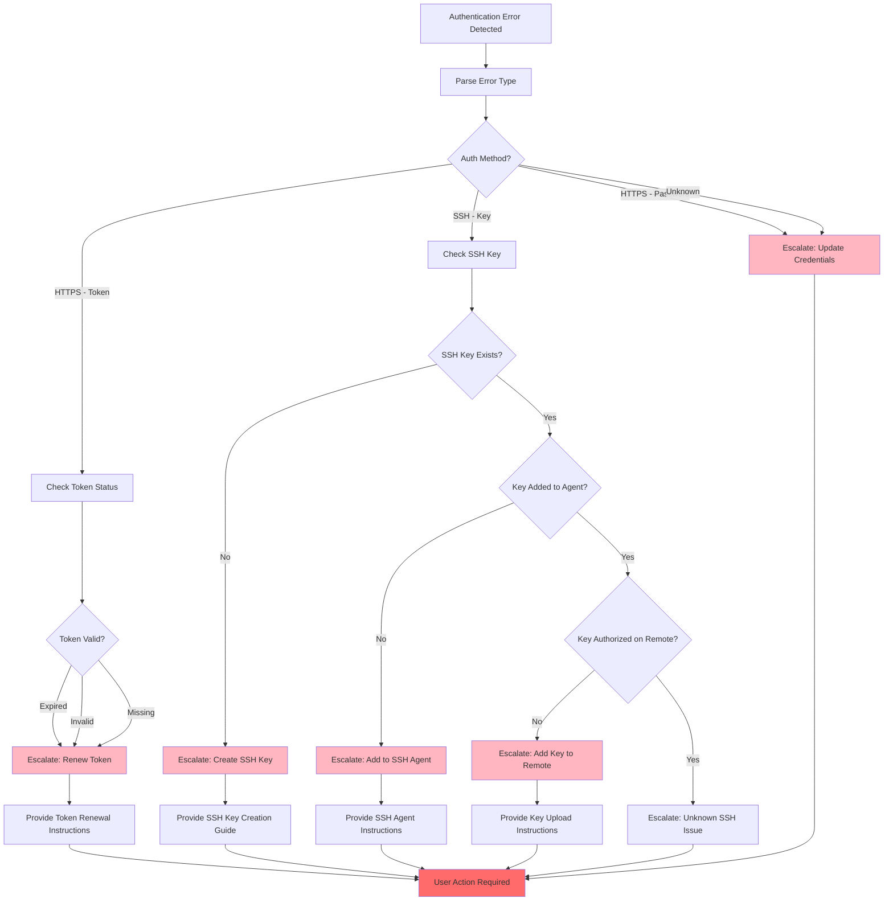
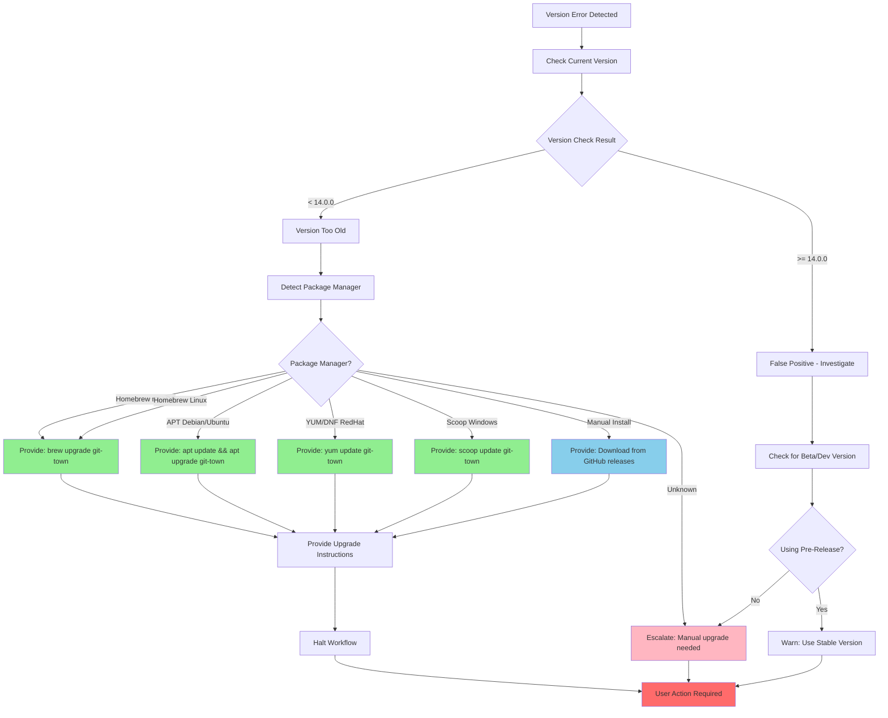

# Git-Town Error Handling Guide

> Comprehensive error handling strategies for AI agents working with git-town workflows

## Table of Contents

1. [Overview](#overview)
2. [Error Categories](#error-categories)
   - [Merge Conflicts](#1-merge-conflicts)
   - [Network Errors](#2-network-errors)
   - [Configuration Errors](#3-configuration-errors)
   - [Branch State Errors](#4-branch-state-errors)
   - [Authentication Errors](#5-authentication-errors)
   - [Version Errors](#6-version-errors)
3. [Error Recovery State Machine](#error-recovery-state-machine)
4. [Agent Decision Logic Matrix](#agent-decision-logic-matrix)
5. [Best Practices](#best-practices)

---

## Overview

Git-town operations can fail for various reasons, from simple configuration issues to complex merge conflicts. This guide provides comprehensive error handling strategies for AI agents to detect, diagnose, and resolve errors autonomously when safe, or escalate to users when human judgment is required.

**Error Handling Philosophy**:
- **Detect Early**: Validate environment before executing commands
- **Diagnose Accurately**: Parse exit codes and stderr for precise error identification
- **Resolve Autonomously**: Auto-fix safe, deterministic errors (stashing, retries)
- **Escalate Wisely**: Delegate complex decisions to users or specialized agents
- **Preserve State**: Never leave repository in broken state

---

## Error Categories

### 1. Merge Conflicts

**Exit Code**: `5` (`EXIT_MERGE_CONFLICT`)

**Description**: Occurs when git-town cannot automatically merge changes from parent branch or remote. This is the most complex error category requiring intelligent decision-making.

#### Detection

**Exit Code Pattern**:
```bash
git town sync
EXIT_CODE=$?
[ $EXIT_CODE -eq 5 ] && echo "Merge conflict detected"
```

**Stderr Pattern Matching**:
```bash
OUTPUT=$(git town sync 2>&1)
if echo "$OUTPUT" | grep -qE "CONFLICT|merge conflict|Merge conflict"; then
    echo "Merge conflict detected in output"
fi
```

**Git Status Indicators**:
```bash
# Check for unmerged files
CONFLICTS=$(git diff --name-only --diff-filter=U)
if [ -n "$CONFLICTS" ]; then
    echo "Conflicting files:"
    echo "$CONFLICTS"
fi
```

#### Resolution Workflow

**Step 1: Identify Conflict Type**

```bash
identify_conflict_type() {
    local conflict_file="$1"

    # Check if file is generated (auto-resolvable)
    if [[ "$conflict_file" =~ (package-lock\.json|yarn\.lock|Gemfile\.lock|poetry\.lock) ]]; then
        echo "GENERATED_FILE"
    # Check if file is documentation
    elif [[ "$conflict_file" =~ (\.md|\.txt|CHANGELOG) ]]; then
        echo "DOCUMENTATION"
    # Check if file is source code
    elif [[ "$conflict_file" =~ (\.ts|\.js|\.py|\.rb|\.go|\.java) ]]; then
        echo "SOURCE_CODE"
    # Check if file is configuration
    elif [[ "$conflict_file" =~ (\.json|\.yaml|\.yml|\.toml|\.xml) ]]; then
        echo "CONFIGURATION"
    else
        echo "UNKNOWN"
    fi
}
```

**Step 2: Auto-Resolve Safe Conflicts**

```bash
auto_resolve_conflict() {
    local conflict_file="$1"
    local conflict_type="$2"

    case "$conflict_type" in
        GENERATED_FILE)
            echo "Auto-resolving generated file: $conflict_file"

            # Regenerate lock file
            if [[ "$conflict_file" == "package-lock.json" ]]; then
                rm package-lock.json
                npm install
            elif [[ "$conflict_file" == "yarn.lock" ]]; then
                rm yarn.lock
                yarn install
            elif [[ "$conflict_file" == "Gemfile.lock" ]]; then
                rm Gemfile.lock
                bundle install
            fi

            git add "$conflict_file"
            return 0
            ;;

        DOCUMENTATION)
            echo "Documentation conflict: $conflict_file"
            echo "Strategy: Accept both changes if possible"

            # Check if conflict markers exist
            if grep -q "<<<<<<< HEAD" "$conflict_file"; then
                # Try automatic resolution for simple conflicts
                # This is a simplified example - real implementation would be more sophisticated
                echo "Manual review required for documentation conflicts"
                return 1
            fi
            ;;

        SOURCE_CODE|CONFIGURATION|UNKNOWN)
            echo "Complex conflict in $conflict_file ($conflict_type)"
            echo "Escalating to specialized agent"
            return 1
            ;;
    esac
}
```

**Step 3: Delegate Complex Conflicts**

```bash
resolve_merge_conflicts() {
    local conflicts=$(git diff --name-only --diff-filter=U)

    if [ -z "$conflicts" ]; then
        echo "No conflicts found"
        return 0
    fi

    echo "Analyzing conflicts..."
    local auto_resolved=0
    local needs_escalation=0

    while IFS= read -r conflict_file; do
        local conflict_type=$(identify_conflict_type "$conflict_file")

        if auto_resolve_conflict "$conflict_file" "$conflict_type"; then
            ((auto_resolved++))
        else
            ((needs_escalation++))
        fi
    done <<< "$conflicts"

    if [ $needs_escalation -gt 0 ]; then
        echo "Delegating $needs_escalation conflicts to deep-debugger..."

        # Get remaining conflicted files
        local remaining_conflicts=$(git diff --name-only --diff-filter=U)

        # Delegate to specialized agent
        Task(subagent_type="deep-debugger",
             prompt="Resolve merge conflicts in the following files: $remaining_conflicts

Context:
- Operation: git town sync
- Parent branch: $(git config git-town.main-branch)
- Current branch: $(git branch --show-current)
- Conflict files: $(echo $remaining_conflicts | tr '\n' ', ')

Please analyze each conflict and choose the appropriate resolution strategy.")

        return 1
    fi

    echo "All conflicts auto-resolved ($auto_resolved files)"
    return 0
}
```

#### Prevention Strategies

1. **Regular Syncing**:
   ```bash
   # Sync daily to minimize divergence
   git town sync

   # Before starting new work
   git town sync
   git town hack feature/new-feature
   ```

2. **Small, Focused PRs**:
   - Keep feature branches short-lived (< 3 days)
   - Limit changes to single concern
   - Merge frequently to main

3. **Communication**:
   - Coordinate on shared files
   - Use feature flags for large changes
   - Review parent branch changes before syncing

#### Agent Decision Logic

```
┌─────────────────────────────────┐
│   Merge Conflict Detected       │
└────────────┬────────────────────┘
             │
             ▼
     ┌───────────────┐
     │ Identify File │
     │     Type      │
     └───────┬───────┘
             │
      ┌──────┴──────┐
      │             │
      ▼             ▼
┌──────────┐  ┌──────────┐
│Generated │  │  Source  │
│  File    │  │   Code   │
└─────┬────┘  └─────┬────┘
      │             │
      ▼             ▼
 ┌─────────┐   ┌──────────┐
 │Regenerate│  │ Escalate │
 │   File   │  │ to User/ │
 │          │  │  Expert  │
 └────┬─────┘  └─────┬────┘
      │              │
      ▼              ▼
  ┌────────┐    ┌─────────┐
  │ git add│    │ Task()  │
  └────┬───┘    └────┬────┘
       │             │
       └──────┬──────┘
              ▼
      ┌──────────────┐
      │ git town     │
      │  continue    │
      └──────────────┘
```

#### Agent Decision Tree: Merge Conflicts



#### Decision Logic Table: Merge Conflicts

| Condition | Action | Auto-Resolve? | Retry? | Escalate? |
|-----------|--------|---------------|--------|-----------|
| Generated file (package-lock.json) | Regenerate file | Yes | No | No |
| Generated file (yarn.lock) | Regenerate file | Yes | No | No |
| Generated file (Gemfile.lock) | Regenerate file | Yes | No | No |
| Documentation - simple conflict | Accept both changes | Yes | No | No |
| Documentation - complex overlap | Escalate to user | No | No | Yes |
| Source code conflict | Escalate to expert | No | No | Yes |
| Configuration file conflict | Escalate to user | No | No | Yes |
| Unknown file type | Escalate to user | No | No | Yes |
| Resolution failed after auto-fix | Retry (max 3x) | No | Yes | If retries exhausted |

#### Example Error Handling Code

```bash
handle_merge_conflict() {
    local retry_count=0
    local max_retries=3

    while [ $retry_count -lt $max_retries ]; do
        # Get all conflicting files
        local conflicts=$(git diff --name-only --diff-filter=U)

        if [ -z "$conflicts" ]; then
            echo "No conflicts remaining"
            git town continue
            return 0
        fi

        # Process each conflict
        local auto_resolved=true
        for file in $conflicts; do
            local file_type=$(identify_conflict_type "$file")

            case "$file_type" in
                GENERATED_FILE)
                    echo "Auto-resolving generated file: $file"
                    auto_resolve_conflict "$file" "$file_type"
                    ;;
                DOCUMENTATION)
                    if is_simple_conflict "$file"; then
                        echo "Auto-resolving simple documentation conflict: $file"
                        auto_resolve_conflict "$file" "$file_type"
                    else
                        echo "Escalating complex documentation conflict: $file"
                        auto_resolved=false
                    fi
                    ;;
                SOURCE_CODE|CONFIGURATION|UNKNOWN)
                    echo "Escalating $file_type conflict: $file"
                    auto_resolved=false
                    ;;
            esac
        done

        if [ "$auto_resolved" = false ]; then
            echo "Manual intervention required for remaining conflicts"
            # Delegate to Task() with subagent
            return 1
        fi

        # Try to continue
        if git town continue; then
            echo "Merge conflicts resolved successfully"
            return 0
        else
            retry_count=$((retry_count + 1))
            echo "Retry $retry_count/$max_retries"
        fi
    done

    echo "Failed to resolve conflicts after $max_retries retries"
    return 1
}
```

---

### 2. Network Errors

**Exit Code**: `7` (`EXIT_REMOTE_ERROR`)

**Description**: Remote operations fail due to network connectivity, DNS resolution, or timeout issues. These are typically transient and should be retried.

#### Detection

**Exit Code Check**:
```bash
git town sync
EXIT_CODE=$?
[ $EXIT_CODE -eq 7 ] && echo "Remote error detected"
```

**Stderr Pattern Matching**:
```bash
OUTPUT=$(git town propose 2>&1)
if echo "$OUTPUT" | grep -qE "unable to access|Could not resolve host|Connection timed out|Network is unreachable"; then
    echo "Network error detected"
fi
```

**Specific Network Error Types**:
```bash
identify_network_error() {
    local output="$1"

    if echo "$output" | grep -q "Could not resolve host"; then
        echo "DNS_RESOLUTION_FAILURE"
    elif echo "$output" | grep -q "Connection timed out"; then
        echo "CONNECTION_TIMEOUT"
    elif echo "$output" | grep -q "Network is unreachable"; then
        echo "NETWORK_UNREACHABLE"
    elif echo "$output" | grep -q "SSL certificate problem"; then
        echo "SSL_ERROR"
    elif echo "$output" | grep -q "The requested URL returned error: 50"; then
        echo "SERVER_ERROR"
    else
        echo "UNKNOWN_NETWORK_ERROR"
    fi
}
```

#### Resolution: Exponential Backoff Retry

**Basic Retry Strategy**:
```bash
retry_with_backoff() {
    local command="$1"
    local max_attempts="${2:-3}"  # Default: 3 attempts
    local initial_wait="${3:-2}"  # Default: 2 seconds

    local attempt=1
    local wait_time=$initial_wait

    while [ $attempt -le $max_attempts ]; do
        echo "Attempt $attempt/$max_attempts: $command"

        # Execute command and capture output
        local output
        output=$(eval "$command" 2>&1)
        local exit_code=$?

        if [ $exit_code -eq 0 ]; then
            echo "✓ Success on attempt $attempt"
            echo "$output"
            return 0
        elif [ $exit_code -eq 7 ]; then
            local error_type=$(identify_network_error "$output")
            echo "⚠ Network error ($error_type) on attempt $attempt"

            if [ $attempt -lt $max_attempts ]; then
                echo "Retrying in ${wait_time}s..."
                sleep $wait_time
                wait_time=$((wait_time * 2))  # Exponential backoff
            else
                echo "✗ Failed after $max_attempts attempts"
                echo "Last error: $output"
                return 7
            fi
        else
            # Non-network error - don't retry
            echo "✗ Non-retriable error (exit code: $exit_code)"
            echo "$output"
            return $exit_code
        fi

        attempt=$((attempt + 1))
    done

    return 7
}
```

**Advanced Retry with Jitter**:
```bash
retry_with_jitter() {
    local command="$1"
    local max_attempts="${2:-3}"
    local base_wait="${3:-2}"
    local max_wait="${4:-30}"

    local attempt=1

    while [ $attempt -le $max_attempts ]; do
        echo "Attempt $attempt/$max_attempts: $command"

        local output
        output=$(eval "$command" 2>&1)
        local exit_code=$?

        if [ $exit_code -eq 0 ]; then
            return 0
        elif [ $exit_code -eq 7 ]; then
            if [ $attempt -lt $max_attempts ]; then
                # Calculate exponential backoff with jitter
                local exp_wait=$((base_wait * (2 ** (attempt - 1))))
                local jitter=$((RANDOM % 1000))  # Random 0-999ms
                local wait_time=$((exp_wait + jitter / 1000))

                # Cap at max_wait
                [ $wait_time -gt $max_wait ] && wait_time=$max_wait

                echo "Retrying in ${wait_time}s (with jitter)..."
                sleep $wait_time
            fi
        else
            return $exit_code
        fi

        attempt=$((attempt + 1))
    done

    return 7
}
```

**Usage Example**:
```bash
# Simple retry
retry_with_backoff "git town sync" 3 2

# Retry with jitter (better for high-load scenarios)
retry_with_jitter "git town propose" 5 2 60
```

#### Prevention Strategies

1. **Offline Mode for Unreliable Connections**:
   ```bash
   # Work offline, sync later
   git config git-town.offline true

   # When connection available
   git config git-town.offline false
   git town sync
   ```

2. **Pre-flight Network Check**:
   ```bash
   check_network_connectivity() {
       local remote_url=$(git config --get remote.origin.url)
       local host

       # Extract host from URL
       if [[ "$remote_url" =~ ^https?://([^/]+) ]]; then
           host="${BASH_REMATCH[1]}"
       elif [[ "$remote_url" =~ ^git@([^:]+): ]]; then
           host="${BASH_REMATCH[1]}"
       else
           echo "Cannot parse remote URL: $remote_url"
           return 1
       fi

       # Check connectivity
       if ping -c 1 -W 2 "$host" &>/dev/null; then
           echo "✓ Network connectivity to $host confirmed"
           return 0
       else
           echo "✗ Cannot reach $host"
           return 1
       fi
   }

   # Use before remote operations
   if check_network_connectivity; then
       git town sync
   else
       echo "Working offline - skipping sync"
   fi
   ```

3. **Configure Timeout Settings**:
   ```bash
   # Increase timeout for slow connections
   git config --global http.lowSpeedLimit 1000
   git config --global http.lowSpeedTime 60
   ```

#### Agent Decision Logic

**Decision Tree**:
```
Network Error (Exit 7)
│
├─ Attempt < 3?
│  ├─ Yes → Wait (exponential backoff) → Retry
│  └─ No → Continue to diagnosis
│
├─ Error Type?
│  ├─ DNS_RESOLUTION → Check /etc/hosts, DNS config → Escalate
│  ├─ CONNECTION_TIMEOUT → Check firewall, proxy → Retry with longer timeout
│  ├─ SSL_ERROR → Update certificates → Escalate
│  └─ SERVER_ERROR → Wait longer (server issue) → Escalate if persists
│
└─ Escalate to user with diagnostic info
```

#### Agent Decision Tree: Network Errors



#### Decision Logic Table: Network Errors

| Error Type | Auto-Resolve? | Retry Strategy | Max Retries | Escalate? |
|------------|---------------|----------------|-------------|-----------|
| Connection timeout | Yes | Exponential backoff (2s, 4s, 8s) | 3 | If exhausted |
| DNS resolution failure | Conditional | Check /etc/hosts, retry DNS | 2 | If can't auto-fix |
| SSL certificate error | No | None | 0 | Immediately |
| Server error (5xx) | Yes | Linear backoff (5s, 10s, 15s) | 3 | If persists |
| Network unreachable | Conditional | Check connectivity, switch offline | 1 | If no offline mode |
| Authentication timeout | No | None | 0 | Immediately |
| Proxy error | Conditional | Check proxy config | 2 | If can't auto-fix |
| Rate limiting (429) | Yes | Exponential backoff (60s, 120s) | 2 | If persists |

#### Example Error Handling Code

```bash
handle_network_error() {
    local command="$1"
    local error_output="$2"
    local retry_count=0
    local max_retries=3

    # Classify error type
    local error_type=$(classify_network_error "$error_output")

    case "$error_type" in
        TIMEOUT|CONNECTION_FAILED)
            echo "Network timeout/connection error - retrying with backoff"

            while [ $retry_count -lt $max_retries ]; do
                # Exponential backoff with jitter
                local wait_time=$((2 ** retry_count))
                local jitter=$(( RANDOM % 2 ))
                local total_wait=$((wait_time + jitter))

                echo "Waiting ${total_wait}s before retry $((retry_count + 1))/$max_retries"
                sleep $total_wait

                # Retry command
                if eval "$command"; then
                    echo "Retry successful"
                    return 0
                fi

                retry_count=$((retry_count + 1))
            done

            # Check if offline mode is available
            if supports_offline_mode; then
                echo "Switching to offline mode"
                enable_offline_mode
                return 0
            else
                echo "Network error persists, escalating to user"
                return 1
            fi
            ;;

        DNS_RESOLUTION)
            echo "DNS resolution error - checking configuration"

            # Try to auto-fix common DNS issues
            if can_fix_dns; then
                echo "Auto-fixing DNS configuration"
                fix_dns_config
                eval "$command"
                return $?
            else
                echo "Cannot auto-fix DNS, escalating to user"
                return 1
            fi
            ;;

        SSL_ERROR)
            echo "SSL/Certificate error - requires manual intervention"
            echo "Error details: $error_output"
            return 1
            ;;

        SERVER_ERROR)
            echo "Server error (5xx) - waiting for server recovery"

            local wait_times=(5 10 15)
            for wait in "${wait_times[@]}"; do
                echo "Waiting ${wait}s for server recovery"
                sleep $wait

                if eval "$command"; then
                    echo "Server recovered, operation successful"
                    return 0
                fi
            done

            echo "Server error persists, escalating to user"
            return 1
            ;;

        *)
            echo "Unknown network error: $error_type"
            return 1
            ;;
    esac
}

classify_network_error() {
    local error_output="$1"

    if echo "$error_output" | grep -qiE "timeout|timed out"; then
        echo "TIMEOUT"
    elif echo "$error_output" | grep -qiE "connection refused|could not connect"; then
        echo "CONNECTION_FAILED"
    elif echo "$error_output" | grep -qiE "could not resolve|dns|name resolution"; then
        echo "DNS_RESOLUTION"
    elif echo "$error_output" | grep -qiE "ssl|certificate|tls"; then
        echo "SSL_ERROR"
    elif echo "$error_output" | grep -qiE "500|502|503|504"; then
        echo "SERVER_ERROR"
    else
        echo "UNKNOWN"
    fi
}
```

---

### 3. Configuration Errors

**Exit Code**: `2` (`EXIT_NOT_CONFIGURED`) or `9` (`EXIT_INVALID_CONFIG`)

**Description**: Git-town is not configured or has invalid configuration values. These errors require running setup or fixing configuration values.

#### Detection

**Exit Code Check**:
```bash
git town hack feature/new
EXIT_CODE=$?

if [ $EXIT_CODE -eq 2 ]; then
    echo "Git-town not configured"
elif [ $EXIT_CODE -eq 9 ]; then
    echo "Invalid git-town configuration"
fi
```

**Stderr Pattern Matching**:
```bash
OUTPUT=$(git town sync 2>&1)
if echo "$OUTPUT" | grep -qE "not configured|run.*git town config|configuration is invalid"; then
    echo "Configuration error detected"
fi
```

**Validation Script**:
```bash
validate_git_town_config() {
    # Check if git-town is configured
    local main_branch=$(git config --get git-town.main-branch)
    if [ -z "$main_branch" ]; then
        echo "ERROR: Main branch not configured"
        return 2
    fi

    # Check if main branch exists
    if ! git rev-parse --verify "$main_branch" &>/dev/null; then
        echo "ERROR: Configured main branch '$main_branch' does not exist"
        return 9
    fi

    # Check if perennial branches exist
    local perennials=$(git config --get git-town.perennial-branches)
    if [ -n "$perennials" ]; then
        IFS=',' read -ra BRANCHES <<< "$perennials"
        for branch in "${BRANCHES[@]}"; do
            if ! git rev-parse --verify "$branch" &>/dev/null; then
                echo "WARNING: Perennial branch '$branch' does not exist"
            fi
        done
    fi

    echo "✓ Git-town configuration valid"
    return 0
}
```

#### Resolution Workflow

**Step 1: Run Interactive Setup**:
```bash
fix_configuration_error() {
    local exit_code="$1"

    if [ $exit_code -eq 2 ]; then
        echo "Running git-town configuration setup..."

        # Run interactive setup
        git town config setup

        # Verify configuration
        validate_git_town_config
        return $?

    elif [ $exit_code -eq 9 ]; then
        echo "Invalid configuration detected. Reviewing settings..."

        # Show current configuration
        echo "Current git-town configuration:"
        git config --get-regexp "^git-town\."

        # Reset and reconfigure
        echo "Reset configuration? (y/n)"
        # In agent context, auto-confirm if safe
        git town config setup
    fi
}
```

**Step 2: Automated Configuration**:
```bash
auto_configure_git_town() {
    echo "Auto-configuring git-town with sensible defaults..."

    # Detect main branch
    local main_branch="main"
    if git rev-parse --verify master &>/dev/null && ! git rev-parse --verify main &>/dev/null; then
        main_branch="master"
    fi

    # Set main branch
    git config git-town.main-branch "$main_branch"
    echo "✓ Set main branch: $main_branch"

    # Detect perennial branches
    local perennials=()
    for branch in develop staging production; do
        if git rev-parse --verify "$branch" &>/dev/null; then
            perennials+=("$branch")
        fi
    done

    if [ ${#perennials[@]} -gt 0 ]; then
        git config git-town.perennial-branches "$(IFS=,; echo "${perennials[*]}")"
        echo "✓ Set perennial branches: ${perennials[*]}"
    fi

    # Enable sync-upstream (keep main branch updated)
    git config git-town.sync-upstream true
    echo "✓ Enabled sync-upstream"

    # Set push verification (safer)
    git config git-town.ship-delete-tracking-branch true
    echo "✓ Enabled automatic tracking branch deletion"

    validate_git_town_config
}
```

#### Prevention Strategies

1. **Setup Validation in Project README**:
   ```markdown
   ## Development Setup

   1. Install git-town: `brew install git-town`
   2. Configure git-town: `git town config setup`
   3. Verify configuration: `./scripts/validate-git-town.sh`
   ```

2. **Pre-commit Hook**:
   ```bash
   #!/bin/bash
   # .git/hooks/pre-commit
   # Validate git-town configuration

   source ./scripts/validate-git-town.sh
   validate_git_town_config || exit 1
   ```

3. **CI/CD Validation**:
   ```yaml
   # .github/workflows/validate.yml
   - name: Validate git-town configuration
     run: ./scripts/validate-git-town.sh
   ```

#### Agent Decision Logic

**Always Auto-Fix**:
Configuration errors are deterministic and safe to auto-fix:

```bash
handle_config_error() {
    local exit_code="$1"

    case $exit_code in
        2)  # Not configured
            echo "Auto-configuring git-town..."
            auto_configure_git_town
            return 0
            ;;
        9)  # Invalid config
            echo "Fixing invalid configuration..."
            git town config setup
            validate_git_town_config
            return $?
            ;;
    esac
}
```

**Never Escalate** (unless auto-fix fails):
Only escalate if automated configuration fails after multiple attempts.

#### Agent Decision Tree: Configuration Errors



#### Decision Logic Table: Configuration Errors

| Error Type | Auto-Resolve? | Action | Escalate? |
|------------|---------------|--------|-----------|
| Not configured (Exit 2) | Yes | Run `git town config setup` with defaults | Only if setup fails |
| Missing main branch config | Yes | Set `main-branch = main` | No |
| Missing perennial branches | Yes | Set `perennial-branches = develop,staging` | No |
| Invalid main branch name | Yes | Detect default branch, set config | No |
| Invalid perennial branch | Conditional | Validate branch exists, remove if not | If validation fails |
| Invalid push-new-branches | Yes | Set to `true` (safe default) | No |
| Invalid sync-strategy | Yes | Set to `merge` (safe default) | No |
| Corrupted config file | No | None - requires manual intervention | Yes |
| Permission denied on config | No | None - requires manual intervention | Yes |

#### Example Error Handling Code

```bash
handle_configuration_error() {
    local exit_code="$1"
    local error_output="$2"
    local retry_count=0
    local max_retries=3

    case "$exit_code" in
        2)  # EXIT_NOT_CONFIGURED
            echo "Git-town not configured - running setup with defaults"

            # Use non-interactive setup with sensible defaults
            if setup_git_town_defaults; then
                echo "Configuration successful"
                return 0
            else
                echo "Auto-configuration failed, escalating to user"
                return 1
            fi
            ;;

        9)  # EXIT_INVALID_CONFIG
            echo "Invalid git-town configuration detected"

            while [ $retry_count -lt $max_retries ]; do
                # Parse and fix invalid configuration
                local config_key=$(parse_invalid_config "$error_output")

                if [ -n "$config_key" ]; then
                    echo "Attempting to fix configuration: $config_key"

                    if fix_config_value "$config_key"; then
                        echo "Configuration fixed successfully"
                        return 0
                    fi
                fi

                retry_count=$((retry_count + 1))
                echo "Retry $retry_count/$max_retries"
            done

            echo "Unable to auto-fix configuration after $max_retries retries"
            return 1
            ;;

        *)
            echo "Unknown configuration error: exit code $exit_code"
            return 1
            ;;
    esac
}

setup_git_town_defaults() {
    # Detect default branch (main or master)
    local default_branch=$(git symbolic-ref refs/remotes/origin/HEAD 2>/dev/null | sed 's@^refs/remotes/origin/@@')

    if [ -z "$default_branch" ]; then
        # Fallback to 'main' if detection fails
        default_branch="main"
    fi

    # Set main branch
    git config git-town.main-branch "$default_branch" || return 1

    # Set common perennial branches (if they exist)
    local perennial_branches=()
    for branch in develop staging production; do
        if git show-ref --verify --quiet "refs/heads/$branch"; then
            perennial_branches+=("$branch")
        fi
    done

    if [ ${#perennial_branches[@]} -gt 0 ]; then
        local perennial_list=$(IFS=,; echo "${perennial_branches[*]}")
        git config git-town.perennial-branches "$perennial_list" || return 1
    fi

    # Set safe defaults for other settings
    git config git-town.push-new-branches true || return 1
    git config git-town.sync-strategy merge || return 1

    echo "Git-town configured with defaults:"
    echo "  main-branch: $default_branch"
    echo "  perennial-branches: ${perennial_list:-none}"
    echo "  push-new-branches: true"
    echo "  sync-strategy: merge"

    return 0
}

parse_invalid_config() {
    local error_output="$1"

    # Extract configuration key from error message
    if echo "$error_output" | grep -qE "invalid.*main-branch"; then
        echo "main-branch"
    elif echo "$error_output" | grep -qE "invalid.*perennial"; then
        echo "perennial-branches"
    elif echo "$error_output" | grep -qE "invalid.*push-new"; then
        echo "push-new-branches"
    elif echo "$error_output" | grep -qE "invalid.*sync-strategy"; then
        echo "sync-strategy"
    else
        echo ""
    fi
}

fix_config_value() {
    local config_key="$1"

    case "$config_key" in
        main-branch)
            # Reset to detected default
            local default_branch=$(git symbolic-ref refs/remotes/origin/HEAD 2>/dev/null | sed 's@^refs/remotes/origin/@@')
            default_branch="${default_branch:-main}"

            git config --unset git-town.main-branch
            git config git-town.main-branch "$default_branch"
            ;;

        perennial-branches)
            # Remove invalid branches from list
            local current=$(git config git-town.perennial-branches)
            local valid_branches=()

            IFS=',' read -ra branches <<< "$current"
            for branch in "${branches[@]}"; do
                if git show-ref --verify --quiet "refs/heads/$branch"; then
                    valid_branches+=("$branch")
                fi
            done

            git config --unset git-town.perennial-branches
            if [ ${#valid_branches[@]} -gt 0 ]; then
                local valid_list=$(IFS=,; echo "${valid_branches[*]}")
                git config git-town.perennial-branches "$valid_list"
            fi
            ;;

        push-new-branches)
            git config --unset git-town.push-new-branches
            git config git-town.push-new-branches true
            ;;

        sync-strategy)
            git config --unset git-town.sync-strategy
            git config git-town.sync-strategy merge
            ;;

        *)
            return 1
            ;;
    esac

    return 0
}
```

---

### 4. Branch State Errors

**Exit Code**: `6` (`EXIT_UNCOMMITTED_CHANGES`) or `8` (`EXIT_BRANCH_NOT_FOUND`)

**Description**: Repository working tree has uncommitted changes, or specified branch does not exist. These require state cleanup before proceeding.

#### Detection

**Uncommitted Changes (Exit 6)**:
```bash
# Exit code detection
git town hack feature/new
[ $? -eq 6 ] && echo "Uncommitted changes detected"

# Git status detection
if [ -n "$(git status --porcelain)" ]; then
    echo "Working tree not clean"
fi

# Detailed status
check_working_tree_status() {
    local status=$(git status --porcelain)

    if [ -z "$status" ]; then
        echo "CLEAN"
        return 0
    fi

    # Categorize changes
    local staged=$(echo "$status" | grep '^[AMDRC]' | wc -l)
    local unstaged=$(echo "$status" | grep '^.[MD]' | wc -l)
    local untracked=$(echo "$status" | grep '^??' | wc -l)

    echo "DIRTY: staged=$staged, unstaged=$unstaged, untracked=$untracked"
    return 1
}
```

**Branch Not Found (Exit 8)**:
```bash
# Exit code detection
git town hack feature/existing
[ $? -eq 8 ] && echo "Branch already exists or not found"

# Branch existence check
branch_exists() {
    local branch="$1"
    git rev-parse --verify "$branch" &>/dev/null
}

if branch_exists "feature/new"; then
    echo "Branch exists"
fi
```

#### Resolution: Smart Stashing

**Auto-Stash Strategy** (Exit 6):
```bash
smart_stash() {
    local message="${1:-WIP: Auto-stash before git-town operation}"
    local status=$(git status --porcelain)

    if [ -z "$status" ]; then
        echo "Working tree clean, no stash needed"
        return 0
    fi

    # Check if there are staged changes
    local staged=$(echo "$status" | grep '^[AMDRC]')

    if [ -n "$staged" ]; then
        echo "Staged changes detected - creating commit instead of stash"
        git commit -m "chore: checkpoint before git-town operation"
        return 0
    fi

    # Stash unstaged and untracked changes
    echo "Stashing changes: $message"
    git stash push -u -m "$message"

    # Verify stash
    if [ $? -eq 0 ]; then
        echo "✓ Changes stashed successfully"
        return 0
    else
        echo "✗ Failed to stash changes"
        return 1
    fi
}

# Usage
smart_stash "WIP before hack"
git town hack feature/new-feature
# Optionally restore
git stash pop
```

**Branch Resolution** (Exit 8):
```bash
resolve_branch_error() {
    local branch_name="$1"
    local operation="$2"  # "hack", "switch", etc.

    # Check if branch exists locally
    if git rev-parse --verify "$branch_name" &>/dev/null; then
        echo "Branch '$branch_name' exists locally"

        if [ "$operation" == "hack" ]; then
            echo "Cannot create existing branch. Switching instead..."
            git checkout "$branch_name"
            return 0
        fi
    fi

    # Check if branch exists on remote
    if git ls-remote --heads origin "$branch_name" | grep -q "$branch_name"; then
        echo "Branch '$branch_name' exists on remote but not locally"
        echo "Fetching from remote..."
        git fetch origin "$branch_name:$branch_name"
        git checkout "$branch_name"
        return 0
    fi

    # Branch truly doesn't exist
    echo "Branch '$branch_name' not found locally or remotely"

    # Suggest similar branches
    echo "Did you mean one of these?"
    git branch -a | grep -i "$(echo $branch_name | sed 's/feature\///')" | head -5

    return 8
}
```

#### Prevention Strategies

1. **Clean Working Directory Before Operations**:
   ```bash
   pre_flight_check() {
       # Ensure clean state
       if [ -n "$(git status --porcelain)" ]; then
           echo "Working tree not clean. Please commit or stash changes."
           return 1
       fi

       # Ensure on valid branch
       local current_branch=$(git branch --show-current)
       if [ -z "$current_branch" ]; then
           echo "Detached HEAD state detected"
           return 1
       fi

       return 0
   }

   # Use before git-town operations
   pre_flight_check && git town hack feature/new
   ```

2. **Branch Naming Conventions**:
   ```bash
   # Validate branch names before creation
   validate_branch_name() {
       local branch="$1"

       # Check naming convention
       if [[ ! "$branch" =~ ^(feature|bugfix|hotfix|release)/[a-z0-9-]+$ ]]; then
           echo "Invalid branch name format"
           echo "Expected: feature/my-feature or bugfix/issue-123"
           return 1
       fi

       return 0
   }
   ```

#### Agent Decision Logic

**Auto-Stash Approval**:
```
Uncommitted Changes (Exit 6)
│
├─ Are changes staged?
│  ├─ Yes → Create checkpoint commit → Continue operation
│  └─ No → Continue to analysis
│
├─ Are changes auto-generated?
│  ├─ Yes (node_modules, dist, .log) → Stash → Continue
│  └─ No → Continue to analysis
│
├─ User approved auto-stash?
│  ├─ Yes (via agent settings) → Stash → Continue → Pop after
│  └─ No → Escalate to user
│
└─ Escalate: "Uncommitted changes detected. Commit, stash, or discard?"
```

**Branch Resolution**:
```
Branch Not Found (Exit 8)
│
├─ Operation type?
│  ├─ hack (create new) → Check if exists → Switch if yes
│  └─ other → Search remote → Fetch if found
│
├─ Branch exists remotely?
│  ├─ Yes → Fetch and checkout
│  └─ No → Continue to suggestions
│
├─ Find similar branches → Suggest to user
│
└─ Escalate: "Branch not found. Did you mean: [suggestions]?"
```

#### Agent Decision Tree: Branch State Errors



#### Decision Logic Table: Branch State Errors

| Error Type | Auto-Resolve? | Action | Escalate? |
|------------|---------------|--------|-----------|
| Uncommitted changes - tracked files | Yes | Auto-stash with message | No |
| Uncommitted changes - staged files | Yes | Auto-stash including staged | No |
| Untracked files - build artifacts | Yes | Add to .gitignore | No |
| Untracked files - user files | No | None - may be important | Yes |
| Branch not found - exists on remote | Yes | Fetch and checkout | No |
| Branch not found - similar names | Conditional | Suggest alternatives | Yes (with suggestions) |
| Branch not found - typo detected | Conditional | Suggest correct name | Yes (with suggestion) |
| Branch not found - no matches | No | None | Yes |
| Stash pop conflict after operation | No | None - keep stash | Yes |
| Cannot create stash (e.g., disk full) | No | None | Yes |

#### Example Error Handling Code

```bash
handle_branch_state_error() {
    local exit_code="$1"
    local error_output="$2"

    case "$exit_code" in
        6)  # EXIT_UNCOMMITTED_CHANGES
            echo "Uncommitted changes detected - auto-stashing"

            # Analyze working tree status
            local status=$(git status --porcelain)

            # Check for untracked files
            local untracked=$(echo "$status" | grep "^??" || true)

            if [ -n "$untracked" ]; then
                # Try to identify if untracked files are safe to ignore
                if are_build_artifacts "$untracked"; then
                    echo "Untracked files are build artifacts - adding to .gitignore"
                    add_to_gitignore "$untracked"
                else
                    echo "Untracked files detected - escalating to user"
                    echo "Untracked files:"
                    echo "$untracked"
                    return 1
                fi
            fi

            # Stash tracked and staged changes
            if git stash push -u -m "Auto-stash before git-town operation: $(date +%Y-%m-%d_%H:%M:%S)"; then
                echo "Changes stashed successfully"

                # Try the operation again
                # (caller should retry the original command)

                # Pop stash after operation
                # (caller should handle this in try-finally pattern)

                return 0
            else
                echo "Failed to stash changes"
                return 1
            fi
            ;;

        8)  # EXIT_BRANCH_NOT_FOUND
            echo "Branch not found - searching for alternatives"

            # Extract branch name from error
            local branch_name=$(echo "$error_output" | grep -oE "branch '[^']+'" | cut -d"'" -f2)

            if [ -z "$branch_name" ]; then
                echo "Could not determine branch name from error"
                return 1
            fi

            # Check if branch exists on remote
            if git ls-remote --heads origin "$branch_name" | grep -q "$branch_name"; then
                echo "Branch exists on remote - fetching"
                git fetch origin "$branch_name:$branch_name"
                return 0
            fi

            # Find similar branches
            local similar_branches=$(find_similar_branches "$branch_name")

            if [ -n "$similar_branches" ]; then
                echo "Branch not found. Did you mean one of these?"
                echo "$similar_branches"
                return 1
            else
                echo "Branch '$branch_name' not found and no similar branches exist"
                return 1
            fi
            ;;

        *)
            echo "Unknown branch state error: exit code $exit_code"
            return 1
            ;;
    esac
}

are_build_artifacts() {
    local untracked_files="$1"

    # Common patterns for build artifacts
    local build_patterns=(
        "node_modules/"
        "dist/"
        "build/"
        "target/"
        ".next/"
        ".cache/"
        "*.log"
        "*.tmp"
        ".DS_Store"
        "coverage/"
        ".nyc_output/"
    )

    # Check if all untracked files match build patterns
    while IFS= read -r file; do
        file=$(echo "$file" | sed 's/^?? //')
        local is_build_artifact=false

        for pattern in "${build_patterns[@]}"; do
            if [[ "$file" == $pattern ]] || [[ "$file" == *"/$pattern" ]]; then
                is_build_artifact=true
                break
            fi
        done

        if [ "$is_build_artifact" = false ]; then
            return 1
        fi
    done <<< "$untracked_files"

    return 0
}

add_to_gitignore() {
    local untracked_files="$1"

    while IFS= read -r file; do
        file=$(echo "$file" | sed 's/^?? //')

        # Extract pattern (directory or file extension)
        if [[ "$file" == */ ]]; then
            # Directory
            echo "$file" >> .gitignore
        else
            # File - add by extension
            local extension="${file##*.}"
            if [ "$extension" != "$file" ]; then
                echo "*.$extension" >> .gitignore
            fi
        fi
    done <<< "$untracked_files"

    # Deduplicate .gitignore
    sort -u .gitignore -o .gitignore
}

find_similar_branches() {
    local target_branch="$1"
    local threshold=3  # Levenshtein distance threshold

    # Get all branches
    local all_branches=$(git branch -a | sed 's/^[* ] //' | sed 's#remotes/origin/##')

    # Find branches within edit distance threshold
    local similar_branches=""

    while IFS= read -r branch; do
        local distance=$(levenshtein_distance "$target_branch" "$branch")

        if [ "$distance" -le "$threshold" ]; then
            similar_branches="$similar_branches\n  - $branch (distance: $distance)"
        fi
    done <<< "$all_branches"

    echo -e "$similar_branches" | sort -t: -k2 -n | head -5
}

levenshtein_distance() {
    # Simple Levenshtein distance calculation
    # (This is a simplified version - use a proper implementation in production)
    local s1="$1"
    local s2="$2"

    local len1=${#s1}
    local len2=${#s2}

    if [ "$len1" -eq 0 ]; then
        echo "$len2"
        return
    fi

    if [ "$len2" -eq 0 ]; then
        echo "$len1"
        return
    fi

    # For simplicity, use a heuristic based on common prefix/suffix
    local common_prefix=0
    for ((i=0; i<len1 && i<len2; i++)); do
        if [ "${s1:i:1}" = "${s2:i:1}" ]; then
            ((common_prefix++))
        else
            break
        fi
    done

    local remaining1=$((len1 - common_prefix))
    local remaining2=$((len2 - common_prefix))

    echo $((remaining1 + remaining2))
}
```

---

### 5. Authentication Errors

**Exit Code**: `7` (`EXIT_REMOTE_ERROR` with auth-related stderr)

**Description**: Remote operations fail due to authentication issues (invalid credentials, expired tokens, SSH key problems). These always require user intervention.

#### Detection

**Pattern Matching**:
```bash
detect_auth_error() {
    local output="$1"
    local exit_code="$2"

    if [ $exit_code -ne 7 ]; then
        return 1
    fi

    # Check for authentication-related patterns
    if echo "$output" | grep -qE "authentication failed|Authentication failed|fatal: could not read Username|fatal: could not read Password|Permission denied \(publickey\)|invalid credentials|token.*expired"; then
        echo "AUTH_ERROR_DETECTED"
        return 0
    fi

    return 1
}
```

**Specific Auth Error Types**:
```bash
identify_auth_error_type() {
    local output="$1"

    if echo "$output" | grep -q "could not read Username\|could not read Password"; then
        echo "CREDENTIALS_REQUIRED"
    elif echo "$output" | grep -q "Permission denied (publickey)"; then
        echo "SSH_KEY_ERROR"
    elif echo "$output" | grep -q "token.*expired\|Invalid token"; then
        echo "TOKEN_EXPIRED"
    elif echo "$output" | grep -q "Two-factor authentication"; then
        echo "2FA_REQUIRED"
    else
        echo "UNKNOWN_AUTH_ERROR"
    fi
}
```

#### Diagnostic Workflow

**Step 1: Identify Authentication Method**:
```bash
identify_auth_method() {
    local remote_url=$(git config --get remote.origin.url)

    if [[ "$remote_url" =~ ^https?:// ]]; then
        echo "HTTPS"
    elif [[ "$remote_url" =~ ^git@|^ssh:// ]]; then
        echo "SSH"
    else
        echo "UNKNOWN"
    fi
}
```

**Step 2: Run Diagnostics**:
```bash
diagnose_auth_error() {
    local auth_method=$(identify_auth_method)
    local remote_url=$(git config --get remote.origin.url)

    echo "Authentication Diagnostics"
    echo "=========================="
    echo "Remote URL: $remote_url"
    echo "Auth Method: $auth_method"
    echo ""

    case $auth_method in
        HTTPS)
            echo "HTTPS Authentication Check:"
            echo "1. Credential Helper:"
            git config --get credential.helper
            echo ""
            echo "2. GitHub CLI Status:"
            gh auth status 2>&1 || echo "  GitHub CLI not authenticated"
            echo ""
            echo "3. Token Storage:"
            if [ -f ~/.git-credentials ]; then
                echo "  Credentials file exists"
            else
                echo "  No credentials file found"
            fi
            ;;

        SSH)
            echo "SSH Authentication Check:"
            echo "1. SSH Agent:"
            ssh-add -l 2>&1 || echo "  No identities in SSH agent"
            echo ""
            echo "2. SSH Keys:"
            ls -la ~/.ssh/id_* 2>/dev/null || echo "  No SSH keys found"
            echo ""
            echo "3. SSH Connection Test:"
            if [[ "$remote_url" =~ github\.com ]]; then
                ssh -T git@github.com 2>&1
            elif [[ "$remote_url" =~ gitlab\.com ]]; then
                ssh -T git@gitlab.com 2>&1
            fi
            ;;
    esac
}
```

#### Resolution Guidance

**Always Escalate to User**:
```bash
handle_auth_error() {
    local output="$1"
    local auth_error_type=$(identify_auth_error_type "$output")
    local auth_method=$(identify_auth_method)

    echo "✗ Authentication Error Detected"
    echo "Type: $auth_error_type"
    echo "Method: $auth_method"
    echo ""

    # Run diagnostics
    diagnose_auth_error

    # Provide resolution steps
    echo ""
    echo "Resolution Steps:"
    echo "================="

    case $auth_error_type in
        CREDENTIALS_REQUIRED)
            if [ "$auth_method" == "HTTPS" ]; then
                echo "1. Authenticate with GitHub CLI:"
                echo "   gh auth login"
                echo ""
                echo "2. Or configure credential helper:"
                echo "   git config --global credential.helper store"
                echo "   (Next git operation will prompt for credentials)"
            fi
            ;;

        SSH_KEY_ERROR)
            echo "1. Check SSH key exists:"
            echo "   ls -la ~/.ssh/id_*"
            echo ""
            echo "2. Generate new SSH key if needed:"
            echo "   ssh-keygen -t ed25519 -C 'your_email@example.com'"
            echo ""
            echo "3. Add key to SSH agent:"
            echo "   eval \"\$(ssh-agent -s)\""
            echo "   ssh-add ~/.ssh/id_ed25519"
            echo ""
            echo "4. Add public key to GitHub:"
            echo "   cat ~/.ssh/id_ed25519.pub"
            echo "   (Copy and paste to https://github.com/settings/keys)"
            ;;

        TOKEN_EXPIRED)
            echo "1. Refresh GitHub token:"
            echo "   gh auth refresh"
            echo ""
            echo "2. Or re-authenticate:"
            echo "   gh auth login"
            ;;

        2FA_REQUIRED)
            echo "1. Use personal access token instead of password"
            echo "2. Generate token: https://github.com/settings/tokens"
            echo "3. Authenticate: gh auth login"
            ;;

        *)
            echo "1. Verify credentials: gh auth status"
            echo "2. Re-authenticate: gh auth login"
            echo "3. Check SSH keys: ssh -T git@github.com"
            ;;
    esac

    echo ""
    echo "After resolving authentication, retry the operation."

    # Always return error - never auto-fix auth issues
    return 7
}
```

#### Prevention Strategies

1. **Use Credential Helpers**:
   ```bash
   # macOS Keychain
   git config --global credential.helper osxkeychain

   # Linux
   git config --global credential.helper cache --timeout=3600

   # Windows
   git config --global credential.helper wincred
   ```

2. **SSH Key Best Practices**:
   ```bash
   # Generate secure SSH key
   ssh-keygen -t ed25519 -C "your_email@example.com"

   # Add to SSH agent
   eval "$(ssh-agent -s)"
   ssh-add ~/.ssh/id_ed25519

   # Test connection
   ssh -T git@github.com
   ```

3. **Token Management**:
   ```bash
   # Check current authentication
   gh auth status

   # Refresh token before expiration
   gh auth refresh

   # Use fine-grained tokens with limited scopes
   ```

#### Agent Decision Logic

**Never Auto-Fix**:
Authentication errors ALWAYS require user intervention:

```
Authentication Error Detected
│
├─ Run diagnostics (identify error type)
│
├─ Generate resolution instructions
│
├─ Escalate to user with:
│  ├─ Error type and auth method
│  ├─ Diagnostic results
│  └─ Step-by-step resolution guide
│
└─ Halt workflow (return 7)

NEVER:
- Attempt to modify credentials
- Prompt for passwords
- Generate tokens automatically
- Modify SSH configurations
```

#### Agent Decision Tree: Authentication Errors



#### Decision Logic Table: Authentication Errors

| Error Type | Auto-Resolve? | Action | Escalate? |
|------------|---------------|--------|-----------|
| HTTPS - expired token | No | Provide renewal instructions | Always |
| HTTPS - invalid token | No | Provide token creation guide | Always |
| HTTPS - missing credentials | No | Guide user to credential setup | Always |
| SSH - key not found | No | Provide SSH key creation guide | Always |
| SSH - key not in agent | No | Provide ssh-add instructions | Always |
| SSH - key not authorized on remote | No | Guide to add key to GitHub/GitLab | Always |
| SSH - wrong key permissions | No | Provide chmod 600 instructions | Always |
| Two-factor authentication required | No | Provide 2FA setup guide | Always |
| Account suspended/banned | No | Contact platform support | Always |
| IP blocked/rate limited | No | Wait and retry, or VPN guidance | Always |

#### Example Error Handling Code

```bash
handle_authentication_error() {
    local error_output="$1"

    echo "Authentication error detected - user intervention required"

    # Classify auth error type
    local auth_type=$(classify_auth_error "$error_output")

    case "$auth_type" in
        HTTPS_TOKEN_EXPIRED)
            echo ""
            echo "ERROR: Your authentication token has expired."
            echo ""
            echo "To fix this issue:"
            echo "1. Generate a new personal access token:"
            echo "   - GitHub: https://github.com/settings/tokens"
            echo "   - GitLab: https://gitlab.com/-/profile/personal_access_tokens"
            echo ""
            echo "2. Update your git credential helper:"
            echo "   git config credential.helper store"
            echo "   git push  # You'll be prompted for new token"
            echo ""
            return 1
            ;;

        HTTPS_TOKEN_INVALID)
            echo ""
            echo "ERROR: Your authentication token is invalid."
            echo ""
            echo "To fix this issue:"
            echo "1. Ensure your token has the correct scopes:"
            echo "   - repo (for private repositories)"
            echo "   - workflow (for GitHub Actions)"
            echo ""
            echo "2. Update your credentials:"
            echo "   git credential reject <<EOF"
            echo "   protocol=https"
            echo "   host=github.com"
            echo "   EOF"
            echo ""
            echo "3. Try the operation again (you'll be prompted for new token)"
            echo ""
            return 1
            ;;

        SSH_KEY_NOT_FOUND)
            echo ""
            echo "ERROR: SSH key not found."
            echo ""
            echo "To fix this issue:"
            echo "1. Generate a new SSH key:"
            echo "   ssh-keygen -t ed25519 -C \"your_email@example.com\""
            echo ""
            echo "2. Start the SSH agent:"
            echo "   eval \"\$(ssh-agent -s)\""
            echo ""
            echo "3. Add your key to the agent:"
            echo "   ssh-add ~/.ssh/id_ed25519"
            echo ""
            echo "4. Add the public key to your GitHub/GitLab account:"
            echo "   cat ~/.ssh/id_ed25519.pub"
            echo "   # Copy the output and add it in your account settings"
            echo ""
            return 1
            ;;

        SSH_KEY_NOT_IN_AGENT)
            echo ""
            echo "ERROR: SSH key exists but is not added to the SSH agent."
            echo ""
            echo "To fix this issue:"
            echo "1. Start the SSH agent (if not running):"
            echo "   eval \"\$(ssh-agent -s)\""
            echo ""
            echo "2. Add your SSH key:"
            echo "   ssh-add ~/.ssh/id_ed25519"
            echo ""
            echo "3. Verify the key is added:"
            echo "   ssh-add -l"
            echo ""
            return 1
            ;;

        SSH_KEY_NOT_AUTHORIZED)
            echo ""
            echo "ERROR: SSH key is not authorized on the remote server."
            echo ""
            echo "To fix this issue:"
            echo "1. Copy your public key:"
            echo "   cat ~/.ssh/id_ed25519.pub"
            echo ""
            echo "2. Add it to your remote platform:"
            echo "   - GitHub: https://github.com/settings/keys"
            echo "   - GitLab: https://gitlab.com/-/profile/keys"
            echo ""
            echo "3. Test the connection:"
            echo "   ssh -T git@github.com"
            echo ""
            return 1
            ;;

        SSH_PERMISSIONS_WRONG)
            echo ""
            echo "ERROR: SSH key has incorrect permissions."
            echo ""
            echo "To fix this issue:"
            echo "1. Fix the permissions:"
            echo "   chmod 700 ~/.ssh"
            echo "   chmod 600 ~/.ssh/id_ed25519"
            echo "   chmod 644 ~/.ssh/id_ed25519.pub"
            echo ""
            echo "2. Try the operation again"
            echo ""
            return 1
            ;;

        TWO_FACTOR_REQUIRED)
            echo ""
            echo "ERROR: Two-factor authentication is required."
            echo ""
            echo "To fix this issue:"
            echo "1. Use a personal access token instead of password"
            echo "2. Or use SSH keys instead of HTTPS"
            echo ""
            echo "See authentication setup guide for details."
            echo ""
            return 1
            ;;

        *)
            echo ""
            echo "ERROR: Unknown authentication error."
            echo ""
            echo "Error details:"
            echo "$error_output"
            echo ""
            echo "Please check:"
            echo "1. Your credentials are up to date"
            echo "2. Your account has access to this repository"
            echo "3. Two-factor authentication is configured correctly"
            echo ""
            return 1
            ;;
    esac
}

classify_auth_error() {
    local error_output="$1"

    if echo "$error_output" | grep -qiE "token.*expired|credentials.*expired"; then
        echo "HTTPS_TOKEN_EXPIRED"
    elif echo "$error_output" | grep -qiE "bad credentials|invalid.*token|authentication failed"; then
        echo "HTTPS_TOKEN_INVALID"
    elif echo "$error_output" | grep -qiE "permission denied.*publickey|no such identity"; then
        echo "SSH_KEY_NOT_FOUND"
    elif echo "$error_output" | grep -qiE "agent.*no identities"; then
        echo "SSH_KEY_NOT_IN_AGENT"
    elif echo "$error_output" | grep -qiE "permission denied \(publickey\)"; then
        echo "SSH_KEY_NOT_AUTHORIZED"
    elif echo "$error_output" | grep -qiE "permissions.*too open"; then
        echo "SSH_PERMISSIONS_WRONG"
    elif echo "$error_output" | grep -qiE "two-factor|2fa"; then
        echo "TWO_FACTOR_REQUIRED"
    else
        echo "UNKNOWN"
    fi
}
```

---

### 6. Version Errors

**Exit Code**: `3` (`EXIT_OLD_VERSION`)

**Description**: Installed git-town version is older than minimum required version (14.0.0). Requires upgrade.

#### Detection

**Exit Code Check**:
```bash
./validate-git-town.sh
EXIT_CODE=$?
[ $EXIT_CODE -eq 3 ] && echo "Git-town version too old"
```

**Version Comparison**:
```bash
check_git_town_version() {
    local required_version="14.0.0"

    # Get installed version
    local installed_version=$(git-town version 2>/dev/null | grep -oP '\d+\.\d+\.\d+' | head -1)

    if [ -z "$installed_version" ]; then
        echo "ERROR: Cannot determine git-town version"
        return 1
    fi

    echo "Installed: $installed_version"
    echo "Required: $required_version"

    # Compare versions
    if version_less_than "$installed_version" "$required_version"; then
        echo "ERROR: git-town version too old"
        echo "Please upgrade: brew upgrade git-town"
        return 3
    fi

    echo "✓ Version requirement met"
    return 0
}

version_less_than() {
    local version1="$1"
    local version2="$2"

    # Convert to comparable format
    local v1=$(echo "$version1" | awk -F. '{printf "%03d%03d%03d", $1, $2, $3}')
    local v2=$(echo "$version2" | awk -F. '{printf "%03d%03d%03d", $1, $2, $3}')

    [ "$v1" -lt "$v2" ]
}
```

#### Resolution: Upgrade Instructions

**Platform-Specific Upgrade**:
```bash
upgrade_git_town() {
    local platform=$(uname -s)

    echo "Upgrading git-town..."
    echo "Platform: $platform"
    echo ""

    case $platform in
        Darwin)
            echo "macOS detected. Using Homebrew..."
            if command -v brew &>/dev/null; then
                echo "Running: brew upgrade git-town"
                brew upgrade git-town
                return $?
            else
                echo "✗ Homebrew not installed"
                echo "Install from: https://www.git-town.com/install"
                return 1
            fi
            ;;

        Linux)
            echo "Linux detected"
            if command -v apt-get &>/dev/null; then
                echo "Debian/Ubuntu system detected"
                echo "Please upgrade using package manager or download from:"
                echo "https://github.com/git-town/git-town/releases"
            elif command -v yum &>/dev/null; then
                echo "RedHat/CentOS system detected"
                echo "Please upgrade using package manager or download from:"
                echo "https://github.com/git-town/git-town/releases"
            else
                echo "Download latest release from:"
                echo "https://github.com/git-town/git-town/releases"
            fi
            echo ""
            echo "For manual installation:"
            echo "curl -L https://github.com/git-town/git-town/releases/download/vX.Y.Z/git-town_X.Y.Z_linux_amd64.tar.gz | tar -xz"
            return 1
            ;;

        MINGW*|MSYS*|CYGWIN*)
            echo "Windows detected"
            if command -v scoop &>/dev/null; then
                echo "Running: scoop update git-town"
                scoop update git-town
                return $?
            else
                echo "✗ Scoop not installed"
                echo "Install from: https://www.git-town.com/install"
                return 1
            fi
            ;;

        *)
            echo "Unknown platform: $platform"
            echo "Please visit: https://www.git-town.com/install"
            return 1
            ;;
    esac
}
```

#### Prevention Strategies

1. **Document Minimum Version in README**:
   ```markdown
   ## Prerequisites

   - Git 2.30+
   - Git-Town 14.0.0+ ([installation guide](https://www.git-town.com/install))
   ```

2. **CI/CD Version Check**:
   ```yaml
   # .github/workflows/validate.yml
   - name: Check git-town version
     run: |
       ./scripts/validate-git-town.sh
       if [ $? -eq 3 ]; then
         echo "Git-town version too old"
         exit 3
       fi
   ```

3. **Development Environment Setup Script**:
   ```bash
   # scripts/setup-dev-env.sh
   echo "Setting up development environment..."

   # Check git-town version
   if ! ./scripts/validate-git-town.sh; then
       echo "Upgrading git-town..."
       upgrade_git_town
   fi
   ```

#### Agent Decision Logic

**Escalate with Upgrade Instructions**:
```
Version Error (Exit 3)
│
├─ Detect platform (macOS, Linux, Windows)
│
├─ Generate platform-specific upgrade command
│
├─ Escalate to user with:
│  ├─ Current version
│  ├─ Required version
│  └─ Upgrade command for their platform
│
└─ Halt workflow (return 3)

Example escalation:
"Git-town version 13.5.0 is too old (required: 14.0.0+)

To upgrade on macOS:
  brew upgrade git-town

After upgrading, retry the operation."
```

#### Agent Decision Tree: Version Errors



#### Decision Logic Table: Version Errors

| Condition | Auto-Resolve? | Action | Escalate? |
|-----------|---------------|--------|-----------|
| Version < 14.0.0 on Homebrew | No | Provide `brew upgrade` instructions | Always |
| Version < 14.0.0 on APT | No | Provide `apt upgrade` instructions | Always |
| Version < 14.0.0 on YUM/DNF | No | Provide `yum update` instructions | Always |
| Version < 14.0.0 on Scoop | No | Provide `scoop update` instructions | Always |
| Version < 14.0.0 manual install | No | Provide GitHub download link | Always |
| Version >= 14.0.0 but error | No | Investigate version detection bug | Always |
| Using pre-release/beta version | No | Recommend stable version | Always |
| Unknown package manager | No | Manual upgrade guidance | Always |
| Cannot detect version | No | Reinstall instructions | Always |

#### Example Error Handling Code

```bash
handle_version_error() {
    local error_output="$1"

    echo "Git-town version error detected"

    # Check current version
    local current_version=$(git town version 2>/dev/null | grep -oE '[0-9]+\.[0-9]+\.[0-9]+' || echo "unknown")
    local required_version="14.0.0"

    echo "Current version: $current_version"
    echo "Required version: >= $required_version"

    # Detect package manager
    local package_manager=$(detect_package_manager)

    echo ""
    echo "ERROR: Git-town version is too old and must be upgraded."
    echo ""
    echo "Detected package manager: $package_manager"
    echo ""

    case "$package_manager" in
        homebrew)
            echo "To upgrade git-town:"
            echo "  brew update"
            echo "  brew upgrade git-town"
            echo ""
            echo "Verify installation:"
            echo "  git town version"
            echo ""
            echo "Expected version: >= $required_version"
            ;;

        apt)
            echo "To upgrade git-town:"
            echo "  sudo apt update"
            echo "  sudo apt upgrade git-town"
            echo ""
            echo "If git-town is not in your repositories, install from GitHub:"
            echo "  VERSION=\$(curl -s https://api.github.com/repos/git-town/git-town/releases/latest | grep tag_name | cut -d'\"' -f4)"
            echo "  wget https://github.com/git-town/git-town/releases/download/\$VERSION/git-town_linux_amd64.deb"
            echo "  sudo dpkg -i git-town_linux_amd64.deb"
            ;;

        yum|dnf)
            echo "To upgrade git-town:"
            echo "  sudo $package_manager update git-town"
            echo ""
            echo "If git-town is not in your repositories, install from GitHub:"
            echo "  VERSION=\$(curl -s https://api.github.com/repos/git-town/git-town/releases/latest | grep tag_name | cut -d'\"' -f4)"
            echo "  wget https://github.com/git-town/git-town/releases/download/\$VERSION/git-town_linux_amd64.rpm"
            echo "  sudo rpm -i git-town_linux_amd64.rpm"
            ;;

        scoop)
            echo "To upgrade git-town:"
            echo "  scoop update"
            echo "  scoop update git-town"
            echo ""
            echo "Verify installation:"
            echo "  git town version"
            ;;

        manual)
            echo "Git-town appears to be manually installed."
            echo ""
            echo "To upgrade:"
            echo "1. Visit: https://github.com/git-town/git-town/releases/latest"
            echo "2. Download the appropriate binary for your system"
            echo "3. Replace the existing git-town binary"
            echo ""
            echo "For macOS/Linux:"
            echo "  VERSION=\$(curl -s https://api.github.com/repos/git-town/git-town/releases/latest | grep tag_name | cut -d'\"' -f4)"
            echo "  # Download appropriate binary for your OS"
            echo "  # macOS: git-town_darwin_amd64 or git-town_darwin_arm64"
            echo "  # Linux: git-town_linux_amd64"
            echo ""
            echo "  sudo mv /path/to/downloaded/git-town /usr/local/bin/git-town"
            echo "  sudo chmod +x /usr/local/bin/git-town"
            ;;

        *)
            echo "Could not detect package manager."
            echo ""
            echo "Manual upgrade instructions:"
            echo "1. Determine your current installation method"
            echo "2. Visit: https://www.git-town.com/install.html"
            echo "3. Follow the upgrade instructions for your platform"
            echo ""
            echo "Or install from GitHub releases:"
            echo "  https://github.com/git-town/git-town/releases/latest"
            ;;
    esac

    echo ""
    echo "After upgrading, verify the version:"
    echo "  git town version"
    echo ""
    echo "Then retry the operation."
    echo ""

    return 1
}

detect_package_manager() {
    # Detect package manager based on system
    if command -v brew >/dev/null 2>&1; then
        # Check if git-town was installed via brew
        if brew list git-town >/dev/null 2>&1; then
            echo "homebrew"
            return
        fi
    fi

    if command -v apt-get >/dev/null 2>&1; then
        echo "apt"
        return
    fi

    if command -v dnf >/dev/null 2>&1; then
        echo "dnf"
        return
    fi

    if command -v yum >/dev/null 2>&1; then
        echo "yum"
        return
    fi

    if command -v scoop >/dev/null 2>&1; then
        echo "scoop"
        return
    fi

    # Default to manual if no package manager detected
    echo "manual"
}

check_version_compatibility() {
    local current_version="$1"
    local required_version="$2"

    # Simple version comparison (major.minor.patch)
    local current_major=$(echo "$current_version" | cut -d. -f1)
    local current_minor=$(echo "$current_version" | cut -d. -f2)
    local current_patch=$(echo "$current_version" | cut -d. -f3)

    local required_major=$(echo "$required_version" | cut -d. -f1)
    local required_minor=$(echo "$required_version" | cut -d. -f2)
    local required_patch=$(echo "$required_version" | cut -d. -f3)

    if [ "$current_major" -lt "$required_major" ]; then
        return 1
    elif [ "$current_major" -eq "$required_major" ]; then
        if [ "$current_minor" -lt "$required_minor" ]; then
            return 1
        elif [ "$current_minor" -eq "$required_minor" ]; then
            if [ "$current_patch" -lt "$required_patch" ]; then
                return 1
            fi
        fi
    fi

    return 0
}
```

---

## Error Recovery State Machine

The following state machine defines the error recovery workflow for git-town operations. Agents should follow this state machine to ensure consistent, reliable error handling.


### State Descriptions

| State | Description | Timeout | Actions |
|-------|-------------|---------|---------|
| **ValidateEnvironment** | Run pre-flight checks before command execution | 10s | Check git-town installation, version, configuration, git repo |
| **ExecuteCommand** | Execute git-town command and capture exit code | 120s | Run command, capture stdout/stderr, parse exit code |
| **Success** | Command completed successfully | - | Log success, continue workflow, report to user |
| **HandleMergeConflict** | Process merge conflict errors | - | Identify conflict type, choose resolution strategy |
| **IdentifyConflictType** | Analyze conflicting files | 5s | Parse file types, check if auto-resolvable |
| **AutoResolve** | Automatically resolve generated file conflicts | 30s | Regenerate lock files, accept both for docs |
| **DelegateToExpert** | Send complex conflicts to specialized agent | - | Create Task for deep-debugger |
| **WaitForResolution** | Wait for conflict resolution | 300s | Monitor git status, check for resolution completion |
| **ContinueOperation** | Resume interrupted git-town operation | 60s | Run `git town continue` |
| **AbortOperation** | Cancel interrupted git-town operation | 10s | Run `git town abort`, cleanup state |
| **HandleUncommitted** | Process uncommitted changes error | - | Check change type, decide on action |
| **CheckChangeType** | Analyze uncommitted changes | 5s | Check staged vs unstaged, identify file types |
| **CreateCommit** | Commit staged changes | 10s | Run `git commit -m "checkpoint"` |
| **AutoStash** | Stash unstaged changes | 10s | Run `git stash push -u -m "auto-stash"` |
| **HandleNetworkError** | Process remote operation failures | - | Identify network error type, retry strategy |
| **RetryWithBackoff** | Retry command with exponential backoff | 60s | Wait (2^attempt seconds), retry command |
| **DiagnoseNetwork** | Analyze network connectivity | 30s | Check DNS, ping host, test SSH/HTTPS |
| **HandleBranchError** | Process branch not found errors | - | Search for branch locally and remotely |
| **CheckBranchExists** | Look for branch in all locations | 10s | Check local, remote, suggest alternatives |
| **SwitchToBranch** | Switch to existing local branch | 5s | Run `git checkout <branch>` |
| **FetchBranch** | Fetch branch from remote | 30s | Run `git fetch origin <branch>:<branch>` |
| **SuggestAlternatives** | Find similar branch names | 5s | Use fuzzy matching to suggest branches |
| **HandleConfigError** | Process configuration errors | - | Determine if auto-fixable |
| **AutoConfigure** | Automatically configure git-town | 30s | Detect main branch, set perennials, enable features |
| **ValidateConfig** | Verify configuration validity | 5s | Check required settings, verify branches exist |
| **InstallGitTown** | Guide user to install git-town | - | Provide platform-specific instructions |
| **UpgradeGitTown** | Guide user to upgrade git-town | - | Provide platform-specific upgrade commands |
| **ConfigureGitTown** | Run git-town setup | 60s | Execute `git town config setup` |
| **NavigateToRepo** | Guide user to git repository | - | Show current directory, expected repo path |
| **HandleUserAbort** | Process user-initiated abort | - | Acknowledge abort, preserve state |
| **EscalateToUser** | Request user intervention | - | Provide context, diagnostic info, resolution steps |
| **WaitForUserAction** | Pause until user resolves issue | ∞ | Monitor for manual fixes, poll for completion |
| **RetryCommand** | Re-execute original command | 120s | Run original git-town command again |
| **CleanupState** | Ensure repository in clean state | 10s | Verify no interrupted operations, clear locks |

### Transition Conditions

| From State | To State | Condition | Notes |
|------------|----------|-----------|-------|
| ExecuteCommand | Success | exit_code == 0 | Normal success path |
| ExecuteCommand | HandleMergeConflict | exit_code == 5 | Merge conflict detected |
| ExecuteCommand | HandleUncommitted | exit_code == 6 | Uncommitted changes present |
| ExecuteCommand | HandleNetworkError | exit_code == 7 | Remote operation failed |
| ExecuteCommand | HandleBranchError | exit_code == 8 | Branch not found |
| ExecuteCommand | HandleConfigError | exit_code == 9 | Invalid configuration |
| ExecuteCommand | HandleUserAbort | exit_code == 10 | User aborted operation |
| RetryWithBackoff | ExecuteCommand | retry_count < 3 | Still have retry attempts |
| RetryWithBackoff | DiagnoseNetwork | retry_count >= 3 | Max retries exhausted |
| WaitForResolution | ContinueOperation | git diff --diff-filter=U is empty | All conflicts resolved |
| WaitForResolution | AbortOperation | timeout exceeded | 5 minute timeout |
| ValidateConfig | RetryCommand | all config checks pass | Configuration fixed |
| ValidateConfig | EscalateToUser | config checks fail | Cannot auto-fix |

### Timeout Handling

When a state exceeds its timeout:

1. **Log timeout event** with state name and duration
2. **Attempt graceful cleanup** (e.g., `git town abort` if in operation)
3. **Escalate to user** with timeout context
4. **Transition to CleanupState**

Example:
```bash
handle_timeout() {
    local state="$1"
    local timeout="$2"

    echo "✗ Timeout in state '$state' after ${timeout}s"

    # Attempt cleanup
    if git town status | grep -q "in progress"; then
        echo "Aborting interrupted git-town operation..."
        git town abort
    fi

    # Escalate
    echo "Operation timed out. Manual intervention required."
    echo "Current state: $state"
    echo "Repository status:"
    git status

    return 1
}
```

---

## Agent Decision Logic Matrix

This matrix defines when agents should autonomously resolve errors vs. escalate to users or specialized agents.

| Error Category | Exit Code | Auto-Resolve? | Delegate To | Escalate? | Conditions |
|----------------|-----------|---------------|-------------|-----------|------------|
| **Merge Conflicts** | 5 | Partial | deep-debugger | Sometimes | Auto-resolve: Generated files (lock files, build artifacts)<br>Delegate: Source code conflicts<br>Escalate: Cannot determine safe resolution |
| **Network Errors** | 7 (network) | Yes | - | If persists | Auto-resolve: Retry with exponential backoff (max 3 attempts)<br>Escalate: Auth errors, max retries exceeded |
| **Configuration Errors** | 2, 9 | Yes | - | If auto-fix fails | Auto-resolve: Run `git town config setup`, detect sensible defaults<br>Escalate: Auto-configuration fails |
| **Uncommitted Changes** | 6 | Conditional | - | Sometimes | Auto-resolve: Stash if user approved, commit if staged<br>Escalate: User did not approve auto-stash |
| **Branch Not Found** | 8 | Conditional | - | Sometimes | Auto-resolve: Fetch from remote, switch to existing<br>Escalate: Branch truly doesn't exist |
| **Authentication Errors** | 7 (auth) | No | - | Always | Escalate: Always - never auto-fix credentials |
| **Version Errors** | 3 | No | - | Always | Escalate: With platform-specific upgrade instructions |
| **Not Installed** | 1 | No | - | Always | Escalate: With platform-specific installation instructions |
| **Not Git Repo** | 4 | No | - | Always | Escalate: Guide to correct directory |
| **User Abort** | 10 | No | - | Acknowledge | Acknowledge abort, preserve state, halt workflow |

### Decision Tree for Auto-Resolution

```
Error Detected
│
├─ Is error deterministic? (same input → same output)
│  ├─ Yes → Continue
│  └─ No → Escalate (e.g., intermittent network issues)
│
├─ Is resolution safe and reversible?
│  ├─ Yes → Continue
│  └─ No → Escalate (e.g., data loss risk)
│
├─ Does user approve this action?
│  ├─ Yes (via settings/flags) → Continue
│  └─ No → Escalate
│
├─ Has auto-resolution succeeded before?
│  ├─ Yes → Auto-resolve
│  └─ No → Escalate (first occurrence)
│
└─ Success → Log action, continue workflow
   Failure → Escalate with diagnostic info
```

### Escalation Message Template

When escalating to user:

```
✗ [Error Category]: [Brief Description]

Details:
- Command: git town [command]
- Exit Code: [code]
- Error Type: [specific error]

Diagnostics:
[Relevant diagnostic output]

Resolution:
[Step-by-step resolution instructions]

After resolving, you can:
- Retry: [exact command to retry]
- Continue: git town continue
- Abort: git town abort
```

Example:
```
✗ Authentication Error: GitHub credentials invalid

Details:
- Command: git town propose
- Exit Code: 7
- Error Type: HTTPS authentication failed

Diagnostics:
- Remote URL: https://github.com/user/repo.git
- Auth Method: HTTPS
- GitHub CLI: Not authenticated

Resolution:
1. Authenticate with GitHub CLI:
   gh auth login

2. Or configure credential helper:
   git config --global credential.helper store

After resolving, you can:
- Retry: git town propose
```

---

## Best Practices

### 1. Always Validate Before Executing

```bash
safe_git_town_command() {
    local command="$1"

    # Step 1: Validate environment
    ./scripts/validate-git-town.sh
    local validation_code=$?

    if [ $validation_code -ne 0 ]; then
        echo "✗ Validation failed (exit $validation_code)"
        return $validation_code
    fi

    # Step 2: Execute command
    eval "$command"
    local exec_code=$?

    # Step 3: Handle errors
    if [ $exec_code -ne 0 ]; then
        handle_git_town_error "$command" $exec_code
    fi

    return $exec_code
}
```

### 2. Log All Operations

```bash
log_git_town_operation() {
    local command="$1"
    local exit_code="$2"
    local output="$3"

    local timestamp=$(date -u +"%Y-%m-%dT%H:%M:%SZ")
    local log_entry="$timestamp | $command | exit=$exit_code"

    echo "$log_entry" >> .git-town-operations.log

    if [ $exit_code -ne 0 ]; then
        echo "$output" >> .git-town-errors.log
    fi
}
```

### 3. Implement Circuit Breaker Pattern

```bash
execute_with_circuit_breaker() {
    local command="$1"
    local failure_threshold=5
    local timeout_seconds=60

    # Check circuit state
    local failure_count=$(get_failure_count)

    if [ $failure_count -ge $failure_threshold ]; then
        local last_failure=$(get_last_failure_time)
        local time_since_failure=$(($(date +%s) - last_failure))

        if [ $time_since_failure -lt $timeout_seconds ]; then
            echo "✗ Circuit breaker OPEN (${failure_count} consecutive failures)"
            echo "Wait $((timeout_seconds - time_since_failure))s before retry"
            return 1
        else
            echo "Circuit breaker HALF-OPEN (attempting recovery)"
            reset_failure_count
        fi
    fi

    # Execute command
    eval "$command"
    local exit_code=$?

    if [ $exit_code -ne 0 ]; then
        increment_failure_count
    else
        reset_failure_count
    fi

    return $exit_code
}
```

### 4. Provide Detailed Error Context

```bash
report_error_with_context() {
    local command="$1"
    local exit_code="$2"
    local output="$3"

    echo "Error Report"
    echo "============"
    echo ""
    echo "Command: $command"
    echo "Exit Code: $exit_code"
    echo ""
    echo "Environment:"
    echo "- Git-town version: $(git-town version)"
    echo "- Git version: $(git --version)"
    echo "- Current branch: $(git branch --show-current)"
    echo "- Main branch: $(git config git-town.main-branch)"
    echo ""
    echo "Repository State:"
    git status --short
    echo ""
    echo "Output:"
    echo "$output"
}
```

### 5. Test Error Handling

```bash
# test-error-handling.sh
test_merge_conflict_handling() {
    # Setup: Create conflict scenario
    git checkout -b test-conflict-branch
    echo "version A" > conflict.txt
    git add conflict.txt
    git commit -m "Version A"

    git checkout main
    echo "version B" > conflict.txt
    git add conflict.txt
    git commit -m "Version B"

    # Test: Attempt sync (should trigger conflict)
    git checkout test-conflict-branch
    git town sync
    local exit_code=$?

    # Verify: Check exit code and conflict detection
    assert_equals $exit_code 5 "Expected merge conflict exit code"
    assert_file_contains conflict.txt "<<<<<<< HEAD" "Expected conflict markers"

    # Cleanup
    git town abort
    git checkout main
    git branch -D test-conflict-branch
}
```

---

*Last updated: 2025-12-30*
*Version: 1.0.0*
