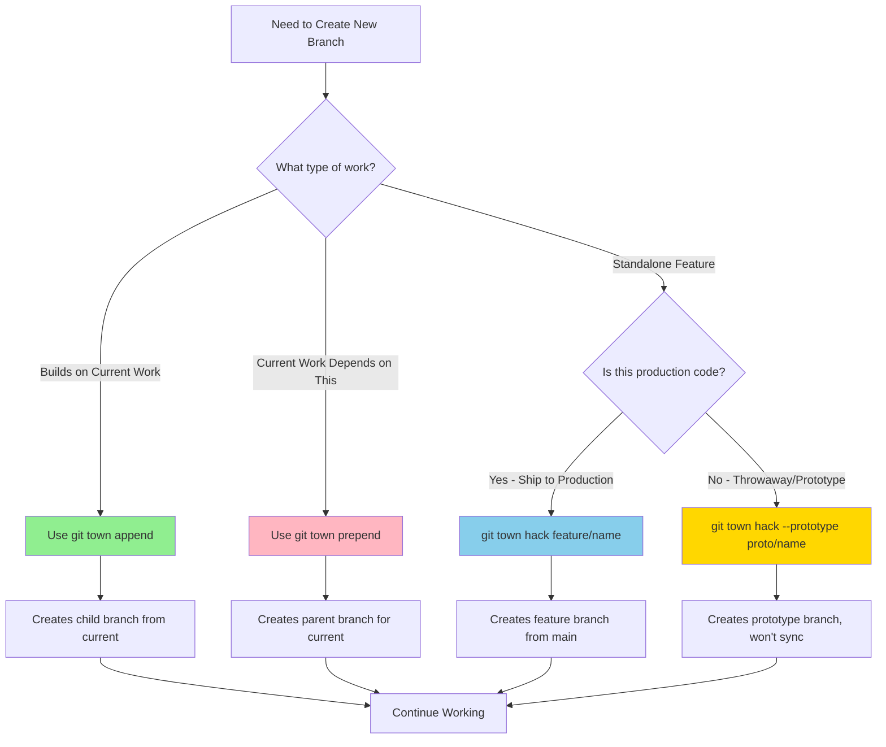
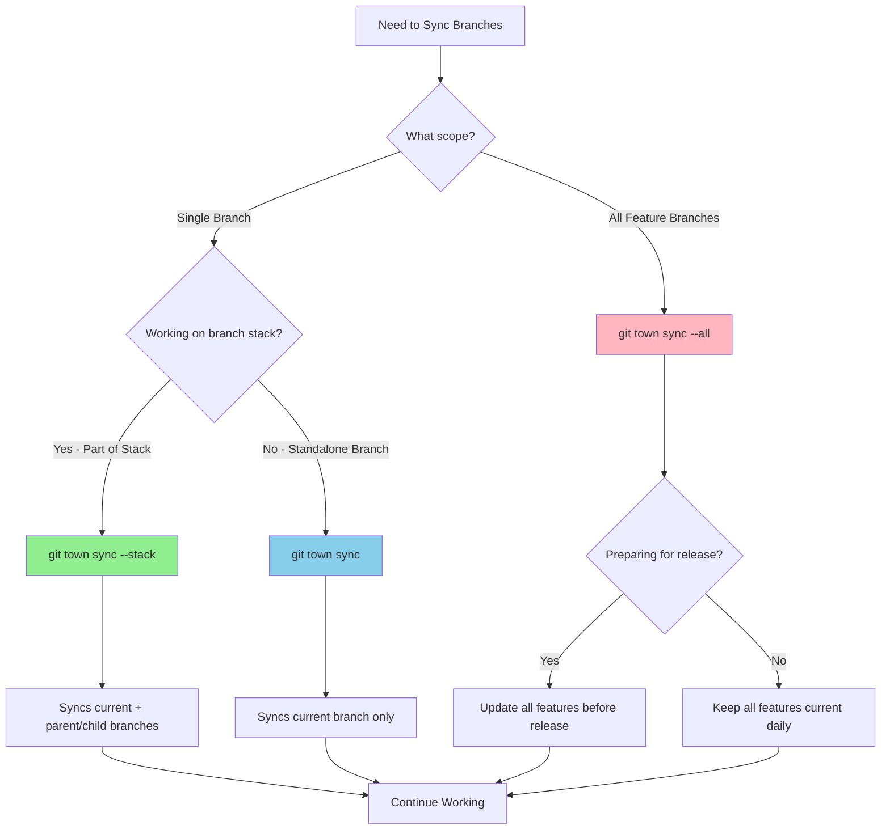
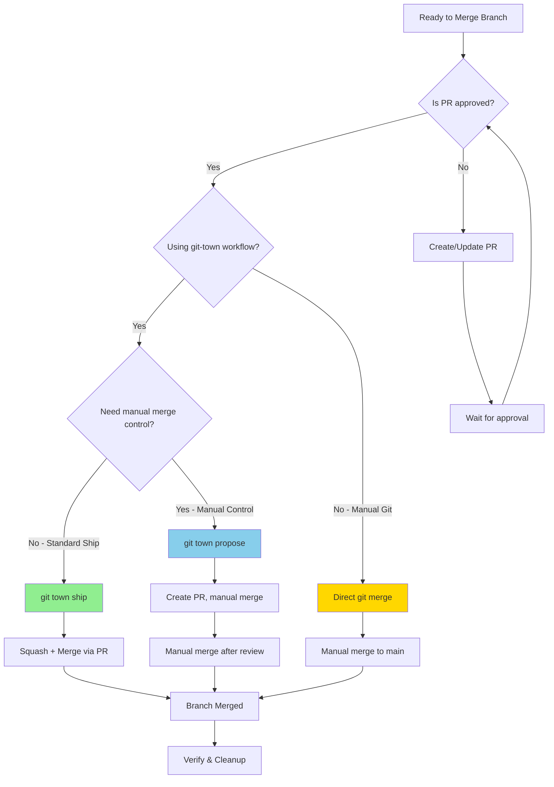
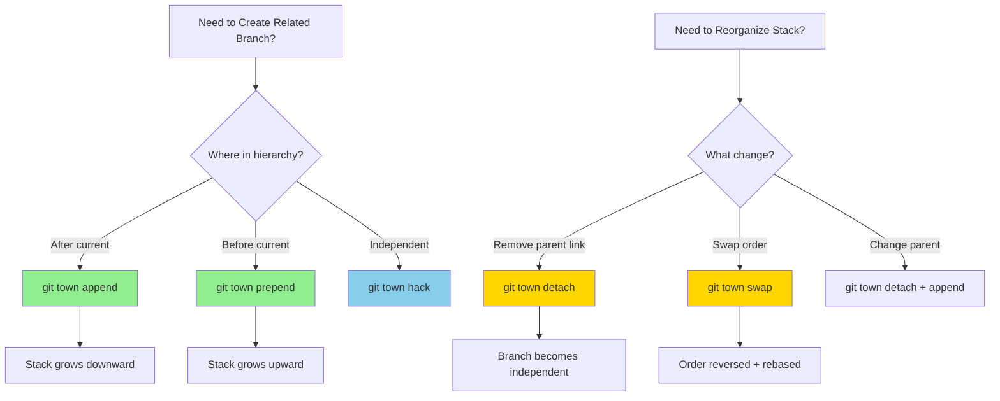
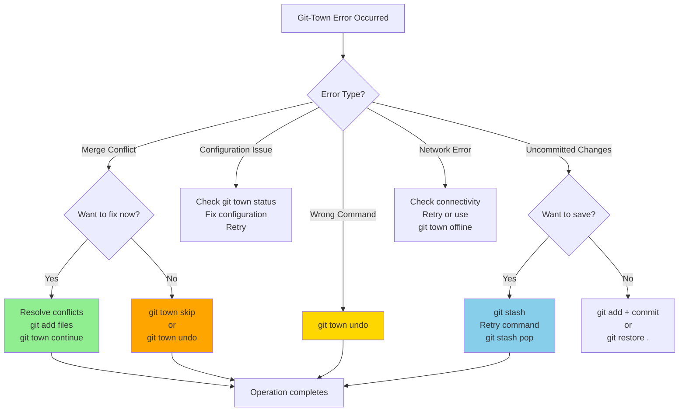

# Git-Town Reference Documentation

> Quick reference for git-town commands, exit codes, and agent integration patterns

## Table of Contents

1. [Exit Codes](#exit-codes)
2. [Core Commands](#core-commands)
3. [Command-Specific Exit Codes](#command-specific-exit-codes)
4. [Agent Handling Logic](#agent-handling-logic)
5. [Error Detection Patterns](#error-detection-patterns)

---

## Exit Codes

Git-town uses standardized exit codes to communicate command results. Agents must handle these codes appropriately to ensure proper workflow execution.

### Standard Exit Codes

| Exit Code | Constant | Meaning | Agent Action |
|-----------|----------|---------|--------------|
| 0 | `EXIT_SUCCESS` | Command completed successfully | Continue workflow |
| 1 | `EXIT_NOT_FOUND` | git-town not installed or not in PATH | Install git-town, halt workflow |
| 2 | `EXIT_NOT_CONFIGURED` | git-town not configured for repository | Run `git town config setup`, halt workflow |
| 3 | `EXIT_OLD_VERSION` | git-town version < 14.0.0 | Upgrade git-town, halt workflow |
| 4 | `EXIT_NOT_GIT_REPO` | Not in a git repository | Navigate to git repo, halt workflow |
| 5 | `EXIT_MERGE_CONFLICT` | Merge conflict occurred | Resolve conflicts, continue or abort |
| 6 | `EXIT_UNCOMMITTED_CHANGES` | Uncommitted changes prevent operation | Commit or stash changes, retry |
| 7 | `EXIT_REMOTE_ERROR` | Remote operation failed (network, auth) | Check connectivity/credentials, retry |
| 8 | `EXIT_BRANCH_NOT_FOUND` | Specified branch does not exist | Verify branch name, halt workflow |
| 9 | `EXIT_INVALID_CONFIG` | Invalid git-town configuration | Fix configuration, retry |
| 10 | `EXIT_USER_ABORT` | User aborted operation | Acknowledge abort, halt workflow |

### Validation Script Exit Codes

The `validate-git-town.sh` script uses a subset of standard exit codes:

```bash
# Exit code constants
EXIT_SUCCESS=0           # All checks passed
EXIT_NOT_FOUND=1         # git-town not installed
EXIT_NOT_CONFIGURED=2    # git-town not configured
EXIT_OLD_VERSION=3       # git-town version too old
EXIT_NOT_GIT_REPO=4      # Not a git repository
```

**Usage Example:**

```bash
#!/usr/bin/env bash
source ./validate-git-town.sh

validate_git_town
EXIT_CODE=$?

case $EXIT_CODE in
    0)
        echo "Validation passed, proceeding with git-town operations"
        ;;
    1)
        echo "ERROR: git-town not installed. Install via: brew install git-town"
        exit 1
        ;;
    2)
        echo "WARNING: git-town not configured. Run: git town config setup"
        exit 2
        ;;
    3)
        echo "ERROR: git-town version too old. Upgrade via: brew upgrade git-town"
        exit 3
        ;;
    4)
        echo "ERROR: Not in a git repository"
        exit 4
        ;;
esac
```

---

## Core Commands

Git-town provides four primary commands that form the foundation of the development workflow. Each command has specific usage patterns, success scenarios, and error cases that agents must handle.

### `git town hack`

**Purpose**: Create a new feature branch from the main branch and sync with remote.

**Syntax**:
```bash
git town hack <branch-name> [--parent <parent-branch>]
```

**Options**:
- `<branch-name>`: Name for the new feature branch (required)
- `--parent <parent-branch>`: Specify parent branch (default: main branch)

**Workflow**:
1. Creates new branch from parent (default: main)
2. Pushes branch to remote origin
3. Sets up tracking relationship
4. Switches to the new branch

**Success Example**:
```bash
$ git town hack feature/user-authentication
✓ Creating feature branch 'feature/user-authentication'
✓ Pushing branch to origin
✓ Setting up tracking
✓ Switched to branch 'feature/user-authentication'
```

**Error Example 1: Uncommitted Changes**
```bash
$ git town hack feature/payment-gateway
✗ Error: You have uncommitted changes
  Please commit or stash your changes before creating a new branch

Exit Code: 6
Agent Action: Stash changes with git stash push -m "WIP", retry command
```

**Error Example 2: Branch Already Exists**
```bash
$ git town hack feature/user-authentication
✗ Error: Branch 'feature/user-authentication' already exists
  Use 'git checkout feature/user-authentication' to switch to it

Exit Code: 8
Agent Action: Switch to existing branch instead of creating new one
```

**Agent Implementation Pattern**:
```bash
# Attempt to create feature branch
git town hack feature/new-feature
EXIT_CODE=$?

case $EXIT_CODE in
    0)
        echo "✓ Feature branch created successfully"
        ;;
    6)
        echo "⚠ Uncommitted changes detected. Stashing..."
        git stash push -m "WIP before creating feature branch"
        git town hack feature/new-feature
        ;;
    8)
        echo "⚠ Branch already exists. Switching to it..."
        git checkout feature/new-feature
        ;;
    *)
        echo "✗ Failed to create feature branch (exit code: $EXIT_CODE)"
        exit $EXIT_CODE
        ;;
esac
```

---

### `git town sync`

**Purpose**: Synchronize current branch with its parent branch and remote repository.

**Syntax**:
```bash
git town sync [--all] [--stack]
```

**Options**:
- `--all`: Sync all feature branches (not just current)
- `--stack`: Sync entire branch stack (current + parent branches)

**Workflow**:
1. Fetches updates from remote
2. Rebases current branch onto parent
3. Pushes changes to remote
4. Updates tracking information

**Success Example**:
```bash
$ git town sync
✓ Fetching updates from origin
✓ Rebasing feature/user-auth onto main
✓ Pushing to origin/feature/user-auth
✓ Branch synchronized successfully
```

**Error Example 1: Merge Conflict**
```bash
$ git town sync
✓ Fetching updates from origin
✗ Error: Merge conflict in src/auth/login.ts

  Conflicting files:
  - src/auth/login.ts
  - src/auth/logout.ts

  Please resolve conflicts and run:
    git town continue  (to continue sync)
    git town abort     (to abort sync)

Exit Code: 5
Agent Action: Delegate to deep-debugger for conflict resolution
```

**Error Example 2: Network Failure**
```bash
$ git town sync
✓ Fetching updates from origin
✗ Error: Failed to fetch from remote
  fatal: unable to access 'https://github.com/user/repo.git/':
  Could not resolve host: github.com

Exit Code: 7
Agent Action: Retry with exponential backoff (3 attempts)
```

**Agent Implementation Pattern**:
```bash
# Sync current branch with parent
git town sync
EXIT_CODE=$?

case $EXIT_CODE in
    0)
        echo "✓ Branch synchronized successfully"
        ;;
    5)
        echo "✗ Merge conflict detected during sync"
        echo "Conflicting files:"
        git diff --name-only --diff-filter=U

        # Delegate to specialized conflict resolution agent
        Task(subagent_type="deep-debugger",
             prompt="Resolve merge conflicts in: $(git diff --name-only --diff-filter=U | tr '\n' ' ')")
        ;;
    6)
        echo "⚠ Uncommitted changes. Creating checkpoint commit..."
        git add -A
        git commit -m "chore: checkpoint before sync"
        git town sync
        ;;
    7)
        echo "⚠ Remote operation failed. Retrying..."
        retry_with_backoff "git town sync" 3
        ;;
    *)
        echo "✗ Sync failed (exit code: $EXIT_CODE)"
        exit $EXIT_CODE
        ;;
esac
```

---

### `git town propose`

**Purpose**: Create a pull request for the current feature branch.

**Syntax**:
```bash
git town propose [--title "PR title"] [--body "PR description"] [--draft]
```

**Options**:
- `--title "..."`: Custom PR title (default: branch name)
- `--body "..."`: Custom PR description (default: commit messages)
- `--draft`: Create as draft PR

**Workflow**:
1. Pushes current branch to remote
2. Opens GitHub/GitLab to create PR
3. Pre-fills PR title and description
4. Returns PR URL

**Success Example**:
```bash
$ git town propose --title "Add user authentication" --draft
✓ Pushing branch to origin
✓ Creating pull request
✓ PR created: https://github.com/user/repo/pull/42

  Pull Request #42: Add user authentication
  Status: Draft
  Base: main ← feature/user-authentication
```

**Error Example 1: No Commits to Propose**
```bash
$ git town propose
✗ Error: No commits to propose
  Your branch is up to date with 'origin/feature/user-auth'
  and has no commits ahead of 'main'

Exit Code: 6
Agent Action: Verify commits exist, inform user, halt workflow
```

**Error Example 2: Authentication Failure**
```bash
$ git town propose
✓ Pushing branch to origin
✗ Error: Failed to create pull request
  fatal: Authentication failed for 'https://github.com/user/repo.git/'

  Please verify your credentials:
  - GitHub token: gh auth login
  - SSH keys: ssh -T git@github.com

Exit Code: 7
Agent Action: Escalate to user for credential refresh
```

**Agent Implementation Pattern**:
```bash
# Create pull request for current feature branch
git town propose --title "$PR_TITLE" --draft
EXIT_CODE=$?

case $EXIT_CODE in
    0)
        # Extract PR URL from output
        PR_URL=$(git town propose --title "$PR_TITLE" --draft 2>&1 | grep -oP 'https://[^\s]+')
        echo "✓ Pull request created: $PR_URL"

        # Report to user
        echo "PR #$(basename $PR_URL) is ready for review"
        ;;
    6)
        echo "⚠ No commits to propose"
        echo "Current branch status:"
        git log --oneline main..HEAD

        if [ -z "$(git log --oneline main..HEAD)" ]; then
            echo "✗ No commits ahead of main. Nothing to propose."
            exit 6
        else
            echo "⚠ Committing staged changes..."
            git add -A
            git commit -m "feat: final changes for PR"
            git town propose --title "$PR_TITLE" --draft
        fi
        ;;
    7)
        echo "✗ Authentication failed"
        echo "Please verify GitHub credentials:"
        echo "  gh auth status"
        echo "  gh auth login"
        exit 7
        ;;
    *)
        echo "✗ Failed to create PR (exit code: $EXIT_CODE)"
        exit $EXIT_CODE
        ;;
esac
```

---

### `git town ship`

**Purpose**: Merge feature branch into parent branch and delete the feature branch.

**Syntax**:
```bash
git town ship [--message "commit message"]
```

**Options**:
- `--message "..."`: Custom merge commit message (default: PR title)

**Workflow**:
1. Syncs feature branch with parent
2. Merges feature branch into parent
3. Pushes parent branch to remote
4. Deletes feature branch (local and remote)
5. Switches to parent branch

**Success Example**:
```bash
$ git town ship --message "Add user authentication feature"
✓ Syncing feature/user-auth with main
✓ Merging feature/user-auth into main
✓ Pushing main to origin
✓ Deleting feature/user-auth (local and remote)
✓ Switched to branch 'main'

Feature branch shipped successfully!
```

**Error Example 1: PR Not Approved**
```bash
$ git town ship
✗ Error: Pull request #42 is not approved
  Required approvals: 2
  Current approvals: 1

  Please wait for PR approval before shipping

Exit Code: 9
Agent Action: Wait for approvals, retry after notification
```

**Error Example 2: Merge Conflict on Parent Branch**
```bash
$ git town ship
✓ Syncing feature/user-auth with main
✗ Error: Merge conflict when merging into main

  Conflicting files:
  - src/auth/config.ts
  - package.json

  Please resolve conflicts and run:
    git town continue  (to continue ship)
    git town abort     (to abort ship)

Exit Code: 5
Agent Action: Delegate to deep-debugger for conflict resolution
```

**Agent Implementation Pattern**:
```bash
# Ship feature branch to main
git town ship --message "$MERGE_MESSAGE"
EXIT_CODE=$?

case $EXIT_CODE in
    0)
        echo "✓ Feature branch shipped successfully"
        echo "Current branch: $(git branch --show-current)"

        # Report completion
        echo "Changes merged to main and feature branch deleted"
        ;;
    5)
        echo "✗ Merge conflict detected during ship"
        echo "Conflicting files:"
        git diff --name-only --diff-filter=U

        # Delegate to conflict resolution
        Task(subagent_type="deep-debugger",
             prompt="Resolve merge conflicts during ship operation: $(git diff --name-only --diff-filter=U | tr '\n' ' ')")

        # After resolution, continue ship
        echo "Continuing ship after conflict resolution..."
        git town continue
        ;;
    7)
        echo "⚠ Remote operation failed. Retrying..."
        retry_with_backoff "git town ship --message '$MERGE_MESSAGE'" 3
        ;;
    9)
        echo "✗ PR not ready to ship"
        echo "Checking PR status..."
        gh pr view --json state,reviews

        echo "Waiting for PR approval..."
        exit 9
        ;;
    10)
        echo "⚠ Ship operation aborted by user"
        echo "Feature branch preserved"
        ;;
    *)
        echo "✗ Ship failed (exit code: $EXIT_CODE)"
        exit $EXIT_CODE
        ;;
esac
```

---

## Command-Specific Exit Codes

Different git-town commands may return specific exit codes based on their context.

### `git town hack <branch-name>`

Creates a new feature branch and syncs with remote.

| Exit Code | Scenario | Agent Response |
|-----------|----------|----------------|
| 0 | Branch created and synced successfully | Continue development workflow |
| 6 | Uncommitted changes detected | Stash changes: `git stash push -m "WIP before hack"`, retry |
| 7 | Remote sync failed | Check network/auth, retry or work offline |
| 8 | Branch already exists locally | Switch to existing branch: `git checkout <branch>` |

**Example Agent Logic:**

```bash
git town hack feature/new-feature
EXIT_CODE=$?

if [ $EXIT_CODE -eq 6 ]; then
    echo "Stashing uncommitted changes..."
    git stash push -m "WIP before hack"
    git town hack feature/new-feature
elif [ $EXIT_CODE -eq 8 ]; then
    echo "Branch exists, switching instead..."
    git checkout feature/new-feature
fi
```

### `git town sync`

Syncs current branch with parent and remote.

| Exit Code | Scenario | Agent Response |
|-----------|----------|----------------|
| 0 | Sync completed successfully | Continue workflow |
| 5 | Merge conflict during sync | Delegate to `deep-debugger` for conflict resolution |
| 6 | Uncommitted changes block sync | Commit changes or stash, retry |
| 7 | Remote fetch/push failed | Check connectivity, retry with exponential backoff |

**Example Agent Logic:**

```bash
git town sync
EXIT_CODE=$?

case $EXIT_CODE in
    5)
        echo "Merge conflict detected. Resolving..."
        # Agent delegates to conflict resolution workflow
        Task(subagent_type="deep-debugger", prompt="Resolve merge conflicts in current branch")
        ;;
    6)
        echo "Uncommitted changes detected. Creating checkpoint commit..."
        git add -A
        git commit -m "chore: checkpoint before sync"
        git town sync
        ;;
    7)
        echo "Remote operation failed. Retrying in 5 seconds..."
        sleep 5
        git town sync
        ;;
esac
```

### `git town propose`

Creates a pull request for the current feature branch.

| Exit Code | Scenario | Agent Response |
|-----------|----------|----------------|
| 0 | PR created successfully | Report PR URL to user |
| 6 | Uncommitted changes detected | Commit changes, push, retry |
| 7 | Remote push failed | Check auth/network, retry |
| 9 | Missing PR template or invalid config | Fix configuration, retry |

**Example Agent Logic:**

```bash
git town propose
EXIT_CODE=$?

if [ $EXIT_CODE -eq 0 ]; then
    PR_URL=$(gh pr view --json url -q .url)
    echo "Pull request created: $PR_URL"
elif [ $EXIT_CODE -eq 6 ]; then
    echo "Committing changes before propose..."
    git add -A
    git commit -m "feat: final changes for PR"
    git push
    git town propose
fi
```

### `git town ship`

Merges feature branch to parent and deletes feature branch.

| Exit Code | Scenario | Agent Response |
|-----------|----------|----------------|
| 0 | Branch shipped successfully | Report success, continue to next task |
| 5 | Merge conflict on parent branch | Resolve conflicts, retry ship |
| 7 | Remote operations failed | Check connectivity, retry |
| 10 | User aborted ship | Acknowledge abort, preserve feature branch |

**Example Agent Logic:**

```bash
git town ship
EXIT_CODE=$?

case $EXIT_CODE in
    0)
        echo "Feature branch shipped successfully"
        ;;
    5)
        echo "Merge conflict on parent branch. Manual resolution required."
        git town ship --abort
        Task(subagent_type="deep-debugger", prompt="Resolve merge conflicts during ship")
        ;;
    10)
        echo "Ship operation aborted by user"
        ;;
esac
```

---

## Agent Handling Logic

### Decision Tree for Exit Code Handling

```
git-town command execution
│
├─ Exit Code 0 → ✓ Success
│                 └─ Continue workflow
│
├─ Exit Code 1 → ✗ Not Installed
│                 └─ Install git-town
│                     └─ Platform detection
│                         ├─ macOS: brew install git-town
│                         ├─ Linux: See https://www.git-town.com/install
│                         └─ Windows: scoop install git-town
│
├─ Exit Code 2 → ⚠ Not Configured
│                 └─ Run: git town config setup
│                     └─ Retry original command
│
├─ Exit Code 3 → ✗ Old Version
│                 └─ Upgrade git-town
│                     └─ Platform detection
│                         ├─ macOS: brew upgrade git-town
│                         ├─ Linux: See https://www.git-town.com/install
│                         └─ Windows: scoop update git-town
│
├─ Exit Code 4 → ✗ Not Git Repo
│                 └─ Navigate to git repository
│                     └─ Halt workflow
│
├─ Exit Code 5 → ⚠ Merge Conflict
│                 └─ Delegate to deep-debugger
│                     └─ Options:
│                         ├─ Resolve conflicts manually
│                         ├─ Continue: git town continue
│                         └─ Abort: git town abort
│
├─ Exit Code 6 → ⚠ Uncommitted Changes
│                 └─ Options:
│                     ├─ Commit: git add -A && git commit
│                     ├─ Stash: git stash push -m "WIP"
│                     └─ Retry original command
│
├─ Exit Code 7 → ⚠ Remote Error
│                 └─ Diagnose:
│                     ├─ Network: Check connectivity
│                     ├─ Auth: Verify credentials
│                     └─ Retry with exponential backoff
│
├─ Exit Code 8 → ✗ Branch Not Found
│                 └─ Verify branch name
│                     └─ Suggest alternatives: git branch -a
│
├─ Exit Code 9 → ✗ Invalid Config
│                 └─ Run: git town config setup
│                     └─ Fix configuration issues
│
└─ Exit Code 10 → ⚠ User Abort
                  └─ Acknowledge abort
                      └─ Preserve current state
```

### Recommended Agent Response Patterns

#### Pattern 1: Retry with Exponential Backoff (Exit Code 7)

```bash
retry_with_backoff() {
    local command="$1"
    local max_attempts=3
    local attempt=1
    local wait_time=2

    while [ $attempt -le $max_attempts ]; do
        echo "Attempt $attempt/$max_attempts: $command"

        eval "$command"
        local exit_code=$?

        if [ $exit_code -eq 0 ]; then
            return 0
        elif [ $exit_code -eq 7 ]; then
            if [ $attempt -lt $max_attempts ]; then
                echo "Remote error. Retrying in ${wait_time}s..."
                sleep $wait_time
                wait_time=$((wait_time * 2))
            fi
        else
            return $exit_code
        fi

        attempt=$((attempt + 1))
    done

    return 7
}

# Usage
retry_with_backoff "git town sync"
```

#### Pattern 2: Automatic Stash/Unstash (Exit Code 6)

```bash
safe_git_town_operation() {
    local command="$1"
    local stashed=false

    eval "$command"
    local exit_code=$?

    if [ $exit_code -eq 6 ]; then
        echo "Stashing uncommitted changes..."
        git stash push -m "Auto-stash before git-town operation"
        stashed=true

        eval "$command"
        exit_code=$?

        if [ $stashed = true ]; then
            echo "Restoring stashed changes..."
            git stash pop
        fi
    fi

    return $exit_code
}

# Usage
safe_git_town_operation "git town sync"
```

#### Pattern 3: Conflict Resolution Delegation (Exit Code 5)

```bash
handle_merge_conflict() {
    local command="$1"

    eval "$command"
    local exit_code=$?

    if [ $exit_code -eq 5 ]; then
        echo "Merge conflict detected during: $command"

        # Show conflict files
        git diff --name-only --diff-filter=U

        # Delegate to specialized agent
        echo "Delegating conflict resolution to deep-debugger..."
        # Agent uses Task tool here

        # After resolution, continue
        git town continue
    fi

    return $exit_code
}

# Usage
handle_merge_conflict "git town sync"
```

---

## Error Detection Patterns

### Parsing Git-Town Output

Git-town provides structured error messages that agents can parse for better error handling.

#### Common Error Patterns

| Error Pattern | Regex | Exit Code | Meaning |
|---------------|-------|-----------|---------|
| Not installed | `git-town.*not found\|command not found` | 1 | git-town not in PATH |
| Not configured | `not configured\|run.*git town config` | 2 | Missing configuration |
| Version error | `version.*too old\|upgrade.*git-town` | 3 | Outdated version |
| Merge conflict | `CONFLICT\|merge conflict` | 5 | Merge conflict occurred |
| Uncommitted | `uncommitted changes\|working tree.*not clean` | 6 | Dirty working tree |
| Remote error | `remote.*failed\|network.*error\|authentication failed` | 7 | Remote operation failed |
| Branch error | `branch.*not found\|does not exist` | 8 | Invalid branch reference |

#### Error Detection Script

```bash
#!/usr/bin/env bash
# detect-git-town-error.sh
# Parses git-town output to determine error type

detect_error_type() {
    local output="$1"
    local exit_code="$2"

    # First, check exit code
    if [ "$exit_code" -ne 0 ]; then
        # Parse output for specific error patterns
        if echo "$output" | grep -qE "git-town.*not found|command not found"; then
            echo "ERROR_NOT_INSTALLED"
            return 1
        elif echo "$output" | grep -qE "not configured|run.*git town config"; then
            echo "ERROR_NOT_CONFIGURED"
            return 2
        elif echo "$output" | grep -qE "version.*too old|upgrade.*git-town"; then
            echo "ERROR_OLD_VERSION"
            return 3
        elif echo "$output" | grep -qE "CONFLICT|merge conflict"; then
            echo "ERROR_MERGE_CONFLICT"
            return 5
        elif echo "$output" | grep -qE "uncommitted changes|working tree.*not clean"; then
            echo "ERROR_UNCOMMITTED"
            return 6
        elif echo "$output" | grep -qE "remote.*failed|network.*error|authentication failed"; then
            echo "ERROR_REMOTE"
            return 7
        elif echo "$output" | grep -qE "branch.*not found|does not exist"; then
            echo "ERROR_BRANCH_NOT_FOUND"
            return 8
        else
            echo "ERROR_UNKNOWN"
            return "$exit_code"
        fi
    else
        echo "SUCCESS"
        return 0
    fi
}

# Usage example
OUTPUT=$(git town sync 2>&1)
EXIT_CODE=$?

ERROR_TYPE=$(detect_error_type "$OUTPUT" "$EXIT_CODE")
echo "Error type: $ERROR_TYPE"
```

### Agent Integration Example

```bash
#!/usr/bin/env bash
# agent-git-town-wrapper.sh
# Wrapper for git-town commands with intelligent error handling

source ./validate-git-town.sh
source ./detect-git-town-error.sh

execute_git_town_command() {
    local command="$1"

    # Step 1: Validate git-town environment
    validate_git_town
    local validation_code=$?

    if [ $validation_code -ne 0 ]; then
        echo "Validation failed with code: $validation_code"
        return $validation_code
    fi

    # Step 2: Execute command
    OUTPUT=$(eval "$command" 2>&1)
    EXIT_CODE=$?

    # Step 3: Detect error type
    ERROR_TYPE=$(detect_error_type "$OUTPUT" "$EXIT_CODE")

    # Step 4: Handle based on error type
    case $ERROR_TYPE in
        SUCCESS)
            echo "✓ Command succeeded: $command"
            echo "$OUTPUT"
            return 0
            ;;
        ERROR_UNCOMMITTED)
            echo "⚠ Uncommitted changes detected. Auto-stashing..."
            git stash push -m "Auto-stash before $command"
            eval "$command"
            git stash pop
            ;;
        ERROR_MERGE_CONFLICT)
            echo "✗ Merge conflict detected. Manual intervention required."
            echo "Conflicts in:"
            git diff --name-only --diff-filter=U
            return 5
            ;;
        ERROR_REMOTE)
            echo "⚠ Remote error. Retrying in 5 seconds..."
            sleep 5
            eval "$command"
            ;;
        *)
            echo "✗ Command failed: $command"
            echo "$OUTPUT"
            return $EXIT_CODE
            ;;
    esac
}

# Usage
execute_git_town_command "git town hack feature/new-feature"
execute_git_town_command "git town sync"
execute_git_town_command "git town propose"
```

---

## Decision Trees

### Branching Strategy Decision Tree

Use this decision tree to determine which git-town command to use for creating new branches.



#### Decision Table

| Scenario | Command | Reasoning |
|----------|---------|-----------|
| New independent feature for production | `git town hack feature/user-auth` | Standalone work that will ship to main |
| Research spike or throwaway code | `git town hack --prototype proto/research` | Won't be synced, easier cleanup |
| Next step in current feature (dependent) | `git town append feature/add-tests` | Builds on current branch, creates child |
| Foundation needed for current work | `git town prepend feature/setup-db` | Current branch depends on this, creates parent |
| Hotfix for production issue | `git town hack hotfix/fix-login` | Urgent standalone fix from main |
| Refactoring before adding feature | `git town prepend refactor/cleanup` | Current feature needs this refactor first |
| Adding tests after implementation | `git town append test/unit-tests` | Tests depend on implementation |
| Experimenting with new library | `git town hack --prototype proto/new-lib` | Experimental work, may be discarded |

#### Example Use Cases

**Use Case 1: Standalone Feature**
```bash
# Starting new feature for user authentication
git town hack feature/user-authentication

# Why: Independent feature that will ship to main
# Alternative: Could use git checkout -b, but git-town provides sync benefits
```

**Use Case 2: Building on Current Work (Stacked Branches)**
```bash
# Current branch: feature/user-model
# Now need to add authentication endpoints that depend on user-model

git town append feature/auth-endpoints

# Why: Auth endpoints depend on user-model being merged first
# Creates: feature/user-model → feature/auth-endpoints stack
# When syncing, both branches stay up to date
```

**Use Case 3: Foundation Work (Reverse Dependency)**
```bash
# Current branch: feature/admin-dashboard
# Realize you need to add admin roles first

git town prepend feature/admin-roles

# Why: Admin dashboard depends on roles being implemented
# Creates: feature/admin-roles → feature/admin-dashboard stack
# Switches to: feature/admin-roles (implement foundation first)
```

**Use Case 4: Prototype/Throwaway Work**
```bash
# Experimenting with a new state management library
git town hack --prototype proto/zustand-experiment

# Why: Experimental work that may be discarded
# Benefits: Won't be synced automatically, easy to delete
# When done: Just delete branch, no git-town cleanup needed
```

---

### Sync Scope Decision Tree

Use this decision tree to determine which sync scope to use.



#### Decision Matrix

| Scenario | Command | When to Use | Performance Impact |
|----------|---------|-------------|-------------------|
| Working on single feature | `git town sync` | Default workflow, focused on one branch | Low - updates 1 branch |
| Working on stacked branches | `git town sync --stack` | Using append/prepend, need stack updates | Medium - updates 2-5 branches |
| End of day sync | `git town sync --all` | Keep all features up to date | High - updates all feature branches |
| Pre-release preparation | `git town sync --all` | Ensure all features are current | High - full repository sync |
| After main branch update | `git town sync --all` | Major changes merged to main | High - propagate changes |
| Quick check before PR | `git town sync` | Just need current branch updated | Low - fast feedback |
| Mid-stack development | `git town sync --stack` | Changes affect parent/child branches | Medium - stack coherence |
| Morning startup | `git town sync --all` | Start day with fresh state | High - one-time cost |

#### Performance Implications

**`git town sync` (Current Branch Only)**
- **Time**: 5-30 seconds
- **Network**: Fetches current branch + main
- **Conflicts**: Only in current branch
- **Use**: 80% of daily syncs

**`git town sync --stack` (Current + Related Branches)**
- **Time**: 30 seconds - 2 minutes
- **Network**: Fetches stack branches + main
- **Conflicts**: Possible in any stack branch
- **Use**: 15% of daily syncs (when using stacked branches)

**`git town sync --all` (All Feature Branches)**
- **Time**: 1-10 minutes (depends on branch count)
- **Network**: Fetches all remotes
- **Conflicts**: Possible in any feature branch
- **Use**: 5% of syncs (strategic timing)

#### When to Use Each Variant

**Use `git town sync` when:**
- ✓ Working on a single, standalone feature
- ✓ Quick sync before making commits
- ✓ Checking if main has updates
- ✓ Branch is not part of a stack
- ✓ Time-constrained (fastest option)

**Use `git town sync --stack` when:**
- ✓ Working on stacked branches (append/prepend)
- ✓ Changes in parent affect current work
- ✓ Need to push stack changes upstream
- ✓ Testing integration across stack layers
- ✓ Preparing to merge parent branch

**Use `git town sync --all` when:**
- ✓ Start of day (morning sync)
- ✓ End of day (before leaving)
- ✓ Before major release
- ✓ After significant main branch changes
- ✓ Weekly maintenance sync
- ✓ Returning from vacation/break

#### Example Workflows

**Scenario 1: Daily Feature Development**
```bash
# Morning: Start with full sync
git town sync --all

# Mid-day: Quick syncs while working
git checkout feature/user-auth
git town sync  # Fast, focused sync

# Make changes...
git add .
git commit -m "feat: add password hashing"

# Before lunch: Quick sync
git town sync

# End of day: Full sync
git town sync --all
```

**Scenario 2: Stacked Branch Development**
```bash
# Working on stack: feature/api → feature/ui → feature/tests
git checkout feature/ui  # Middle of stack

# Sync entire stack to keep coherent
git town sync --stack

# Changes propagate:
# 1. feature/api syncs with main
# 2. feature/ui syncs with feature/api
# 3. feature/tests syncs with feature/ui
```

**Scenario 3: Pre-Release Preparation**
```bash
# Week before release: Ensure all features are current
git town sync --all

# Review any conflicts across all branches
# Update features that fell behind main
# Verify all features still build
```

---

### Completion Strategy Decision Tree

Use this decision tree to determine how to complete and merge your branch.



#### Decision Table

| Scenario | Command | Pre-Conditions | Post-Actions |
|----------|---------|----------------|--------------|
| Standard approved PR | `git town ship` | PR approved, CI green, no conflicts | Auto-deletes branch, updates main |
| Need to review merge commit | `git town propose` → manual merge | Want to customize merge message | Manual PR merge, run `git town sync` |
| Not using git-town | `git merge` + manual cleanup | Working outside git-town workflow | Manual branch deletion |
| Prototype branch | Delete locally | Prototype flag set, not for shipping | `git branch -D proto/name` |
| Hotfix emergency | `git town ship` ASAP | Critical production fix approved | Fast-track merge, skip normal review |
| Stacked branches | Ship from bottom up | Dependencies merged first | Ship parent before child |

#### Pre-Ship Checklist

Before running `git town ship`, verify:

**Code Quality**
- [ ] All tests passing locally
- [ ] CI/CD pipeline green
- [ ] Code review approved
- [ ] No merge conflicts with main
- [ ] Branch is up to date (`git town sync`)

**Documentation**
- [ ] Code comments added
- [ ] README updated (if needed)
- [ ] CHANGELOG entry added
- [ ] API docs updated (if API changes)

**Configuration**
- [ ] Environment variables documented
- [ ] Database migrations tested
- [ ] Feature flags configured
- [ ] Dependencies updated in lock files

**Security**
- [ ] No secrets committed
- [ ] Security scan passed
- [ ] Dependencies have no critical vulnerabilities
- [ ] Authentication/authorization tested

**Performance**
- [ ] No performance regressions
- [ ] Database queries optimized
- [ ] Large file uploads handled
- [ ] Caching implemented where needed

#### Post-Ship Verification

After `git town ship` completes:

**Verify Merge**
```bash
# Check that main has your changes
git checkout main
git pull
git log --oneline -5  # Verify your commit is there

# Verify branch was deleted remotely
git branch -r | grep feature/your-branch
# Should return nothing
```

**Verify Deployment**
```bash
# If using CI/CD, check deployment status
gh run list --branch main

# Verify in staging/production
curl https://staging.example.com/health
```

**Cleanup Local Branches**
```bash
# Git-town auto-deletes local branch after ship
# Verify it's gone
git branch | grep feature/your-branch
# Should return nothing

# Prune remote-tracking branches
git fetch --prune
```

#### Example Workflows

**Workflow 1: Standard Ship (Recommended)**
```bash
# 1. Ensure branch is up to date
git town sync

# 2. Run pre-ship checklist
npm test          # All tests pass
npm run lint      # No linting errors
git status        # Clean working directory

# 3. Create/update PR if not exists
git town propose  # Creates PR if needed

# 4. Wait for approval (done outside terminal)
# - Code review approved
# - CI/CD green
# - QA sign-off

# 5. Ship the feature
git town ship

# 6. Verify merge
git checkout main
git pull
git log --oneline -5

# Result:
# ✓ PR merged and closed
# ✓ Remote branch deleted
# ✓ Local branch deleted
# ✓ Switched to main branch
# ✓ Main branch updated
```

**Workflow 2: Manual Merge Control**
```bash
# 1. Create PR but don't auto-merge
git town propose

# 2. Wait for approval
# 3. Manually merge PR via GitHub UI with custom merge message
# 4. Sync local repository
git checkout main
git pull

# 5. Clean up local branch
git branch -d feature/my-feature
```

**Workflow 3: Stacked Branches Ship**
```bash
# Stack: feature/api → feature/ui → feature/tests
# Ship from bottom to top

# Ship API layer first
git checkout feature/api
git town ship  # Merges to main

# Ship UI layer second
git checkout feature/ui
git town sync  # Updates parent reference from feature/api to main
git town ship  # Merges to main

# Ship tests layer last
git checkout feature/tests
git town sync  # Updates parent reference from feature/ui to main
git town ship  # Merges to main
```

**Workflow 4: Prototype Cleanup**
```bash
# Prototype branches are NOT shipped
git checkout main

# Delete prototype branch locally
git branch -D proto/experiment

# Delete remotely if pushed
git push origin --delete proto/experiment

# No git-town ship needed for prototypes
```

---

## Advanced Branching Commands

Git-town provides advanced commands for managing complex branch hierarchies and workflows.

### `git town append`

**Purpose**: Create a new branch as a child of the current branch (stacked branches).

**Syntax**:
```bash
git town append <branch-name>
```

**Use Cases**:
- Building features in layers (API → UI → Tests)
- Breaking large features into reviewable chunks
- Working on dependent features

**Example 1: Success - Create Stacked Branch**
```bash
# Starting on feature/api
git checkout feature/api
git town append feature/ui

# Result:
# - Creates feature/ui branch
# - Sets feature/api as parent of feature/ui
# - Checks out feature/ui
# - Stack: main → feature/api → feature/ui
```

**Example 2: Error - Uncommitted Changes**
```bash
$ git town append feature/ui
Error: you have uncommitted changes

# Exit Code: 6
# Recovery:
git stash push -m "WIP before append"
git town append feature/ui
git stash pop
```

**Example 3: Error - Branch Already Exists**
```bash
$ git town append feature/ui
Error: branch "feature/ui" already exists

# Exit Code: 8
# Recovery:
# Option 1: Use different name
git town append feature/ui-v2

# Option 2: Delete existing branch
git branch -D feature/ui
git town append feature/ui
```

---

### `git town prepend`

**Purpose**: Insert a new branch between the current branch and its parent.

**Syntax**:
```bash
git town prepend <branch-name>
```

**Use Cases**:
- Adding infrastructure before feature implementation
- Splitting features discovered during development
- Refactoring before feature work

**Example 1: Success - Insert Intermediate Branch**
```bash
# Current stack: main → feature/ui
git checkout feature/ui
git town prepend feature/api

# Result:
# - Creates feature/api branch from main
# - Sets main as parent of feature/api
# - Sets feature/api as parent of feature/ui
# - Checks out feature/api
# - New stack: main → feature/api → feature/ui
```

**Example 2: Error - Not on Feature Branch**
```bash
$ git checkout main
$ git town prepend feature/api
Error: cannot prepend on main branch

# Exit Code: 7
# Recovery:
git checkout <feature-branch>
git town prepend feature/api
```

**Example 3: Error - Dirty Working Directory**
```bash
$ git town prepend feature/api
Error: uncommitted changes detected

# Exit Code: 6
# Recovery:
git add .
git commit -m "WIP: Save progress"
git town prepend feature/api
```

---

### `git town detach`

**Purpose**: Remove parent relationship, making branch a direct child of main.

**Syntax**:
```bash
git town detach [<branch-name>]
```

**Use Cases**:
- Converting stacked branch to independent feature
- Reorganizing branch hierarchies
- Removing dependencies between branches

**Example 1: Success - Detach Current Branch**
```bash
# Stack: main → feature/api → feature/ui
git checkout feature/ui
git town detach

# Result:
# - feature/ui parent changed from feature/api to main
# - New stack: main → feature/api
#              main → feature/ui (independent)
```

**Example 2: Success - Detach Specific Branch**
```bash
# Stack: main → feature/api → feature/ui → feature/tests
git town detach feature/ui

# Result:
# - feature/ui parent changed to main
# - feature/tests parent changed to feature/ui (maintains chain)
# - New stack: main → feature/api
#              main → feature/ui → feature/tests
```

**Example 3: Error - Already Detached**
```bash
$ git checkout feature/standalone
$ git town detach
Warning: branch "feature/standalone" already has main as parent

# Exit Code: 0 (warning, not error)
# No action needed
```

---

### `git town swap`

**Purpose**: Swap the positions of two branches in a stack.

**Syntax**:
```bash
git town swap <branch-1> <branch-2>
```

**Use Cases**:
- Reordering implementation layers
- Fixing dependency order
- Reorganizing PR review sequence

**Example 1: Success - Swap Adjacent Branches**
```bash
# Stack: main → feature/api → feature/ui
git town swap feature/api feature/ui

# Result:
# - New stack: main → feature/ui → feature/api
# - Rebases feature/api onto feature/ui
```

**Example 2: Error - Branches Not in Same Stack**
```bash
# Stack 1: main → feature/api
# Stack 2: main → feature/ui
$ git town swap feature/api feature/ui
Error: branches are not in the same stack

# Exit Code: 7
# Recovery:
# Cannot swap - branches are independent
# Use git town append/prepend to restructure
```

**Example 3: Error - Merge Conflicts During Swap**
```bash
$ git town swap feature/api feature/ui
Error: merge conflicts detected during rebase

# Exit Code: 5
# Recovery:
git status  # Review conflicts
# Resolve conflicts in files
git add <resolved-files>
git town continue  # Resume swap operation
```

---

## Advanced Branching Decision Tree



---

## Error Recovery Commands

Git-town provides commands to handle errors and resume interrupted operations.

### `git town continue`

**Purpose**: Resume a git-town command after resolving conflicts or errors.

**Syntax**:
```bash
git town continue
```

**Use Cases**:
- Continue after resolving merge conflicts
- Resume after fixing validation errors
- Proceed after manual intervention

**Example 1: Success - Resume After Conflict Resolution**
```bash
# During sync, merge conflict occurs
$ git town sync
Error: merge conflicts detected

# Resolve conflicts
$ git status
# Edit conflicted files
$ git add <resolved-files>

# Continue the sync operation
$ git town continue
# Sync completes successfully
```

**Example 2: Success - Continue After Stash**
```bash
# During hack, uncommitted changes detected
$ git town hack feature/new-branch
Error: uncommitted changes

# Stash changes
$ git stash push -m "WIP"

# Retry and continue
$ git town hack feature/new-branch
# Success
```

**Example 3: Error - Nothing to Continue**
```bash
$ git town continue
Error: no git-town operation in progress

# Exit Code: 0 (informational)
# No action needed - no operation was interrupted
```

---

### `git town skip`

**Purpose**: Skip the current branch during a multi-branch operation.

**Syntax**:
```bash
git town skip
```

**Use Cases**:
- Skip problematic branch during sync-all
- Continue with other branches after error
- Defer complex conflict resolution

**Example 1: Success - Skip Conflicted Branch**
```bash
# Syncing all branches
$ git town sync --all
Processing feature/api... OK
Processing feature/ui... CONFLICT

# Skip feature/ui for now
$ git town skip
Processing feature/tests... OK
Sync complete (1 branch skipped)
```

**Example 2: Success - Skip During Stack Sync**
```bash
# Syncing stacked branches: api → ui → tests
$ git town sync
Syncing feature/api... OK
Syncing feature/ui... CONFLICT

# Skip and continue with feature/tests
$ git town skip
Syncing feature/tests... OK
```

**Example 3: Error - Cannot Skip Single Operation**
```bash
$ git town sync
# Conflict occurs
$ git town skip
Error: cannot skip - only one branch in operation

# Exit Code: 7
# Recovery: Use git town undo or resolve conflicts
```

---

### `git town undo`

**Purpose**: Undo the most recent git-town command and restore previous state.

**Syntax**:
```bash
git town undo
```

**Use Cases**:
- Revert accidental command execution
- Undo failed operation
- Restore state after unexpected results

**Example 1: Success - Undo Branch Creation**
```bash
# Created wrong branch
$ git town hack feature/wrong-name
Branch created: feature/wrong-name

# Undo creation
$ git town undo
Branch deleted: feature/wrong-name
Restored to: main
```

**Example 2: Success - Undo Failed Sync**
```bash
# Sync caused conflicts
$ git town sync
Error: merge conflicts in 3 files

# Undo the sync attempt
$ git town undo
Sync undone
Restored to: <commit-before-sync>
```

**Example 3: Success - Undo Ship Operation**
```bash
# Accidentally shipped wrong branch
$ git checkout feature/not-ready
$ git town ship
Merged to main: feature/not-ready

# Immediately undo
$ git town undo
Reverted merge: feature/not-ready
Restored: feature/not-ready, main
```

**Important Notes**:
- Undo is tracked per-repository in `.git/town/undo` stack
- Can undo multiple commands sequentially
- Cannot undo after garbage collection removes commits
- Undo is best-effort - complex operations may not fully restore

---

### `git town status`

**Purpose**: Show current git-town operation status and configuration.

**Syntax**:
```bash
git town status
```

**Use Cases**:
- Check if operation is in progress
- View branch relationships (stack structure)
- Debug configuration issues

**Example 1: Success - No Operation in Progress**
```bash
$ git town status
No git-town operation in progress

Configuration:
  Main branch: main
  Perennial branches: develop, staging

Current branch: feature/user-auth
  Parent: main
  Children: none

Branch type: feature
```

**Example 2: Success - Operation in Progress**
```bash
$ git town status
Operation in progress: sync (paused due to conflict)

Current step: Syncing feature/api with main
Completed: 2/5 branches
Remaining: feature/ui, feature/tests, feature/docs

To continue: git town continue
To abort: git town undo
```

**Example 3: Success - Stack Structure**
```bash
$ git checkout feature/ui
$ git town status
Current branch: feature/ui

Stack structure:
  main
  └── feature/api
      └── feature/ui (current)
          └── feature/tests

Branch type: feature (stacked)
Parent: feature/api
Children: feature/tests
```

---

## Error Recovery Decision Tree



---

## Offline Mode

Git-town's offline mode allows development without network connectivity.

### `git town offline`

**Purpose**: Toggle offline mode to work without network access.

**Syntax**:
```bash
git town offline [on|off]
```

**Use Cases**:
- Air-gapped development environments
- Working without internet access
- Avoiding network errors during development
- Testing local-only workflows

**Example 1: Success - Enable Offline Mode**
```bash
$ git town offline on
Offline mode enabled

# Git-town will now skip all network operations:
# - No remote fetch/push
# - No PR creation
# - Local-only sync

$ git town status
Offline mode: ON
```

**Example 2: Success - Work Offline**
```bash
# Enable offline mode
$ git town offline on

# Create branches (local only)
$ git town hack feature/offline-work
Branch created: feature/offline-work (local only)

# Sync with main (local only, no fetch)
$ git town sync
Syncing with local main branch...
No remote updates (offline mode)
Sync complete (local only)

# Ship branch (fails in offline mode)
$ git town ship
Error: cannot ship in offline mode - requires network access

# Disable offline mode when online
$ git town offline off
Offline mode disabled

# Now can ship
$ git town ship
# Connects to remote and completes ship
```

**Example 3: Success - Check Offline Status**
```bash
$ git town offline
Offline mode: OFF (connected)

$ git town offline on
$ git town offline
Offline mode: ON
```

**Offline Mode Behavior**:

| Command | Online Behavior | Offline Behavior |
|---------|----------------|------------------|
| `hack` | Creates branch + pushes | Creates branch (local only) |
| `sync` | Fetches + merges remote | Merges local main only |
| `propose` | Creates PR on remote | **Fails** - requires network |
| `ship` | Merges + pushes + deletes remote | **Fails** - requires network |
| `status` | Shows remote tracking | Shows local status only |

**When to Use Offline Mode**:
- ✅ Developing on airplane/train
- ✅ Air-gapped secure environments
- ✅ Testing workflows without network
- ✅ Avoiding network latency during rapid iteration
- ❌ Creating PRs (requires network)
- ❌ Shipping branches (requires network)

**Important Notes**:
- Offline mode is per-repository (stored in `.git/config`)
- Automatically disabled on `git town propose` or `git town ship`
- Can be re-enabled after going online
- Local commits still sync when connectivity restored

---

## Configuration

Git-town configuration can be managed via commands or config files.

### `git town config`

**Purpose**: Configure git-town behavior for the repository.

**Syntax**:
```bash
git town config [--global]
git town config <key> <value>
git town config --unset <key>
```

**Configuration Keys**:

| Key | Description | Default | Example |
|-----|-------------|---------|---------|
| `git-town.main-branch` | Main development branch | `main` | `main`, `master`, `trunk` |
| `git-town.perennial-branches` | Long-lived branches | `[]` | `develop`, `staging`, `qa` |
| `git-town.push-new-branches` | Auto-push new branches | `true` | `true`, `false` |
| `git-town.ship-delete-remote-branch` | Delete remote after ship | `true` | `true`, `false` |
| `git-town.sync-upstream` | Sync with upstream fork | `false` | `true`, `false` |
| `git-town.sync-perennial-strategy` | How to sync perennials | `rebase` | `rebase`, `merge` |
| `git-town.new-branch-push-flag` | Push flag for new branches | `--set-upstream` | `--set-upstream`, `-u` |

**Example 1: Success - Set Main Branch**
```bash
$ git town config git-town.main-branch trunk
Main branch set to: trunk

# Verify
$ git town config git-town.main-branch
trunk
```

**Example 2: Success - Add Perennial Branches**
```bash
# Add staging as long-lived branch
$ git town config git-town.perennial-branches staging
Perennial branches: staging

# Add multiple perennial branches
$ git town config git-town.perennial-branches "develop staging qa"
Perennial branches: develop, staging, qa
```

**Example 3: Success - Configure Auto-Push Behavior**
```bash
# Disable auto-push for new branches
$ git town config git-town.push-new-branches false
New branches will NOT be pushed automatically

# Re-enable
$ git town config git-town.push-new-branches true
New branches will be pushed automatically
```

### Configuration File Formats

**Repository-Level Configuration** (`.git/config`):
```ini
[git-town]
	main-branch = main
	perennial-branches = develop,staging
	push-new-branches = true
	ship-delete-remote-branch = true
	sync-upstream = false
```

**Global Configuration** (`~/.gitconfig`):
```ini
[git-town]
	push-new-branches = true
	ship-delete-remote-branch = true
	new-branch-push-flag = --set-upstream
```

### Platform-Specific Configurations

**GitHub Configuration**:
```bash
# Standard GitHub setup
git town config git-town.main-branch main
git town config git-town.perennial-branches ""
git town config git-town.push-new-branches true
git town config git-town.ship-delete-remote-branch true

# GitHub with staging environment
git town config git-town.main-branch main
git town config git-town.perennial-branches "develop staging"
git town config git-town.sync-perennial-strategy merge
```

**GitLab Configuration**:
```bash
# GitLab with protected branches
git town config git-town.main-branch main
git town config git-town.perennial-branches "staging production"
git town config git-town.push-new-branches true
git town config git-town.ship-delete-remote-branch false  # Keep for audit
```

**Gitea Configuration**:
```bash
# Gitea self-hosted setup
git town config git-town.main-branch master
git town config git-town.perennial-branches "develop"
git town config git-town.push-new-branches true
git town config git-town.sync-upstream false
```

### Example 4: Success - View All Configuration**
```bash
$ git town config
Git-Town Configuration:

Main branch: main
Perennial branches: develop, staging
Push new branches: true
Delete remote branch on ship: true
Sync with upstream: false
Sync perennial strategy: rebase
New branch push flag: --set-upstream

Configuration source: .git/config (repository-level)
```

**Example 5: Success - Unset Configuration**
```bash
# Remove perennial branches configuration
$ git town config --unset git-town.perennial-branches
Perennial branches configuration removed

# Reset to default
$ git town config --unset git-town.push-new-branches
Push new branches: true (default)
```

**Example 6: Error - Invalid Configuration Value**
```bash
$ git town config git-town.sync-perennial-strategy invalid
Error: invalid value 'invalid' for git-town.sync-perennial-strategy
Valid values: rebase, merge

# Exit Code: 2
# Recovery:
git town config git-town.sync-perennial-strategy rebase
```

### Team Configuration Best Practices

**Shared Team Configuration** (commit to repository):
```bash
# Create .git-town.toml in repository root
cat > .git-town.toml << 'EOF'
[git-town]
main-branch = "main"
perennial-branches = ["develop", "staging"]
push-new-branches = true
ship-delete-remote-branch = true
EOF

# Team members run once after clone:
git town config --import .git-town.toml
```

**Monorepo Configuration**:
```bash
# Different main branches per component
git town config git-town.main-branch main

# More perennial branches for release trains
git town config git-town.perennial-branches "release-1.0 release-2.0 develop staging"
```

---

## Additional Resources

- **Git-Town Documentation**: https://www.git-town.com/
- **Git-Town Configuration Guide**: https://www.git-town.com/configuration
- **Git-Town Command Reference**: https://www.git-town.com/commands
- **Troubleshooting**: https://www.git-town.com/troubleshooting

---

*Last updated: 2025-12-30*
*Version: 1.1.0*
