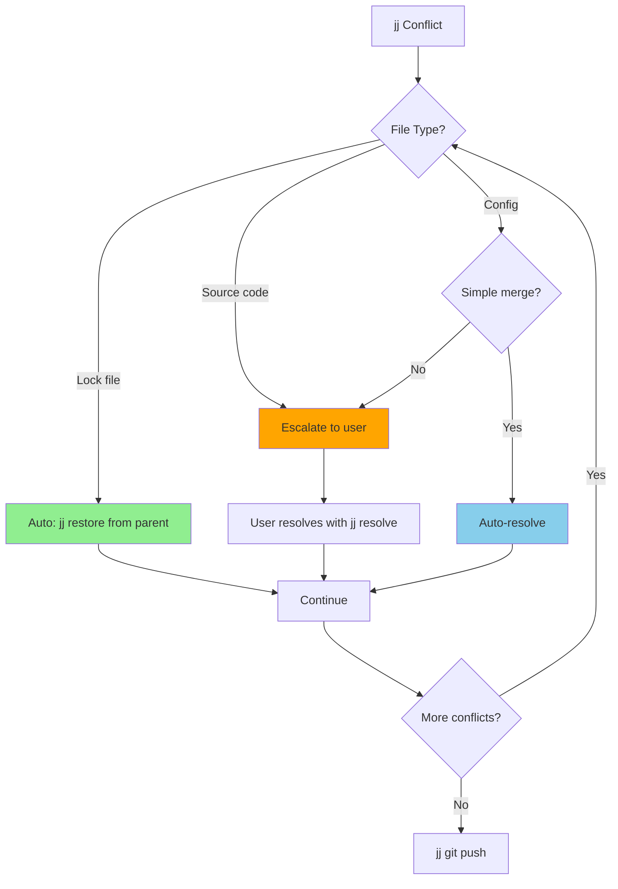
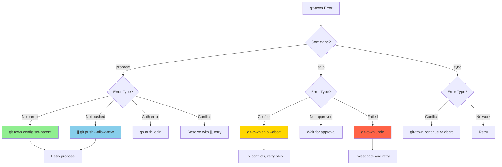
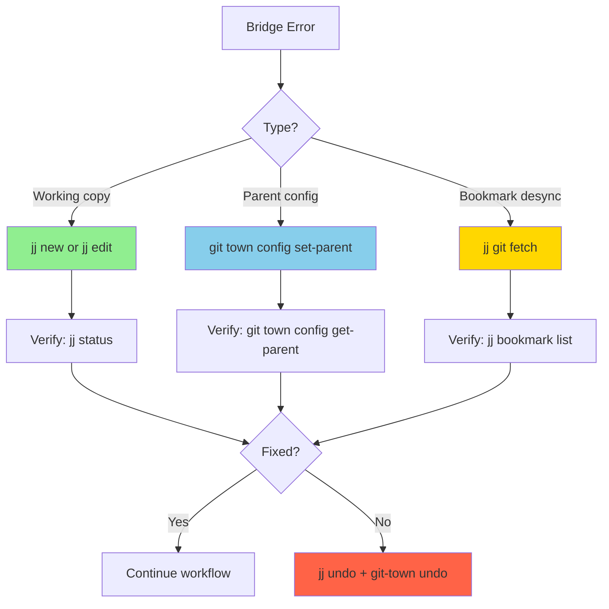
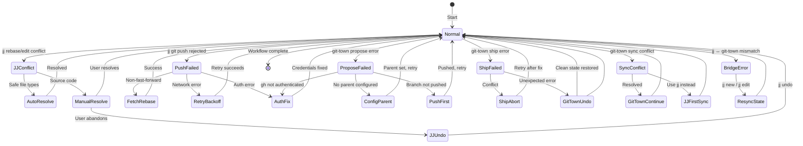

# Jujutsu (jj) + Git-Town Error Handling Guide

> Comprehensive error handling for the jj → git-town → git tool chain

## Table of Contents

1. [Overview](#overview)
2. [Error Categories](#error-categories)
   - [jj Conflict Errors](#1-jj-conflict-errors)
   - [Divergent Bookmark Errors](#2-divergent-bookmark-errors)
   - [Git Push Failures](#3-git-push-failures)
   - [git-town Propose/Ship Errors](#4-git-town-proposeship-errors)
   - [git-town Sync Conflicts](#5-git-town-sync-conflicts)
   - [Bridge Errors (jj ↔ git-town)](#6-bridge-errors-jj--git-town)
   - [jj-stack (jst) Errors](#7-jj-stack-jst-errors)
3. [Error Recovery State Machine](#error-recovery-state-machine)
4. [Agent Decision Logic Matrix](#agent-decision-logic-matrix)
5. [Best Practices](#best-practices)

---

## Overview

The jj → git-town → git tool chain has error points at each layer:

- **jj layer**: Conflicts during rebase/edit, divergent bookmarks, operation failures
- **git-town layer**: Propose failures, ship failures, sync conflicts, parent misconfiguration
- **git layer**: Push rejections, auth failures, network errors

**Error Handling Philosophy**:
- **Detect Early**: Validate at each layer before proceeding
- **Diagnose by Layer**: Identify which tool produced the error
- **Resolve at Source**: Fix jj errors with jj, git-town errors with git-town
- **Leverage Undo**: Both jj (`jj undo`) and git-town (`git-town undo`) have undo
- **Preserve State**: Never leave repository in broken state

---

## Error Categories

### 1. jj Conflict Errors

**Description**: Occurs when jj records conflicts during rebase or mid-stack edits. Unlike git, jj does NOT block on conflicts - it records them in the commit tree.

#### Detection

```bash
# Revset-based detection (preferred)
CONFLICTS=$(jj log -r "trunk()..@ & conflicts()" -T 'change_id ++ "\n"' --no-graph)
if [ -n "$CONFLICTS" ]; then
    echo "Conflicts found:"
    echo "$CONFLICTS"
fi
```

#### Resolution

```bash
# Resolve bottom-up (prevents cascading conflicts)
conflicts=$(jj log -r "trunk()..@ & conflicts()" -T 'change_id ++ "\n"' --no-graph --reversed)

for change in $conflicts; do
    jj edit "$change"
    jj resolve --list          # Show conflicted files
    jj resolve                 # Launch merge tool
    # Or: manually edit files to remove conflict markers
done
```

#### Auto-Resolution for Safe Files

```bash
auto_resolve() {
    local change_id="$1"
    jj edit "$change_id"

    for file in $(jj resolve --list 2>/dev/null); do
        case "$file" in
            *.lock|package-lock.json|yarn.lock)
                jj restore --from @- "$file"
                echo "Auto-resolved lock file: $file"
                ;;
            *.cs|*.ts|*.js|*.py)
                echo "ESCALATE: Source code conflict in $file"
                return 1
                ;;
        esac
    done
}
```

#### Decision Tree



---

### 2. Divergent Bookmark Errors

**Description**: A bookmark points to multiple changes, typically after force-push from another client.

#### Detection

```bash
DIVERGENT=$(jj bookmark list 2>&1 | grep -i "divergent\|conflict")
if [ -n "$DIVERGENT" ]; then
    echo "Divergent bookmarks: $DIVERGENT"
fi
```

#### Resolution

```bash
# Force-set bookmark to the correct change
jj bookmark set <bookmark-name> -r <correct-change-id>
jj git push -b <bookmark-name>
```

---

### 3. Git Push Failures

**Description**: `jj git push` fails due to remote rejection, auth issues, or network errors.

#### Detection

```bash
OUTPUT=$(jj git push -b my-bookmark 2>&1)
EXIT_CODE=$?

if [ $EXIT_CODE -ne 0 ]; then
    if echo "$OUTPUT" | grep -qi "rejected\|non-fast-forward"; then
        echo "Non-fast-forward rejection"
    elif echo "$OUTPUT" | grep -qi "auth\|permission\|forbidden"; then
        echo "Authentication error"
    elif echo "$OUTPUT" | grep -qi "network\|timeout"; then
        echo "Network error"
    fi
fi
```

#### Resolution

**Non-fast-forward**:
```bash
jj git fetch
jj rebase -b <stack-root> -d main
jj git push -b "glob:stack-*"
```

**Network error** (retry with backoff):
```bash
for i in 1 2 3; do
    sleep $((i * 5))
    jj git push -b "glob:stack-*" && break
done
```

**Auth error**:
```bash
echo "Fix authentication:"
echo "  SSH: ssh -T git@github.com"
echo "  gh: gh auth login"
```

---

### 4. git-town Propose/Ship Errors

**Description**: git-town operations fail during PR creation or branch shipping.

#### Propose Failures

**Detection**:
```bash
OUTPUT=$(git-town propose --title "..." --body "..." 2>&1)
EXIT_CODE=$?

case $EXIT_CODE in
    5) echo "Merge conflict during propose" ;;
    6) echo "Uncommitted changes" ;;
    7) echo "Remote error" ;;
esac
```

**Common causes and fixes**:

| Error | Cause | Fix |
|-------|-------|-----|
| "branch has no parent" | git-town parent not configured | `git town config set-parent <branch> <parent>` |
| "gh not authenticated" | gh CLI not logged in | `gh auth login` |
| "branch not pushed" | Bookmark not pushed to remote | `jj git push -b <bookmark> --allow-new` |
| Exit code 5 | Merge conflict | Resolve with jj, then retry |
| Exit code 6 | Uncommitted changes | `jj new` to create clean state |

**Parent not configured** (most common):
```bash
# Before proposing, always set parent
git town config set-parent stack-1-auth main

# Verify
git checkout stack-1-auth
git town config get-parent  # Should show: main
```

#### Ship Failures

**Detection**:
```bash
OUTPUT=$(git-town ship 2>&1)
EXIT_CODE=$?

if [ $EXIT_CODE -ne 0 ]; then
    if echo "$OUTPUT" | grep -qi "conflict"; then
        echo "Merge conflict during ship"
    elif echo "$OUTPUT" | grep -qi "not merged\|checks"; then
        echo "PR not approved or checks failing"
    fi
fi
```

**Resolution**:
```bash
# Merge conflict during ship
git-town ship --abort           # Abort and return to pre-ship state
# Fix conflicts, then retry
git-town ship

# Or undo entirely
git-town undo
```

#### Decision Tree



---

### 5. git-town Sync Conflicts

**Description**: `git-town sync` encounters merge conflicts while syncing with parent/remote.

#### Detection

```bash
git-town sync
EXIT_CODE=$?

if [ $EXIT_CODE -eq 5 ]; then
    echo "Merge conflict during sync"
    git status  # Shows conflicted files
fi
```

#### Resolution

```bash
# Option 1: Resolve and continue
# ... resolve conflicts in files ...
git add <resolved-files>
git-town continue

# Option 2: Abort
git-town sync --abort

# Option 3: Use jj-first sync instead (recommended for stacks)
git-town sync --abort
jj git fetch
jj rebase -b <stack-root> -d main
# jj handles conflicts without blocking
jj git push -b "glob:stack-*"
```

**Agent recommendation**: For stacked workflows, prefer jj-first sync over git-town sync to leverage jj's non-blocking conflict handling.

---

### 6. Bridge Errors (jj ↔ git-town)

**Description**: Errors at the integration point between jj and git-town, typically involving working copy state or parent misconfiguration.

#### Working Copy State Mismatch

**Symptom**: After `git checkout` for git-town, jj shows unexpected state.

```bash
# After git-town operations, resync jj
jj new  # Creates new change, resyncs working copy

# Or edit a specific change
jj edit <change-id>
```

#### Parent Configuration Drift

**Symptom**: After jj rebase, git-town's parent config is stale.

```bash
# After rebasing stack onto main (post-ship)
# Update git-town parents
update_parents_after_ship() {
    local shipped_branch="$1"
    local remaining_branches=("${@:2}")

    for branch in "${remaining_branches[@]}"; do
        local current_parent
        current_parent=$(git checkout "$branch" 2>/dev/null && git town config get-parent 2>/dev/null)

        if [ "$current_parent" = "$shipped_branch" ]; then
            git town config set-parent "$branch" main
            echo "Updated parent of $branch: $shipped_branch -> main"
        fi
    done
}
```

#### Bookmark-Branch Desync

**Symptom**: jj bookmark points to different commit than git branch after git-town operation.

```bash
# After git-town ship or sync, re-sync bookmarks
jj git fetch                    # Import git state into jj
jj bookmark list                # Verify bookmark state

# If bookmark is wrong, force-set
jj bookmark set <name> -r <correct-change-id>
```

#### Decision Tree



---

### 7. jj-stack (jst) Errors

**Description**: Errors from the optional jj-stack companion tool.

#### jst not installed

```bash
if ! command -v jst &> /dev/null; then
    echo "jst not available. Falling back to jj + git-town workflow."
    # Use manual bookmark + push + git-town propose
fi
```

#### jst submit failure

```bash
OUTPUT=$(jst submit 2>&1)
if [ $? -ne 0 ]; then
    echo "jst submit failed. Falling back to manual workflow."
    # Create bookmarks manually
    # Push with jj
    # Configure git-town parents
    # Propose with git-town
fi
```

---

## Error Recovery State Machine



---

## Agent Decision Logic Matrix

| Error | Layer | Detection | Auto-Recovery? | Action | Escalation |
|-------|-------|-----------|----------------|--------|------------|
| Lock file conflict | jj | File extension | Yes | `jj restore` | Never |
| Source code conflict | jj | File extension | No | Show diff to user | Always |
| Divergent bookmark | jj | `jj bookmark list` | Yes | `jj bookmark set` | Multiple divergences |
| Non-fast-forward push | git | stderr | Yes | Fetch + rebase + retry | Conflicts after rebase |
| Network error | git | stderr | Yes | Retry with backoff | Max retries exceeded |
| Auth error | git | stderr | No | Guide user | Always |
| No parent configured | git-town | stderr/exit 1 | Yes | `git town config set-parent` | Never |
| Branch not pushed | git-town | stderr | Yes | `jj git push --allow-new` | Never |
| Propose conflict | git-town | exit 5 | Maybe | Resolve with jj, retry | Complex conflicts |
| Ship conflict | git-town | exit 5 | No | `git-town ship --abort` | Always |
| Ship not approved | git-town | stderr | No | Wait for approval | Always |
| Sync conflict | git-town | exit 5 | Maybe | Continue or jj-first sync | Complex conflicts |
| Working copy mismatch | bridge | jj status | Yes | `jj new` or `jj edit` | Never |
| Parent config drift | bridge | `get-parent` check | Yes | `set-parent` | Never |
| Bookmark desync | bridge | `jj bookmark list` | Yes | `jj git fetch` | Never |
| jst not available | jst | `command -v jst` | Yes | Fall back to jj+git-town | Never |

---

## Best Practices

### 1. Validate Before Each Layer Transition

```bash
# Before jj → git-town bridge
validate_bridge() {
    # Check no conflicts
    if jj log -r "trunk()..@ & conflicts()" --no-graph -T '"x"' | grep -q x; then
        echo "ERROR: Resolve jj conflicts before git-town operations"
        return 1
    fi

    # Check bookmarks pushed
    jj git push -b "glob:stack-*" 2>/dev/null || {
        echo "ERROR: Push bookmarks first"
        return 1
    }

    # Check git-town parents configured
    for bookmark in $(jj bookmark list "glob:stack-*" -T 'name ++ "\n"' 2>/dev/null); do
        git checkout "$bookmark" 2>/dev/null
        if ! git town config get-parent > /dev/null 2>&1; then
            echo "ERROR: Configure parent for $bookmark"
            return 1
        fi
    done

    return 0
}
```

### 2. Use jj undo + git-town undo as Safety Nets

```bash
# If jj operation goes wrong
jj undo

# If git-town operation goes wrong
git-town undo

# If both went wrong, undo in reverse order (git-town first, then jj)
git-town undo
jj undo
```

### 3. Prefer jj-First Sync for Stacks

```bash
# Instead of git-town sync (which may conflict with jj):
jj git fetch
jj rebase -b <stack-root> -d main
jj git push -b "glob:stack-*"
```

### 4. Resolve Conflicts Bottom-Up

```bash
# Get conflicts in bottom-to-top order
jj log -r "trunk()..@ & conflicts()" --no-graph --reversed
# Resolve the bottom-most first to prevent cascading
```

### 5. Check Stack Health Regularly

```bash
stack_health() {
    echo "=== Stack Health ==="
    local count=$(jj log -r "trunk()..@" --no-graph | wc -l)
    local conflicts=$(jj log -r "trunk()..@ & conflicts()" --no-graph | wc -l)
    local bookmarked=$(jj log -r "trunk()..@ & bookmarks()" --no-graph | wc -l)
    echo "Changes: $count | Conflicts: $conflicts | Bookmarked: $bookmarked"
    [ "$conflicts" -gt 0 ] && return 1
    return 0
}
```

---

*Last updated: 2026-02-06*
*jj-vcs error handling v1.0.0 (jj → git-town → git)*
