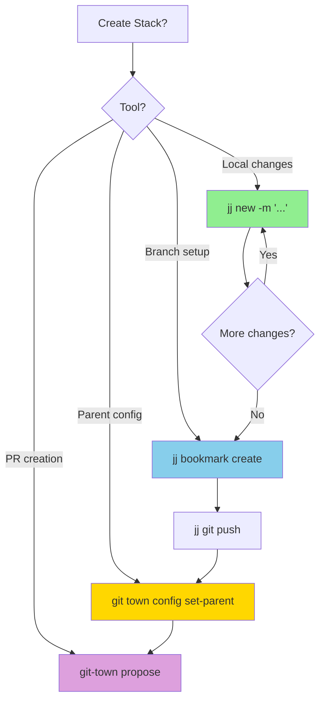
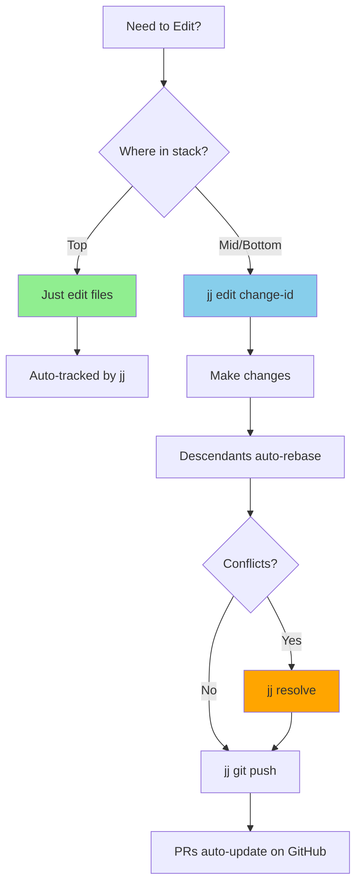
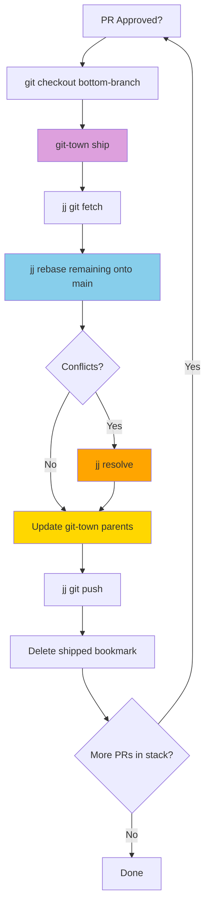

# Jujutsu (jj) + Git-Town Reference Documentation

> Command reference, exit codes, revsets, and agent integration patterns for jj + git-town stacked PR workflows

**Tool Chain**: `jj (local) → git-town (remote workflow) → git (transport)`

## Table of Contents

1. [jj Change Management](#jj-change-management)
2. [jj Stack Operations](#jj-stack-operations)
3. [jj Inspection](#jj-inspection)
4. [jj Bookmarks](#jj-bookmarks)
5. [jj Git Interop](#jj-git-interop)
6. [jj Conflict Resolution](#jj-conflict-resolution)
7. [jj Operations (Undo/Redo)](#jj-operations-undoredo)
8. [git-town Integration Commands](#git-town-integration-commands)
9. [Bridge: jj → git-town](#bridge-jj--git-town)
10. [Revset Reference](#revset-reference)
11. [Exit Codes](#exit-codes)
12. [jj-stack (jst) Commands](#jj-stack-jst-commands)
13. [Agent Integration Patterns](#agent-integration-patterns)
14. [Decision Trees](#decision-trees)

---

## jj Change Management

### jj new

Create a new change as a child of the current change.

```bash
jj new                                    # New empty change on top of current
jj new -m "feat: add authentication"      # With description
jj new main -m "feat: start feature"      # On top of specific revision
jj new <id-1> <id-2> -m "merge"           # Merge commit
```

### jj commit

Finalize current working-copy change, create new empty child.

```bash
jj commit -m "feat: implement login form"
```

**Agent notes**: Prefer `jj new -m "..."` over `jj commit` for stack building.

### jj describe

Update the description of a change.

```bash
jj describe -m "feat: updated description"
jj describe <change-id> -m "fix: corrected bug"
```

### jj edit

Switch working copy to an existing change for modification.

```bash
jj edit <change-id>                       # By change ID (stable!)
jj edit "description('auth')"             # By revset
```

**Agent notes**: Primary mechanism for mid-stack editing. Descendants auto-rebase after edits.

### jj abandon

Discard a change. Descendants are reparented to the abandoned change's parent.

```bash
jj abandon                                # Current change
jj abandon <change-id>                    # Specific change
jj abandon -r "<id-1>::<id-2>"            # Range
```

---

## jj Stack Operations

### jj rebase

Move changes to a new parent.

```bash
jj rebase -b @ -d main                   # Current + descendants onto main
jj rebase -b <change-id> -d main         # Specific branch onto main
jj rebase -r <change-id> -d main         # Single change only
```

**Flags**: `-b` = branch (change + descendants), `-r` = revision only, `-d` = destination, `-s` = source + descendants

### jj squash

Move changes from current commit into its parent.

```bash
jj squash                                 # All changes into parent
jj squash --into <parent-id> <file>       # Specific files
```

### jj split

Split the current change into two sequential changes.

```bash
jj split <file-1> <file-2>               # Specified files go in first change
```

---

## jj Inspection

### jj log

Show the revision graph.

```bash
jj log                                    # Default log
jj log -r "trunk()..@"                    # Current stack
jj log -r "bookmarks()"                   # Bookmarked changes
jj log --limit 10                         # Last 10
jj log -r "trunk()..@" -T 'change_id ++ " " ++ description.first_line() ++ "\n"'  # Machine-parseable
jj log -r "trunk()..@" -p                 # With patches
```

### jj status

Show working copy status.

```bash
jj status
```

### jj diff

Show changes.

```bash
jj diff                                   # Current change
jj diff -r <change-id>                    # Specific change
jj diff --from <id-1> --to <id-2>         # Between changes
jj diff --stat                            # Summary view
```

### jj evolog

Show evolution log of a change.

```bash
jj evolog                                 # Current change
jj evolog -r <change-id>                  # Specific change
```

---

## jj Bookmarks

Bookmarks map to git branches in colocated repos. git-town manages these branches for remote operations.

### jj bookmark create

```bash
jj bookmark create my-feature             # At current change
jj bookmark create stack-1-auth -r <id>   # At specific revision
```

**Naming convention**: `stack-N-description` for stacked PRs (enables `glob:stack-*` batch operations).

### jj bookmark set

```bash
jj bookmark set my-feature                # Move to current change
jj bookmark set stack-1-auth -r <id>      # Move to specific revision
```

### jj bookmark move

```bash
jj bookmark move my-feature --to @
```

### jj bookmark delete

```bash
jj bookmark delete my-feature
jj git push -b my-feature                 # Push deletion to remote
```

### jj bookmark list

```bash
jj bookmark list                          # All bookmarks
jj bookmark list "glob:stack-*"           # Stack bookmarks only
jj bookmark list --all                    # Include tracking status
```

---

## jj Git Interop

### jj git init

```bash
jj git init --colocate                    # On existing git repo (recommended)
```

### jj git fetch

```bash
jj git fetch                              # From all remotes
jj git fetch --remote origin              # Specific remote
```

### jj git push

```bash
jj git push -b my-feature                 # Single bookmark
jj git push -b "glob:stack-*"             # Batch push
jj git push --all                         # All bookmarks
jj git push -b my-feature --allow-new     # First-time push
```

---

## jj Conflict Resolution

jj records conflicts in commits rather than blocking operations.

### jj resolve

```bash
jj resolve                                # All conflicts in current change
jj resolve <file-path>                    # Specific file
jj resolve --list                         # List conflicted files
```

### jj restore

```bash
jj restore <file-path>                    # From parent
jj restore --from <change-id> <file>      # From specific revision
```

---

## jj Operations (Undo/Redo)

### jj undo

```bash
jj undo                                   # Undo last operation
```

### jj op log

```bash
jj op log                                 # Operation history
jj op log --limit 10
```

---

## git-town Integration Commands

These git-town commands are used for remote workflow operations in the jj + git-town flow.

### git-town propose

Create a PR for the current branch. git-town automatically targets the configured parent branch.

```bash
# Switch to the bookmark's branch, then propose
git checkout stack-1-auth-refactor
git-town propose --title "refactor: Extract auth service" --body "Part 1 of stack."

# Draft PR
git-town propose --title "WIP: Auth refactor" --draft
```

**Agent notes**: Always configure git-town parent before proposing. Use `git town config set-parent <branch> <parent>`.

### git-town ship

Merge a branch to its parent, delete the branch locally and remotely.

```bash
git checkout stack-1-auth-refactor
git-town ship
```

**Agent notes**: Ship from bottom of stack upward. After shipping, update remaining stack with jj (rebase + push).

### git-town sync

Synchronize current branch with parent and remote.

```bash
git checkout stack-2-auth-oauth
git-town sync
```

**Agent notes**: For full-stack sync, prefer jj-first approach (`jj git fetch` + `jj rebase`). Use `git-town sync` for single-branch operations.

### git-town config

Configure branch parent relationships.

```bash
# Set parent branch
git town config set-parent stack-1-auth main
git town config set-parent stack-2-oauth stack-1-auth

# Verify parent
git town config get-parent          # (while on the branch)

# Set main branch
git town config set-main-branch main
```

### git-town undo

Undo the most recent git-town operation.

```bash
git-town undo
```

### git-town continue

Continue after resolving conflicts during a git-town operation.

```bash
git-town continue
```

---

## Bridge: jj → git-town

The critical bridge step connects jj's local change management to git-town's remote workflow.

### Full Bridge Sequence

```bash
# 1. jj: Create changes (local)
jj new main -m "feat: first change"
# ... edits ...
jj new -m "feat: second change"
# ... edits ...

# 2. jj: Create bookmarks (→ git branches)
jj bookmark create stack-1-first -r <change-id-1>
jj bookmark create stack-2-second -r <change-id-2>

# 3. jj: Push to remote
jj git push -b "glob:stack-*" --allow-new

# 4. git-town: Configure parent tracking
git town config set-parent stack-1-first main
git town config set-parent stack-2-second stack-1-first

# 5. git-town: Create PRs
git checkout stack-1-first
git-town propose --title "First change"
git checkout stack-2-second
git-town propose --title "Second change"

# 6. Return to jj context
jj new
```

### After Mid-Stack Edit

```bash
# jj: Edit change (descendants auto-rebase)
jj edit <change-id-1>
# ... make fixes ...

# jj: Push updated branches
jj git push -b "glob:stack-*"

# git-town: PRs auto-update (no action needed)
```

### After Bottom PR Merged

```bash
# git-town: Ship the bottom branch
git checkout stack-1-first
git-town ship

# jj: Rebase remaining stack
jj git fetch
jj rebase -b <change-id-2> -d main

# git-town: Update parent for next branch
git town config set-parent stack-2-second main

# jj: Push updated state
jj git push -b "glob:stack-*"

# Cleanup
jj bookmark delete stack-1-first
```

---

## Revset Reference

| Expression | Meaning | Use Case |
|------------|---------|----------|
| `@` | Working copy change | Current change |
| `@-` | Parent of working copy | Previous change |
| `trunk()` | Main/master branch | Stack base |
| `trunk()..@` | Changes between trunk and working copy | View current stack |
| `@::` | Current change and all descendants | Everything from here down |
| `::@` | Current change and all ancestors | Everything up to here |
| `bookmarks()` | All bookmarked changes | Changes with bookmarks |
| `mine()` | Changes authored by current user | My changes |
| `description("text")` | Changes with matching description | Find by message |
| `conflicts()` | Changes with unresolved conflicts | Find broken changes |
| `empty()` | Empty changes | Find cleanup targets |
| `trunk()..@ & conflicts()` | Conflicted changes in stack | Pre-push check |
| `trunk()..@ ~ bookmarks()` | Unbookmarked changes in stack | Need bookmark assignment |

---

## Exit Codes

### jj Exit Codes

| Exit Code | Meaning | Agent Action |
|-----------|---------|--------------|
| 0 | Success | Continue workflow |
| 1 | General error | Parse stderr for specifics |
| 2 | CLI usage error | Fix command syntax |
| 3 | Internal error | Report to user |

### git-town Exit Codes

| Exit Code | Constant | Meaning | Agent Action |
|-----------|----------|---------|--------------|
| 0 | `EXIT_SUCCESS` | Success | Continue workflow |
| 1 | `EXIT_NOT_FOUND` | git-town not installed | Install git-town |
| 2 | `EXIT_NOT_CONFIGURED` | git-town not configured | Run config setup |
| 3 | `EXIT_OLD_VERSION` | Version < 14.0.0 | Upgrade git-town |
| 5 | `EXIT_MERGE_CONFLICT` | Merge conflict | Resolve conflicts, continue |
| 6 | `EXIT_UNCOMMITTED_CHANGES` | Uncommitted changes | Commit or stash |
| 7 | `EXIT_REMOTE_ERROR` | Remote operation failed | Check connectivity |

### Validation Script Exit Codes

| Exit Code | Meaning |
|-----------|---------|
| 0 | All checks passed |
| 1 | jj not installed |
| 2 | Not a jj repository |
| 3 | jj version < 0.25.0 |
| 4 | Not a git repository |
| 5 | gh CLI not ready |
| 6 | git-town not ready |

---

## jj-stack (jst) Commands

Optional companion tool for automated PR management.

### jst (status)

```bash
jst                                       # View stack with PR status
```

### jst submit

```bash
jst submit                                # Create/update all PRs in stack
```

### jst sync

```bash
jst sync                                  # Fetch + rebase + push
```

---

## Agent Integration Patterns

### Pattern 1: Full Stack Creation

```bash
# Validate environment
bash scripts/validate-jj-vcs.sh || exit $?

# Create stack (jj)
jj new main -m "feat: first change"
CHANGE_1=$(jj log -r @ -T 'change_id' --no-graph)
# ... make changes ...

jj new -m "feat: second change"
CHANGE_2=$(jj log -r @ -T 'change_id' --no-graph)
# ... make changes ...

# Bridge to git-town
jj bookmark create stack-1-first -r "$CHANGE_1"
jj bookmark create stack-2-second -r "$CHANGE_2"
jj git push -b "glob:stack-*" --allow-new

git town config set-parent stack-1-first main
git town config set-parent stack-2-second stack-1-first

# Create PRs (git-town)
git checkout stack-1-first
git-town propose --title "First change"
git checkout stack-2-second
git-town propose --title "Second change"

# Return to jj
jj new
```

### Pattern 2: Mid-Stack Edit + Update

```bash
# Edit with jj
jj edit "$CHANGE_1"
# ... fixes ...

# Push (jj) - PRs auto-update
jj git push -b "glob:stack-*"
```

### Pattern 3: Ship Bottom + Rebase Stack

```bash
# Ship with git-town
git checkout stack-1-first
git-town ship

# Rebase with jj
jj git fetch
jj rebase -b "$CHANGE_2" -d main

# Update git-town config
git town config set-parent stack-2-second main

# Push with jj
jj git push -b "glob:stack-*"
jj bookmark delete stack-1-first
```

### Pattern 4: Conflict Detection

```bash
CONFLICTS=$(jj log -r "trunk()..@ & conflicts()" -T 'change_id ++ "\n"' --no-graph)
if [ -n "$CONFLICTS" ]; then
    echo "Resolve conflicts before proceeding:"
    echo "$CONFLICTS"
fi
```

### Pattern 5: Change ID Extraction

```bash
CHANGE_ID=$(jj log -r @ -T 'change_id' --no-graph)
jj log -r "trunk()..@" -T 'change_id ++ " " ++ description.first_line() ++ "\n"' --no-graph
```

---

## Decision Trees

### Stack Creation Decision Tree



### Edit + Update Decision Tree



### Ship + Cleanup Decision Tree



---

*Last updated: 2026-02-06*
*jj-vcs skill v1.0.0 (jj → git-town → git)*
