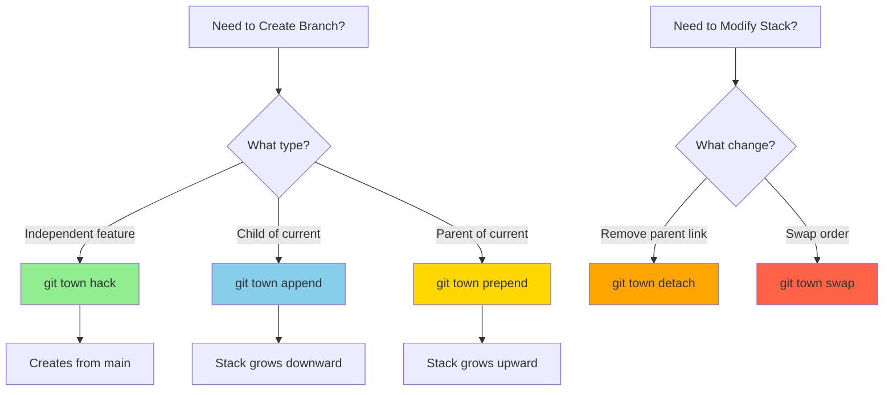
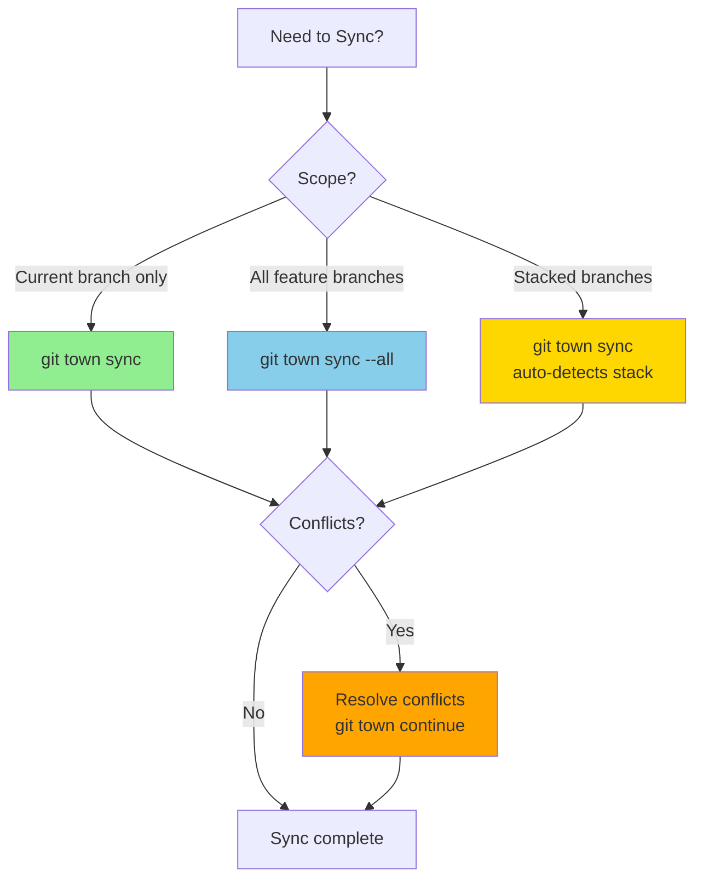
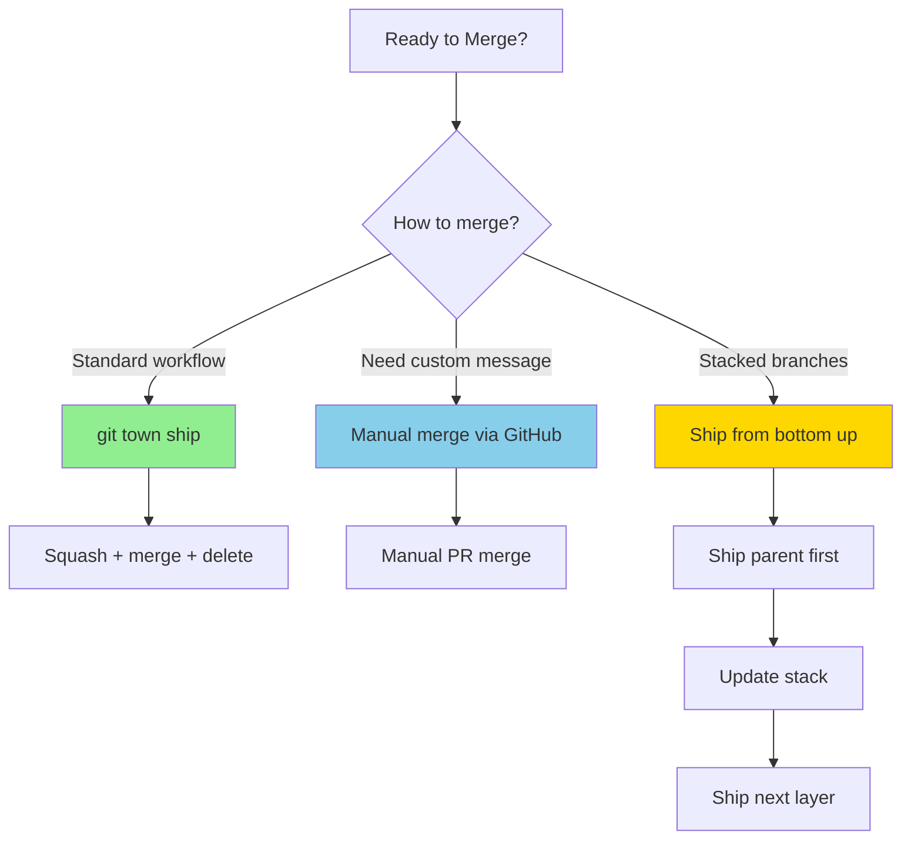
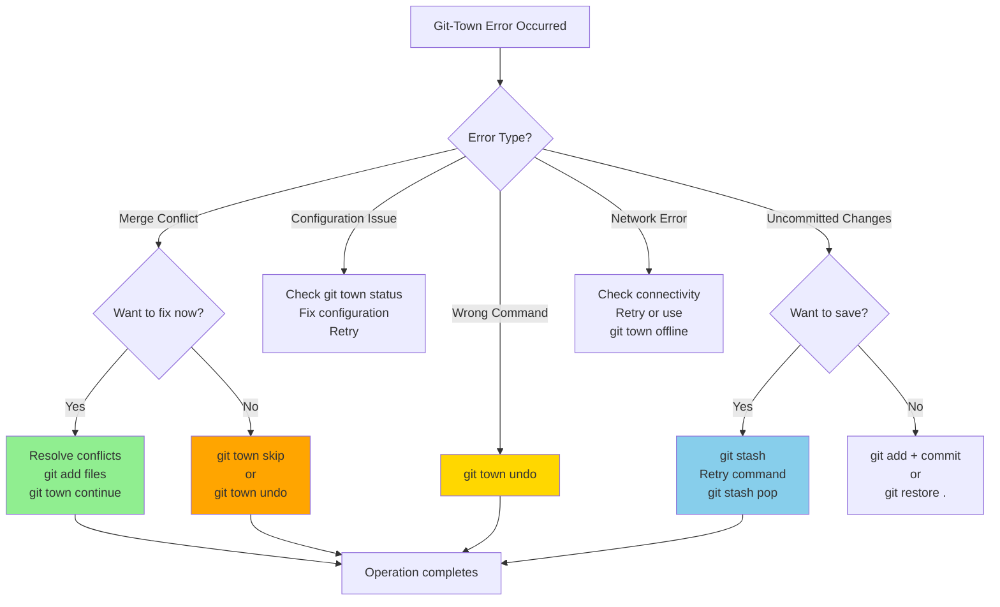

# Git-Town Reference Documentation

> Agent integration patterns, exit codes, and decision trees for git-town skill

**Note**: For detailed command documentation, use Context7 MCP (see SKILL.md). This reference focuses on agent-specific integration logic and error handling.

## Table of Contents

1. [Exit Codes](#exit-codes)
2. [Decision Trees](#decision-trees)
3. [Agent Integration Patterns](#agent-integration-patterns)
4. [Documentation Sources](#documentation-sources)

---

## Exit Codes

Git-town uses standardized exit codes to communicate command results. Agents must handle these codes appropriately to ensure proper workflow execution.

### Standard Exit Codes

| Exit Code | Constant | Meaning | Agent Action |
|-----------|----------|---------|--------------|
| 0 | `EXIT_SUCCESS` | Command completed successfully | Continue workflow |
| 1 | `EXIT_NOT_FOUND` | git-town not installed or not in PATH | Install git-town, halt workflow |
| 2 | `EXIT_NOT_CONFIGURED` | git-town not configured for repository | Run `git town config setup`, halt workflow |
| 3 | `EXIT_OLD_VERSION` | git-town version < 14.0.0 | Upgrade git-town, halt workflow |
| 4 | `EXIT_NOT_GIT_REPO` | Not in a git repository | Navigate to git repo, halt workflow |
| 5 | `EXIT_MERGE_CONFLICT` | Merge conflict occurred | Resolve conflicts, continue or abort |
| 6 | `EXIT_UNCOMMITTED_CHANGES` | Uncommitted changes prevent operation | Commit or stash changes, retry |
| 7 | `EXIT_REMOTE_ERROR` | Remote operation failed (network, auth) | Check connectivity/credentials, retry |
| 8 | `EXIT_BRANCH_NOT_FOUND` | Specified branch does not exist | Verify branch name, halt workflow |
| 9 | `EXIT_INVALID_CONFIG` | Invalid git-town configuration | Fix configuration, retry |
| 10 | `EXIT_USER_ABORT` | User aborted operation | Acknowledge abort, halt workflow |

### Validation Script Exit Codes

The `validate-git-town.sh` script uses a subset of standard exit codes:

```bash
# Exit code constants
EXIT_SUCCESS=0           # All checks passed
EXIT_NOT_FOUND=1         # git-town not installed
EXIT_NOT_CONFIGURED=2    # git-town not configured
EXIT_OLD_VERSION=3       # git-town version too old
EXIT_NOT_GIT_REPO=4      # Not a git repository
```

**Usage Example:**

```bash
#!/usr/bin/env bash
source ./validate-git-town.sh

validate_git_town
EXIT_CODE=$?

case $EXIT_CODE in
    0)
        echo "Validation passed, proceeding with git-town operations"
        ;;
    1)
        echo "ERROR: git-town not installed. Install via: brew install git-town"
        exit 1
        ;;
    2)
        echo "WARNING: git-town not configured. Run: git town config setup"
        exit 2
        ;;
    3)
        echo "ERROR: git-town version too old. Upgrade via: brew upgrade git-town"
        exit 3
        ;;
    4)
        echo "ERROR: Not in a git repository"
        exit 4
        ;;
esac
```

---

## Decision Trees

Visual decision trees for agent workflow logic. These guide agents through complex decisions during git-town operations.

### Branching Strategy Decision Tree

When to use each branching command:



**Decision Logic:**
- **Independent feature**: Use `git town hack` to create from main branch
- **Add layer below**: Use `git town append` to create child branch
- **Add layer above**: Use `git town prepend` to insert parent branch
- **Break dependency**: Use `git town detach` to make branch independent
- **Reorder stack**: Use `git town swap` to change branch order

### Sync Scope Decision Tree

When to sync current branch vs all branches:



**Decision Logic:**
- **Working on one feature**: Use `git town sync` for current branch
- **Maintaining multiple features**: Use `git town sync --all` to update all
- **Stacked branches**: Git-town automatically syncs entire stack
- **Conflicts occur**: Use `git town continue` after resolving

### Completion Strategy Decision Tree

When to use ship vs manual merge:



**Decision Logic:**
- **Standard completion**: Use `git town ship` for automated workflow
- **Custom merge message**: Merge via GitHub UI, then sync locally
- **Stacked branches**: Ship from bottom to top, updating parents after each ship
- **Prototype branch**: Delete locally, don't ship (prototypes aren't merged)

### Error Recovery Decision Tree

How to handle git-town errors:



**Decision Logic:**
- **Merge conflict**: Resolve and `git town continue`, or `git town skip`/`undo`
- **Wrong command**: Use `git town undo` to revert recent operation
- **Configuration issue**: Check `git town status` and fix config
- **Uncommitted changes**: Stash or commit, then retry
- **Network error**: Check connectivity or enable offline mode

---

## Agent Integration Patterns

### Pattern 1: Validation Before Execution

Always validate git-town installation before executing commands:

```bash
# Run validation script
bash packages/git/skills/git-town/scripts/validate-git-town.sh
EXIT_CODE=$?

if [ $EXIT_CODE -ne 0 ]; then
    # Handle validation failure based on exit code
    case $EXIT_CODE in
        1) echo "Install git-town" ;;
        2) echo "Configure git-town" ;;
        3) echo "Upgrade git-town" ;;
        4) echo "Not in git repo" ;;
    esac
    exit $EXIT_CODE
fi

# Proceed with git-town commands
git town hack feature/my-branch
```

### Pattern 2: Non-Interactive Execution

Always use explicit CLI flags to avoid interactive prompts:

```bash
# ✅ GOOD - Explicit flags, non-interactive
git town hack feature/user-auth --parent main

# ❌ BAD - Interactive prompt for parent branch
git town hack feature/user-auth
```

### Pattern 3: Interview Template Usage

Use interview templates to gather user input before executing commands:

```bash
# 1. Load interview template
TEMPLATE="packages/git/skills/git-town/templates/interview-branch-creation.md"

# 2. Parse required fields: branch_name, base_branch, prototype
# 3. Validate branch_name against pattern: ^[a-z0-9-]+(/[a-z0-9-]+)*$
# 4. Execute with explicit flags

git town hack "$BRANCH_NAME" --parent "$BASE_BRANCH"
```

### Pattern 4: Error Recovery with Decision Trees

Query ERROR_HANDLING.md when errors occur:

```bash
# Execute git-town command
git town sync
EXIT_CODE=$?

if [ $EXIT_CODE -eq 5 ]; then
    # Merge conflict detected
    # Query: git-town:ERROR_HANDLING:merge conflicts
    # Follow decision tree for conflict resolution

    # Option 1: Resolve conflicts
    # ... resolve conflicts in files ...
    git add resolved-files
    git town continue

    # Option 2: Skip or undo
    git town skip  # or git town undo
fi
```

### Pattern 5: Context7 for Command Documentation

Use Context7 MCP for up-to-date command reference:

```javascript
const { createLibraryHelper } = require('@fortium/ensemble-core');

// Create git-town helper
const gitTown = createLibraryHelper('git-town');

if (await gitTown.isAvailable()) {
    // Fetch command documentation from Context7
    const hackDocs = await gitTown.fetchDocs('hack command', 3000);
    const syncDocs = await gitTown.fetchDocs('sync command', 3000);

    // Use fetched docs to guide execution
} else {
    // Show Context7 installation instructions
    console.log(gitTown.getInstructions());

    // Fallback to local REFERENCE.md (this file)
}
```

### Pattern 6: Exit Code Mapping

Map git-town exit codes to agent actions:

```javascript
const exitCodeActions = {
    0: 'continue',           // Success - proceed with workflow
    1: 'install_git_town',   // Not found - install required
    2: 'configure_git_town', // Not configured - run setup
    3: 'upgrade_git_town',   // Old version - upgrade needed
    4: 'navigate_to_repo',   // Not git repo - change directory
    5: 'resolve_conflicts',  // Merge conflict - manual resolution
    6: 'commit_or_stash',    // Uncommitted changes - save work
    7: 'check_network',      // Remote error - verify connectivity
    8: 'verify_branch',      // Branch not found - check name
    9: 'fix_config',         // Invalid config - repair settings
    10: 'acknowledge_abort'  // User abort - halt workflow
};

function handleGitTownExit(exitCode) {
    const action = exitCodeActions[exitCode];
    if (action) {
        executeAction(action);
    } else {
        throw new Error(`Unknown git-town exit code: ${exitCode}`);
    }
}
```

---

## Documentation Sources

### Context7 MCP (Recommended)

For up-to-date git-town command documentation:

```javascript
// Query via Context7
const docs = await fetchLibraryDocs('git-town', 'hack command', 5000);
```

**Topics to query:**
- `'hack command'` - Create feature branches
- `'sync command'` - Synchronize branches
- `'propose command'` - Create pull requests
- `'ship command'` - Merge and cleanup
- `'append command'` - Create child branches
- `'prepend command'` - Insert parent branches
- `'detach command'` - Remove parent relationship
- `'swap command'` - Reorder branches
- `'continue command'` - Resume after conflicts
- `'skip command'` - Skip during multi-branch ops
- `'undo command'` - Revert recent operation
- `'status command'` - Show operation state
- `'offline command'` - Toggle offline mode
- `'config command'` - Configuration management
- `'configuration'` - All config options
- `'troubleshooting'` - Error handling guide
- `'stacked branches'` - Advanced branching

**Benefits:**
- ✅ Always current with latest git-town version
- ✅ Automatic updates when new features released
- ✅ Version-aware documentation
- ✅ No manual maintenance required

### Local Documentation (Fallback)

When Context7 is unavailable:

1. **Exit Codes**: This file (REFERENCE.md) - Exit code handling logic
2. **Decision Trees**: This file (REFERENCE.md) - Agent workflow guidance
3. **Interview Templates**: `templates/` directory - Non-interactive patterns
4. **Error Handling**: ERROR_HANDLING.md - Error recovery decision trees
5. **Quick Start**: SKILL.md - Basic command examples
6. **Official Docs**: https://www.git-town.com/ - Git-town website

### Installation Instructions

If Context7 is not available, show these instructions to users:

```bash
# 1. Find Context7 in MCP catalog
mcp-find --query "context7"

# 2. Install Context7 MCP
mcp-add context7

# 3. Verify installation
# Context7 should now be available

# 4. Retry your git-town command
```

---

## Summary

This reference provides:
- ✅ **Exit codes** - Agent error handling logic (local)
- ✅ **Decision trees** - Workflow guidance (local)
- ✅ **Integration patterns** - Best practices (local)
- 🌐 **Command documentation** - Via Context7 (remote, up-to-date)

**Recommended workflow:**
1. Check Context7 availability: `checkContext7Available()`
2. If available: Query command docs via Context7
3. If not: Use local fallback docs + show install instructions
4. Always use: Exit codes, decision trees, interview templates (local)

---

*Last updated: 2025-12-31*
*Context7 integration added for dynamic documentation*
