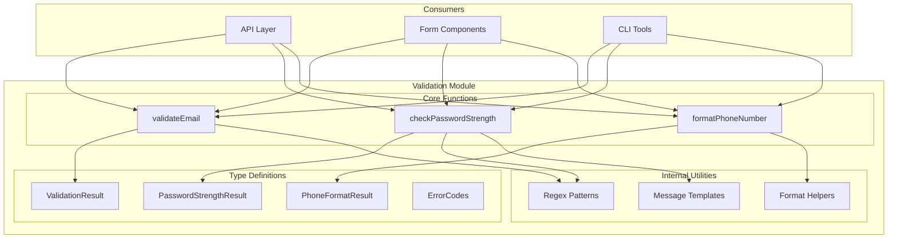
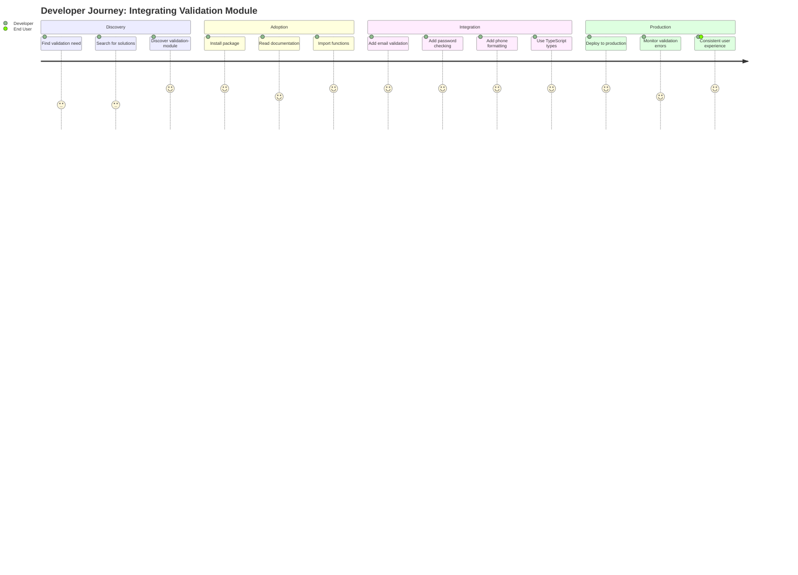

# Product Requirements Document: Validation Module

| Field | Value |
|-------|-------|
| **Version** | 1.0.0 |
| **Status** | Draft |
| **Created** | 2026-01-16 |
| **Last Updated** | 2026-01-16 |
| **Author** | Product Manager |
| **Stakeholders** | Development Team, API Consumers, QA Team |

---

## Changelog

| Version | Date | Author | Changes |
|---------|------|--------|---------|
| 1.0.0 | 2026-01-16 | Product Manager | Initial PRD creation |

---

## 1. Product Summary

### 1.1 Problem Statement

Developers frequently need to validate user input across applications, including email addresses, passwords, and phone numbers. Currently, teams either:

1. Write custom validation logic repeatedly across projects, leading to inconsistent implementations
2. Use heavyweight validation libraries that include unnecessary features, increasing bundle size
3. Lack proper TypeScript type definitions, reducing developer experience and compile-time safety

This results in:
- Duplicated effort across projects
- Inconsistent validation behavior
- Runtime errors due to missing type safety
- Increased maintenance burden

### 1.2 Proposed Solution

Create a lightweight, strongly-typed TypeScript validation module that provides:

- **Email validation** with RFC 5322 compliance checking
- **Password strength checking** with configurable rules and detailed feedback
- **Phone number formatting** with support for common formats
- **TypeScript types** for all validation results, enabling compile-time safety

### 1.3 Value Proposition

| Stakeholder | Value Delivered |
|-------------|-----------------|
| Developers | Type-safe validation functions with excellent DX |
| Projects | Consistent validation behavior across applications |
| Teams | Reduced code duplication and maintenance burden |
| End Users | Better UX through consistent, accurate validation feedback |

### 1.4 Solution Architecture

---

## 2. User Analysis

### 2.1 Target Users

| User Type | Description | Primary Needs |
|-----------|-------------|---------------|
| Frontend Developers | Build forms and user interfaces | Client-side validation with immediate feedback |
| Backend Developers | Build APIs and services | Server-side validation with detailed error information |
| Full-Stack Developers | Work across the stack | Consistent validation logic shareable between client and server |

### 2.2 User Personas

#### Persona 1: Sarah - Frontend Developer

| Attribute | Details |
|-----------|---------|
| **Role** | Senior Frontend Developer |
| **Experience** | 5 years with TypeScript/React |
| **Goals** | Provide users with instant, helpful validation feedback |
| **Pain Points** | Inconsistent validation across forms; poor TypeScript support in existing libraries |
| **Success Criteria** | Type-safe validation with descriptive error messages |

#### Persona 2: Marcus - Backend Developer

| Attribute | Details |
|-----------|---------|
| **Role** | Backend Developer |
| **Experience** | 3 years with Node.js/TypeScript |
| **Goals** | Validate API inputs reliably and return structured errors |
| **Pain Points** | Validation logic duplicated from frontend; unclear error codes |
| **Success Criteria** | Structured validation results with error codes for API responses |

#### Persona 3: Alex - Full-Stack Developer

| Attribute | Details |
|-----------|---------|
| **Role** | Full-Stack Developer |
| **Experience** | 4 years with TypeScript |
| **Goals** | Share validation logic between frontend and backend |
| **Pain Points** | Different validation implementations causing sync issues |
| **Success Criteria** | Single source of truth for validation across the stack |

### 2.3 User Journey

---

## 3. Goals and Non-Goals

### 3.1 Goals

| ID | Goal | Success Metric | Priority |
|----|------|----------------|----------|
| G1 | Provide type-safe email validation | 100% TypeScript coverage; zero any types | P0 |
| G2 | Implement password strength checking with detailed feedback | Return strength score (0-4) and improvement suggestions | P0 |
| G3 | Support phone number formatting for common patterns | Support US, UK, and international formats | P0 |
| G4 | Export comprehensive TypeScript types | All public APIs have explicit type definitions | P0 |
| G5 | Maintain minimal bundle size | Final bundle under 10KB minified | P1 |
| G6 | Achieve high test coverage | Unit test coverage >= 60% | P1 |
| G7 | Provide clear, actionable error messages | Each validation failure includes human-readable message | P1 |

### 3.2 Non-Goals

| ID | Non-Goal | Rationale |
|----|----------|-----------|
| NG1 | Real-time email deliverability checking | Requires external API calls; out of scope for synchronous validation |
| NG2 | Internationalized phone number parsing with carrier detection | Requires large datasets; use libphonenumber for advanced needs |
| NG3 | Password breach database checking (Have I Been Pwned integration) | Requires network requests; should be separate async utility |
| NG4 | Form framework integration (React Hook Form, Formik adapters) | Keep module framework-agnostic; consumers can wrap as needed |
| NG5 | Localization/i18n for error messages | Initial version English-only; i18n can be added in v2.0 |
| NG6 | Credit card or SSN validation | Different security domain; would expand module scope significantly |
| NG7 | Custom regex pattern configuration at runtime | Increases complexity; users needing custom patterns can fork or extend |

---

## 4. Feature Requirements

### 4.1 P0 Features (Must Have)

#### F1: Email Validation Function

**User Story:** As a developer, I want to validate email addresses so that I can ensure users provide valid contact information.

**Description:** Implement a `validateEmail` function that checks email addresses against RFC 5322 patterns and returns a structured result.

**Acceptance Criteria:**

| ID | Criterion | Testable Condition |
|----|-----------|-------------------|
| AC-F1.1 | Function accepts a string parameter and returns ValidationResult type | `validateEmail(email: string): ValidationResult` compiles without errors |
| AC-F1.2 | Valid emails return `{ isValid: true, value: normalizedEmail }` | `validateEmail("user@example.com").isValid === true` |
| AC-F1.3 | Invalid emails return `{ isValid: false, error: { code: string, message: string } }` | `validateEmail("invalid").isValid === false && validateEmail("invalid").error !== undefined` |
| AC-F1.4 | Handles common valid patterns: standard, plus addressing, subdomains | `validateEmail("user+tag@sub.example.com").isValid === true` |
| AC-F1.5 | Rejects clearly invalid patterns: missing @, missing domain, spaces | `validateEmail("user@").isValid === false` |
| AC-F1.6 | Normalizes email by trimming whitespace and lowercasing | `validateEmail(" User@Example.COM ").value === "user@example.com"` |

---

#### F2: Password Strength Checking Function

**User Story:** As a developer, I want to check password strength so that I can guide users to create secure passwords.

**Description:** Implement a `checkPasswordStrength` function that analyzes password complexity and returns a strength score with improvement suggestions.

**Acceptance Criteria:**

| ID | Criterion | Testable Condition |
|----|-----------|-------------------|
| AC-F2.1 | Function accepts a string parameter and returns PasswordStrengthResult type | `checkPasswordStrength(password: string): PasswordStrengthResult` compiles without errors |
| AC-F2.2 | Returns strength score from 0 (very weak) to 4 (very strong) | `checkPasswordStrength("abc").score >= 0 && checkPasswordStrength("abc").score <= 4` |
| AC-F2.3 | Returns strength label: "very-weak", "weak", "fair", "strong", "very-strong" | Result includes `label` property matching strength level |
| AC-F2.4 | Checks minimum length requirement (8 characters) | `checkPasswordStrength("short").requirements.minLength === false` |
| AC-F2.5 | Checks for uppercase letter presence | `checkPasswordStrength("lowercase").requirements.uppercase === false` |
| AC-F2.6 | Checks for lowercase letter presence | `checkPasswordStrength("UPPERCASE").requirements.lowercase === false` |
| AC-F2.7 | Checks for number presence | `checkPasswordStrength("NoNumbers").requirements.number === false` |
| AC-F2.8 | Checks for special character presence | `checkPasswordStrength("NoSpecial1").requirements.specialChar === false` |
| AC-F2.9 | Returns array of improvement suggestions for weak passwords | `checkPasswordStrength("weak").suggestions.length > 0` |
| AC-F2.10 | Strong passwords (score 4) return empty suggestions array | `checkPasswordStrength("Str0ng!Pass#2024").suggestions.length === 0` |

---

#### F3: Phone Number Formatting Function

**User Story:** As a developer, I want to format phone numbers so that I can display them consistently to users.

**Description:** Implement a `formatPhoneNumber` function that accepts various phone number inputs and returns consistently formatted output.

**Acceptance Criteria:**

| ID | Criterion | Testable Condition |
|----|-----------|-------------------|
| AC-F3.1 | Function accepts string and optional format parameter, returns PhoneFormatResult | `formatPhoneNumber(phone: string, format?: PhoneFormat): PhoneFormatResult` compiles |
| AC-F3.2 | Default format is US national: (XXX) XXX-XXXX | `formatPhoneNumber("5551234567").formatted === "(555) 123-4567"` |
| AC-F3.3 | Supports E.164 international format: +1XXXXXXXXXX | `formatPhoneNumber("5551234567", "e164").formatted === "+15551234567"` |
| AC-F3.4 | Supports digits-only format: XXXXXXXXXX | `formatPhoneNumber("(555) 123-4567", "digits").formatted === "5551234567"` |
| AC-F3.5 | Strips non-numeric characters from input | `formatPhoneNumber("555-123-4567").formatted === "(555) 123-4567"` |
| AC-F3.6 | Returns error for invalid phone numbers (wrong digit count) | `formatPhoneNumber("123").isValid === false` |
| AC-F3.7 | Handles phone numbers with country code prefix | `formatPhoneNumber("+1 555 123 4567").formatted === "(555) 123-4567"` |

---

#### F4: TypeScript Type Exports

**User Story:** As a TypeScript developer, I want to import validation types so that I can use them in my type definitions.

**Description:** Export all validation result types for consumer use.

**Acceptance Criteria:**

| ID | Criterion | Testable Condition |
|----|-----------|-------------------|
| AC-F4.1 | Export ValidationResult interface with isValid, value, and error properties | Type can be imported and used: `import { ValidationResult } from 'validation-module'` |
| AC-F4.2 | Export PasswordStrengthResult interface with score, label, requirements, suggestions | Type is importable and includes all documented properties |
| AC-F4.3 | Export PhoneFormatResult interface with isValid, formatted, and error properties | Type is importable and usable in consumer type definitions |
| AC-F4.4 | Export ValidationError interface with code and message properties | Type is importable for error handling |
| AC-F4.5 | Export PhoneFormat type union: "national" | "e164" | "digits" | Type can be used for format parameter |
| AC-F4.6 | Export PasswordRequirements interface with boolean properties for each requirement | Type is importable and documents all checked requirements |

---

### 4.2 P1 Features (Should Have)

#### F5: Detailed Error Codes

**User Story:** As a developer, I want specific error codes so that I can provide targeted error handling in my application.

**Description:** Provide specific error codes for different validation failure reasons.

**Acceptance Criteria:**

| ID | Criterion | Testable Condition |
|----|-----------|-------------------|
| AC-F5.1 | Email errors include codes: EMAIL_EMPTY, EMAIL_INVALID_FORMAT, EMAIL_INVALID_DOMAIN | Each failure type returns distinct error code |
| AC-F5.2 | Phone errors include codes: PHONE_EMPTY, PHONE_INVALID_LENGTH, PHONE_INVALID_FORMAT | Each failure type returns distinct error code |
| AC-F5.3 | Error codes are exported as const enum or union type | `ErrorCode` type is importable and usable in switch statements |

---

#### F6: Edge Case Handling

**User Story:** As a developer, I want validation functions to handle edge cases gracefully so that my application does not crash on unexpected input.

**Description:** Handle null, undefined, and edge case inputs gracefully.

**Acceptance Criteria:**

| ID | Criterion | Testable Condition |
|----|-----------|-------------------|
| AC-F6.1 | Empty string input returns isValid: false with appropriate error | `validateEmail("").isValid === false` |
| AC-F6.2 | Whitespace-only input returns isValid: false | `validateEmail("   ").isValid === false` |
| AC-F6.3 | Functions handle very long input strings without crashing | `validateEmail("a".repeat(10000) + "@example.com")` completes without error |
| AC-F6.4 | Unicode characters in email local part are handled | `validateEmail("user@example.com").isValid === true` (ASCII only for v1) |

---

### 4.3 P2 Features (Nice to Have)

#### F7: Password Strength Configuration

**User Story:** As a developer, I want to configure password requirements so that I can match my application's security policy.

**Description:** Allow optional configuration of password strength requirements.

**Acceptance Criteria:**

| ID | Criterion | Testable Condition |
|----|-----------|-------------------|
| AC-F7.1 | Accept optional config parameter for minimum length | `checkPasswordStrength("abc", { minLength: 3 }).requirements.minLength === true` |
| AC-F7.2 | Config allows disabling specific requirements | `checkPasswordStrength("test", { requireSpecialChar: false })` does not penalize missing special char |

---

## 5. Technical Requirements

### 5.1 Performance Requirements

| ID | Requirement | Target | Measurement Method |
|----|-------------|--------|-------------------|
| TR-P1 | Email validation execution time | < 1ms per call | Jest performance test with 1000 iterations |
| TR-P2 | Password strength check execution time | < 2ms per call | Jest performance test with 1000 iterations |
| TR-P3 | Phone formatting execution time | < 1ms per call | Jest performance test with 1000 iterations |
| TR-P4 | Module bundle size | < 10KB minified | Build output size measurement |

### 5.2 Security Requirements

| ID | Requirement | Implementation |
|----|-------------|----------------|
| TR-S1 | No eval() or Function() constructor usage | Static code analysis verification |
| TR-S2 | No regex patterns vulnerable to ReDoS | Regex complexity review; linear-time patterns only |
| TR-S3 | No sensitive data logging | No console output in production builds |
| TR-S4 | Input length limits to prevent memory exhaustion | Reject inputs exceeding 1000 characters |

### 5.3 Compatibility Requirements

| ID | Requirement | Target |
|----|-------------|--------|
| TR-C1 | TypeScript version support | TypeScript 4.7+ |
| TR-C2 | Node.js version support | Node.js 16+ |
| TR-C3 | ES Module and CommonJS support | Dual package exports |
| TR-C4 | Browser compatibility | ES2020+ environments |

### 5.4 Quality Requirements

| ID | Requirement | Target |
|----|-------------|--------|
| TR-Q1 | Unit test coverage | >= 60% |
| TR-Q2 | Integration test coverage | >= 50% |
| TR-Q3 | TypeScript strict mode | Enabled with no errors |
| TR-Q4 | Zero runtime dependencies | No external packages required |

---

## 6. Acceptance Criteria Summary

| Feature | ID | Criterion | Priority |
|---------|-----|-----------|----------|
| Email Validation | AC-F1.1 | Function signature and return type | P0 |
| Email Validation | AC-F1.2 | Valid email returns success result | P0 |
| Email Validation | AC-F1.3 | Invalid email returns error result | P0 |
| Email Validation | AC-F1.4 | Handles common valid patterns | P0 |
| Email Validation | AC-F1.5 | Rejects invalid patterns | P0 |
| Email Validation | AC-F1.6 | Normalizes email format | P0 |
| Password Strength | AC-F2.1 | Function signature and return type | P0 |
| Password Strength | AC-F2.2 | Returns score 0-4 | P0 |
| Password Strength | AC-F2.3 | Returns strength label | P0 |
| Password Strength | AC-F2.4 | Checks minimum length | P0 |
| Password Strength | AC-F2.5 | Checks uppercase presence | P0 |
| Password Strength | AC-F2.6 | Checks lowercase presence | P0 |
| Password Strength | AC-F2.7 | Checks number presence | P0 |
| Password Strength | AC-F2.8 | Checks special character presence | P0 |
| Password Strength | AC-F2.9 | Returns improvement suggestions | P0 |
| Password Strength | AC-F2.10 | Strong passwords have no suggestions | P0 |
| Phone Formatting | AC-F3.1 | Function signature and return type | P0 |
| Phone Formatting | AC-F3.2 | Default US national format | P0 |
| Phone Formatting | AC-F3.3 | E.164 international format | P0 |
| Phone Formatting | AC-F3.4 | Digits-only format | P0 |
| Phone Formatting | AC-F3.5 | Strips non-numeric characters | P0 |
| Phone Formatting | AC-F3.6 | Error for invalid phone numbers | P0 |
| Phone Formatting | AC-F3.7 | Handles country code prefix | P0 |
| Type Exports | AC-F4.1 | Export ValidationResult | P0 |
| Type Exports | AC-F4.2 | Export PasswordStrengthResult | P0 |
| Type Exports | AC-F4.3 | Export PhoneFormatResult | P0 |
| Type Exports | AC-F4.4 | Export ValidationError | P0 |
| Type Exports | AC-F4.5 | Export PhoneFormat type | P0 |
| Type Exports | AC-F4.6 | Export PasswordRequirements | P0 |
| Error Codes | AC-F5.1 | Email-specific error codes | P1 |
| Error Codes | AC-F5.2 | Phone-specific error codes | P1 |
| Error Codes | AC-F5.3 | Exported error code type | P1 |
| Edge Cases | AC-F6.1 | Empty string handling | P1 |
| Edge Cases | AC-F6.2 | Whitespace-only handling | P1 |
| Edge Cases | AC-F6.3 | Long input handling | P1 |
| Edge Cases | AC-F6.4 | Unicode handling | P1 |
| Password Config | AC-F7.1 | Configurable minimum length | P2 |
| Password Config | AC-F7.2 | Disable specific requirements | P2 |

---

## 7. Risk Assessment

| ID | Risk | Likelihood | Impact | Mitigation Strategy | Contingency Plan |
|----|------|------------|--------|---------------------|------------------|
| R1 | Regex patterns have ReDoS vulnerabilities | Medium | High | Use linear-time regex patterns; test with pathological inputs | Replace with character-by-character parsing if regex proves unsafe |
| R2 | Email validation too strict, rejecting valid emails | Medium | Medium | Test against RFC 5322 test suite; include common edge cases | Provide escape hatch option to accept less strict validation |
| R3 | Phone formatting only works for US numbers | Low | Medium | Document scope clearly as US-focused; design for extension | Add international format support in v2.0 |
| R4 | Bundle size exceeds target due to comprehensive regex | Low | Low | Monitor bundle size in CI; tree-shake unused code | Split into sub-modules for selective import |
| R5 | TypeScript version incompatibility | Low | High | Test against minimum supported TS version in CI | Provide type definitions for older TS versions |
| R6 | Password strength algorithm too opinionated | Medium | Low | Document scoring algorithm; allow configuration override | Make algorithm pluggable in future version |

---

## Appendix A: Glossary

| Term | Definition |
|------|------------|
| E.164 | International telephone number format standard |
| RFC 5322 | Internet Message Format standard defining email address syntax |
| ReDoS | Regular Expression Denial of Service attack |
| TDD | Test-Driven Development methodology |
| DX | Developer Experience |

---

## Appendix B: References

- RFC 5322: https://www.rfc-editor.org/rfc/rfc5322
- E.164 Format: https://www.itu.int/rec/T-REC-E.164
- NIST Password Guidelines: https://pages.nist.gov/800-63-3/sp800-63b.html
