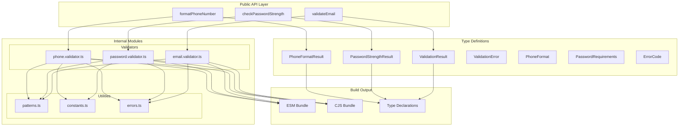
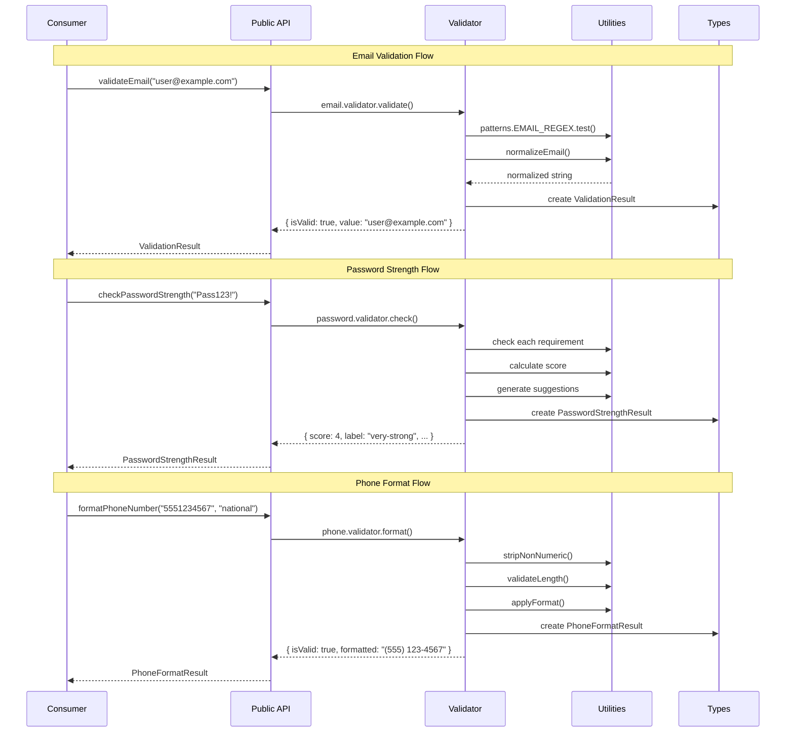
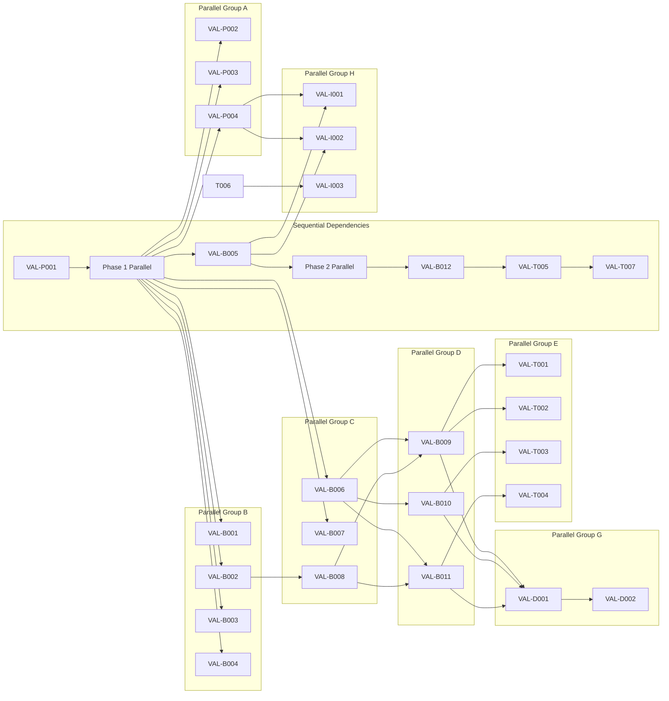

# Technical Requirements Document: Validation Module

| Field | Value |
|-------|-------|
| **Version** | 1.0.0 |
| **Status** | Draft |
| **Created** | 2026-01-16 |
| **Last Updated** | 2026-01-16 |
| **Author** | Technical Architect |
| **Source PRD** | docs/PRD/validation-module.md |
| **Task ID Prefix** | VAL |

---

## Changelog

| Version | Date | Author | Changes |
|---------|------|--------|---------|
| 1.0.0 | 2026-01-16 | Technical Architect | Initial TRD creation from PRD v1.0.0 |

---

## 1. Overview

### 1.1 Technical Summary

This TRD defines the technical implementation of a TypeScript validation module providing three core functions: email validation, password strength checking, and phone number formatting. The module is designed as a zero-dependency, tree-shakeable library with comprehensive TypeScript type exports.

### 1.2 Key Technical Decisions

| Decision | Rationale |
|----------|-----------|
| **Pure TypeScript implementation** | Maximum type safety; no runtime type checking overhead |
| **Zero runtime dependencies** | Minimal bundle size; no supply chain risk |
| **Linear-time regex patterns** | ReDoS prevention; predictable performance |
| **Discriminated union return types** | Type-safe success/failure handling without exceptions |
| **Dual ESM/CJS exports** | Maximum compatibility across Node.js ecosystem |
| **Character-level validation for critical paths** | Fallback from regex for security-sensitive validation |

### 1.3 Technology Stack

| Component | Technology | Version |
|-----------|------------|---------|
| Language | TypeScript | 5.x (strict mode) |
| Runtime | Node.js | 16+ |
| Testing | Jest + ts-jest | 29.x |
| Build | tsc | 5.x |
| Linting | ESLint | 8.x |
| Formatting | Prettier | 3.x |
| Package Format | Dual ESM/CJS | - |

### 1.4 Integration Points

| Integration | Type | Description |
|-------------|------|-------------|
| npm registry | Output | Published package for consumption |
| TypeScript projects | Consumer | Import validation functions and types |
| Node.js backends | Consumer | Server-side input validation |
| Browser bundles | Consumer | Client-side form validation |

---

## 2. System Architecture

### 2.1 Architecture Overview



### 2.2 Component Descriptions

| Component | Responsibility | Location |
|-----------|---------------|----------|
| `index.ts` | Public API exports | `src/index.ts` |
| `email.validator.ts` | Email validation logic | `src/validators/email.validator.ts` |
| `password.validator.ts` | Password strength checking | `src/validators/password.validator.ts` |
| `phone.validator.ts` | Phone number formatting | `src/validators/phone.validator.ts` |
| `types.ts` | TypeScript type definitions | `src/types.ts` |
| `patterns.ts` | Regex patterns (linear-time) | `src/utils/patterns.ts` |
| `constants.ts` | Configuration constants | `src/utils/constants.ts` |
| `errors.ts` | Error code definitions | `src/utils/errors.ts` |

### 2.3 Data Flow Diagram



---

## 3. Technical Specifications

### 3.1 Type Definitions

```typescript
// Core validation result (discriminated union)
interface ValidationSuccess {
  isValid: true;
  value: string;
}

interface ValidationFailure {
  isValid: false;
  error: ValidationError;
}

type ValidationResult = ValidationSuccess | ValidationFailure;

// Error structure
interface ValidationError {
  code: ErrorCode;
  message: string;
}

// Error codes (const enum for tree-shaking)
const enum ErrorCode {
  // Email errors
  EMAIL_EMPTY = 'EMAIL_EMPTY',
  EMAIL_INVALID_FORMAT = 'EMAIL_INVALID_FORMAT',
  EMAIL_INVALID_DOMAIN = 'EMAIL_INVALID_DOMAIN',
  EMAIL_TOO_LONG = 'EMAIL_TOO_LONG',

  // Phone errors
  PHONE_EMPTY = 'PHONE_EMPTY',
  PHONE_INVALID_LENGTH = 'PHONE_INVALID_LENGTH',
  PHONE_INVALID_FORMAT = 'PHONE_INVALID_FORMAT',

  // Generic
  INPUT_TOO_LONG = 'INPUT_TOO_LONG',
}

// Password strength result
interface PasswordStrengthResult {
  score: 0 | 1 | 2 | 3 | 4;
  label: 'very-weak' | 'weak' | 'fair' | 'strong' | 'very-strong';
  requirements: PasswordRequirements;
  suggestions: string[];
}

interface PasswordRequirements {
  minLength: boolean;
  uppercase: boolean;
  lowercase: boolean;
  number: boolean;
  specialChar: boolean;
}

// Phone formatting
type PhoneFormat = 'national' | 'e164' | 'digits';

interface PhoneFormatSuccess {
  isValid: true;
  formatted: string;
  digits: string;
}

interface PhoneFormatFailure {
  isValid: false;
  error: ValidationError;
}

type PhoneFormatResult = PhoneFormatSuccess | PhoneFormatFailure;
```

### 3.2 Function Signatures

```typescript
/**
 * Validates an email address against RFC 5322 patterns.
 * Normalizes the email by trimming and lowercasing.
 */
function validateEmail(email: string): ValidationResult;

/**
 * Checks password strength and returns detailed feedback.
 * Score ranges from 0 (very weak) to 4 (very strong).
 */
function checkPasswordStrength(password: string): PasswordStrengthResult;

/**
 * Formats a phone number according to the specified format.
 * Default format is US national: (XXX) XXX-XXXX
 */
function formatPhoneNumber(
  phone: string,
  format?: PhoneFormat
): PhoneFormatResult;
```

### 3.3 Validation Rules

#### Email Validation Rules

| Rule | Implementation | Pattern/Logic |
|------|---------------|---------------|
| Empty check | Length check | `input.trim().length === 0` |
| Max length | Length check | `input.length <= 254` (RFC 5321) |
| Contains @ | Character search | `input.includes('@')` |
| Local part valid | Linear regex | `^[a-zA-Z0-9.!#$%&'*+/=?^_\`{|}~-]+$` |
| Domain valid | Linear regex | `^[a-zA-Z0-9]([a-zA-Z0-9-]*[a-zA-Z0-9])?(\.[a-zA-Z0-9]([a-zA-Z0-9-]*[a-zA-Z0-9])?)*$` |
| TLD exists | Length check | Domain has at least one dot with 2+ char TLD |

#### Password Strength Rules

| Requirement | Check | Score Contribution |
|-------------|-------|-------------------|
| Minimum length (8 chars) | `password.length >= 8` | +1 if met |
| Uppercase letter | `/[A-Z]/.test(password)` | +1 if met |
| Lowercase letter | `/[a-z]/.test(password)` | +1 if met |
| Number | `/[0-9]/.test(password)` | +0.5 if met |
| Special character | `/[!@#$%^&*(),.?":{}|<>]/.test(password)` | +0.5 if met |

Score mapping:
- 0-1: very-weak
- 1-2: weak
- 2-3: fair
- 3-4: strong
- 4+: very-strong

#### Phone Formatting Rules

| Format | Output Pattern | Example |
|--------|---------------|---------|
| national | (XXX) XXX-XXXX | (555) 123-4567 |
| e164 | +1XXXXXXXXXX | +15551234567 |
| digits | XXXXXXXXXX | 5551234567 |

Validation:
- Strip all non-numeric characters
- Remove leading +1 or 1 if 11 digits
- Require exactly 10 digits for US numbers

### 3.4 Error Handling

| Scenario | Error Code | Message Template |
|----------|------------|------------------|
| Empty email | EMAIL_EMPTY | "Email address is required" |
| Invalid email format | EMAIL_INVALID_FORMAT | "Invalid email format" |
| Invalid domain | EMAIL_INVALID_DOMAIN | "Invalid email domain" |
| Email too long | EMAIL_TOO_LONG | "Email address exceeds maximum length" |
| Empty phone | PHONE_EMPTY | "Phone number is required" |
| Wrong digit count | PHONE_INVALID_LENGTH | "Phone number must be 10 digits" |
| Invalid characters | PHONE_INVALID_FORMAT | "Invalid phone number format" |
| Input too long | INPUT_TOO_LONG | "Input exceeds maximum length of 1000 characters" |

### 3.5 Security Specifications

| Requirement | Implementation |
|-------------|----------------|
| Input length limit | Reject inputs > 1000 characters before processing |
| ReDoS prevention | All regex patterns are linear-time; no nested quantifiers |
| No eval usage | Static analysis verification in CI |
| No logging | No console.log in production builds |

---

## 4. Master Task List

### 4.1 Project Setup Tasks

| Task ID | Description | Assignee | Dependencies | Priority |
|---------|-------------|----------|--------------|----------|
| VAL-P001 | Initialize TypeScript project with strict mode | backend-implementer | None | P0 |
| VAL-P002 | Configure Jest with ts-jest | backend-implementer | VAL-P001 | P0 |
| VAL-P003 | Configure ESLint and Prettier | backend-implementer | VAL-P001 | P1 |
| VAL-P004 | Configure dual ESM/CJS build | backend-implementer | VAL-P001 | P0 |

### 4.2 Type Definition Tasks

| Task ID | Description | Assignee | Dependencies | Priority |
|---------|-------------|----------|--------------|----------|
| VAL-B001 | Define ValidationResult discriminated union type | backend-implementer | VAL-P001 | P0 |
| VAL-B002 | Define ValidationError interface and ErrorCode enum | backend-implementer | VAL-B001 | P0 |
| VAL-B003 | Define PasswordStrengthResult and PasswordRequirements interfaces | backend-implementer | VAL-B001 | P0 |
| VAL-B004 | Define PhoneFormatResult and PhoneFormat types | backend-implementer | VAL-B001 | P0 |
| VAL-B005 | Create main index.ts with all type exports | backend-implementer | VAL-B001, VAL-B002, VAL-B003, VAL-B004 | P0 |

### 4.3 Utility Module Tasks

| Task ID | Description | Assignee | Dependencies | Priority |
|---------|-------------|----------|--------------|----------|
| VAL-B006 | Create patterns.ts with linear-time regex patterns | backend-implementer | VAL-P001 | P0 |
| VAL-B007 | Create constants.ts with configuration values | backend-implementer | VAL-P001 | P0 |
| VAL-B008 | Create errors.ts with error message templates | backend-implementer | VAL-B002 | P0 |

### 4.4 Validator Implementation Tasks

| Task ID | Description | Assignee | Dependencies | Priority |
|---------|-------------|----------|--------------|----------|
| VAL-B009 | Implement validateEmail function | backend-implementer | VAL-B001, VAL-B002, VAL-B006, VAL-B008 | P0 |
| VAL-B010 | Implement checkPasswordStrength function | backend-implementer | VAL-B003, VAL-B006, VAL-B007 | P0 |
| VAL-B011 | Implement formatPhoneNumber function | backend-implementer | VAL-B004, VAL-B006, VAL-B007, VAL-B008 | P0 |
| VAL-B012 | Add edge case handling (empty, whitespace, long inputs) | backend-implementer | VAL-B009, VAL-B010, VAL-B011 | P1 |

### 4.5 Testing Tasks

| Task ID | Description | Assignee | Dependencies | Priority |
|---------|-------------|----------|--------------|----------|
| VAL-T001 | Write unit tests for validateEmail (valid cases) | verify-app | VAL-B009 | P0 |
| VAL-T002 | Write unit tests for validateEmail (invalid cases) | verify-app | VAL-B009 | P0 |
| VAL-T003 | Write unit tests for checkPasswordStrength | verify-app | VAL-B010 | P0 |
| VAL-T004 | Write unit tests for formatPhoneNumber | verify-app | VAL-B011 | P0 |
| VAL-T005 | Write edge case tests (empty, whitespace, long inputs) | verify-app | VAL-B012 | P1 |
| VAL-T006 | Write type tests (TypeScript compilation verification) | verify-app | VAL-B005 | P0 |
| VAL-T007 | Verify coverage meets 60% unit test target | verify-app | VAL-T001, VAL-T002, VAL-T003, VAL-T004, VAL-T005 | P0 |

### 4.6 Documentation Tasks

| Task ID | Description | Assignee | Dependencies | Priority |
|---------|-------------|----------|--------------|----------|
| VAL-D001 | Add JSDoc comments to all public functions | backend-implementer | VAL-B009, VAL-B010, VAL-B011 | P1 |
| VAL-D002 | Create README with usage examples | backend-implementer | VAL-B005, VAL-D001 | P1 |

### 4.7 Integration Tasks

| Task ID | Description | Assignee | Dependencies | Priority |
|---------|-------------|----------|--------------|----------|
| VAL-I001 | Verify ESM import works correctly | verify-app | VAL-P004, VAL-B005 | P0 |
| VAL-I002 | Verify CJS require works correctly | verify-app | VAL-P004, VAL-B005 | P0 |
| VAL-I003 | Verify TypeScript types are correctly exported | verify-app | VAL-B005, VAL-T006 | P0 |

---

## 5. Execution Plan

### 5.1 Phase 1: Foundation

**Objective:** Establish project infrastructure and type definitions.

| Task ID | Description | Parallel Group |
|---------|-------------|----------------|
| VAL-P001 | Initialize TypeScript project | - |
| VAL-P002 | Configure Jest | A |
| VAL-P003 | Configure ESLint/Prettier | A |
| VAL-P004 | Configure dual build | A |
| VAL-B001 | Define ValidationResult type | B |
| VAL-B002 | Define ValidationError and ErrorCode | B |
| VAL-B003 | Define PasswordStrengthResult types | B |
| VAL-B004 | Define PhoneFormatResult types | B |

### 5.2 Phase 2: Core Implementation

**Objective:** Implement utility modules and validation functions.

| Task ID | Description | Parallel Group |
|---------|-------------|----------------|
| VAL-B005 | Create index.ts exports | - |
| VAL-B006 | Create patterns.ts | C |
| VAL-B007 | Create constants.ts | C |
| VAL-B008 | Create errors.ts | C |
| VAL-B009 | Implement validateEmail | D |
| VAL-B010 | Implement checkPasswordStrength | D |
| VAL-B011 | Implement formatPhoneNumber | D |

### 5.3 Phase 3: Testing and Polish

**Objective:** Achieve coverage targets and handle edge cases.

| Task ID | Description | Parallel Group |
|---------|-------------|----------------|
| VAL-T001 | Test validateEmail (valid) | E |
| VAL-T002 | Test validateEmail (invalid) | E |
| VAL-T003 | Test checkPasswordStrength | E |
| VAL-T004 | Test formatPhoneNumber | E |
| VAL-B012 | Add edge case handling | - |
| VAL-T005 | Test edge cases | - |
| VAL-T006 | Type compilation tests | F |
| VAL-T007 | Verify coverage targets | - |

### 5.4 Phase 4: Documentation and Integration

**Objective:** Complete documentation and verify package exports.

| Task ID | Description | Parallel Group |
|---------|-------------|----------------|
| VAL-D001 | Add JSDoc comments | G |
| VAL-D002 | Create README | G |
| VAL-I001 | Verify ESM import | H |
| VAL-I002 | Verify CJS require | H |
| VAL-I003 | Verify type exports | H |

### 5.5 Execution Plan Diagram

```mermaid
gantt
    title Validation Module Execution Plan
    dateFormat X
    axisFormat %s

    section Phase 1: Foundation
    VAL-P001 Initialize Project       :p001, 0, 1
    VAL-P002 Configure Jest           :p002, after p001, 1
    VAL-P003 Configure ESLint         :p003, after p001, 1
    VAL-P004 Configure Dual Build     :p004, after p001, 1
    VAL-B001 ValidationResult Type    :b001, after p001, 1
    VAL-B002 ValidationError Type     :b002, after p001, 1
    VAL-B003 PasswordStrength Types   :b003, after p001, 1
    VAL-B004 PhoneFormat Types        :b004, after p001, 1

    section Phase 2: Core
    VAL-B005 Index Exports            :b005, after b001 b002 b003 b004, 1
    VAL-B006 Patterns Module          :b006, after p001, 1
    VAL-B007 Constants Module         :b007, after p001, 1
    VAL-B008 Errors Module            :b008, after b002, 1
    VAL-B009 validateEmail            :b009, after b006 b008, 1
    VAL-B010 checkPasswordStrength    :b010, after b006 b007, 1
    VAL-B011 formatPhoneNumber        :b011, after b006 b007 b008, 1

    section Phase 3: Testing
    VAL-T001 Email Valid Tests        :t001, after b009, 1
    VAL-T002 Email Invalid Tests      :t002, after b009, 1
    VAL-T003 Password Tests           :t003, after b010, 1
    VAL-T004 Phone Tests              :t004, after b011, 1
    VAL-B012 Edge Case Handling       :b012, after b009 b010 b011, 1
    VAL-T005 Edge Case Tests          :t005, after b012, 1
    VAL-T006 Type Tests               :t006, after b005, 1
    VAL-T007 Coverage Verification    :t007, after t001 t002 t003 t004 t005, 1

    section Phase 4: Docs
    VAL-D001 JSDoc Comments           :d001, after b009 b010 b011, 1
    VAL-D002 README                   :d002, after d001 b005, 1
    VAL-I001 Verify ESM               :i001, after p004 b005, 1
    VAL-I002 Verify CJS               :i002, after p004 b005, 1
    VAL-I003 Verify Types             :i003, after t006, 1
```



### 5.6 Parallelization Map



### 5.7 Critical Path

The critical path through the project is:

```
VAL-P001 -> VAL-B001 -> VAL-B005 -> VAL-B006 -> VAL-B009 -> VAL-T001/T002 -> VAL-B012 -> VAL-T005 -> VAL-T007
```

This path determines the minimum duration to completion. Parallelization opportunities exist in:
- Groups A/B/C can run concurrently after P001
- Groups D (all validators) can run concurrently after utilities complete
- Groups E (all tests) can run concurrently after their respective validators
- Groups G/H (docs and integration) can run concurrently in final phase

---

## 6. Quality Requirements

### 6.1 Testing Targets

| Metric | Target | Measurement |
|--------|--------|-------------|
| Unit Test Coverage | >= 60% | Jest coverage report |
| Integration Test Coverage | >= 50% | Jest coverage report |
| Type Coverage | 100% | No `any` types in public API |

### 6.2 Code Standards

| Standard | Requirement |
|----------|-------------|
| TypeScript Strict Mode | Enabled, no errors |
| ESLint | All rules pass |
| Prettier | Code formatted |
| No any Types | Public API fully typed |
| JSDoc | All exported functions documented |

### 6.3 Security Requirements

| Requirement | Verification Method |
|-------------|-------------------|
| No eval() usage | ESLint rule: no-eval |
| No Function() constructor | ESLint rule: no-new-func |
| Linear-time regex only | Manual review; ReDoS test suite |
| Input length limits | Unit tests verify rejection of long inputs |
| No sensitive data logging | No console.log in src/ |

### 6.4 Performance Requirements

| Metric | Target | Verification |
|--------|--------|--------------|
| validateEmail | < 1ms per call | Jest performance test |
| checkPasswordStrength | < 2ms per call | Jest performance test |
| formatPhoneNumber | < 1ms per call | Jest performance test |
| Bundle size | < 10KB minified | Build output measurement |

---

## 7. Risk Assessment

### 7.1 Risks from PRD

| ID | Risk | Likelihood | Impact | Technical Mitigation |
|----|------|------------|--------|---------------------|
| R1 | ReDoS vulnerabilities in regex patterns | Medium | High | Use only linear-time patterns; test with pathological inputs like `"a".repeat(1000) + "@"` |
| R2 | Email validation too strict | Medium | Medium | Implement against RFC 5322 test vectors; log rejected emails for analysis |
| R3 | Phone formatting only works for US numbers | Low | Medium | Document US-only scope; design PhoneFormat type for future extension |
| R4 | Bundle size exceeds 10KB target | Low | Low | Monitor size in CI; tree-shake unused code paths |
| R5 | TypeScript version incompatibility | Low | High | Test against TS 4.7, 5.0, 5.x in CI matrix |
| R6 | Password strength algorithm too opinionated | Medium | Low | Document scoring algorithm in JSDoc; keep structure extensible |

### 7.2 Technical Risks

| ID | Risk | Likelihood | Impact | Mitigation |
|----|------|------------|--------|------------|
| TR1 | Jest configuration issues with ESM/CJS | Medium | Medium | Use ts-jest with proper transformIgnorePatterns |
| TR2 | Dual package hazard (ESM/CJS) | Low | High | Use package.json exports field correctly; test both entry points |
| TR3 | Type inference issues in complex unions | Low | Medium | Use explicit type annotations; comprehensive type tests |
| TR4 | Edge cases in international email addresses | Medium | Low | Document ASCII-only scope for v1.0; defer IDN support |

---

## 8. Non-Goals

*Imported from PRD Section 3.2*

| ID | Non-Goal | Rationale |
|----|----------|-----------|
| NG1 | Real-time email deliverability checking | Requires external API calls; out of scope for synchronous validation |
| NG2 | Internationalized phone number parsing with carrier detection | Requires large datasets; use libphonenumber for advanced needs |
| NG3 | Password breach database checking (Have I Been Pwned integration) | Requires network requests; should be separate async utility |
| NG4 | Form framework integration (React Hook Form, Formik adapters) | Keep module framework-agnostic; consumers can wrap as needed |
| NG5 | Localization/i18n for error messages | Initial version English-only; i18n can be added in v2.0 |
| NG6 | Credit card or SSN validation | Different security domain; would expand module scope significantly |
| NG7 | Custom regex pattern configuration at runtime | Increases complexity; users needing custom patterns can fork or extend |

---

## 9. File Structure

```
validation-module/
├── src/
│   ├── index.ts                 # Public API exports
│   ├── types.ts                 # Type definitions
│   ├── validators/
│   │   ├── email.validator.ts   # Email validation
│   │   ├── password.validator.ts # Password strength
│   │   └── phone.validator.ts   # Phone formatting
│   └── utils/
│       ├── patterns.ts          # Regex patterns
│       ├── constants.ts         # Configuration
│       └── errors.ts            # Error definitions
├── tests/
│   ├── email.test.ts
│   ├── password.test.ts
│   ├── phone.test.ts
│   ├── types.test.ts
│   └── edge-cases.test.ts
├── package.json
├── tsconfig.json
├── jest.config.js
├── .eslintrc.js
├── .prettierrc
└── README.md
```

---

## 10. Appendix

### 10.1 Email Regex Pattern (Linear-Time)

```typescript
// Split into local and domain parts, validate separately
const EMAIL_LOCAL_PATTERN = /^[a-zA-Z0-9.!#$%&'*+/=?^_`{|}~-]+$/;
const EMAIL_DOMAIN_PATTERN = /^[a-zA-Z0-9]([a-zA-Z0-9-]*[a-zA-Z0-9])?(\.[a-zA-Z0-9]([a-zA-Z0-9-]*[a-zA-Z0-9])?)*$/;
```

### 10.2 Password Strength Scoring Algorithm

```typescript
function calculateScore(password: string, requirements: PasswordRequirements): number {
  let score = 0;
  if (requirements.minLength) score += 1;
  if (requirements.uppercase) score += 1;
  if (requirements.lowercase) score += 1;
  if (requirements.number) score += 0.5;
  if (requirements.specialChar) score += 0.5;
  return Math.min(4, Math.floor(score));
}
```

### 10.3 Phone Format Templates

```typescript
const PHONE_FORMATS = {
  national: (digits: string) =>
    `(${digits.slice(0,3)}) ${digits.slice(3,6)}-${digits.slice(6)}`,
  e164: (digits: string) =>
    `+1${digits}`,
  digits: (digits: string) =>
    digits,
};
```

---

*End of Technical Requirements Document*
